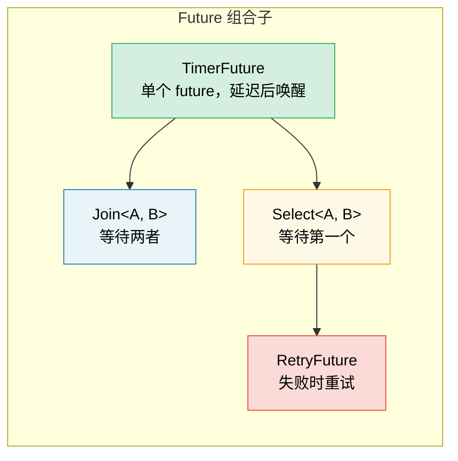

# 6. Building Futures by Hand 🟡

> **你将学到什么：**
> - 实现一个带有基于线程唤醒的 `TimerFuture`
> - 构建一个 `Join` 组合子：并发运行两个 futures
> - 构建一个 `Select` 组合子：竞争两个 futures
> - 组合子如何组合 —— futures 一直到底

## 一个简单的 Timer Future

现在让我们从头构建真实的、有用的 futures。这将巩固第 2-5 章的理论。

### TimerFuture：一个完整的例子

```rust
use std::future::Future;
use std::pin::Pin;
use std::sync::{Arc, Mutex};
use std::task::{Context, Poll, Waker};
use std::thread;
use std::time::{Duration, Instant};

pub struct TimerFuture {
    shared_state: Arc<Mutex<SharedState>>,
}

struct SharedState {
    completed: bool,
    waker: Option<Waker>,
}

impl TimerFuture {
    pub fn new(duration: Duration) -> Self {
        let shared_state = Arc::new(Mutex::new(SharedState {
            completed: false,
            waker: None,
        }));

        // 生成一个线程，在持续时间后设置 completed=true
        let thread_shared_state = Arc::clone(&shared_state);
        thread::spawn(move || {
            thread::sleep(duration);
            let mut state = thread_shared_state.lock().unwrap();
            state.completed = true;
            if let Some(waker) = state.waker.take() {
                waker.wake(); // 通知执行器
            }
        });

        TimerFuture { shared_state }
    }
}

impl Future for TimerFuture {
    type Output = ();

    fn poll(self: Pin<&mut Self>, cx: &mut Context<'_>) -> Poll<()> {
        let mut state = self.shared_state.lock().unwrap();
        if state.completed {
            Poll::Ready(())
        } else {
            // 存储 waker，以便计时器线程可以唤醒我们
            // 重要：总是更新 waker —— 执行器可能在
            // 两次轮询之间改变了它
            state.waker = Some(cx.waker().clone());
            Poll::Pending
        }
    }
}

// 用法：
// async fn example() {
//     println!("Starting timer...");
//     TimerFuture::new(Duration::from_secs(2)).await;
//     println!("Timer done!");
// }
//
// ⚠️ 这为每个计时器生成一个 OS 线程 —— 学习可以，但在
// 生产环境中使用 `tokio::time::sleep`，它由共享
// 计时器轮支持，不需要额外线程。
```

### Join：并发运行两个 Futures

`Join` 轮询两个 futures，当*两者* 都完成时完成。这是 `tokio::join!` 内部的工作方式：

```rust
use std::future::Future;
use std::pin::Pin;
use std::task::{Context, Poll};

/// 并发轮询两个 futures，将两个结果作为元组返回
pub struct Join<A, B>
where
    A: Future,
    B: Future,
{
    a: MaybeDone<A>,
    b: MaybeDone<B>,
}

enum MaybeDone<F: Future> {
    Pending(F),
    Done(F::Output),
    Taken, // 输出已被取走
}

// MaybeDone<F> 存储 F::Output，编译器无法证明
// 即使 F: Unpin 它也是 Unpin。因为我们只与 Unpin
// futures 一起使用 Join，并且从不对字段进行 pin 投影，
// 手动实现 Unpin 是安全的，这让我们可以在 poll() 中调用 self.get_mut()。
impl<A: Future + Unpin, B: Future + Unpin> Unpin for Join<A, B> {}

impl<A, B> Join<A, B>
where
    A: Future,
    B: Future,
{
    pub fn new(a: A, b: B) -> Self {
        Join {
            a: MaybeDone::Pending(a),
            b: MaybeDone::Pending(b),
        }
    }
}

impl<A, B> Future for Join<A, B>
where
    A: Future + Unpin,
    B: Future + Unpin,
{
    type Output = (A::Output, B::Output);

    fn poll(self: Pin<&mut Self>, cx: &mut Context<'_>) -> Poll<Self::Output> {
        let this = self.get_mut();

        // 如果未完成则轮询 A
        if let MaybeDone::Pending(ref mut fut) = this.a {
            if let Poll::Ready(val) = Pin::new(fut).poll(cx) {
                this.a = MaybeDone::Done(val);
            }
        }

        // 如果未完成则轮询 B
        if let MaybeDone::Pending(ref mut fut) = this.b {
            if let Poll::Ready(val) = Pin::new(fut).poll(cx) {
                this.b = MaybeDone::Done(val);
            }
        }

        // 两者都完成了？
        match (&this.a, &this.b) {
            (MaybeDone::Done(_), MaybeDone::Done(_)) => {
                // 取走两个输出
                let a_val = match std::mem::replace(&mut this.a, MaybeDone::Taken) {
                    MaybeDone::Done(v) => v,
                    _ => unreachable!(),
                };
                let b_val = match std::mem::replace(&mut this.b, MaybeDone::Taken) {
                    MaybeDone::Done(v) => v,
                    _ => unreachable!(),
                };
                Poll::Ready((a_val, b_val))
            }
            _ => Poll::Pending, // 至少还有一个仍在 pending
        }
    }
}

// 用法（异步块是 !Unpin，所以用 Box::pin 包装）：
// let (page1, page2) = Join::new(
//     Box::pin(http_get("https://example.com/a")),
//     Box::pin(http_get("https://example.com/b")),
// ).await;
// 两个请求并发运行！
```

> **关键见解**：这里的"并发"意味着*在同一线程上交错*。
> Join 不生成线程 —— 它在同一个 `poll()` 调用中轮询两个 futures。
> 这是协作式并发，不是并行。



### Select：竞争两个 Futures

`Select` 在*任一* future 首先完成时完成（另一个被 drop）：

```rust
use std::future::Future;
use std::pin::Pin;
use std::task::{Context, Poll};

pub enum Either<A, B> {
    Left(A),
    Right(B),
}

/// 返回第一个完成的 future；drop 另一个
pub struct Select<A, B> {
    a: A,
    b: B,
}

impl<A, B> Select<A, B>
where
    A: Future + Unpin,
    B: Future + Unpin,
{
    pub fn new(a: A, b: B) -> Self {
        Select { a, b }
    }
}

impl<A, B> Future for Select<A, B>
where
    A: Future + Unpin,
    B: Future + Unpin,
{
    type Output = Either<A::Output, B::Output>;

    fn poll(mut self: Pin<&mut Self>, cx: &mut Context<'_>) -> Poll<Self::Output> {
        // 先轮询 A
        if let Poll::Ready(val) = Pin::new(&mut self.a).poll(cx) {
            return Poll::Ready(Either::Left(val));
        }

        // 然后轮询 B
        if let Poll::Ready(val) = Pin::new(&mut self.b).poll(cx) {
            return Poll::Ready(Either::Right(val));
        }

        Poll::Pending
    }
}

// 与超时一起使用：
// match Select::new(http_get(url), TimerFuture::new(timeout)).await {
//     Either::Left(response) => println!("Got response: {}", response),
//     Either::Right(()) => println!("Request timed out!"),
// }
```

> **公平性说明**：我们的 `Select` 总是先轮询 A —— 如果两者都就绪，A
> 总是赢。Tokio 的 `select!` 宏随机化轮询顺序以保证公平。

<details>
<summary><strong>🏋️ 练习：构建一个 RetryFuture</strong>（点击展开）</summary>

**挑战**：构建一个 `RetryFuture<F, Fut>`，它接受一个闭包 `F: Fn() -> Fut`，如果内部 future 返回 `Err`，则重试最多 N 次。它应该返回第一个 `Ok` 结果或最后一个 `Err`。

*提示*：你需要"运行尝试"和"所有尝试已用尽"的状态。

<details>
<summary>🔑 答案</summary>

```rust
use std::future::Future;
use std::pin::Pin;
use std::task::{Context, Poll};

pub struct RetryFuture<F, Fut, T, E>
where
    F: Fn() -> Fut,
    Fut: Future<Output = Result<T, E>> + Unpin,
{
    factory: F,
    current: Option<Fut>,
    remaining: usize,
    last_error: Option<E>,
}

impl<F, Fut, T, E> RetryFuture<F, Fut, T, E>
where
    F: Fn() -> Fut,
    Fut: Future<Output = Result<T, E>> + Unpin,
{
    pub fn new(max_attempts: usize, factory: F) -> Self {
        let current = Some((factory)());
        RetryFuture {
            factory,
            current,
            remaining: max_attempts.saturating_sub(1),
            last_error: None,
        }
    }
}

impl<F, Fut, T, E> Future for RetryFuture<F, Fut, T, E>
where
    F: Fn() -> Fut + Unpin,
    Fut: Future<Output = Result<T, E>> + Unpin,
    T: Unpin,
    E: Unpin,
{
    type Output = Result<T, E>;

    fn poll(mut self: Pin<&mut Self>, cx: &mut Context<'_>) -> Poll<Self::Output> {
        loop {
            if let Some(ref mut fut) = self.current {
                match Pin::new(fut).poll(cx) {
                    Poll::Ready(Ok(val)) => return Poll::Ready(Ok(val)),
                    Poll::Ready(Err(e)) => {
                        self.last_error = Some(e);
                        if self.remaining > 0 {
                            self.remaining -= 1;
                            self.current = Some((self.factory)());
                            // 循环立即轮询新的 future
                        } else {
                            return Poll::Ready(Err(self.last_error.take().unwrap()));
                        }
                    }
                    Poll::Pending => return Poll::Pending,
                }
            } else {
                return Poll::Ready(Err(self.last_error.take().unwrap()));
            }
        }
    }
}

// 用法：
// let result = RetryFuture::new(3, || async {
//     http_get("https://flaky-server.com/api").await
// }).await;
```

**关键要点**：retry future 本身是一个状态机：它持有当前尝试，在失败时创建新的内部 futures。这就是组合子的组合方式 —— futures 一直到底。

</details>
</details>

> **关键要点 —— Building Futures by Hand**
> - 一个 future 需要三样东西：状态、`poll()` 实现和 waker 注册
> - `Join` 轮询两个子 futures；`Select` 返回最先完成的
> - 组合子本身是包装其他 futures 的 futures —— 一直到底都是 turtles
> - 手写 futures 提供深刻见解，但在生产中使用 `tokio::join!`/`select!`

> **另见：**[第 2 章 — The Future Trait](ch02-the-future-trait.md) 了解 trait 定义，[第 8 章 — Tokio Deep Dive](ch08-tokio-deep-dive.md) 了解生产级等价物

***
