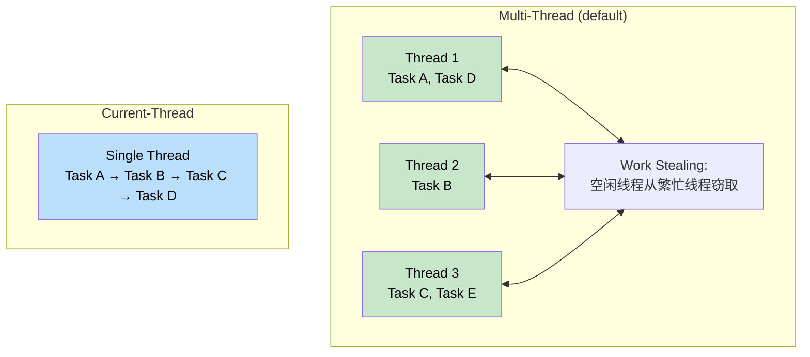
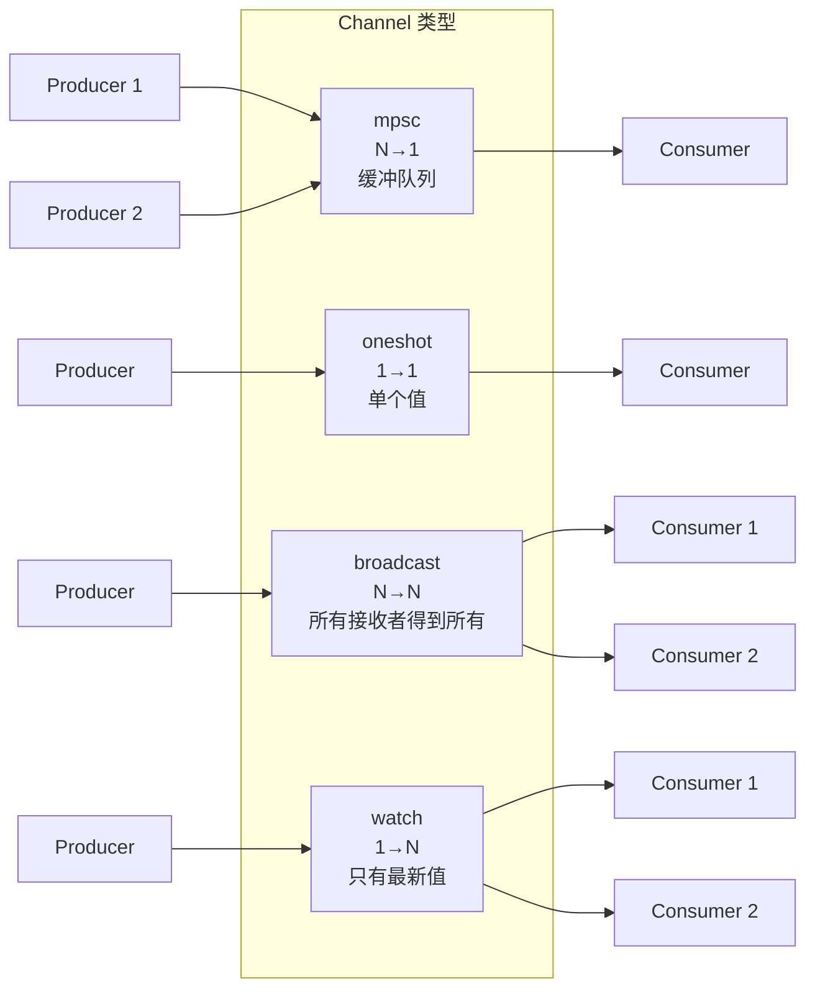
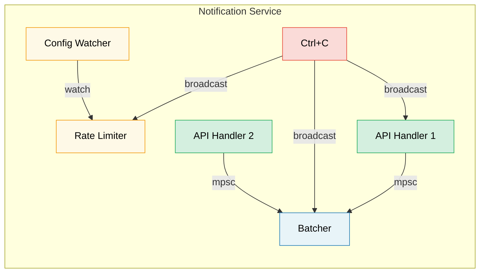

# 8. Tokio Deep Dive 🟡

> **你将学到什么：**
> - 运行时类型：多线程 vs 当前线程以及何时使用每种
> - `tokio::spawn`、`'static` 要求和 `JoinHandle`
> - 任务取消语义（cancel-on-drop）
> - 同步原语：Mutex、RwLock、Semaphore 和所有四种 channel 类型

## 运行时类型：多线程 vs 当前线程

Tokio 提供两种运行时配置：

```rust
// 多线程（#[tokio::main] 默认）
// 使用工作窃取线程池 —— 任务可以在线程之间移动
#[tokio::main]
async fn main() {
    // N 个工作线程（默认 = CPU 核心数）
    // 任务是 Send + 'static
}

// 当前线程 —— 所有内容在一个线程上运行
#[tokio::main(flavor = "current_thread")]
async fn main() {
    // 单线程 —— 任务不需要是 Send
    // 更轻量，适合简单工具或 WASM
}

// 手动构建运行时：
let rt = tokio::runtime::Builder::new_multi_thread()
    .worker_threads(4)
    .enable_all()
    .build()
    .unwrap();

rt.block_on(async {
    println!("Running on custom runtime");
});
```



### tokio::spawn 和 'static 要求

`tokio::spawn` 将一个 future 放入运行时的任务队列。因为它可能在*任何* 时间运行在*任何* 工作线程上，future 必须是 `Send + 'static`：

```rust
use tokio::task;

async fn example() {
    let data = String::from("hello");

    // ✅ 可行：将所有权移入任务
    let handle = task::spawn(async move {
        println!("{data}");
        data.len()
    });

    let len = handle.await.unwrap();
    println!("Length: {len}");
}

async fn problem() {
    let data = String::from("hello");

    // ❌ 失败：data 被借用，不是 'static
    // task::spawn(async {
    //     println!("{data}"); // 借用 `data` —— 不是 'static
    // });

    // ❌ 失败：Rc 不是 Send
    // let rc = std::rc::Rc::new(42);
    // task::spawn(async move {
    //     println!("{rc}"); // Rc 是 !Send —— 不能跨线程边界
    // });
}
```

**为什么是 `'static`？** 生成的任务独立运行 —— 它可能比创建它的作用域存活更久。编译器无法证明引用将保持有效，所以它要求拥有数据。

**为什么是 `Send`？** 任务可能在与挂起时不同的线程上恢复。在 `.await` 点之间持有的所有数据必须安全地在线程之间发送。

```rust
// 常见模式：克隆共享数据到任务中
let shared = Arc::new(config);

for i in 0..10 {
    let shared = Arc::clone(&shared); // 克隆 Arc，而不是数据
    tokio::spawn(async move {
        process_item(i, &shared).await;
    });
}
```

### JoinHandle 和任务取消

```rust
use tokio::task::JoinHandle;
use tokio::time::{sleep, Duration};

async fn cancellation_example() {
    let handle: JoinHandle<String> = tokio::spawn(async {
        sleep(Duration::from_secs(10)).await;
        "completed".to_string()
    });

    // 通过 drop handle 取消任务？不 —— 任务继续运行！
    // drop(handle); // 任务在后台继续

    // 要真正取消，调用 abort()：
    handle.abort();

    // 等待被取消的任务返回 JoinError
    match handle.await {
        Ok(val) => println!("Got: {val}"),
        Err(e) if e.is_cancelled() => println!("Task was cancelled"),
        Err(e) => println!("Task panicked: {e}"),
    }
}
```

> **重要**：在 tokio 中，drop `JoinHandle`**不会**取消任务。
> 任务变成*分离的*并继续运行。你必须显式调用 `.abort()` 来取消它。
> 这与直接 drop `Future` 不同，后者确实取消/drop 底层计算。

### Tokio 同步原语

Tokio 提供感知异步的同步原语。关键原则：**不要在 `.await` 点之间使用 `std::sync::Mutex`**。

```rust
use tokio::sync::{Mutex, RwLock, Semaphore, mpsc, oneshot, broadcast, watch};

// --- Mutex ---
// 异步互斥锁：lock() 方法是异步的，不会阻塞线程
let data = Arc::new(Mutex::new(vec![1, 2, 3]));
{
    let mut guard = data.lock().await; // 非阻塞锁
    guard.push(4);
} // Guard 在这里 drop —— 锁释放

// --- Channels ---
// mpsc: 多生产者，单消费者
let (tx, mut rx) = mpsc::channel::<String>(100); // 有界缓冲区

tokio::spawn(async move {
    tx.send("hello".into()).await.unwrap();
});

let msg = rx.recv().await.unwrap();

// oneshot: 单个值，单消费者
let (tx, rx) = oneshot::channel::<i32>();
tx.send(42).unwrap(); // 不需要 await —— 要么发送要么失败
let val = rx.await.unwrap();

// broadcast: 多生产者，多消费者（所有人都得到每条消息）
let (tx, _) = broadcast::channel::<String>(100);
let mut rx1 = tx.subscribe();
let mut rx2 = tx.subscribe();

// watch: 单个值，多消费者（只有最新值）
let (tx, rx) = watch::channel(0u64);
tx.send(42).unwrap();
println!("Latest: {}", *rx.borrow());
```

> **注意**：为了简洁，这些 channel 示例中使用 `.unwrap()`。
> 在生产环境中，优雅地处理发送/接收错误 —— 失败的 `.send()` 意味着
> 接收者被 drop，失败的 `.recv()` 意味着 channel 已关闭。



## 案例研究：为通知服务选择正确的 Channel

你正在构建一个通知服务，其中：
- 多个 API 处理程序生成事件
- 一个后台任务批量发送它们
- 一个配置观察器在运行时更新速率限制
- 一个关闭信号必须到达所有组件

**每个使用什么 channel？**

| 需求 | Channel | 为什么 |
|------|---------|--------|
| API 处理程序 → 批处理器 | `mpsc`（有界） | N 个生产者，1 个消费者。有界用于背压 —— 如果批处理器落后，API 处理程序减慢而不是 OOM |
| 配置观察器 → 速率限制器 | `watch` | 只有最新配置重要。多个读取器（每个工作器）看到当前值 |
| 关闭信号 → 所有组件 | `broadcast` | 每个组件必须独立接收关闭通知 |
| 单个健康检查响应 | `oneshot` | 请求/响应模式 —— 一个值，然后完成 |



<details>
<summary><strong>🏋️ 练习：构建一个任务池</strong>（点击展开）</summary>

**挑战**：构建一个函数 `run_with_limit`，它接受一个异步闭包列表和一个并发限制，最多同时执行 N 个任务。使用 `tokio::sync::Semaphore`。

<details>
<summary>🔑 答案</summary>

```rust
use std::future::Future;
use std::sync::Arc;
use tokio::sync::Semaphore;

async fn run_with_limit<F, Fut, T>(tasks: Vec<F>, limit: usize) -> Vec<T>
where
    F: FnOnce() -> Fut + Send + 'static,
    Fut: Future<Output = T> + Send + 'static,
    T: Send + 'static,
{
    let semaphore = Arc::new(Semaphore::new(limit));
    let mut handles = Vec::new();

    for task in tasks {
        let permit = Arc::clone(&semaphore);
        let handle = tokio::spawn(async move {
            let _permit = permit.acquire().await.unwrap();
            // Permit 在任务运行时持有，然后 drop
            task().await
        });
        handles.push(handle);
    }

    let mut results = Vec::new();
    for handle in handles {
        results.push(handle.await.unwrap());
    }
    results
}

// 用法：
// let tasks: Vec<_> = urls.into_iter().map(|url| {
//     move || async move { fetch(url).await }
// }).collect();
// let results = run_with_limit(tasks, 10).await; // 最多 10 个并发
```

**关键要点**：`Semaphore` 是在 tokio 中限制并发的标准方法。每个任务在开始工作之前获取一个 permit。当 semaphore 满时，新任务异步等待（非阻塞）直到有空槽。

</details>
</details>

> **关键要点 —— Tokio Deep Dive**
> - 服务器使用 `multi_thread`（默认）；CLI 工具、测试或 `!Send` 类型使用 `current_thread`
> - `tokio::spawn` 需要 `'static` futures —— 使用 `Arc` 或 channels 共享数据
> - Drop `JoinHandle`**不会**取消任务 —— 显式调用 `.abort()`
> - 根据需要选择同步原语：`Mutex` 用于共享状态，`Semaphore` 用于并发限制，`mpsc`/`oneshot`/`broadcast`/`watch` 用于通信

> **另见：**[第 9 章 — When Tokio Isn't the Right Fit](ch09-when-tokio-isnt-the-right-fit.md) 了解 spawn 的替代方案，[第 12 章 — Common Pitfalls](ch12-common-pitfalls.md) 了解 MutexGuard-across-await bug

***
