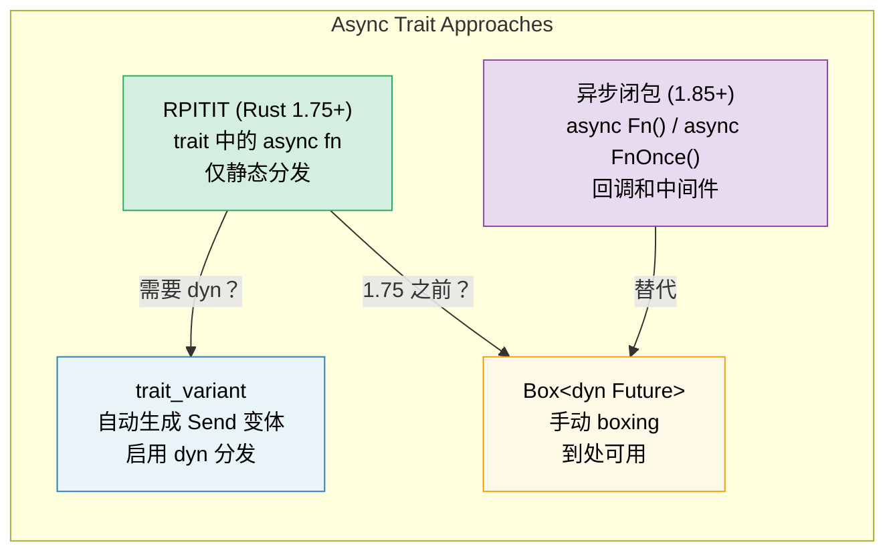

# 10. Async Traits 🟡

> **你将学到什么：**
> - 为什么 trait 中的异步方法花了数年时间才稳定
> - RPITIT：原生异步 trait 方法（Rust 1.75+）
> - dyn 分发挑战和 `trait_variant` 变通方案
> - 异步闭包（Rust 1.85+）：`async Fn()` 和 `async FnOnce()`



## 历史：为什么花了这么长时间

trait 中的异步方法是 Rust 多年来最受请求的功能。问题在于：

```rust
// 这在 Rust 1.75（2023 年 12 月）之前无法编译：
trait DataStore {
    async fn get(&self, key: &str) -> Option<String>;
}
// 为什么？因为 async fn 返回 `impl Future<Output = T>`，
// 而 trait 返回位置不支持 `impl Trait`。
```

根本挑战：当 trait 方法返回 `impl Future` 时，每个实现者返回*不同的具体类型*。编译器需要知道返回类型的大小，但 trait 方法是动态分发的。

### RPITIT：Trait 中返回位置的 Impl Trait

从 Rust 1.75 开始，这对静态分发有效：

```rust
trait DataStore {
    async fn get(&self, key: &str) -> Option<String>;
    // 解糖为：
    // fn get(&self, key: &str) -> impl Future<Output = Option<String>>;
}

struct InMemoryStore {
    data: std::collections::HashMap<String, String>,
}

impl DataStore for InMemoryStore {
    async fn get(&self, key: &str) -> Option<String> {
        self.data.get(key).cloned()
    }
}

// ✅ 适用于泛型（静态分发）：
async fn lookup<S: DataStore>(store: &S, key: &str) {
    if let Some(val) = store.get(key).await {
        println!("{key} = {val}");
    }
}
```

### dyn 分发和 Send 边界

限制：你不能直接使用 `dyn DataStore`，因为编译器不知道返回的 future 的大小：

```rust
// ❌ 无法工作：
// async fn lookup_dyn(store: &dyn DataStore, key: &str) { ... }
// 错误：trait `DataStore` 不是 dyn 兼容的，因为方法 `get` 是 `async`

// ✅ 变通方案：返回一个 boxed future
trait DynDataStore {
    fn get(&self, key: &str) -> Pin<Box<dyn Future<Output = Option<String>> + Send + '_>>;
}

// 或使用 trait_variant 宏（见下文）
```

**Send 问题**：在线程运行时中，生成的任务必须是 `Send`。但异步 trait 方法不会自动添加 `Send` 边界：

```rust
trait Worker {
    async fn run(self); // Future 可能是 Send 也可能不是
}

struct MyWorker;

impl Worker for MyWorker {
    async fn run(self) {
        // 如果这使用 !Send 类型，future 就是 !Send
        let rc = std::rc::Rc::new(42);
        some_work().await;
        println!("{rc}");
    }
}

// ❌ 这失败了，因为 future 是 !Send（Rc 是 !Send）：
// tokio::spawn(worker.run()); // 需要 Send + 'static
//
// 注意：我们在这里使用 `self`（拥有）是因为 tokio::spawn 也需要 'static ——
// 一个借用 &self 的 future 不能是 'static。
// 即使没有 Rc，`async fn run(&self)` 也不能被 spawn。
```

### trait_variant Crate

`trait_variant` crate（来自 Rust async 工作组）自动生成一个 `Send` 变体：

```rust
// Cargo.toml: trait-variant = "0.1"

#[trait_variant::make(SendDataStore: Send)]
trait DataStore {
    async fn get(&self, key: &str) -> Option<String>;
    async fn set(&self, key: &str, value: String);
}

// 现在你有两个 traits：
// - DataStore：futures 上没有 Send 边界
// - SendDataStore：所有 futures 都是 Send
// 两者有相同的方法，实现者为 DataStore 实现
// 如果他们的 futures 是 Send，则免费获得 SendDataStore。

// 当你需要 spawn 时使用 SendDataStore：
async fn spawn_lookup(store: Arc<dyn SendDataStore>) {
    tokio::spawn(async move {
        store.get("key").await;
    });
}
```

### 快速参考：Async Traits

| 方法 | 静态分发 | 动态分发 | Send | 语法开销 |
|------|:---:|:---:|:---:|---|
| 原生 `async fn` 在 trait 中 | ✅ | ❌ | 隐式 | 无 |
| `trait_variant` | ✅ | ✅ | 显式 | `#[trait_variant::make]` |
| 手动 `Box::pin` | ✅ | ✅ | 显式 | 高 |
| `async-trait` crate | ✅ | ✅ | `#[async_trait]` | 中等（proc macro） |

> **推荐**：对于新代码（Rust 1.75+），当你需要 `dyn` 分发时，使用带有 `trait_variant` 的原生异步 traits。`async-trait` crate 仍然被广泛使用，但 boxing 每个 future —— 原生方法对静态分发是零成本的。

### 异步闭包（Rust 1.85+）

从 Rust 1.85 开始，`异步闭包` 稳定了 —— 捕获环境并返回 future 的闭包：

```rust
// 1.85 之前：笨拙的变通方案
let urls = vec!["https://a.com", "https://b.com"];
let fetchers: Vec<_> = urls.iter().map(|url| {
    let url = url.to_string();
    // 返回一个非异步闭包，返回一个异步块
    move || async move { reqwest::get(&url).await }
}).collect();

// 1.85 之后：异步闭包直接工作
let fetchers: Vec<_> = urls.iter().map(|url| {
    async move || { reqwest::get(url).await }
    // ↑ 这是一个异步闭包 —— 捕获 url，返回一个 Future
}).collect();
```

异步闭包实现了新的 `AsyncFn`、`AsyncFnMut` 和 `AsyncFnOnce` traits，它们镜像 `Fn`、`FnMut`、`FnOnce`：

```rust
// 接受异步闭包的泛型函数
async fn retry<F>(max: usize, f: F) -> Result<String, Error>
where
    F: AsyncFn() -> Result<String, Error>,
{
    for _ in 0..max {
        if let Ok(val) = f().await {
            return Ok(val);
        }
    }
    f().await
}
```

> **迁移提示**：如果你有使用 `Fn() -> impl Future<Output = T>` 的代码，
> 考虑切换到 `AsyncFn() -> T` 以获得更清晰的签名。

<details>
<summary><strong>🏋️ 练习：设计一个异步 Service Trait</strong>（点击展开）</summary>

**挑战**：设计一个带有异步 `get` 和 `set` 方法的 `Cache` trait。实现两次：一次使用 `HashMap`（内存中），一次使用模拟 Redis 后端（使用 `tokio::time::sleep` 模拟网络延迟）。编写一个泛型函数，适用于两者。

<details>
<summary>🔑 答案</summary>

```rust
use std::collections::HashMap;
use std::sync::Arc;
use tokio::sync::Mutex;
use tokio::time::{sleep, Duration};

trait Cache {
    async fn get(&self, key: &str) -> Option<String>;
    async fn set(&self, key: &str, value: String);
}

// --- 内存中实现 ---
struct MemoryCache {
    store: Mutex<HashMap<String, String>>,
}

impl MemoryCache {
    fn new() -> Self {
        MemoryCache {
            store: Mutex::new(HashMap::new()),
        }
    }
}

impl Cache for MemoryCache {
    async fn get(&self, key: &str) -> Option<String> {
        self.store.lock().await.get(key).cloned()
    }

    async fn set(&self, key: &str, value: String) {
        self.store.lock().await.insert(key.to_string(), value);
    }
}

// --- 模拟 Redis 实现 ---
struct RedisCache {
    store: Mutex<HashMap<String, String>>,
    latency: Duration,
}

impl RedisCache {
    fn new(latency_ms: u64) -> Self {
        RedisCache {
            store: Mutex::new(HashMap::new()),
            latency: Duration::from_millis(latency_ms),
        }
    }
}

impl Cache for RedisCache {
    async fn get(&self, key: &str) -> Option<String> {
        sleep(self.latency).await; // 模拟网络往返
        self.store.lock().await.get(key).cloned()
    }

    async fn set(&self, key: &str, value: String) {
        sleep(self.latency).await;
        self.store.lock().await.insert(key.to_string(), value);
    }
}

// --- 适用于任何 Cache 的泛型函数 ---
async fn cache_demo<C: Cache>(cache: &C, label: &str) {
    cache.set("greeting", "Hello, async!".into()).await;
    let val = cache.get("greeting").await;
    println!("[{label}] greeting = {val:?}");
}

#[tokio::main]
async fn main() {
    let mem = MemoryCache::new();
    cache_demo(&mem, "memory").await;

    let redis = RedisCache::new(50);
    cache_demo(&redis, "redis").await;
}
```

**关键要点**：同一个泛型函数通过静态分发适用于两个实现。没有 boxing，没有分配开销。对于动态分发，添加 `trait_variant::make(SendCache: Send)`。

</details>
</details>

> **关键要点 —— Async Traits**
> - 从 Rust 1.75 开始，你可以直接在 traits 中编写 `async fn`（不需要 `#[async_trait]` crate）
> - `trait_variant::make` 为动态分发自动生成 `Send` 变体
> - 异步闭包（`async Fn()`）在 1.85 稳定 —— 用于回调和中间件
> - 对于性能关键代码，优先选择静态分发（`<S: Service>`）而不是 `dyn`

> **另见：**[第 13 章 — Production Patterns](ch13-production-patterns.md) 了解 Tower 的 `Service` trait，[第 6 章 — Building Futures by Hand](ch06-building-futures-by-hand.md) 了解手动 trait 实现

***
