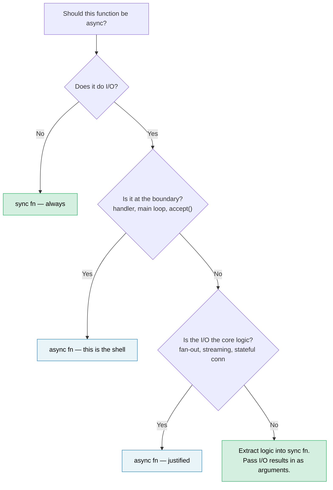

# 14. Async Is an Optimization, Not an Architecture 🔴

> **你将学到什么：**
> - 为什么异步倾向于污染整个代码库 —— 以及为什么这是一个设计缺陷，而不是特性
> - "同步核心，异步外壳"模式，让大多数代码可测试和可调试
> - 如何处理困难情况：*也需要* I/O 的逻辑
> - 何时 `spawn_blocking` 是修复 vs 症状
> - 何时异步真正属于你的核心逻辑
> - 为什么同步优先的库比异步优先的库更具可组合性

你已经花了 13 章学习异步 Rust。这里有本书尚未告诉你的最重要的事情：**你的大多数代码不应该是异步的。**

## 函数着色问题

Bob Nystrom 的 ["What Color is Your Function?"](https://journal.stuffwithstuff.com/2015/02/01/what-color-is-your-function/) 确定了核心问题：异步函数可以调用同步函数，但同步函数不能调用异步函数。一旦一个函数变成异步，调用链中它上面的所有内容都必须跟随。

在 Rust 中，这比 C# 或 JavaScript **更糟**，因为异步不仅感染函数签名 —— 它感染类型：

| 同步代码 | 异步等价物 | 为什么不同 |
|---|---|---|
| `fn process(&self)` | `async fn process(&self)` | 调用者也必须是异步 |
| `&mut T` | `Arc<Mutex<T>>` | 生成的任务需要 `'static + Send` |
| `std::sync::Mutex` | `tokio::sync::Mutex` | 如果在 `.await` 期间持有，则是不同的类型 |
| `impl Trait` 返回 | `impl Future<Output = T> + Send` | 自 RPITIT 以来更简单（Rust 1.75，第 10 章），但仍然有色 |
| `#[test]` | `#[tokio::test]` | 测试需要运行时 |
| 堆栈跟踪：5 帧 | 堆栈跟踪：25 帧 | 一半是运行时内部 |

每一行都是某人必须做出、做对并维护的决定 —— 这些都与业务逻辑无关。业界正在*远离*这个：Java 的 Project Loom（虚拟线程）和 Go 的 goroutines 都让你编写看起来同步的代码，运行时廉价地多路复用。Rust 选择显式异步以实现零成本控制，但该控制有复杂性成本，应该有意识地支付，而不是默认支付。

## "但线程很昂贵"

反射性的反驳："我们需要异步，因为线程很昂贵。"在大多数团队操作的规模上，这大多是错误的。

- **栈内存：** 每个 OS 线程保留 8MB 虚拟地址空间（Linux 默认），但 OS 只在接触时提交页面 —— 一个几乎空闲的线程使用 20-80KB 物理内存。
- **上下文切换：** 在现代硬件上约 1-5µs。在 50 个并发请求下，这是噪音。在 100K 次切换/秒下，这是可测量的。
- **创建成本：** Linux 上每个线程约 10-30µs。线程池（rayon、`std::thread::scope`）将其摊销为零。

异步赚取其复杂性的诚实阈值大约是**1K-10K 并发 mostly-idle 连接** —— epoll/io_uring 的甜蜜点，每个连接的栈成为真正的成本。低于这个，线程池更简单、调试更快、足够快。高于这个，异步获胜。大多数服务低于这个。

## 困难的例子：也需要 I/O 的逻辑

一个琐碎的纯函数 —— `fn add(a: i32, b: i32) -> i32` —— 显然不需要异步。这不是一个有趣的教训。有趣的情况是当业务逻辑*似乎*需要在中间进行 I/O：检查库存的验证、查询汇率的定价、查找客户的订单管道。

考虑一个订单处理服务。异步到处的版本看起来自然：

### 版本 A：异步贯穿核心

```rust
// orders.rs —— 异步一直到底

pub async fn process_order(order: Order) -> Result<Receipt, OrderError> {
    // 步骤 1：验证 —— 纯业务规则，没有 I/O
    validate_items(&order)?;
    validate_quantities(&order)?;

    // 步骤 2：检查库存 —— 需要数据库调用
    let stock = inventory_client.check(&order.items).await?;
    if !stock.all_available() {
        return Err(OrderError::OutOfStock(stock.missing()));
    }

    // 步骤 3：计算定价 —— 纯数学，但异步因为我们已经在这里
    let pricing = calculate_pricing(&order, &stock);

    // 步骤 4：应用折扣 —— 需要外部服务调用
    let discount = discount_service.lookup(order.customer_id).await?;
    let final_price = pricing.apply_discount(discount);

    // 步骤 5：格式化收据 —— 纯
    Ok(Receipt::new(order, final_price))
}
```

这是*合理的*异步代码。没有 `Arc<Mutex>` 滥用 —— 只是顺序的 awaits。大多数开发者会这样写然后继续。但看看发生了什么：`validate_items`、`validate_quantities`、`calculate_pricing` 和 `Receipt::new` 都是纯函数，因为步骤 2 和 4 需要 I/O 而被拖入异步上下文。整个函数必须是异步的，它的测试需要运行时，链中的每个调用者现在都被着色了。

### 版本 B：同步核心，异步外壳

替代方案：分离*决定什么*和*如何获取*：

```rust
// core.rs —— 纯业务逻辑，零异步，零 tokio 依赖

pub fn validate_order(order: &Order) -> Result<ValidatedOrder, OrderError> {
    validate_items(order)?;
    validate_quantities(order)?;
    Ok(ValidatedOrder::from(order))
}

pub fn check_stock(
    order: &ValidatedOrder,
    stock: &StockResult,
) -> Result<StockedOrder, OrderError> {
    if !stock.all_available() {
        return Err(OrderError::OutOfStock(stock.missing()));
    }
    Ok(StockedOrder::from(order, stock))
}

pub fn finalize(
    order: &StockedOrder,
    discount: Discount,
) -> Receipt {
    let pricing = calculate_pricing(order);
    let final_price = pricing.apply_discount(discount);
    Receipt::new(order, final_price)
}
```

```rust
// shell.rs —— 薄的异步编排器
//
// 注意：网络调用上的 `?` 需要 `impl From<reqwest::Error> for OrderError`
//（或统一的错误枚举）。见第 12 章了解异步错误处理模式。

use crate::core;

pub async fn process_order(order: Order) -> Result<Receipt, OrderError> {
    // 同步：验证
    let validated = core::validate_order(&order)?;

    // 异步：获取库存（这是外壳的工作）
    let stock = inventory_client.check(&validated.items).await?;

    // 同步：将业务规则应用于获取的数据
    let stocked = core::check_stock(&validated, &stock)?;

    // 异步：获取折扣
    let discount = discount_service.lookup(order.customer_id).await?;

    // 同步：完成
    Ok(core::finalize(&stocked, discount))
}
```

异步外壳是一个**获取 → 决定 → 获取 → 决定的管道**。每个"决定"步骤是一个同步函数，它将 I/O 结果作为输入，而不是自己获取。

### 测试差异

同步核心测试每个业务规则，不需要运行时或 mocks：

```rust
#[test]
fn out_of_stock_rejects_order() {
    let order = validated_order(vec![item("widget", 10)]);
    let stock = stock_result(vec![("widget", 3)]); // 只有 3 个可用

    let result = core::check_stock(&order, &stock);
    assert_eq!(result.unwrap_err(), OrderError::OutOfStock(vec!["widget"]));
}

#[test]
fn discount_applied_correctly() {
    let order = stocked_order(100_00); // 价格（美分）
    let receipt = core::finalize(&order, Discount::Percent(15));
    assert_eq!(receipt.final_price, 85_00);
}
```

异步外壳获得一个更薄的*集成*测试，验证连接而不是逻辑：

```rust
#[tokio::test]
async fn process_order_integration() {
    let mock_inventory = mock_service(/* 返回库存 */);
    let mock_discounts = mock_service(/* 返回 10% */);
    let receipt = process_order(sample_order()).await.unwrap();
    assert!(receipt.final_price > 0);
    // 逻辑正确性已经被上面的核心测试证明
}
```

### 为什么这很重要

| 关注点 | 异步贯穿核心 | 同步核心 + 异步外壳 |
|---|---|---|
| 业务规则可测试，不需要运行时 | 否 | **是** |
| 需要 `#[tokio::test]` 的单元测试数量 | 所有 | **只有集成测试** |
| I/O 失败与逻辑错误纠缠 | 是 —— 一个 `Result` 类型用于两者 | **否** —— 同步返回逻辑错误，外壳处理 I/O 错误 |
| `validate_order` 在 CLI / WASM / batch 中可重用 | 否 —— 传递引入 tokio | **是** —— 纯 `fn` |
| 通过业务逻辑的堆栈跟踪 | 与运行时帧交错 | **干净** |
| 以后可以 swapping HTTP 客户端为 gRPC | 需要更改核心函数 | **只更改外壳** |

关键见解：**步骤 2 和 4 中的 I/O 调用*不需要*在业务逻辑内部。它们是它的输入。** 同步核心将 `StockResult` 和 `Discount` 作为参数。这些值来自哪里 —— HTTP、gRPC、测试夹具、缓存 —— 是外壳关心的问题。

## `spawn_blocking` 气味

第 12 章介绍 `spawn_blocking` 作为意外阻塞执行器的修复。当你有一个一次性阻塞调用时，这是正确的修复 —— `std::fs::read`、压缩库、传统 FFI 函数。

但如果你发现自己将大块代码包装在 `spawn_blocking` 中：

```rust
async fn handler(req: Request) -> Response {
    // 如果这是你的代码库，边界在错误的地方
    tokio::task::spawn_blocking(move || {
        let validated = validate(&req);       // 同步
        let enriched = enrich(validated);      // 同步
        let result = process(enriched);        // 同步
        let output = format_response(result);  // 同步
        output
    }).await.unwrap()
}
```

...这是代码库在告诉你：**这个逻辑从一开始就不是异步的。** 你不需要 `spawn_blocking` —— 你需要同步模块，异步处理程序直接调用它：

```rust
async fn handler(req: Request) -> Response {
    // validate → enrich → process → format 都是同步的。
    // 不需要 spawn_blocking —— 它们很快且 CPU 轻量。
    let response = my_core::handle(req);
    response
}
```

保留 `spawn_blocking` 用于真正重的 CPU 工作（解析大负载、图像处理、压缩），其中时间成本实际上会饿死执行器。对于在微秒内运行的普通业务逻辑，直接同步调用更简单且正确。

## 库：同步优先，异步包装可选

边界问题对库作者来说更重要。同步库可以被同步和异步调用者使用：

```rust
// 同步库 —— 到处可用
let report = my_lib::analyze(&data);

// 调用者 A：同步 CLI
fn main() {
    let report = my_lib::analyze(&data);
    println!("{report}");
}

// 调用者 B：异步处理程序，工作正常
async fn handler() -> Json<Report> {
    let report = my_lib::analyze(&data); // 异步上下文中的同步调用 —— 可以
    Json(report)
}

// 调用者 C：重型分析 —— 调用者决定卸载
async fn handler_heavy() -> Json<Report> {
    let data = data.clone();
    let report = tokio::task::spawn_blocking(move || {
        my_lib::analyze(&data) // 调用者控制异步边界
    }).await.unwrap();
    Json(report)
}
```

异步库强制*所有*调用者进入运行时：

```rust
// 异步库 —— 只能从异步上下文使用
let report = my_lib::analyze(&data).await; // 调用者必须是异步

// 同步调用者？现在你需要 block_on —— 并希望没有嵌套运行时
let report = tokio::runtime::Runtime::new().unwrap().block_on(
    my_lib::analyze(&data)
); // 脆弱，如果已经在运行时内则容易 panic
```

**默认使用同步 API。** 如果你的库进行纯计算、数据转换或解析，没有理由让它异步。如果它进行 I/O，考虑提供一个同步核心，在特性标志后面有一个可选的异步便利层 —— 让调用者拥有边界决定。

## 何时异步属于核心

不是所有东西都能干净地分离。异步属于你的核心逻辑，当：

- **扇出/扇入是逻辑。** 如果你的业务规则是"并发查询 5 个定价服务并返回最便宜的"，并发*是*逻辑，而不是管道。强制这个通过同步 + 线程是重新发明更糟的异步。

- **流式是逻辑。** 处理带有背压的连续事件流 —— 流管理是非平凡的业务逻辑，而不仅仅是一个 I/O 包装器。

- **长生命周期状态连接。** WebSocket 处理程序、gRPC 双向流和协议状态机有固有地绑定到 I/O 事件的状态转换。[第 17 章](ch17-capstone-project.md) 中的综合项目 —— 一个异步聊天服务器 —— 正是这种情况：并发连接、基于房间的扇出和优雅关闭是根本上的异步工作。

**测试**：如果从函数中删除 `async` 需要用线程、channels 或手动轮询替换它，那么异步在承担它的重量。如果删除 `async` 只是意味着删除关键字而没有其他更改，它从来不需要是异步的。

## 决策规则



> **经验法则：** 从同步开始。仅在最外层 I/O 边界添加异步。只有当你能阐明*哪些并发 I/O 操作*证明复杂性税合理时，才将它向内拉。

---

<details>
<summary><strong>🏋️ 练习：提取同步核心</strong>（点击展开）</summary>

以下 axum 处理程序有异步污染 —— 业务逻辑与 I/O 混合。将它重构为同步核心模块和薄的异步外壳。

```rust
use axum::{Json, extract::Path};

async fn get_device_report(Path(device_id): Path<String>) -> Result<Json<Report>, AppError> {
    // 通过 HTTP 从设备获取原始遥测
    let raw = reqwest::get(format!("http://bmc-{device_id}/telemetry"))
        .await?
        .json::<RawTelemetry>()
        .await?;

    // 业务逻辑：将原始传感器读数转换为校准值
    let mut readings = Vec::new();
    for sensor in &raw.sensors {
        let calibrated = (sensor.raw_value as f64) * sensor.scale + sensor.offset;
        if calibrated < sensor.min_valid || calibrated > sensor.max_valid {
            return Err(AppError::SensorOutOfRange {
                name: sensor.name.clone(),
                value: calibrated,
            });
        }
        readings.push(CalibratedReading {
            name: sensor.name.clone(),
            value: calibrated,
            unit: sensor.unit.clone(),
        });
    }

    // 业务逻辑：分类设备健康状态
    let critical_count = readings.iter()
        .filter(|r| r.value > 90.0)
        .count();
    let health = if critical_count > 2 { Health::Critical }
                 else if critical_count > 0 { Health::Warning }
                 else { Health::Ok };

    // 从库存服务获取设备元数据
    let meta = reqwest::get(format!("http://inventory/devices/{device_id}"))
        .await?
        .json::<DeviceMetadata>()
        .await?;

    Ok(Json(Report {
        device_id,
        device_name: meta.name,
        health,
        readings,
        timestamp: chrono::Utc::now(),
    }))
}
```

**你的目标：**

1. 创建 `core.rs`，带有同步函数：`calibrate_sensors`、`classify_health` 和 `build_report`
2. 创建 `shell.rs`，带有薄的异步处理程序，获取然后调用同步核心
3. 编写 `#[test]`（不是 `#[tokio::test]`）用于：传感器超出范围、健康分类阈值和正常报告

**提示：**
- 同步核心应该将 `RawTelemetry` 和 `DeviceMetadata` 作为输入 —— 它永远不应该知道这些来自 HTTP。
- 你需要定义小型测试辅助函数（例如，`raw_telemetry()`、`sensor()`、`reading()`、`device_meta()`）来构建树测试夹具。它们的签名从使用中应该很明显。

<details>
<summary>🔑 答案</summary>

```rust
// core.rs —— 零异步依赖

pub fn calibrate_sensors(raw: &RawTelemetry) -> Result<Vec<CalibratedReading>, AppError> {
    raw.sensors.iter().map(|sensor| {
        let calibrated = (sensor.raw_value as f64) * sensor.scale + sensor.offset;
        if calibrated < sensor.min_valid || calibrated > sensor.max_valid {
            return Err(AppError::SensorOutOfRange {
                name: sensor.name.clone(),
                value: calibrated,
            });
        }
        Ok(CalibratedReading {
            name: sensor.name.clone(),
            value: calibrated,
            unit: sensor.unit.clone(),
        })
    }).collect()
}

pub fn classify_health(readings: &[CalibratedReading]) -> Health {
    let critical_count = readings.iter()
        .filter(|r| r.value > 90.0)
        .count();
    if critical_count > 2 { Health::Critical }
    else if critical_count > 0 { Health::Warning }
    else { Health::Ok }
}

pub fn build_report(
    device_id: String,
    readings: Vec<CalibratedReading>,
    meta: &DeviceMetadata,
) -> Report {
    Report {
        device_id,
        device_name: meta.name.clone(),
        health: classify_health(&readings),
        readings,
        timestamp: chrono::Utc::now(),
    }
}
```

```rust
// shell.rs —— 仅异步边界

pub async fn get_device_report(
    Path(device_id): Path<String>,
) -> Result<Json<Report>, AppError> {
    let raw = reqwest::get(format!("http://bmc-{device_id}/telemetry"))
        .await?
        .json::<RawTelemetry>()
        .await?;

    let readings = core::calibrate_sensors(&raw)?;

    let meta = reqwest::get(format!("http://inventory/devices/{device_id}"))
        .await?
        .json::<DeviceMetadata>()
        .await?;

    Ok(Json(core::build_report(device_id, readings, &meta)))
}
```

```rust
// core_tests.rs —— 不需要运行时

// 测试夹具辅助函数 —— 构造数据，没有任何 I/O
fn sensor(name: &str, raw_value: f64, valid_range: std::ops::Range<f64>) -> RawSensor {
    RawSensor {
        name: name.into(),
        raw_value,
        scale: 1.0,
        offset: 0.0,
        min_valid: valid_range.start,
        max_valid: valid_range.end,
        unit: "unit".into(),
    }
}

fn raw_telemetry(sensors: Vec<RawSensor>) -> RawTelemetry {
    RawTelemetry { sensors }
}

fn reading(name: &str, value: f64) -> CalibratedReading {
    CalibratedReading { name: name.into(), value, unit: "unit".into() }
}

fn device_meta(name: &str) -> DeviceMetadata {
    DeviceMetadata { name: name.into() }
}

#[test]
fn sensor_out_of_range_rejected() {
    let raw = raw_telemetry(vec![sensor("gpu_temp", 105.0, 0.0..100.0)]);
    let result = core::calibrate_sensors(&raw);
    assert!(matches!(result, Err(AppError::SensorOutOfRange { .. })));
}

#[test]
fn health_classification() {
    let readings = vec![
        reading("a", 50.0),  // 正常
        reading("b", 95.0),  // 严重
        reading("c", 91.0),  // 严重
        reading("d", 92.0),  // 严重
    ];
    assert_eq!(core::classify_health(&readings), Health::Critical);
}

#[test]
fn normal_report() {
    let raw = raw_telemetry(vec![sensor("fan_rpm", 3000.0, 0.0..10000.0)]);
    let readings = core::calibrate_sensors(&raw).unwrap();
    let meta = device_meta("gpu-node-42");
    let report = core::build_report("dev-1".into(), readings, &meta);
    assert_eq!(report.health, Health::Ok);
    assert_eq!(report.readings.len(), 1);
}
```

**什么改变了：** 异步处理程序从 30 行混合逻辑和 I/O 变为 8 行纯编排。业务规则（校准数学、范围验证、健康阈值）现在用 `#[test]` 测试，在毫秒内运行，对 tokio、reqwest 或任何 HTTP mock 服务器零依赖。

</details>
</details>

---

> **关键要点：**
>
> 1. 异步是**I/O 多路优化**，不是应用程序架构。大多数业务逻辑是同步的。
> 2. **同步核心，异步外壳：** 将业务规则保持在纯同步函数中，将 I/O 结果作为参数。异步外壳编排获取并调用核心。
> 3. 如果你将大块包装在 `spawn_blocking` 中，**边界在错误的地方** —— 将逻辑重构为同步模块。
> 4. **库应该默认使用同步 API。** 异步库强制所有调用者进入运行时；同步库让调用者拥有异步边界。
> 5. 异步为**扇出/扇入、流式和状态连接**赚取它的成本 —— 并发*是*业务逻辑的情况。
>
> **另见：**[第 12 章 — Common Pitfalls](ch12-common-pitfalls.md)（spawn_blocking 作为战术修复）· [第 13 章 — Production Patterns](ch13-production-patterns.md)（背压，结构化并发）· [第 17 章 — Capstone: Async Chat Server](ch17-capstone-project.md)（异步是正确架构的情况）

***
