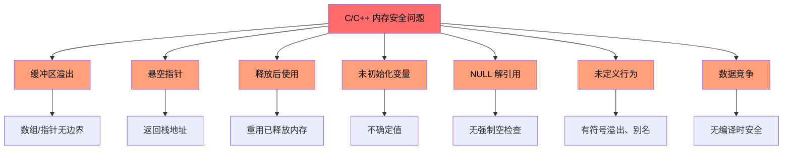
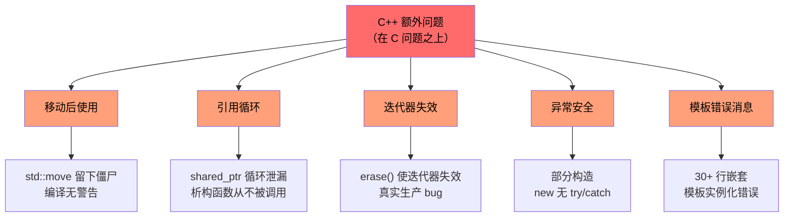
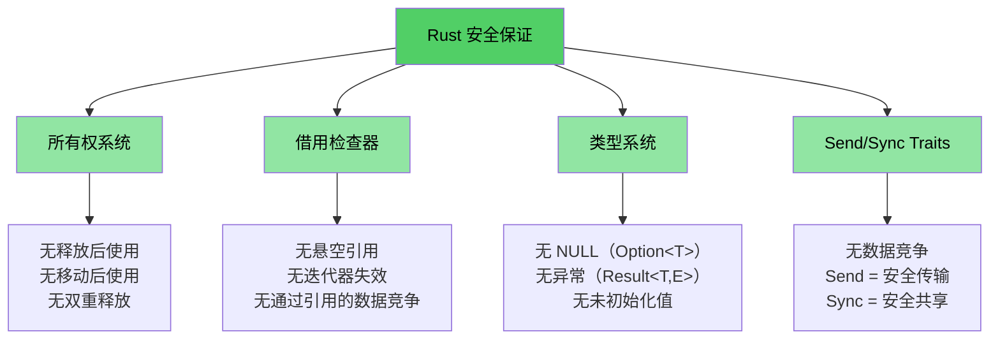

# 为什么 C/C++ 开发者需要 Rust

> **你将学到什么：**
> - Rust 消除的问题完整列表 —— 内存安全、未定义行为、数据竞争等
> - 为什么 `shared_ptr`、`unique_ptr` 和其他 C++ 缓解措施是权宜之计，而非解决方案
> - 具体的 C 和 C++ 漏洞示例，这些在安全 Rust 中结构上不可能发生

> **想直接看代码？** 跳到 [看代码](ch02-getting-started.md#enough-talk-already-show-me-some-code)

## Rust 消除的完整列表

在深入示例之前，这里是执行摘要。安全 Rust **结构上防止** 此列表中的每个问题 —— 不是通过纪律、工具或代码审查，而是通过类型系统和编译器：

| **消除的问题** | **C** | **C++** | **Rust 如何防止** |
|----------------------|:-----:|:-------:|--------------------------|
| 缓冲区溢出/下溢 | ✅ | ✅ | 所有数组、切片和字符串携带边界；索引在运行时检查 |
| 内存泄漏（无需 GC） | ✅ | ✅ | `Drop` trait = 正确的 RAII；自动清理，无需 Rule of Five |
| 悬空指针 | ✅ | ✅ | 生命周期系统在编译时证明引用比其引用对象活得长 |
| 释放后使用 | ✅ | ✅ | 所有权系统使这成为编译错误 |
| 移动后使用 | — | ✅ | 移动是**破坏性的** —— 原始绑定不再存在 |
| 未初始化变量 | ✅ | ✅ | 所有变量在使用前必须初始化；编译器强制执行 |
| 整数溢出/下溢 UB | ✅ | ✅ | Debug 构建在溢出时 panic；release 构建回绕（无论哪种都是定义行为） |
| NULL 指针解引用/SEGV | ✅ | ✅ | 无空指针；`Option<T>` 强制显式处理 |
| 数据竞争 | ✅ | ✅ | `Send`/`Sync` traits + 借用检查器使数据竞争成为编译错误 |
| 不受控的副作用 | ✅ | ✅ | 默认不可变；可变性需要显式 `mut` |
| 无继承（更好的可维护性） | — | ✅ | Traits + 组合取代类层次结构；促进重用而无耦合 |
| 无异常；可预测的控制流 | — | ✅ | 错误是值（`Result<T, E>`）；无法忽略，无隐藏 `throw` 路径 |
| 迭代器失效 | — | ✅ | 借用检查器禁止在迭代时可变地修改集合 |
| 引用循环/泄漏的析构函数 | — | ✅ | 所有权是树形的；`Rc` 循环是可选的，可用 `Weak` 捕获 |
| 无忘记的互斥锁解锁 | ✅ | ✅ | `Mutex<T>` 包装数据；lock guard 是访问的唯一方式 |
| 未定义行为（通用） | ✅ | ✅ | 安全 Rust **零**未定义行为；`unsafe` 块是显式的和可审计的 |

> **底线：** 这些不是通过编码标准强制执行的理想目标。它们是**编译时保证**。如果你的代码编译通过，这些 bug 就不可能存在。

---

## C 和 C++ 共有的问题

> **想跳过示例？** 跳到 [Rust 如何解决所有这些问题](#how-rust-addresses-all-of-this) 或直接到 [看代码](ch02-getting-started.md#enough-talk-already-show-me-some-code)

两种语言共享一组核心的内存安全问题，这是超过 70% CVE（常见漏洞和暴露）的根本原因：

### 缓冲区溢出

C 数组、指针和字符串没有内在边界。超过它们非常简单：

```c
#include <stdlib.h>
#include <string.h>

void buffer_dangers() {
    char buffer[10];
    strcpy(buffer, "This string is way too long!");  // 缓冲区溢出

    int arr[5] = {1, 2, 3, 4, 5};
    int *ptr = arr;           // 丢失大小信息
    ptr[10] = 42;             // 无边界检查 —— 未定义行为
}
```

在 C++ 中，`std::vector::operator[]` 仍然没有边界检查。只有 `.at()` 有 —— 但谁会捕获异常呢？

### 悬空指针和释放后使用

```c
int *bar() {
    int i = 42;
    return &i;    // 返回栈变量地址 —— 悬空！
}

void use_after_free() {
    char *p = (char *)malloc(20);
    free(p);
    *p = '\0';   // 释放后使用 —— 未定义行为
}
```

### 未初始化变量和未定义行为

C 和 C++ 都允许未初始化变量。结果值是不确定的，读取它们是未定义行为：

```c
int x;               // 未初始化
if (x > 0) { ... }  // UB —— x 可能是任何值
```

整数溢出在 C 中对无符号类型是**定义的**，但对有符号类型是**未定义的**。在 C++ 中，有符号溢出也是未定义行为。两种编译器都可以并利用此进行"优化"，以令人惊讶的方式破坏程序。

### NULL 指针解引用

```c
int *ptr = NULL;
*ptr = 42;           // SEGV —— 但编译器不会阻止你
```

在 C++ 中，`std::optional<T>` 有帮助但很冗长，而且经常被 `.value()` 绕过，它会抛出异常。

### 可视化：共有的问题



---

## C++ 在此基础上增加了更多问题

> **C 读者**：如果你不使用 C++，可以 [跳过此处到 Rust 如何解决所有这些问题](#how-rust-addresses-all-of-this)
>
> **想直接看代码？** 跳到 [看代码](ch02-getting-started.md#enough-talk-already-show-me-some-code)

C++ 引入智能指针、RAII、移动语义和异常来解决 C 的问题。这些是**权宜之计，而非根治** —— 它们将失败模式从"运行时崩溃"转移到"运行时更微妙的 bug"：

### `unique_ptr` 和 `shared_ptr` —— 权宜之计，而非解决方案

C++ 智能指针比原始 `malloc`/`free` 是重大改进，但它们没有解决根本问题：

| C++ 缓解措施 | 修复什么 | **不**修复什么 |
|----------------|---------------|------------------------|
| `std::unique_ptr` | 通过 RAII 防止泄漏 | **移动后使用**仍然编译；留下僵尸 nullptr |
| `std::shared_ptr` | 共享所有权 | **引用循环**静默泄漏；`weak_ptr` 纪律是手动的 |
| `std::optional` | 替换一些空使用 | `.value()` **抛出**如果为空 —— 隐藏控制流 |
| `std::string_view` | 避免复制 | **悬空**如果源字符串被释放 —— 无生命周期检查 |
| 移动语义 | 高效传输 | 移动后的对象处于**"有效但未指定状态"** —— UB 等待发生 |
| RAII | 自动清理 | 需要 **Rule of Five** 才能正确；一个错误破坏一切 |

```cpp
// unique_ptr：移动后使用干净地编译
std::unique_ptr<int> ptr = std::make_unique<int>(42);
std::unique_ptr<int> ptr2 = std::move(ptr);
std::cout << *ptr;  // 编译！运行时未定义行为。
                     // 在 Rust 中，这是编译错误："value used after move"
```

```cpp
// shared_ptr：引用循环静默泄漏
struct Node {
    std::shared_ptr<Node> next;
    std::shared_ptr<Node> parent;  // 循环！析构函数从不被调用。
};
auto a = std::make_shared<Node>();
auto b = std::make_shared<Node>();
a->next = b;
b->parent = a;  // 内存泄漏 —— 引用计数永远不会达到 0
                 // 在 Rust 中，Rc<T> + Weak<T> 使循环显式和可打破的
```

### 移动后使用 —— 沉默的杀手

C++ `std::move` 不是移动 —— 它是类型转换。原始对象保持在"有效但未指定状态"。编译器让你继续使用它：

```cpp
auto vec = std::make_unique<std::vector<int>>({1, 2, 3});
auto vec2 = std::move(vec);
vec->size();  // 编译！但解引用 nullptr —— 运行时崩溃
```

在 Rust 中，移动是**破坏性的**。原始绑定消失：

```rust
let vec = vec![1, 2, 3];
let vec2 = vec;           // 移动 —— vec 被消耗
// vec.len();             // 编译错误：value used after move
```

### 迭代器失效 —— 来自生产 C++ 的真实 bug

这些不是人为的示例 —— 它们代表在大型 C++ 代码库中发现的**真实 bug 模式**：

```cpp
// BUG 1：erase 未重新赋值迭代器（未定义行为）
while (it != pending_faults.end()) {
    if (*it != nullptr && (*it)->GetId() == fault->GetId()) {
        pending_faults.erase(it);   // ← 迭代器失效！
        removed_count++;            //   下次循环使用悬空迭代器
    } else {
        ++it;
    }
}
// 修复：it = pending_faults.erase(it);
```

```cpp
// BUG 2：基于索引的 erase 跳过元素
for (auto i = 0; i < entries.size(); i++) {
    if (config_status == ConfigDisable::Status::Disabled) {
        entries.erase(entries.begin() + i);  // ← 移动元素
    }                                         //   i++ 跳过移动的那个
}
```

```cpp
// BUG 3：一个 erase 路径正确，另一个不正确
while (it != incomplete_ids.end()) {
    if (current_action == nullptr) {
        incomplete_ids.erase(it);  // ← BUG：迭代器未重新赋值
        continue;
    }
    it = incomplete_ids.erase(it); // ← 正确路径
}
```

**这些编译时没有任何警告。** 在 Rust 中，借用检查器使所有三个成为编译错误 —— 你不能在迭代集合时可变地修改它，就此为止。

### 异常安全和 `dynamic_cast`/`new` 模式

现代 C++ 代码库仍然严重依赖没有编译时安全的模式：

```cpp
// 典型的 C++ 工厂模式 —— 每个分支都是潜在的 bug
DriverBase* driver = nullptr;
if (dynamic_cast<ModelA*>(device)) {
    driver = new DriverForModelA(framework);
} else if (dynamic_cast<ModelB*>(device)) {
    driver = new DriverForModelB(framework);
}
// 如果 driver 仍然是 nullptr 怎么办？如果 new 抛出怎么办？谁拥有 driver？
```

在典型的 10 万行 C++ 代码库中，你可能会发现数百个 `dynamic_cast` 调用（每个都是潜在的运行时失败）、数百个原始 `new` 调用（每个都是潜在的泄漏）和数百个 `virtual`/`override` 方法（到处是 vtable 开销）。

### 悬空引用和 lambda 捕获

```cpp
int& get_reference() {
    int x = 42;
    return x;  // 悬空引用 —— 编译，运行时 UB
}

auto make_closure() {
    int local = 42;
    return [&local]() { return local; };  // 悬空捕获！
}
```

### 可视化：C++ 额外问题



---

## Rust 如何解决所有这些问题

上面列出的每个问题 —— 来自 C 和 C++ —— 都被 Rust 的编译时保证防止：

| 问题 | Rust 的解决方案 |
|---------|-----------------|
| 缓冲区溢出 | 切片携带长度；索引进行边界检查 |
| 悬空指针/释放后使用 | 生命周期系统在编译时证明引用有效 |
| 移动后使用 | 移动是破坏性的 —— 编译器拒绝让你触碰原始值 |
| 内存泄漏 | `Drop` trait = 无 Rule of Five 的 RAII；自动、正确的清理 |
| 引用循环 | 所有权是树形的；`Rc` + `Weak` 使循环显式 |
| 迭代器失效 | 借用检查器禁止在借用集合时可变地修改它 |
| NULL 指针 | 无空。`Option<T>` 强制通过模式匹配显式处理 |
| 数据竞争 | `Send`/`Sync` traits 使数据竞争成为编译错误 |
| 未初始化变量 | 所有变量必须初始化；编译器强制执行 |
| 整数 UB | Debug 在溢出时 panic；release 回绕（两者都是定义行为） |
| 异常 | 无异常；`Result<T, E>` 在类型签名中可见，用 `?` 传播 |
| 继承复杂性 | Traits + 组合；无菱形问题，无 vtable 脆弱性 |
| 忘记的互斥锁解锁 | `Mutex<T>` 包装数据；lock guard 是唯一的访问路径 |

```rust
fn rust_prevents_everything() {
    // ✅ 无缓冲区溢出 —— 边界检查
    let arr = [1, 2, 3, 4, 5];
    // arr[10];  // 运行时 panic，永不 UB

    // ✅ 无移动后使用 —— 编译错误
    let data = vec![1, 2, 3];
    let moved = data;
    // data.len();  // error: value used after move

    // ✅ 无悬空指针 —— 生命周期错误
    // let r;
    // { let x = 5; r = &x; }  // error: x does not live long enough

    // ✅ 无空 —— Option 强制处理
    let maybe: Option<i32> = None;
    // maybe.unwrap();  // panic，但你会用 match 或 if let 代替

    // ✅ 无数据竞争 —— 编译错误
    // let mut shared = vec![1, 2, 3];
    // std::thread::spawn(|| shared.push(4));  // error: closure may outlive
    // shared.push(5);                         //   borrowed value
}
```

### Rust 的安全模型 —— 完整图景



## 快速参考：C vs C++ vs Rust

| **概念** | **C** | **C++** | **Rust** | **主要区别** |
|-------------|-------|---------|----------|-------------------|
| 内存管理 | `malloc()/free()` | `unique_ptr`、`shared_ptr` | `Box<T>`、`Rc<T>`、`Arc<T>` | 自动、无循环、无僵尸 |
| 数组 | `int arr[10]` | `std::vector<T>`、`std::array<T>` | `Vec<T>`、`[T; N]` | 默认边界检查 |
| 字符串 | `char*` 带`\0` | `std::string`、`string_view` | `String`、`&str` | UTF-8 保证、生命周期检查 |
| 引用 | `int*`（原始） | `T&`、`T&&`（移动） | `&T`、`&mut T` | 生命周期 + 借用检查 |
| 多态 | 函数指针 | 虚函数、继承 | Traits、trait 对象 | 组合优于继承 |
| 泛型 | 宏/`void*` | 模板 | 泛型 + trait 边界 | 清晰的错误消息 |
| 错误处理 | 返回码、`errno` | 异常、`std::optional` | `Result<T, E>`、`Option<T>` | 无隐藏控制流 |
| NULL 安全 | `ptr == NULL` | `nullptr`、`std::optional<T>` | `Option<T>` | 强制空检查 |
| 线程安全 | 手动（pthreads） | 手动（`std::mutex` 等） | 编译时 `Send`/`Sync` | 数据竞争不可能 |
| 构建系统 | Make、CMake | CMake、Make 等 | Cargo | 集成工具链 |
| 未定义行为 | 泛滥 | 微妙（有符号溢出、别名） | 安全代码中零 | 安全保证 |

***

