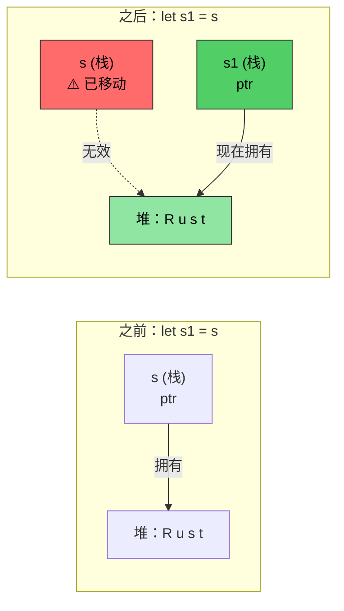
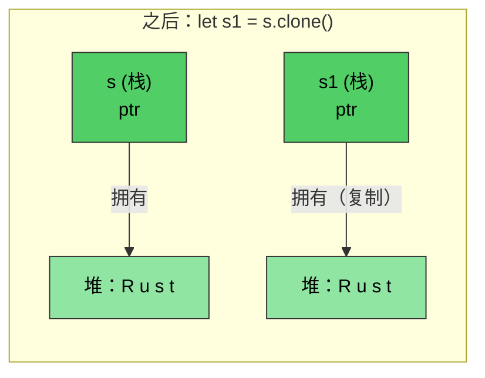

# Rust 内存管理

> **你将学到什么：** Rust 的所有权系统 —— 这门语言中最重要的概念。学完本章后，你将理解移动语义、借用规则和 `Drop` trait。如果你理解了这个章节，Rust 的其余部分自然迎刃而解。如果你感到困惑，重读一遍 —— 对大多数 C/C++ 开发者来说，所有权在第二遍时才会豁然开朗。

- C/C++ 中的内存管理是 bug 的来源：
    - 在 C 中：内存用 `malloc()` 分配，用 `free()` 释放。没有针对悬空指针、释放后使用或双重释放的检查
    - 在 C++ 中：RAII（资源获取即初始化）和智能指针有帮助，但 `std::move(ptr)` 在移动后仍然编译 —— 移动后使用是 UB
- Rust 让 RAII **万无一失**：
    - 移动是**破坏性的** —— 编译器拒绝让你触碰已移动的变量
    - 无需 Rule of Five（无需复制构造函数、移动构造函数、复制赋值、移动赋值、析构函数）
    - Rust 提供对内存分配的完全控制，但在**编译时**强制执行安全
    - 这是通过所有权、借用、可变性和生命周期等机制组合完成的
    - Rust 运行时分配可以发生在栈和堆上

> **对于 C++ 开发者 —— 智能指针映射：**
>
> | **C++** | **Rust** | **安全改进** |
> |---------|----------|----------------------|
> | `std::unique_ptr<T>` | `Box<T>` | 不可能移动后使用 |
> | `std::shared_ptr<T>` | `Rc<T>`（单线程） | 默认无引用循环 |
> | `std::shared_ptr<T>`（线程安全） | `Arc<T>` | 显式线程安全 |
> | `std::weak_ptr<T>` | `Weak<T>` | 必须检查有效性 |
> | 原始指针 | `*const T` / `*mut T` | 仅在 `unsafe` 块中 |
>
> 对于 C 开发者：`Box<T>` 取代 `malloc`/`free` 对。`Rc<T>` 取代手动引用计数。原始指针存在但被限制在 `unsafe` 块中。

# Rust 所有权、借用和生命周期
- 回想一下，Rust 只允许对变量有单个可变引用和多个只读引用
    - 变量的初始声明建立 `所有权`
    - 后续引用从原始所有者 `借用`。规则是借用的作用域永远不能超过所有权作用域。换句话说，借用的 `生命周期` 不能超过所有的生命周期
```rust
fn main() {
    let a = 42; // 所有者
    let b = &a; // 第一次借用
    {
        let aa = 42;
        let c = &a; // 第二次借用；a 仍在作用域中
        // Ok：c 在这里离开作用域
        // aa 在这里离开作用域
    }
    // let d = &aa; // 无法编译，除非 aa 移到外部作用域
    // b 隐式地在 a 之前离开作用域
    // a 最后离开作用域
}
```

- Rust 可以使用几种不同的机制将参数传递给方法
    - 按值（复制）：通常是可以简单复制的类型（例如 u8、u32、i8、i32）
    - 按引用：这相当于传递实际值的指针。这也称为借用，引用可以是不变的（`&`）或可变的（`&mut`）
    - 按移动：这将值的"所有权"转移给函数。调用者不再能引用原始值
```rust
fn foo(x: &u32) {
    println!("{x}");
}
fn bar(x: u32) {
    println!("{x}");
}
fn main() {
    let a = 42;
    foo(&a);    // 按引用
    bar(a);     // 按值（复制）
}
```

- Rust 禁止方法中的悬空引用
    - 方法返回的引用必须仍在作用域中
    - Rust 会在引用离开作用域时自动 `drop` 它
```rust
fn no_dangling() -> &u32 {
    // a 的生命周期开始
    let a = 42;
    // 无法编译。a 的生命周期在这里结束
    &a
}

fn ok_reference(a: &u32) -> &u32 {
    // Ok 因为 a 的生命周期总是超过 ok_reference()
    a
}
fn main() {
    let a = 42;     // a 的生命周期开始
    let b = ok_reference(&a);
    // b 的生命周期在这里结束
    // a 的生命周期在这里结束
}
```

# Rust 移动语义
- 默认情况下，Rust 赋值转移所有权
```rust
fn main() {
    let s = String::from("Rust");    // 从堆分配字符串
    let s1 = s; // 转移所有权给 s1。s 在这时无效
    println!("{s1}");
    // 这无法编译
    //println!("{s}");
    // s1 在这里离开作用域，内存被释放
    // s 在这里离开作用域，但什么也没发生，因为它不拥有任何东西
}
```

*在 `let s1 = s` 之后，所有权转移给 `s1`。堆数据保持不变 —— 只有栈指针移动。`s` 现在无效。*

----
# Rust 移动语义和借用
```rust
fn foo(s : String) {
    println!("{s}");
    // s 指向的堆内存在这里释放
}
fn bar(s : &String) {
    println!("{s}");
    // 什么也没发生 —— s 被借用
}
fn main() {
    let s = String::from("Rust string move example");    // 从堆分配字符串
    foo(s); // 转移所有权；s 现在无效
    // println!("{s}");  // 无法编译
    let t = String::from("Rust string borrow example");
    bar(&t);    // t 继续持有所有权
    println!("{t}"); 
}
```

# Rust 移动语义和所有权
- 可以通过移动转移所有权
    - 移动完成后引用未完成的引用是非法的
    - 如果移动不可取，考虑借用
```rust
struct Point {
    x: u32,
    y: u32,
}
fn consume_point(p: Point) {
    println!("{} {}", p.x, p.y);
}
fn borrow_point(p: &Point) {
    println!("{} {}", p.x, p.y);
}
fn main() {
    let p = Point {x: 10, y: 20};
    // 尝试翻转这两行
    borrow_point(&p);
    consume_point(p);
}
```

# Rust Clone
- `clone()` 方法可用于复制原始内存。原始引用继续有效（缺点是分配增加 2 倍）
```rust
fn main() {
    let s = String::from("Rust");    // 从堆分配字符串
    let s1 = s.clone(); // 复制字符串；在堆上创建新分配
    println!("{s1}");  
    println!("{s}");
    // s1 在这里离开作用域，内存被释放
    // s 在这里离开作用域，内存被释放
}
```

*`clone()` 创建**独立的**堆分配。`s` 和 `s1` 都有效 —— 每个拥有自己的副本。*

# Rust Copy trait
- Rust 使用 `Copy` trait 为内置类型实现复制语义
    - 示例包括 u8、u32、i8、i32 等。复制语义使用"按值传递"
    - 用户定义的数据类型可以选择使用 `derive` 宏加入 `copy` 语义，自动实现 `Copy` trait
    - 编译器将在新赋值后为复制分配空间
```rust
// 尝试注释掉这行来看看下面 let p1 = p; 的变化
#[derive(Copy, Clone, Debug)]   // 我们稍后详细讨论
struct Point{x: u32, y:u32}
fn main() {
    let p = Point {x: 42, y: 40};
    let p1 = p;     // 现在这将执行复制而不是移动
    println!("p: {p:?}");
    println!("p1: {p:?}");
    let p2 = p1.clone();    // 语义上与复制相同
}
```

# Rust Drop trait

- Rust 在作用域结束时自动调用 `drop()` 方法
    - `drop` 是名为 `Drop` 的通用 trait 的一部分。编译器为所有类型提供默认的 NOP 实现，但类型可以覆盖它。例如，`String` 类型覆盖它以释放堆分配的内存
    - 对于 C 开发者：这取代了手动 `free()` 调用的需要 —— 资源在离开作用域时自动释放（RAII）
- **关键安全：** 你不能直接调用 `.drop()`（编译器禁止它）。相反，使用 `drop(obj)` 将值移动到函数中，运行其析构函数，并防止任何进一步使用 —— 消除双重释放 bug

> **对于 C++ 开发者：** `Drop` 直接映射到 C++ 析构函数（`~ClassName()`）：
>
> | | **C++ 析构函数** | **Rust `Drop`** |
> |---|---|---|
> | **语法** | `~MyClass() { ... }` | `impl Drop for MyType { fn drop(&mut self) { ... } }` |
> | **何时调用** | 作用域结束（RAII） | 作用域结束（相同） |
> | **移动时调用** | 源留下"有效但未指定状态" —— 析构函数仍然在已移动的源对象上运行 | 源**消失** —— 已移动的值上无析构函数调用 |
> | **手动调用** | `obj.~MyClass()`（危险，很少使用） | `drop(obj)`（安全 —— 获取所有权，调用 `drop`，防止进一步使用） |
> | **顺序** | 反向声明顺序 | 反向声明顺序（相同） |
> | **Rule of Five** | 必须管理复制构造函数、移动构造函数、复制赋值、移动赋值、析构函数 | 只有 `Drop` —— 编译器处理移动语义，`Clone` 是可选的 |
> | **需要虚析构函数？** | 是，如果通过基指针删除 | 否 —— 无继承，因此无切片问题 |

```rust
struct Point {x: u32, y:u32}

// 等价于：~Point() { printf("Goodbye point x:%u, y:%u\n", x, y); }
impl Drop for Point {
    fn drop(&mut self) {
        println!("Goodbye point x:{}, y:{}", self.x, self.y);
    }
}
fn main() {
    let p = Point{x: 42, y: 42};
    {
        let p1 = Point{x:43, y: 43};
        println!("Exiting inner block");
        // p1.drop() 在这里调用 —— 类似 C++ 作用域结束析构函数
    }
    println!("Exiting main");
    // p.drop() 在这里调用
}
```

# 练习：移动、复制和 Drop

🟡 **中级** —— 自由实验；编译器将指导你
- 创建你自己的 `Point` 实验，在 `#[derive(Debug)]` 中使用和不使用 `Copy`，确保你理解差异。目的是牢固理解移动与复制如何工作，所以确保提问
- 为 `Point` 实现自定义 `Drop`，在 `drop` 中将 x 和 y 设为 0。这个模式例如对释放锁和其他资源很有用
```rust
struct Point{x: u32, y: u32}
fn main() {
    // 创建 Point，赋值给不同的变量，创建新作用域，
    // 传递 point 给函数等
}
```

<details><summary>答案（点击展开）</summary>

```rust
#[derive(Debug)]
struct Point { x: u32, y: u32 }

impl Drop for Point {
    fn drop(&mut self) {
        println!("Dropping Point({}, {})", self.x, self.y);
        self.x = 0;
        self.y = 0;
        // 注意：在 drop 中设为 0 演示了这个模式，
        // 但你在 drop 完成后无法观察到这些值
    }
}

fn consume(p: Point) {
    println!("Consuming: {:?}", p);
    // p 在这里被 drop
}

fn main() {
    let p1 = Point { x: 10, y: 20 };
    let p2 = p1;  // 移动 —— p1 不再有效
    // println!("{:?}", p1);  // 无法编译：p1 被移动

    {
        let p3 = Point { x: 30, y: 40 };
        println!("p3 in inner scope: {:?}", p3);
        // p3 在这里被 drop（作用域结束）
    }

    consume(p2);  // p2 被移动到 consume 并在那里被 drop
    // println!("{:?}", p2);  // 无法编译：p2 被移动

    // 现在尝试：添加 #[derive(Copy, Clone)] 到 Point（并移除 Drop impl）
    // 观察 p1 在 let p2 = p1; 后如何保持有效
}
// 输出：
// p3 in inner scope: Point { x: 30, y: 40 }
// Dropping Point(30, 40)
// Consuming: Point { x: 10, y: 20 }
// Dropping Point(10, 20)
```

</details>


