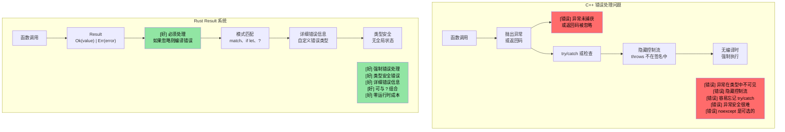
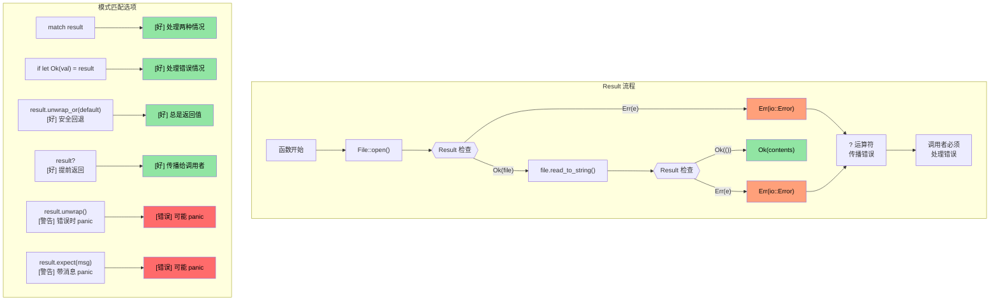

## 连接枚举到 Option 和 Result

> **你将学到什么：** Rust 如何用 `Option<T>` 取代空指针，用 `Result<T, E>` 取代异常，以及 `?` 运算符如何使错误传播简洁。这是 Rust 最独特的模式 —— 错误是值，不是隐藏的控制流。

- 还记得我们之前学过的 `enum` 类型吗？Rust 的 `Option` 和 `Result` 只是标准库中定义的枚举：
```rust
// 这就是 Option 在 std 中的定义方式：
enum Option<T> {
    Some(T),  // 包含一个值
    None,     // 无值
}

// 以及 Result：
enum Result<T, E> {
    Ok(T),    // 成功带值
    Err(E),   // 错误带详情
}
```
- 这意味着你学过的关于使用 `match` 模式匹配的所有内容都直接适用于 `Option` 和 `Result`
- Rust 中**没有空指针** —— `Option<T>` 是替代品，编译器强制你处理 `None` 情况

### C++ 对比：异常 vs Result
| **C++ 模式** | **Rust 等价物** | **优势** |
|----------------|--------------------|--------------|
| `throw std::runtime_error(msg)` | `Err(MyError::Runtime(msg))` | 错误在返回类型中 —— 不能忘记处理 |
| `try { } catch (...) { }` | `match result { Ok(v) => ..., Err(e) => ... }` | 无隐藏控制流 |
| `std::optional<T>` | `Option<T>` | 穷尽匹配必需 —— 不能忘记 None |
| `noexcept` 注解 | 默认 —— 所有 Rust 函数都是"noexcept" | 异常不存在 |
| `errno` / 返回码 | `Result<T, E>` | 类型安全，不能忽略 |

# Rust Option 类型
- Rust `Option` 类型是一个只有两个变体的 `enum`：`Some<T>` 和 `None`
    - 想法是这表示一个 `nullable` 类型，即它要么包含该类型的有效值（`Some<T>`），要么没有有效值（`None`）
    - `Option` 类型用于 API 中，其中操作的结果要么成功并返回有效值，要么失败（但具体错误无关紧要）。例如，考虑将字符串解析为整数值
```rust
fn main() {
    // 返回 Option<usize>
    let a = "1234".find("1");
    match a {
        Some(a) => println!("Found 1 at index {a}"),
        None => println!("Couldn't find 1")
    }
}
```

# Rust Option 类型
- Rust `Option` 可以用各种方式处理
    - `unwrap()` 如果 `Option<T>` 是 `None` 则 panic，否则返回 `T`，这是最不 preferred 的方法
    - `or()` 可用于返回替代值
    - `if let` 让我们测试 `Some<T>`

> **生产模式：** 参见 [使用 unwrap_or 安全提取值](ch17-2-avoiding-unchecked-indexing.md#safe-value-extraction-with-unwrap_or) 和 [函数式转换：map、map_err、find_map](ch17-2-avoiding-unchecked-indexing.md#functional-transforms-map-map_err-find_map) 了解来自生产 Rust 代码的真实示例。
```rust
fn main() {
  // 这返回 Option<usize>
  let a = "1234".find("1");
  println!("{a:?} {}", a.unwrap());
  let a = "1234".find("5").or(Some(42));
  println!("{a:?}");
  if let Some(a) = "1234".find("1") {
      println!("{a}");
  } else {
    println!("Not found in string");
  }
  // 这将 panic
  // "1234".find("5").unwrap();
}
```

# Rust Result 类型
- Result 是一个 `enum` 类型，类似于 `Option`，有两个变体：`Ok<T>` 或 `Err<E>`
    - `Result` 广泛用于可能失败的 Rust API。想法是成功时函数返回 `Ok<T>`，否则返回特定错误 `Err<T>`
```rust
  use std::num::ParseIntError;
  fn main() {
  let a : Result<i32, ParseIntError>  = "1234z".parse();
  match a {
      Ok(n) => println!("Parsed {n}"),
      Err(e) => println!("Parsing failed {e:?}"),
  }
  let a : Result<i32, ParseIntError>  = "1234z".parse().or(Ok(-1));
  println!("{a:?}");
  if let Ok(a) = "1234".parse::<i32>() {
    println!("Let OK {a}");  
  }
  // 这将 panic
  //"1234z".parse().unwrap();
}
```

## Option 和 Result：同一枚硬币的两面

`Option` 和 `Result` 密切相关 —— `Option<T>` 本质上是 `Result<T, ()>`（错误不带任何信息的 result）：

| `Option<T>` | `Result<T, E>` | 含义 |
|-------------|---------------|---------|
| `Some(value)` | `Ok(value)` | 成功 —— 值存在 |
| `None` | `Err(error)` | 失败 —— 无值（Option）或错误详情（Result） |

**它们之间的转换：**

```rust
fn main() {
    let opt: Option<i32> = Some(42);
    let res: Result<i32, &str> = opt.ok_or("value was None");  // Option → Result
    
    let res: Result<i32, &str> = Ok(42);
    let opt: Option<i32> = res.ok();  // Result → Option（丢弃错误）
    
    // 它们共享许多相同的方法：
    // .map()、.and_then()、.unwrap_or()、.unwrap_or_else()、.is_some()/is_ok()
}
```

> **经验法则**：当缺失是正常的时使用 `Option`（例如，查找键）。当失败需要解释时使用 `Result`（例如，文件 I/O、解析）。

# 练习：log() 函数实现与 Option

🟢 **入门**

- 实现一个 `log()` 函数，接受 `Option<&str>` 参数。如果参数是 `None`，则打印默认字符串
- 函数应该返回 `Result` 带 `()` 表示成功和错误（在这种情况下我们永远不会有错误）

<details><summary>答案（点击展开）</summary>

```rust
fn log(message: Option<&str>) -> Result<(), ()> {
    match message {
        Some(msg) => println!("LOG: {msg}"),
        None => println!("LOG: (no message provided)"),
    }
    Ok(())
}

fn main() {
    let _ = log(Some("System initialized"));
    let _ = log(None);
    
    // 使用 unwrap_or 的替代方案：
    let msg: Option<&str> = None;
    println!("LOG: {}", msg.unwrap_or("(default message)"));
}
// 输出：
// LOG: System initialized
// LOG: (no message provided)
// LOG: (default message)
```

</details>

----
# Rust 错误处理
 - Rust 错误可以是不可恢复的（致命的）或可恢复的。致命错误导致 `panic`
    - 一般来说，应该避免导致 `panic` 的情况。`panic` 由程序中的 bug 引起，包括超出索引边界、在 `Option<None>` 上调用 `unwrap()` 等
    - 对于应该不可能的情况有显式 `panic` 是可以的。`panic!` 或 `assert!` 宏可用于健全性检查
```rust
fn main() {
   let x : Option<u32> = None;
   // println!("{x}", x.unwrap()); // 将 panic
   println!("{}", x.unwrap_or(0));  // OK —— 打印 0
   let x = 41;
   //assert!(x == 42); // 将 panic
   //panic!("Something went wrong"); // 无条件 panic
   let _a = vec![0, 1];
   // println!("{}", a[2]); // 超出边界 panic；使用 a.get(2) 将返回 Option<T>
}
```

## 错误处理：C++ vs Rust

### C++ 基于异常的错误处理问题

```cpp
// C++ 错误处理 - 异常创建隐藏控制流
#include <fstream>
#include <stdexcept>

std::string read_config(const std::string& path) {
    std::ifstream file(path);
    if (!file.is_open()) {
        throw std::runtime_error("Cannot open: " + path);
    }
    std::string content;
    // 如果 getline 抛出怎么办？文件是否正确关闭？
    // 使用 RAII 是的，但其他资源呢？
    std::getline(file, content);
    return content;  // 如果调用者不 try/catch 怎么办？
}

int main() {
    // 错误：忘记包装在 try/catch 中！
    auto config = read_config("nonexistent.txt");
    // 异常静默传播，程序崩溃
    // 函数签名中没有任何内容警告我们
    return 0;
}
```



### `Result<T, E>` 可视化

```rust
// Rust 错误处理 - 全面且强制
use std::fs::File;
use std::io::Read;

fn read_file_content(filename: &str) -> Result<String, std::io::Error> {
    let mut file = File::open(filename)?;  // ? 自动传播错误
    let mut contents = String::new();
    file.read_to_string(&mut contents)?;
    Ok(contents)  // 成功情况
}

fn main() {
    match read_file_content("example.txt") {
        Ok(content) => println!("File content: {}", content),
        Err(error) => println!("Failed to read file: {}", error),
        // 编译器强制我们处理两种情况！
    }
}
```



# Rust 错误处理
- Rust 使用 `enum Result<T, E>` 枚举进行可恢复错误处理
    - `Ok<T>` 变体包含成功时的结果，`Err<E>` 包含错误
```rust
fn main() {
    let x = "1234x".parse::<u32>();
    match x {
        Ok(x) => println!("Parsed number {x}"),
        Err(e) => println!("Parsing error {e:?}"),
    }
    let x  = "1234".parse::<u32>();
    // 与上面相同，但使用有效数字
    if let Ok(x) = &x {
        println!("Parsed number {x}")
    } else if let Err(e) = &x {
        println!("Error: {e:?}");
    }
}
```

# Rust 错误处理
- try 运算符 `?` 是 `match` `Ok` / `Err` 模式的便捷速记
    - 注意方法必须返回 `Result<T, E>` 才能使用 `?`
    - `Result<T, E>` 的类型可以更改。在下面的示例中，我们返回与 `str::parse()` 返回的相同错误类型（`std::num::ParseIntError`）
```rust
fn double_string_number(s : &str) -> Result<u32, std::num::ParseIntError> {
   let x = s.parse::<u32>()?; // 如果有错误则立即返回
   Ok(x*2)
}
fn main() {
    let result = double_string_number("1234");
    println!("{result:?}");
    let result = double_string_number("1234x");
    println!("{result:?}");
}
```

# Rust 错误处理
- 错误可以映射到其他类型，或映射到默认值（https://doc.rust-lang.org/std/result/enum.Result.html#method.unwrap_or_default）
```rust
// 在错误情况下将错误类型更改为 ()
fn double_string_number(s : &str) -> Result<u32, ()> {
   let x = s.parse::<u32>().map_err(|_|())?; // 如果有错误则立即返回
   Ok(x*2)
}
```
```rust
fn double_string_number(s : &str) -> Result<u32, ()> {
   let x = s.parse::<u32>().unwrap_or_default(); // 解析错误时默认为 0
   Ok(x*2)
}
```
```rust
fn double_optional_number(x : Option<u32>) -> Result<u32, ()> {
    // ok_or 在下面是将 Option<None> 转换为 Result<u32, ()>
    x.ok_or(()).map(|x|x*2) // .map() 仅应用于 Ok(u32)
}
```

# 练习：错误处理

🟡 **中级**
- 实现一个 `log()` 函数，带单个 u32 参数。如果参数不是 42，则返回错误。成功和错误类型的 `Result<>` 是 `()`
- 调用 `log()` 函数，如果 `log()` 返回错误则退出，带相同的 `Result<>` 类型。否则打印消息说 log 已成功调用

```rust
fn log(x: u32) -> ?? {

}

fn call_log(x: u32) -> ?? {
    // 调用 log(x)，如果返回错误则立即退出
    println!("log was successfully called");
}

fn main() {
    call_log(42);
    call_log(43);
}
```

<details><summary>答案（点击展开）</summary>

```rust
fn log(x: u32) -> Result<(), ()> {
    if x == 42 {
        Ok(())
    } else {
        Err(())
    }
}

fn call_log(x: u32) -> Result<(), ()> {
    log(x)?;  // 如果 log() 返回错误则立即退出
    println!("log was successfully called with {x}");
    Ok(())
}

fn main() {
    let _ = call_log(42);  // 打印：log was successfully called with 42
    let _ = call_log(43);  // 返回 Err(())，不打印任何内容
}
// 输出：
// log was successfully called with 42
```

</details>


