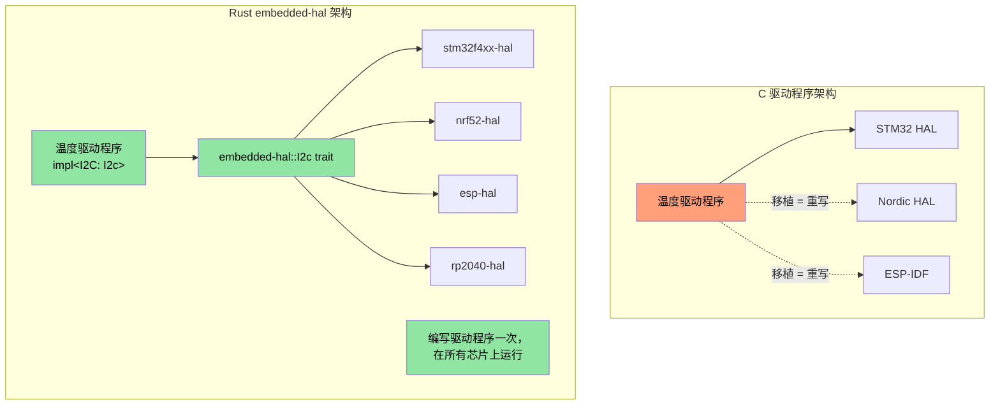

## MMIO 和 Volatile 寄存器访问

> **你将学到什么：** 嵌入式 Rust 中的类型安全硬件寄存器访问 —— volatile MMIO 模式、寄存器抽象 crates，以及 Rust 的类型系统如何编码 C 的 `volatile` 关键字无法做到的寄存器权限。

在 C 固件中，你通过 `volatile` 指针访问特定内存地址的硬件寄存器。Rust 有等价的机制 —— 但带类型安全。

### C volatile vs Rust volatile

```c
// C —— 典型 MMIO 寄存器访问
#define GPIO_BASE     0x40020000
#define GPIO_MODER    (*(volatile uint32_t*)(GPIO_BASE + 0x00))
#define GPIO_ODR      (*(volatile uint32_t*)(GPIO_BASE + 0x14))

void toggle_led(void) {
    GPIO_ODR ^= (1 << 5);  // 翻转引脚 5
}
```

```rust
// Rust —— 原始 volatile（底层，很少直接使用）
use core::ptr;

const GPIO_BASE: usize = 0x4002_0000;
const GPIO_ODR: *mut u32 = (GPIO_BASE + 0x14) as *mut u32;

/// # 安全
/// 调用者必须确保 GPIO_BASE 是有效的映射外设地址。
unsafe fn toggle_led() {
    // 安全：GPIO_ODR 是有效的内存映射寄存器地址。
    let current = unsafe { ptr::read_volatile(GPIO_ODR) };
    unsafe { ptr::write_volatile(GPIO_ODR, current ^ (1 << 5)) };
}
```

### svd2rust —— 类型安全寄存器访问（Rust 方式）

在实践中，你**从不**编写原始 volatile 指针。相反，`svd2rust` 从芯片的 SVD 文件（与你的 IDE 调试视图使用的相同 XML 文件）生成
一个**外设访问 Crate（PAC）**：

```rust
// 生成的 PAC 代码（你不编写这个 —— svd2rust 做）
// PAC 使无效寄存器访问成为编译错误

// 使用 PAC：
use stm32f4::stm32f401;  // 你的芯片的 PAC crate

fn configure_gpio(dp: stm32f401::Peripherals) {
    // 启用 GPIOA 时钟 —— 类型安全，无魔法数字
    dp.RCC.ahb1enr.modify(|_, w| w.gpioaen().enabled());

    // 设置引脚 5 为输出 —— 不能意外写入只读字段
    dp.GPIOA.moder.modify(|_, w| w.moder5().output());

    // 翻转引脚 5 —— 类型检查字段访问
    dp.GPIOA.odr.modify(|r, w| {
        // 安全：在有效寄存器字段中翻转单个位。
        unsafe { w.bits(r.bits() ^ (1 << 5)) }
    });
}
```

| C 寄存器访问 | Rust PAC 等价物 |
|-------------------|---------------------|
| `#define REG (*(volatile uint32_t*)ADDR)` | `svd2rust` 生成的 PAC crate |
| `REG |= BITMASK;` | `periph.reg.modify(|_, w| w.field().variant())` |
| `value = REG;` | `let val = periph.reg.read().field().bits()` |
| 错误的寄存器字段 → 静默 UB | 编译错误 —— 字段不存在 |
| 错误的寄存器宽度 → 静默 UB | 类型检查 —— u8 vs u16 vs u32 |

## 中断处理和临界区

C 固件使用 `__disable_irq()` / `__enable_irq()` 和带 `void` 签名的 ISR 函数。Rust 提供类型安全的等价物。

### C vs Rust 中断模式

```c
// C —— 传统中断处理程序
volatile uint32_t tick_count = 0;

void SysTick_Handler(void) {   // 命名约定至关重要 —— 弄错 → HardFault
    tick_count++;
}

uint32_t get_ticks(void) {
    __disable_irq();
    uint32_t t = tick_count;   // 在临界区内读取
    __enable_irq();
    return t;
}
```

```rust
// Rust —— 使用 cortex-m 和临界区
use core::cell::Cell;
use cortex_m::interrupt::{self, Mutex};

// 由临界区 Mutex 保护的共享状态
static TICK_COUNT: Mutex<Cell<u32>> = Mutex::new(Cell::new(0));

#[cortex_m_rt::exception]     // 属性确保正确的向量表放置
fn SysTick() {                // 如果名称与有效异常不匹配则编译错误
    interrupt::free(|cs| {    // cs = 临界区令牌（证明 IRQ 禁用）
        let count = TICK_COUNT.borrow(cs).get();
        TICK_COUNT.borrow(cs).set(count + 1);
    });
}

fn get_ticks() -> u32 {
    interrupt::free(|cs| TICK_COUNT.borrow(cs).get())
}
```

### RTIC —— 实时中断驱动并发

对于带多个中断优先级的复杂固件，RTIC（以前称为 RTFM）提供
**编译时任务调度，零开销**：

```rust
#[rtic::app(device = stm32f4xx_hal::pac, dispatchers = [USART1])]
mod app {
    use stm32f4xx_hal::prelude::*;

    #[shared]
    struct Shared {
        temperature: f32,   // 在任务间共享 —— RTIC 管理锁定
    }

    #[local]
    struct Local {
        led: stm32f4xx_hal::gpio::Pin<'A', 5, stm32f4xx_hal::gpio::Output>,
    }

    #[init]
    fn init(cx: init::Context) -> (Shared, Local) {
        let dp = cx.device;
        let gpioa = dp.GPIOA.split();
        let led = gpioa.pa5.into_push_pull_output();
        (Shared { temperature: 25.0 }, Local { led })
    }

    // 硬件任务：在 SysTick 中断上运行
    #[task(binds = SysTick, shared = [temperature], local = [led])]
    fn tick(mut cx: tick::Context) {
        cx.local.led.toggle();
        cx.shared.temperature.lock(|temp| {
            // RTIC 保证在此处独占访问 —— 不需要手动锁定
            *temp += 0.1;
        });
    }
}
```

**为什么 RTIC 对 C 固件开发者重要：**
- `#[shared]` 注解替换手动 mutex 管理
- 基于优先级的抢占在编译时配置 —— 无运行时开销
- 通过构造无死锁（框架在编译时证明）
- ISR 命名错误是编译错误，不是运行时 HardFault

## Panic 处理程序策略

在 C 中，当固件出错时，你通常重置或闪烁 LED。
Rust 的 panic 处理程序给你结构化控制：

```rust
// 策略 1：挂起（用于调试 —— 附加调试器，检查状态）
use panic_halt as _;  // panic 时无限循环

// 策略 2：重置 MCU
use panic_reset as _;  // 触发系统重置

// 策略 3：通过 probe 日志（开发）
use panic_probe as _;  // 通过调试 probe 发送 panic 信息（带 defmt）

// 策略 4：通过 defmt 日志然后挂起
use defmt_panic as _;  // 通过 ITM/RTT 发送丰富的 panic 消息

// 策略 5：自定义处理程序（生产固件）
use core::panic::PanicInfo;

#[panic_handler]
fn panic(info: &PanicInfo) -> ! {
    // 1. 禁用中断以防止进一步损坏
    cortex_m::interrupt::disable();

    // 2. 将 panic 信息写入保留的 RAM 区域（重置后仍然存在）
    // 安全：PANIC_LOG 是链接器脚本中定义的保留内存区域。
    unsafe {
        let log = 0x2000_0000 as *mut [u8; 256];
        // 写入截断的 panic 消息
        use core::fmt::Write;
        let mut writer = FixedWriter::new(&mut *log);
        let _ = write!(writer, "{}", info);
    }

    // 3. 触发看门狗重置（或闪烁错误 LED）
    loop {
        cortex_m::asm::wfi();  // 等待中断（挂起时低功耗）
    }
}
```

## 链接器脚本和内存布局

C 固件开发者编写链接器脚本来定义 FLASH/RAM 区域。Rust 嵌入式
通过 `memory.x` 使用相同的概念：

```ld
/* memory.x —— 放在 crate 根目录，由 cortex-m-rt 使用 */
MEMORY
{
  /* 根据你的 MCU 调整 —— 这些是 STM32F401 值 */
  FLASH : ORIGIN = 0x08000000, LENGTH = 512K
  RAM   : ORIGIN = 0x20000000, LENGTH = 96K
}

/* 可选：为 panic 日志保留空间（见上面的 panic 处理程序） */
_panic_log_start = ORIGIN(RAM);
_panic_log_size  = 256;
```

```toml
# .cargo/config.toml —— 设置目标和链接器标志
[target.thumbv7em-none-eabihf]
runner = "probe-rs run --chip STM32F401RE"  # 通过调试 probe 烧录和运行
rustflags = [
    "-C", "link-arg=-Tlink.x",              // cortex-m-rt 链接器脚本
]

[build]
target = "thumbv7em-none-eabihf"            // 带硬件 FPU 的 Cortex-M4F
```

| C 链接器脚本 | Rust 等价物 |
|-----------------|-----------------|
| `MEMORY { FLASH ..., RAM ... }` | crate 根目录的 `memory.x` |
| `__attribute__((section(".data")))` | `#[link_section = ".data"]` |
| Makefile 中的 `-T linker.ld` | `.cargo/config.toml` 中的 `-C link-arg=-Tlink.x` |
| `__bss_start__`、`__bss_end__` | 由 `cortex-m-rt` 自动处理 |
| 启动汇编（`startup.s`） | `cortex-m-rt` `#[entry]` 宏 |

## 编写 `embedded-hal` 驱动程序

`embedded-hal` crate 为 SPI、I2C、GPIO、UART 等定义 traits。针对这些 traits 编写的驱动程序
可在**任何 MCU** 上工作 —— 这是 Rust 嵌入式复用的杀手级功能。

### C vs Rust：温度传感器驱动程序

```c
// C —— 驱动程序紧密耦合到 STM32 HAL
#include "stm32f4xx_hal.h"

float read_temperature(I2C_HandleTypeDef* hi2c, uint8_t addr) {
    uint8_t buf[2];
    HAL_I2C_Mem_Read(hi2c, addr << 1, 0x00, I2C_MEMADD_SIZE_8BIT,
                     buf, 2, HAL_MAX_DELAY);
    int16_t raw = ((int16_t)buf[0] << 4) | (buf[1] >> 4);
    return raw * 0.0625;
}
// 问题：此驱动程序仅适用于 STM32 HAL。移植到 Nordic = 重写。
```

```rust
// Rust —— 驱动程序在任何实现 embedded-hal 的 MCU 上工作
use embedded_hal::i2c::I2c;

pub struct Tmp102<I2C> {
    i2c: I2C,
    address: u8,
}

impl<I2C: I2c> Tmp102<I2C> {
    pub fn new(i2c: I2C, address: u8) -> Self {
        Self { i2c, address }
    }

    pub fn read_temperature(&mut self) -> Result<f32, I2C::Error> {
        let mut buf = [0u8; 2];
        self.i2c.write_read(self.address, &[0x00], &mut buf)?;
        let raw = ((buf[0] as i16) << 4) | ((buf[1] as i16) >> 4);
        Ok(raw as f32 * 0.0625)
    }
}

// 适用于 STM32、Nordic nRF、ESP32、RP2040 —— 任何带 embedded-hal I2c 实现的芯片
```



## 全局分配器设置

`alloc` crate 给你 `Vec`、`String`、`Box` —— 但你需要告诉 Rust
堆内存来自哪里。这相当于为你的平台实现 `malloc()`：

```rust
#![no_std]
extern crate alloc;

use alloc::vec::Vec;
use alloc::string::String;
use embedded_alloc::LlffHeap as Heap;

#[global_allocator]
static HEAP: Heap = Heap::empty();

#[cortex_m_rt::entry]
fn main() -> ! {
    // 用内存区域初始化分配器
    // （通常是不被栈或静态数据使用的部分 RAM）
    {
        const HEAP_SIZE: usize = 4096;
        static mut HEAP_MEM: [u8; HEAP_SIZE] = [0; HEAP_SIZE];
        // 安全：HEAP_MEM 仅在初始化期间访问，在任何分配之前。
        unsafe { HEAP.init(HEAP_MEM.as_ptr() as usize, HEAP_SIZE) }
    }

    // 现在你可以使用堆类型！
    let mut log_buffer: Vec<u8> = Vec::with_capacity(256);
    let name: String = String::from("sensor_01");
    // ...

    loop {}
}
```

| C 堆设置 | Rust 等价物 |
|-------------|-----------------|
| `_sbrk()` / 自定义 `malloc()` | `#[global_allocator]` + `Heap::init()` |
| `configTOTAL_HEAP_SIZE` (FreeRTOS) | `HEAP_SIZE` 常量 |
| `pvPortMalloc()` | `alloc::vec::Vec::new()` —— 自动 |
| 堆耗尽 → 未定义行为 | `alloc_error_handler` → 受控 panic |

## 混合 `no_std` + `std` 工作空间

真实项目（如大型 Rust 工作空间）通常有：
- `no_std` 库 crates 用于硬件可移植逻辑
- `std` 二进制 crates 用于 Linux 应用层

```text
workspace_root/
├── Cargo.toml              # [workspace] members = [...]
├── protocol/               # no_std —— 有线协议，解析
│   ├── Cargo.toml          # 无默认功能，无 std
│   └── src/lib.rs          # #![no_std]
├── driver/                 # no_std —— 硬件抽象
│   ├── Cargo.toml
│   └── src/lib.rs          # #![no_std]，使用 embedded-hal traits
├── firmware/               # no_std —— MCU 二进制
│   ├── Cargo.toml          # 依赖 protocol、driver
│   └── src/main.rs         # #![no_std] #![no_main]
└── host_tool/              # std —— Linux CLI 工具
    ├── Cargo.toml          # 依赖 protocol（相同的 crate！）
    └── src/main.rs         # 使用 std::fs、std::net 等
```

关键模式：`protocol` crate 使用 `#![no_std]` 所以它可以为**两者**编译 ——
MCU 固件和 Linux 主机工具。共享代码，零重复。

```toml
# protocol/Cargo.toml
[package]
name = "protocol"

[features]
default = []
std = []  # 可选：为主机构建时启用特定于 std 的功能

[dependencies]
serde = { version = "1", default-features = false, features = ["derive"] }
# 注意：default-features = false 删除 serde 的 std 依赖
```

```rust
// protocol/src/lib.rs
#![cfg_attr(not(feature = "std"), no_std)]

#[cfg(feature = "std")]
extern crate std;

extern crate alloc;
use alloc::vec::Vec;
use serde::{Serialize, Deserialize};

#[derive(Debug, Serialize, Deserialize)]
pub struct DiagPacket {
    pub sensor_id: u16,
    pub value: i32,
    pub fault_code: u16,
}

// 此函数在 no_std 和 std 上下文中都有效
pub fn parse_packet(data: &[u8]) -> Result<DiagPacket, &'static str> {
    if data.len() < 8 {
        return Err("数据包太短");
    }
    Ok(DiagPacket {
        sensor_id: u16::from_le_bytes([data[0], data[1]]),
        value: i32::from_le_bytes([data[2], data[3], data[4], data[5]]),
        fault_code: u16::from_le_bytes([data[6], data[7]]),
    })
}
```

## 练习：硬件抽象层驱动程序

为通过 SPI 通信的假设 LED 控制器编写 `no_std` 驱动程序。
驱动程序应该使用 `embedded-hal` 对任何 SPI 实现泛型。

**要求：**
1. 定义 `LedController<SPI>` 结构体
2. 实现 `new()`、`set_brightness(led: u8, brightness: u8)` 和 `all_off()`
3. SPI 协议：发送 `[led_index, brightness_value]` 作为 2 字节事务
4. 使用模拟 SPI 实现编写测试

```rust
// 起始代码
#![no_std]
use embedded_hal::spi::SpiDevice;

pub struct LedController<SPI> {
    spi: SPI,
    num_leds: u8,
}

// 待完成：实现 new()、set_brightness()、all_off()
// 待完成：创建 MockSpi 用于测试
```

<details><summary>答案（点击展开）</summary>

```rust
#![no_std]
use embedded_hal::spi::SpiDevice;

pub struct LedController<SPI> {
    spi: SPI,
    num_leds: u8,
}

impl<SPI: SpiDevice> LedController<SPI> {
    pub fn new(spi: SPI, num_leds: u8) -> Self {
        Self { spi, num_leds }
    }

    pub fn set_brightness(&mut self, led: u8, brightness: u8) -> Result<(), SPI::Error> {
        if led >= self.num_leds {
            return Ok(()); // 静默忽略范围外的 LED
        }
        self.spi.write(&[led, brightness])
    }

    pub fn all_off(&mut self) -> Result<(), SPI::Error> {
        for led in 0..self.num_leds {
            self.spi.write(&[led, 0])?;
        }
        Ok(())
    }
}

#[cfg(test)]
mod tests {
    use super::*;

    // 模拟 SPI，记录所有事务
    struct MockSpi {
        transactions: Vec<Vec<u8>>,
    }

    // 模拟的最小错误类型
    #[derive(Debug)]
    struct MockError;
    impl embedded_hal::spi::Error for MockError {
        fn kind(&self) -> embedded_hal::spi::ErrorKind {
            embedded_hal::spi::ErrorKind::Other
        }
    }

    impl embedded_hal::spi::ErrorType for MockSpi {
        type Error = MockError;
    }

    impl SpiDevice for MockSpi {
        fn write(&mut self, buf: &[u8]) -> Result<(), Self::Error> {
            self.transactions.push(buf.to_vec());
            Ok(())
        }
        fn read(&mut self, _buf: &mut [u8]) -> Result<(), Self::Error> { Ok(()) }
        fn transfer(&mut self, _r: &mut [u8], _w: &[u8]) -> Result<(), Self::Error> { Ok(()) }
        fn transfer_in_place(&mut self, _buf: &mut [u8]) -> Result<(), Self::Error> { Ok(()) }
        fn transaction(&mut self, _ops: &mut [embedded_hal::spi::Operation<'_, u8>]) -> Result<(), Self::Error> { Ok(()) }
    }

    #[test]
    fn test_set_brightness() {
        let mock = MockSpi { transactions: vec![] };
        let mut ctrl = LedController::new(mock, 4);
        ctrl.set_brightness(2, 128).unwrap();
        assert_eq!(ctrl.spi.transactions, vec![vec![2, 128]]);
    }

    #[test]
    fn test_all_off() {
        let mock = MockSpi { transactions: vec![] };
        let mut ctrl = LedController::new(mock, 3);
        ctrl.all_off().unwrap();
        assert_eq!(ctrl.spi.transactions, vec![
            vec![0, 0], vec![1, 0], vec![2, 0],
        ]);
    }

    #[test]
    fn test_out_of_range_led() {
        let mock = MockSpi { transactions: vec![] };
        let mut ctrl = LedController::new(mock, 2);
        ctrl.set_brightness(5, 255).unwrap(); // 范围外 —— 忽略
        assert!(ctrl.spi.transactions.is_empty());
    }
}
```

</details>

## 调试嵌入式 Rust —— probe-rs、defmt 和 VS Code

C 固件开发者通常使用 OpenOCD + GDB 或供应商特定 IDE
（Keil、IAR、Segger Ozone）调试。Rust 的嵌入式生态系统已统一使用 **probe-rs**
作为统一调试 probe 接口，用单一的原生 Rust 工具替换 OpenOCD + GDB 栈。

### probe-rs —— 多合一调试 probe 工具

`probe-rs` 替换 OpenOCD + GDB 组合。它支持 CMSIS-DAP、
ST-Link、J-Link 和其他调试 probe，开箱即用：

```bash
# 安装 probe-rs（包括 cargo-flash 和 cargo-embed）
cargo install probe-rs-tools

# 烧录并运行固件
cargo flash --chip STM32F401RE --release

# 烧录、运行并打开 RTT（实时传输）控制台
cargo embed --chip STM32F401RE
```

**probe-rs vs OpenOCD + GDB**：

| 方面 | OpenOCD + GDB | probe-rs |
|--------|--------------|----------|
| 安装 | 2 个独立包 + 脚本 | `cargo install probe-rs-tools` |
| 配置 | 每个板/probe 的 `.cfg` 文件 | `--chip` 标志或 `Embed.toml` |
| 控制台输出 | 半主机（非常慢） | RTT（快 ~10 倍） |
| 日志框架 | `printf` | `defmt`（结构化，零成本） |
| Flash 算法 | XML 包文件 | 内置支持 1000+ 芯片 |
| GDB 支持 | 原生 | `probe-rs gdb` 适配器 |

### `Embed.toml` —— 项目配置

probe-rs 使用单一配置文件，而不是处理 `.cfg` 和 `.gdbinit` 文件：

```toml
# Embed.toml —— 放在项目根目录
[default.general]
chip = "STM32F401RETx"

[default.rtt]
enabled = true           # 启用实时传输控制台
channels = [
    { up = 0, mode = "BlockIfFull", name = "Terminal" },

