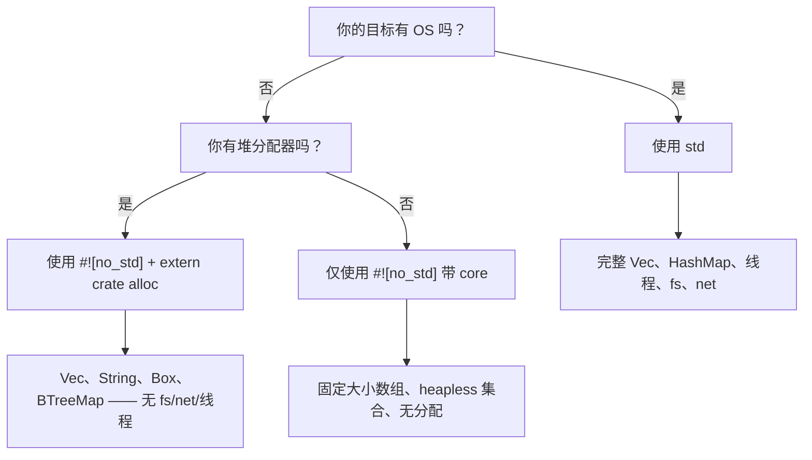

# `no_std` —— 无标准库的 Rust

> **你将学到什么：** 如何使用 `#![no_std]` 为裸机和嵌入式目标编写 Rust —— `core` 和 `alloc` crate 拆分、panic 处理程序，以及这与没有 `libc` 的嵌入式 C 如何对比。

如果你来自嵌入式 C 背景，你已经习惯在没有 `libc` 或使用最小
运行时下工作。Rust 有一流的等价物：**`#![no_std]`** 属性。

## 什么是 `no_std`？

当你在 crate 根目录添加 `#![no_std]` 时，编译器移除
隐式的 `extern crate std;` 并仅链接到 **`core`**（以及可选的 **`alloc`**）。

| 层 | 它提供什么 | 需要 OS / 堆？ |
|-------|-----------------|---------------------|
| `core` | 原始类型、`Option`、`Result`、`Iterator`、数学、`slice`、`str`、原子操作、`fmt` | **否** —— 在裸机上运行 |
| `alloc` | `Vec`、`String`、`Box`、`Rc`、`Arc`、`BTreeMap` | 需要全局分配器，但**不需要 OS** |
| `std` | `HashMap`、`fs`、`net`、`thread`、`io`、`env`、`process` | **是** —— 需要 OS |

> **嵌入式开发者的经验法则：** 如果你的 C 项目链接到 `-lc` 并
> 使用 `malloc`，你可能可以使用 `core` + `alloc`。如果它在没有 `malloc` 的裸机上运行，
> 坚持仅使用 `core`。

## 声明 `no_std`

```rust
// src/lib.rs（或 src/main.rs 对于带 #![no_main] 的二进制文件）
#![no_std]

// 你仍然可以获得 `core` 中的一切：
use core::fmt;
use core::result::Result;
use core::option::Option;

// 如果你有分配器，选择堆类型：
extern crate alloc;
use alloc::vec::Vec;
use alloc::string::String;
```

对于裸机二进制文件，你还需要 `#![no_main]` 和 panic 处理程序：

```rust
#![no_std]
#![no_main]

use core::panic::PanicInfo;

#[panic_handler]
fn panic(_info: &PanicInfo) -> ! {
    loop {} // panic 时挂起 —— 用你的板子的重置/LED 闪烁替换
}

// 入口点取决于你的 HAL / 链接器脚本
```

## 你失去什么（以及替代方案）

| `std` 功能 | `no_std` 替代方案 |
|---------------|---------------------|
| `println!` | `core::write!` 到 UART / `defmt` |
| `HashMap` | `heapless::FnvIndexMap`（固定容量）或 `BTreeMap`（带 `alloc`） |
| `Vec` | `heapless::Vec`（栈分配，固定容量） |
| `String` | `heapless::String` 或 `&str` |
| `std::io::Read/Write` | `embedded_io::Read/Write` |
| `thread::spawn` | 中断处理程序、RTIC 任务 |
| `std::time` | 硬件定时器外设 |
| `std::fs` | Flash / EEPROM 驱动程序 |

## 值得注意的嵌入式 `no_std` crates

| Crate | 目的 | 注释 |
|-------|---------|-------|
| [`heapless`](https://crates.io/crates/heapless) | 固定容量 `Vec`、`String`、`Queue`、`Map` | 不需要分配器 —— 全部在栈上 |
| [`defmt`](https://crates.io/crates/defmt) | 通过 probe/ITM 高效日志 | 类似 `printf` 但延迟格式化在主机上 |
| [`embedded-hal`](https://crates.io/crates/embedded-hal) | 硬件抽象 traits（SPI、I²C、GPIO、UART） | 实现一次，在任何 MCU 上运行 |
| [`cortex-m`](https://crates.io/crates/cortex-m) | ARM Cortex-M 内在函数和寄存器访问 | 底层，类似 CMSIS |
| [`cortex-m-rt`](https://crates.io/crates/cortex-m-rt) | Cortex-M 运行时/启动代码 | 替换你的 `startup.s` |
| [`rtic`](https://crates.io/crates/rtic) | 实时中断驱动并发 | 编译时任务调度，零开销 |
| [`embassy`](https://crates.io/crates/embassy-executor) | 嵌入式 async 执行器 | 裸机上的 `async/await` |
| [`postcard`](https://crates.io/crates/postcard) | `no_std` serde 序列化（二进制） | 当你负担不起字符串时替换 `serde_json` |
| [`thiserror`](https://crates.io/crates/thiserror) | `Error` trait 的 derive 宏 | 自 v2 起在 `no_std` 中工作；优先于 `anyhow` |
| [`smoltcp`](https://crates.io/crates/smoltcp) | `no_std` TCP/IP 栈 | 当你需要无 OS 的网络时 |

## C vs Rust：裸机对比

典型的嵌入式 C blinky：

```c
// C —— 裸机，供应商 HAL
#include "stm32f4xx_hal.h"

void SysTick_Handler(void) {
    HAL_GPIO_TogglePin(GPIOA, GPIO_PIN_5);
}

int main(void) {
    HAL_Init();
    __HAL_RCC_GPIOA_CLK_ENABLE();
    GPIO_InitTypeDef gpio = { .Pin = GPIO_PIN_5, .Mode = GPIO_MODE_OUTPUT_PP };
    HAL_GPIO_Init(GPIOA, &gpio);
    HAL_SYSTICK_Config(HAL_RCC_GetHCLKFreq() / 1000);
    while (1) {}
}
```

Rust 等价物（使用 `embedded-hal` + 板子 crate）：

```rust
#![no_std]
#![no_main]

use cortex_m_rt::entry;
use panic_halt as _; // panic 处理程序：无限循环
use stm32f4xx_hal::{pac, prelude::*};

#[entry]
fn main() -> ! {
    let dp = pac::Peripherals::take().unwrap();
    let gpioa = dp.GPIOA.split();
    let mut led = gpioa.pa5.into_push_pull_output();

    let rcc = dp.RCC.constrain();
    let clocks = rcc.cfgr.freeze();
    let mut delay = dp.TIM2.delay_ms(&clocks);

    loop {
        led.toggle();
        delay.delay_ms(500u32);
    }
}
```

**C 开发者的关键区别：**
- `Peripherals::take()` 返回 `Option` —— 在编译时确保单例模式（无双初始化 bug）
- `.split()` 移动单个引脚的所有权 —— 没有两个模块驱动同一引脚的风险
- 所有寄存器访问都是类型检查的 —— 你不能意外写入只读寄存器
- 借用检查器防止 `main` 和中断处理程序之间的数据竞争（带 RTIC）

## 何时使用 `no_std` vs `std`



# 练习：`no_std` 环形缓冲区

🔴 **挑战** —— 在 `no_std` 上下文中组合泛型、`MaybeUninit` 和 `#[cfg(test)]`

在嵌入式系统中，你经常需要永不分配的固定大小环形缓冲区（循环缓冲区）。
仅使用 `core`（无 `alloc`，无 `std`）实现一个。

**要求：**
- 泛型元素类型 `T: Copy`
- 固定容量 `N`（const 泛型）
- `push(&mut self, item: T)` —— 满时覆盖最旧元素
- `pop(&mut self) -> Option<T>` —— 返回最旧元素
- `len(&self) -> usize`
- `is_empty(&self) -> bool`
- 必须用 `#![no_std]` 编译

```rust
// 起始代码
#![no_std]

use core::mem::MaybeUninit;

pub struct RingBuffer<T: Copy, const N: usize> {
    buf: [MaybeUninit<T>; N],
    head: usize,  // 下一个写入位置
    tail: usize,  // 下一个读取位置
    count: usize,
}

impl<T: Copy, const N: usize> RingBuffer<T, N> {
    pub const fn new() -> Self {
        todo!()
    }
    pub fn push(&mut self, item: T) {
        todo!()
    }
    pub fn pop(&mut self) -> Option<T> {
        todo!()
    }
    pub fn len(&self) -> usize {
        todo!()
    }
    pub fn is_empty(&self) -> bool {
        todo!()
    }
}
```

<details>
<summary>答案</summary>

```rust
#![no_std]

use core::mem::MaybeUninit;

pub struct RingBuffer<T: Copy, const N: usize> {
    buf: [MaybeUninit<T>; N],
    head: usize,
    tail: usize,
    count: usize,
}

impl<T: Copy, const N: usize> RingBuffer<T, N> {
    pub const fn new() -> Self {
        Self {
            // 安全：MaybeUninit 不需要初始化
            buf: unsafe { MaybeUninit::uninit().assume_init() },
            head: 0,
            tail: 0,
            count: 0,
        }
    }

    pub fn push(&mut self, item: T) {
        self.buf[self.head] = MaybeUninit::new(item);
        self.head = (self.head + 1) % N;
        if self.count == N {
            // 缓冲区已满 —— 覆盖最旧，推进 tail
            self.tail = (self.tail + 1) % N;
        } else {
            self.count += 1;
        }
    }

    pub fn pop(&mut self) -> Option<T> {
        if self.count == 0 {
            return None;
        }
        // 安全：我们只读取之前通过 push() 写入的位置
        let item = unsafe { self.buf[self.tail].assume_init() };
        self.tail = (self.tail + 1) % N;
        self.count -= 1;
        Some(item)
    }

    pub fn len(&self) -> usize {
        self.count
    }

    pub fn is_empty(&self) -> bool {
        self.count == 0
    }
}

#[cfg(test)]
mod tests {
    use super::*;

    #[test]
    fn basic_push_pop() {
        let mut rb = RingBuffer::<u32, 4>::new();
        assert!(rb.is_empty());

        rb.push(10);
        rb.push(20);
        rb.push(30);
        assert_eq!(rb.len(), 3);

        assert_eq!(rb.pop(), Some(10));
        assert_eq!(rb.pop(), Some(20));
        assert_eq!(rb.pop(), Some(30));
        assert_eq!(rb.pop(), None);
    }

    #[test]
    fn overwrite_on_full() {
        let mut rb = RingBuffer::<u8, 3>::new();
        rb.push(1);
        rb.push(2);
        rb.push(3);
        // 缓冲区满：[1, 2, 3]

        rb.push(4); // 覆盖 1 → [4, 2, 3]，tail 推进
        assert_eq!(rb.len(), 3);
        assert_eq!(rb.pop(), Some(2)); // 最旧的存活
        assert_eq!(rb.pop(), Some(3));
        assert_eq!(rb.pop(), Some(4));
        assert_eq!(rb.pop(), None);
    }
}
```

**为什么这对嵌入式 C 开发者重要：**
- `MaybeUninit` 是 Rust 的未初始化内存等价物 —— 编译器
  不会插入零填充，就像 C 中的 `char buf[N];`
- `unsafe` 块最小（2 行），每个都有 `// SAFETY:` 注释
- `const fn new()` 意味着你可以在 `static` 变量中创建环形缓冲区
  无需运行时构造函数
- 尽管代码是 `no_std`，测试仍然可以用 `cargo test` 在主机上运行

</details>


