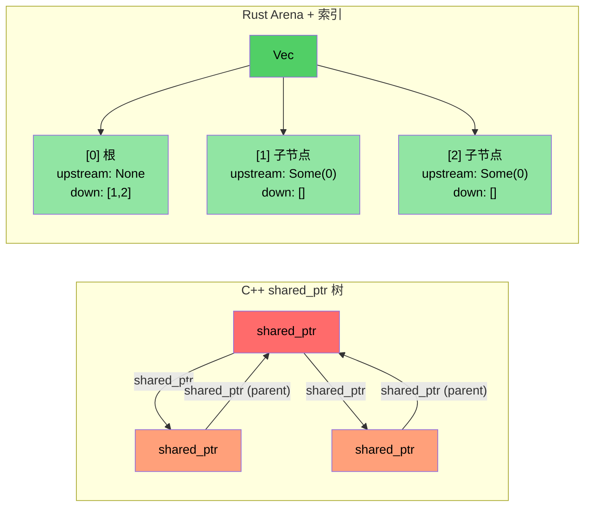

# 案例研究概述：C++ 到 Rust 翻译

> **你将学到什么：** 来自真实世界翻译的经验教训 —— 约 10 万行 C++ 翻译为约 9 万行 Rust，跨约 20 个 crates。五个关键转换模式及其背后的架构决策。

- 我们将一个大型 C++ 诊断系统（约 10 万行 C++）翻译为 Rust 实现（约 20 个 Rust crates，约 9 万行）
- 本节展示**实际使用的模式** —— 不是玩具示例，而是真实的生产代码
- 五个关键转换：

| **#** | **C++ 模式** | **Rust 模式** | **影响** |
|-------|----------------|-----------------|-----------|
| 1 | 类层次结构 + `dynamic_cast` | Enum 派 + `match` | ~400 → 0 次 dynamic_cast |
| 2 | `shared_ptr` / `enable_shared_from_this` 树 | Arena + 索引链接 | 无引用循环 |
| 3 | 每个模块中的 `Framework*` 原始指针 | 带生命周期借用的 `DiagContext<'a>` | 编译时有效性 |
| 4 | 上帝对象 | 可组合状态结构体 | 可测试，模块化 |
| 5 | 无处不在的 `vector<unique_ptr<Base>>` | 仅在需要时使用 trait 对象（约 25 次使用） | 默认静态派 |

### 前后对比指标

| **指标** | **C++（原始）** | **Rust（重写）** |
|------------|---------------------|------------------------|
| `dynamic_cast` / 类型向下转换 | ~400 | 0 |
| `virtual` / `override` 方法 | ~900 | ~25（`Box<dyn Trait>`） |
| 原始 `new` 分配 | ~200 | 0（全部自有类型） |
| `shared_ptr` / 引用计数 | ~10（拓扑库） | 0（仅在 FFI 边界使用 `Arc`） |
| `enum class` 定义 | ~60 | ~190 个 `pub enum` |
| 模式匹配表达式 | N/A | ~750 次 `match` |
| 上帝对象（>5K 行） | 2 | 0 |

----

# 案例研究 1：继承层次结构 → Enum 派

## C++ 模式：事件类层次结构
```cpp
// C++ 原始：每个 GPU 事件类型都是继承自 GpuEventBase 的类
class GpuEventBase {
public:
    virtual ~GpuEventBase() = default;
    virtual void Process(DiagFramework* fw) = 0;
    uint16_t m_recordId;
    uint8_t  m_sensorType;
    // ... 公共字段
};

class GpuPcieDegradeEvent : public GpuEventBase {
public:
    void Process(DiagFramework* fw) override;
    uint8_t m_linkSpeed;
    uint8_t m_linkWidth;
};

class GpuPcieFatalEvent : public GpuEventBase { /* ... */ };
class GpuBootEvent : public GpuEventBase { /* ... */ };
// ... 10+ 个继承自 GpuEventBase 的事件类

// 处理需要 dynamic_cast：
void ProcessEvents(std::vector<std::unique_ptr<GpuEventBase>>& events,
                   DiagFramework* fw) {
    for (auto& event : events) {
        if (auto* degrade = dynamic_cast<GpuPcieDegradeEvent*>(event.get())) {
            // 处理降级...
        } else if (auto* fatal = dynamic_cast<GpuPcieFatalEvent*>(event.get())) {
            // 处理致命...
        }
        // ... 还有 10 多个分支
    }
}
```

## Rust 解决方案：Enum 派
```rust
// 示例：types.rs —— 无继承，无 vtable，无 dynamic_cast
#[derive(Debug, Clone, PartialEq, Eq, Serialize, Deserialize)]
pub enum GpuEventKind {
    PcieDegrade,
    PcieFatal,
    PcieUncorr,
    Boot,
    BaseboardState,
    EccError,
    OverTemp,
    PowerRail,
    ErotStatus,
    Unknown,
}
```

```rust
// 示例：manager.rs —— 独立的类型化 Vec，不需要向下转换
pub struct GpuEventManager {
    sku: SkuVariant,
    degrade_events: Vec<GpuPcieDegradeEvent>,   // 具体类型，不是 Box<dyn>
    fatal_events: Vec<GpuPcieFatalEvent>,
    uncorr_events: Vec<GpuPcieUncorrEvent>,
    boot_events: Vec<GpuBootEvent>,
    baseboard_events: Vec<GpuBaseboardEvent>,
    ecc_events: Vec<GpuEccEvent>,
    // ... 每个事件类型都有自己的 Vec
}

// 访问器返回类型化切片 —— 零歧义
impl GpuEventManager {
    pub fn degrade_events(&self) -> &[GpuPcieDegradeEvent] {
        &self.degrade_events
    }
    pub fn fatal_events(&self) -> &[GpuPcieFatalEvent] {
        &self.fatal_events
    }
}
```

### 为什么不用 `Vec<Box<dyn GpuEvent>>`？
- **错误方法**（直接翻译）：将所有事件放入一个异构集合中，然后向下转换 —— 这是 C++ 用 `vector<unique_ptr<Base>>` 做的事情
- **正确方法**：独立的类型化 Vec 消除*所有*向下转换。每个消费者请求它确切需要的事件类型
- **性能**：独立 Vec 提供更好的缓存局部性（所有降级事件在内存中连续）

----

# 案例研究 2：shared_ptr 树 → Arena/索引模式

## C++ 模式：引用计数树
```cpp
// C++ 拓扑库：PcieDevice 使用 enable_shared_from_this 
// 因为父节点和子节点都需要相互引用
class PcieDevice : public std::enable_shared_from_this<PcieDevice> {
public:
    std::shared_ptr<PcieDevice> m_upstream;
    std::vector<std::shared_ptr<PcieDevice>> m_downstream;
    // ... 设备数据
    
    void AddChild(std::shared_ptr<PcieDevice> child) {
        child->m_upstream = shared_from_this();  // 父子循环！
        m_downstream.push_back(child);
    }
};
// 问题：父→子和子→父创建引用循环
// 需要 weak_ptr 打破循环，但容易忘记
```

## Rust 解决方案：带索引链接的 Arena
```rust
// 示例：components.rs —— 扁平 Vec 拥有所有设备
pub struct PcieDevice {
    pub base: PcieDeviceBase,
    pub kind: PcieDeviceKind,

    // 通过索引的树链接 —— 无引用计数，无循环
    pub upstream_idx: Option<usize>,      // arena Vec 的索引
    pub downstream_idxs: Vec<usize>,      // arena Vec 的索引
}

// "arena" 只是一个由树拥有的 `Vec<PcieDevice>`：
pub struct DeviceTree {
    devices: Vec<PcieDevice>,  // 扁平所有权 —— 一个 Vec 拥有一切
}

impl DeviceTree {
    pub fn parent(&self, device_idx: usize) -> Option<&PcieDevice> {
        self.devices[device_idx].upstream_idx
            .map(|idx| &self.devices[idx])
    }
    
    pub fn children(&self, device_idx: usize) -> Vec<&PcieDevice> {
        self.devices[device_idx].downstream_idxs
            .iter()
            .map(|&idx| &self.devices[idx])
            .collect()
    }
}
```

### 关键洞察
- **无 `shared_ptr`，无 `weak_ptr`，无 `enable_shared_from_this`**
- **不可能有引用循环** —— 索引只是 `usize` 值
- **更好的缓存性能** —— 所有设备在连续内存中
- **更简单的推理** —— 一个所有者（Vec），多个查看者（索引）



----


