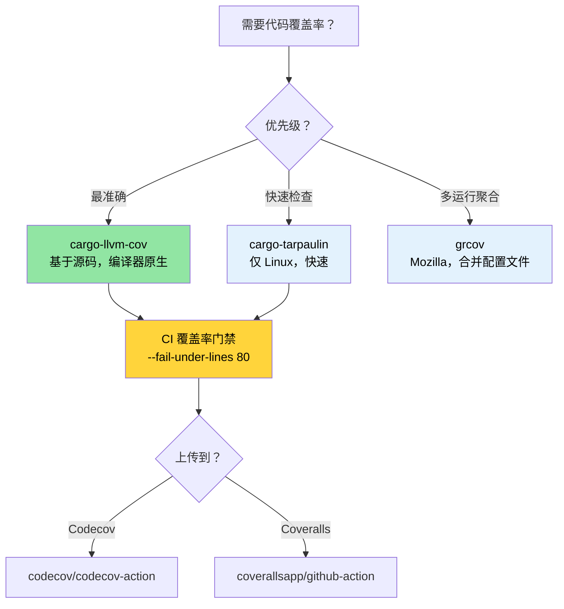

# 代码覆盖率 —— 看到测试遗漏的内容 🟢

> **你将学到什么：**
> - 使用 `cargo-llvm-cov`（最准确的 Rust 覆盖率工具）进行基于源码的覆盖率分析
> - 使用 `cargo-tarpaulin` 和 Mozilla 的 `grcov` 进行快速覆盖率检查
> - 使用 Codecov 和 Coveralls 在 CI 中设置覆盖率门禁
> - 优先处理高风险盲点的覆盖率引导测试策略
>
> **交叉引用：** [Miri 和消毒器](ch05-miri-valgrind-and-sanitizers-verifying-u.md) —— 覆盖率发现未测试代码，Miri 发现已测试代码中的 UB · [基准测试](ch03-benchmarking-measuring-what-matters.md) —— 覆盖率显示*测试了什么*，基准测试显示*什么快* · [CI/CD 管道](ch11-putting-it-all-together-a-production-cic.md) —— 管道中的覆盖率门禁

代码覆盖率衡量你的测试实际执行了哪些行、分支或函数。它不能证明正确性（被覆盖的行仍然可能有 bug），但它可靠地揭示**盲点** —— 没有任何测试练习的代码路径。

项目在多个 crate 中有 1,006 个测试，测试投入相当可观。覆盖率分析回答："这个投入是否触及了重要的代码？"

### 使用 `llvm-cov` 的基于源码的覆盖率

Rust 使用 LLVM，它提供基于源码的覆盖率插桩 —— 可用的最准确覆盖率方法。推荐的工具是 [`cargo-llvm-cov`](https://github.com/taiki-e/cargo-llvm-cov)：

```bash
# 安装
cargo install cargo-llvm-cov

# 或通过 rustup 组件（用于原始 llvm 工具）
rustup component add llvm-tools-preview
```

**基础用法：**

```bash
# 运行测试并显示每文件覆盖率摘要
cargo llvm-cov

# 生成 HTML 报告（可浏览，逐行高亮）
cargo llvm-cov --html
# 输出：target/llvm-cov/html/index.html

# 生成 LCOV 格式（用于 CI 集成）
cargo llvm-cov --lcov --output-path lcov.info

# 工作空间范围的覆盖率（所有 crate）
cargo llvm-cov --workspace

# 仅包含特定包
cargo llvm-cov --package accel_diag --package topology_lib

# 包括文档测试覆盖率
cargo llvm-cov --doctests
```

**阅读 HTML 报告：**

```text
target/llvm-cov/html/index.html
├── 文件名            │ 函数   │ 行     │ 分支   │ 区域
├─ accel_diag/src/lib.rs │  78.5%  │ 82.3% │ 61.2% │  74.1%
├─ sel_mgr/src/parse.rs│  95.2%  │ 96.8% │ 88.0% │  93.5%
├─ topology_lib/src/.. │  91.0%  │ 93.4% │ 79.5% │  89.2%
└─ ...

绿色 = 已覆盖    红色 = 未覆盖    黄色 = 部分覆盖（分支）
```

**覆盖率类型解释：**

| 类型 | 衡量内容 | 意义 |
|------|------------------|-------------|
| **行覆盖率** | 执行了哪些源代码行 | 基础"这段代码被触及了吗？" |
| **分支覆盖率** | 采用了哪些 `if`/`match` 臂 | 捕获未测试的条件 |
| **函数覆盖率** | 调用了哪些函数 | 发现死代码 |
| **区域覆盖率** | 击中了哪些代码区域（子表达式） | 最细粒度 |

### cargo-tarpaulin —— 快速路径

[`cargo-tarpaulin`](https://github.com/xd009642/tarpaulin) 是 Linux 特定的覆盖率工具，设置更简单（无需 LLVM 组件）：

```bash
# 安装
cargo install cargo-tarpaulin

# 基础覆盖率报告
cargo tarpaulin

# HTML 输出
cargo tarpaulin --out Html

# 带特定选项
cargo tarpaulin \
    --workspace \
    --timeout 120 \
    --out Xml Html \
    --output-dir coverage/ \
    --exclude-files "*/tests/*" "*/benches/*" \
    --ignore-panics

# 跳过特定 crate
cargo tarpaulin --workspace --exclude diag_tool  # 排除二进制 crate
```

**tarpaulin vs llvm-cov 比较：**

| 功能 | cargo-llvm-cov | cargo-tarpaulin |
|---------|----------------|-----------------|
| 准确性 | 基于源码（最准确） | 基于 ptrace（偶尔过计数） |
| 平台 | 任意（基于 llvm） | 仅 Linux |
| 分支覆盖率 | 是 | 有限 |
| 文档测试 | 是 | 否 |
| 设置 | 需要 `llvm-tools-preview` | 自包含 |
| 速度 | 更快（编译时插装） | 更慢（ptrace 开销） |
| 稳定性 | 非常稳定 | 偶尔假阳性 |

**推荐**：为了准确性使用 `cargo-llvm-cov`。当需要在不安装 LLVM 工具的情况下进行快速检查时使用 `cargo-tarpaulin`。

### grcov —— Mozilla 的覆盖率工具

[`grcov`](https://github.com/mozilla/grcov) 是 Mozilla 的覆盖率聚合器。它消耗原始 LLVM 性能分析数据并生成多种格式的报告：

```bash
# 安装
cargo install grcov

# 步骤 1：构建带覆盖率插装
export RUSTFLAGS="-Cinstrument-coverage"
export LLVM_PROFILE_FILE="target/coverage/%p-%m.profraw"
cargo build --tests

# 步骤 2：运行测试（生成 .profraw 文件）
cargo test

# 步骤 3：使用 grcov 聚合
grcov target/coverage/ \
    --binary-path target/debug/ \
    --source-dir . \
    --output-types html,lcov \
    --output-path target/coverage/report \
    --branch \
    --ignore-not-existing \
    --ignore "*/tests/*" \
    --ignore "*/.cargo/*"

# 步骤 4：查看报告
open target/coverage/report/html/index.html
```

**何时使用 grcov**：当你需要**从多次测试运行合并覆盖率**（例如，单元测试 + 集成测试 + 模糊测试）到单个报告时最有用。

### CI 中的覆盖率：Codecov 和 Coveralls

上传覆盖率数据到跟踪服务以获取历史趋势和 PR 注释：

```yaml
# .github/workflows/coverage.yml
name: 代码覆盖率

on: [push, pull_request]

jobs:
  coverage:
    runs-on: ubuntu-latest
    steps:
      - uses: actions/checkout@v4
      - uses: dtolnay/rust-toolchain@stable
        with:
          components: llvm-tools-preview

      - name: 安装 cargo-llvm-cov
        uses: taiki-e/install-action@cargo-llvm-cov

      - name: 生成覆盖率
        run: cargo llvm-cov --workspace --lcov --output-path lcov.info

      - name: 上传到 Codecov
        uses: codecov/codecov-action@v4
        with:
          files: lcov.info
          token: ${{ secrets.CODECOV_TOKEN }}
          fail_ci_if_error: true

      # 可选：强制执行最低覆盖率
      - name: 检查覆盖率阈值
        run: |
          cargo llvm-cov --workspace --fail-under-lines 80
          # 如果行覆盖率降至 80% 以下则失败
```

**覆盖率门禁** —— 通过读取 JSON 输出对每个 crate 强制执行最低值：

```bash
# 获取每 crate 覆盖率为 JSON
cargo llvm-cov --workspace --json | jq '.data[0].totals.lines.percent'

# 如果低于阈值则失败
cargo llvm-cov --workspace --fail-under-lines 80
cargo llvm-cov --workspace --fail-under-functions 70
cargo llvm-cov --workspace --fail-under-regions 60
```

### 覆盖率引导测试策略

覆盖率数字本身没有意义，没有策略就毫无价值。这是如何有效使用覆盖率数据：

**步骤 1：按风险分类**

```text
高覆盖率，高风险     → ✅ 良好 —— 保持它
高覆盖率，低风险     → 🔄 可能过度测试 —— 如果慢就跳过
低覆盖率，高风险     → 🔴 立即编写测试 —— 这是 bug 隐藏的地方
低覆盖率，低风险     → 🟡 跟踪但不要恐慌
```

**步骤 2：关注分支覆盖率，而非行覆盖率**

```rust
// 100% 行覆盖率，50% 分支覆盖率 —— 仍然有风险！
pub fn classify_temperature(temp_c: i32) -> ThermalState {
    if temp_c > 105 {       // ← 用 temp=110 测试 → Critical
        ThermalState::Critical
    } else if temp_c > 85 { // ← 用 temp=90 测试 → Warning
        ThermalState::Warning
    } else if temp_c < -10 { // ← 从未测试 → 传感器错误情况遗漏
        ThermalState::SensorError
    } else {
        ThermalState::Normal  // ← 用 temp=25 测试 → Normal
    }
}
```

**步骤 3：排除噪声**

```bash
# 从覆盖率排除测试代码（它总是"已覆盖"）
cargo llvm-cov --workspace --ignore-filename-regex 'tests?\.rs$|benches/'

# 排除生成的代码
cargo llvm-cov --workspace --ignore-filename-regex 'target/'
```

在代码中，标记无法测试的部分：

```rust
// 覆盖率工具识别此模式
#[cfg(not(tarpaulin_include))]  // tarpaulin
fn unreachable_hardware_path() {
    // 此路径需要实际 GPU 硬件才能触发
}

// 对于 llvm-cov，使用更有针对性的方法：
// 简单地接受某些路径需要集成/硬件测试，而非单元测试。
// 在覆盖率例外列表中跟踪它们。
```

### 互补测试工具

**`proptest` —— 基于属性的测试**发现手写测试遗漏的边界情况：

```toml
[dev-dependencies]
proptest = "1"
```

```rust
use proptest::prelude::*;

proptest! {
    #[test]
    fn parse_never_panics(input in "\\PC*") {
        // proptest 生成数千个随机字符串
        // 如果 parse_gpu_csv 在任何输入上 panic，测试失败
        // 并且 proptest 为你最小化失败的用例
        let _ = parse_gpu_csv(&input);
    }

    #[test]
    fn temperature_roundtrip(raw in 0u16..4096) {
        let temp = Temperature::from_raw(raw);
        let md = temp.millidegrees_c();
        // 属性：millidegrees 应该总是可以从 raw 推导
        assert_eq!(md, (raw as i32) * 625 / 10);
    }
}
```

**`insta` —— 快照测试**用于大型结构化输出（JSON、文本报告）：

```toml
[dev-dependencies]
insta = { version = "1", features = ["json"] }
```

```rust
#[test]
fn test_der_report_format() {
    let report = generate_der_report(&test_results);
    // 第一次运行：创建快照文件。后续运行：与它比较。
    // 运行 `cargo insta review` 交互式接受更改。
    insta::assert_json_snapshot!(report);
}
```

> **何时添加 proptest/insta**：如果你的单元测试都是"快乐路径"示例，proptest 会发现你遗漏的边界情况。如果你正在测试大型输出格式（JSON 报告、DER 记录），insta 快照比手写断言更快编写和维护。

### 应用：1,000+ 测试覆盖率地图

项目有 1,000+ 测试但没有覆盖率跟踪。添加它揭示测试投资分布。未覆盖的路径是 [Miri 和消毒器](ch05-miri-valgrind-and-sanitizers-verifying-u.md) 验证的主要候选：

**推荐的覆盖率配置：**

```bash
# 快速工作空间覆盖率（建议的 CI 命令）
cargo llvm-cov --workspace \
    --ignore-filename-regex 'tests?\.rs$' \
    --fail-under-lines 75 \
    --html

# 针对每 crate 覆盖率进行针对性改进
for crate in accel_diag event_log topology_lib network_diag compute_diag fan_diag; do
    echo "=== $crate ==="
    cargo llvm-cov --package "$crate" --json 2>/dev/null | \
        jq -r '.data[0].totals | "行：\(.lines.percent | round)%  分支：\(.branches.percent | round)%"'
done
```

**预期高覆盖率 crate**（基于测试密度）：
- `topology_lib` —— 922 行黄金文件测试套件
- `event_log` —— 带 `create_test_record()` 助手的注册表
- `cable_diag` —— `make_test_event()` / `make_test_context()` 模式

**预期的覆盖率差距**（基于代码检查）：
- IPMI 通信路径中的错误处理臂
- GPU 特定硬件分支（需要实际 GPU）
- `dmesg` 解析边界情况（依赖于平台的输出）

> **覆盖率的 80/20 法则**：从 0% 到 80% 覆盖率很简单。从 80% 到 95% 需要越来越做作的测试场景。从 95% 到 100% 需要 `#[cfg(not(...))]` 排除，很少值得努力。目标是**80% 行覆盖率和 70% 分支覆盖率**作为实际底线。

### 覆盖率故障排除

| 症状 | 原因 | 修复 |
|---------|-------|-----|
| `llvm-cov` 显示所有文件 0% | 未应用插装 | 确保运行 `cargo llvm-cov`，而非分开运行 `cargo test` + `llvm-cov` |
| 覆盖率将 `unreachable!()` 计为未覆盖 | 这些分支存在于编译代码中 | 使用 `#[cfg(not(tarpaulin_include))]` 或添加到排除正则 |
| 覆盖率下测试崩溃 | 插装 + 消毒器冲突 | 不要将 `cargo llvm-cov` 与 `-Zsanitizer=address` 结合；分开运行 |
| `llvm-cov` 和 `tarpaulin` 的覆盖率不同 | 不同的插装技术 | 使用 `llvm-cov` 作为事实来源（编译器原生）；对大差异提交问题 |
| `error: profraw 文件格式错误` | 测试执行中途崩溃 | 先修复测试失败；进程异常退出时 profraw 文件损坏 |
| 分支覆盖率似乎低得离谱 | 优化器为 match 臂、unwrap 等创建分支 | 关注实际阈值的*行*覆盖率；分支覆盖率本来就低 |

### 亲自尝试

1. **测量你的项目的覆盖率**：运行 `cargo llvm-cov --workspace --html` 并打开报告。找到覆盖率最低的三个文件。它们是未测试的，还是天生难以测试（依赖硬件的代码）？

2. **设置覆盖率门禁**：添加 `cargo llvm-cov --workspace --fail-under-lines 60` 到你的 CI。故意注释掉一个测试并验证 CI 失败。然后将阈值提高到项目实际覆盖率水平减去 2%。

3. **分支 vs 行覆盖率**：编写一个带 3 臂 `match` 的函数并仅测试 2 臂。比较行覆盖率（可能显示 66%）vs 分支覆盖率（可能显示 50%）。哪个指标对你的项目更有用？

### 覆盖率工具选择



### 🏋️ 练习

#### 🟢 练习 1：第一个覆盖率报告

安装 `cargo-llvm-cov`，在任何 Rust 项目上运行它，并打开 HTML 报告。找到行覆盖率最低的三个文件。

<details>
<summary>答案</summary>

```bash
cargo install cargo-llvm-cov
cargo llvm-cov --workspace --html --open
# 报告按覆盖率排序文件 —— 最低的在底部
# 查找低于 50% 的文件 —— 那些是你的盲点
```
</details>

#### 🟡 练习 2：CI 覆盖率门禁

在 GitHub Actions 工作流中添加覆盖率门禁，如果行覆盖率降至 60% 以下则失败。通过注释掉测试验证它有效。

<details>
<summary>答案</summary>

```yaml
# .github/workflows/coverage.yml
name: 覆盖率
on: [push, pull_request]
jobs:
  coverage:
    runs-on: ubuntu-latest
    steps:
      - uses: actions/checkout@v4
      - uses: dtolnay/rust-toolchain@stable
        with:
          components: llvm-tools-preview
      - run: cargo install cargo-llvm-cov
      - run: cargo llvm-cov --workspace --fail-under-lines 60
```

注释掉一个测试，推送，然后观察工作流失败。
</details>

### 关键要点

- `cargo-llvm-cov` 是 Rust 最准确的覆盖率工具 —— 它使用编译器自己的插装
- 覆盖率不能证明正确性，但**零覆盖率证明零测试** —— 用它发现盲点
- 在 CI 中设置覆盖率门禁（例如 `--fail-under-lines 80`）以防止回归
- 不要追求 100% 覆盖率 —— 关注高风险代码路径（错误处理、unsafe、解析）
- 永远不要在同一个运行中将覆盖率插装与消毒器结合

---
