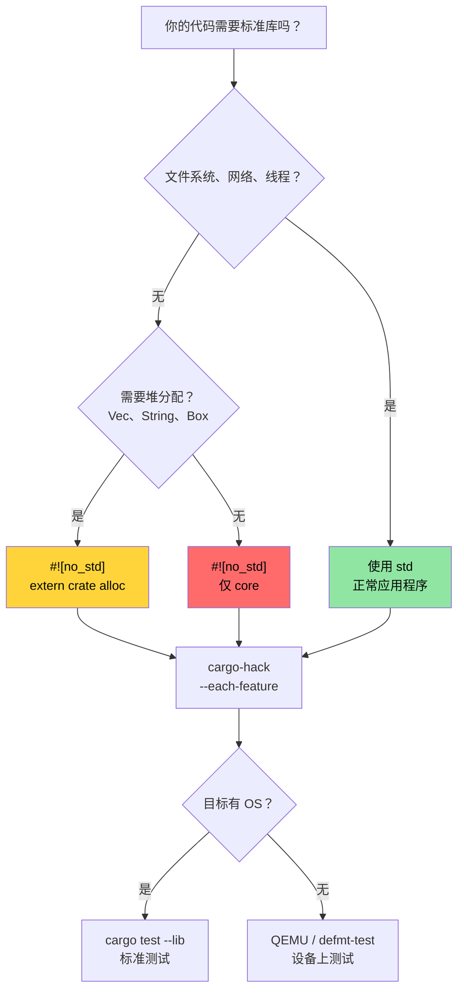

# `no_std` 和功能验证 🔴

> **你将学到什么：**
> - 使用 `cargo-hack` 系统地验证功能组合
> - Rust 的三层：`core` vs `alloc` vs `std` 以及何时使用每一层
> - 构建带自定义 panic 处理程序和分配器的 `no_std` crate
> - 在主机上和使用 QEMU 测试 `no_std` 代码
>
> **交叉引用：** [Windows & 条件编译](ch10-windows-and-conditional-compilation.md) —— 此主题的平台部分 · [跨平台编译](ch02-cross-compilation-one-source-many-target.md) —— 跨平台编译到 ARM 和嵌入式目标 · [Miri 和消毒器](ch05-miri-valgrind-and-sanitizers-verifying-u.md) —— 验证 `no_std` 环境中的 `unsafe` 代码 · [构建脚本](ch01-build-scripts-buildrs-in-depth.md) —— `build.rs` 发出的 `cfg` 标志

Rust 运行在任何地方，从 8 位微控制器到云服务器。本章涵盖基础：使用 `#![no_std]` 剥离标准库并验证你的功能组合实际能编译。

### 使用 `cargo-hack` 验证功能组合

[`cargo-hack`](https://github.com/taiki-e/cargo-hack) 系统地测试所有功能组合 —— 对于带 `#[cfg(...)]` 代码的 crate 至关重要：

```bash
# 安装
cargo install cargo-hack

# 检查每个功能单独编译
cargo hack check --each-feature --workspace

# 核选项：测试所有功能组合（指数级！）
# 仅对 <8 个功能的 crate 实用。
cargo hack check --feature-powerset --workspace

# 实际妥协：单独测试每个功能 + 所有功能 + 无功能
cargo hack check --each-feature --workspace --no-dev-deps
cargo check --workspace --all-features
cargo check --workspace --no-default-features
```

**为什么这对项目很重要：**

如果你添加平台功能（`linux`、`windows`、`direct-ipmi`、`direct-accel-api`），
`cargo-hack` 捕获破坏的组合：

```toml
# 示例：网关平台代码的功能
[features]
default = ["linux"]
linux = []                          # Linux 特定硬件访问
windows = ["dep:windows-sys"]       # Windows 特定 API
direct-ipmi = []                    # unsafe IPMI ioctl（第 5 章）
direct-accel-api = []               # unsafe accel-mgmt FFI（第 5 章）
```

```bash
# 验证所有功能单独和一起编译
cargo hack check --each-feature -p diag_tool
# 捕获："feature 'windows' doesn't compile without 'direct-ipmi'"
# 捕获："#[cfg(feature = \"linux\")] 有拼写错误 —— 是 'lnux'"
```

**CI 集成：**

```yaml
# 添加到 CI 管道（快速 —— 仅编译检查）
- name: 功能矩阵检查
  run: cargo hack check --each-feature --workspace --no-dev-deps
```

> **经验法则**：在 CI 中对任何带 2+ 功能的 crate 运行 `cargo hack check --each-feature`。
> 仅对 <8 个功能的核心库 crate 运行 `--feature-powerset` —— 它是指数级的（$2^n$ 组合）。

### `no_std` —— 何时以及为什么

`#![no_std]` 告诉编译器："不要链接标准库。"你的 crate 只能使用 `core`（和可选的 `alloc`）。你为什么要这样？

| 场景 | 为什么 `no_std` |
|----------|-------------|
| 嵌入式固件（ARM Cortex-M、RISC-V） | 无 OS、无堆、无文件系统 |
| UEFI 诊断工具 | 预引导环境，无 OS API |
| 内核模块 | 内核空间不能使用用户空间 `std` |
| WebAssembly（WASM） | 最小化二进制大小，无 OS 依赖 |
| Bootloader | 在任何 OS 存在之前运行 |
| 带 C 接口的共享库 | 避免调用者中的 Rust 运行时 |

**对于硬件诊断**，`no_std` 在构建以下情况时变得相关：
- 基于 UEFI 的预引导诊断工具（在 OS 加载之前）
- BMC 固件诊断（资源受限的 ARM SoC）
- 内核级 PCIe 诊断（内核模块或 eBPF 探针）

### `core` vs `alloc` vs `std` —— 三层

```text
┌─────────────────────────────────────────────────────────────┐
│ std                                                         │
│  core + alloc 中的所有内容，加上：                            │
│  • 文件 I/O（std::fs、std::io）                              │
│  • 网络（std::net）                                         │
│  • 线程（std::thread）                                      │
│  • 时间（std::time）                                        │
│  • 环境（std::env）                                         │
│  • 进程（std::process）                                     │
│  • OS 特定（std::os::unix、std::os::windows）               │
├─────────────────────────────────────────────────────────────┤
│ alloc          （可用 #![no_std] + extern crate              │
│                 alloc，如果你有全局分配器）                   │
│  • String、Vec、Box、Rc、Arc                                │
│  • BTreeMap、BTreeSet                                       │
│  • format!() 宏                                             │
│  • 需要堆的集合和智能指针                                    │
├─────────────────────────────────────────────────────────────┤
│ core           （总是可用，即使在 #![no_std] 中）              │
│  • 原始类型（u8、bool、char 等）                              │
│  • Option、Result                                           │
│  • Iterator、slice、array、str（切片，不是 String）          │
│  • Traits：Clone、Copy、Debug、Display、From、Into          │
│  • 原子操作（core::sync::atomic）                            │
│  • Cell、RefCell（core::cell）— Pin（core::pin）            │
│  • core::fmt（无分配格式化）                                 │
│  • core::mem、core::ptr（低级内存操作）                      │
│  • 数学：core::num、基础算术                                 │
└─────────────────────────────────────────────────────────────┘
```

**没有 `std` 你失去什么：**
- 无 `HashMap`（需要哈希器 —— 使用 `alloc` 中的 `BTreeMap`，或 `hashbrown`）
- 无 `println!()`（需要 stdout —— 使用 `core::fmt::Write` 到缓冲区）
- 无 `std::error::Error`（自 Rust 1.81 起在 `core` 中稳定，但许多生态系统尚未迁移）
- 无文件 I/O、无网络、无线程（除非由平台 HAL 提供）
- 无 `Mutex`（使用 `spin::Mutex` 或平台特定锁）

### 构建 `no_std` Crate

```rust
// src/lib.rs —— no_std 库 crate
#![no_std]

// 可选使用堆分配
extern crate alloc;
use alloc::string::String;
use alloc::vec::Vec;
use core::fmt;

/// 来自温度传感器的温度读数。
/// 此结构体在任何环境中都有效 —— 从裸机到 Linux。
#[derive(Clone, Copy, Debug)]
pub struct Temperature {
    /// 原始传感器值（典型 I2C 传感器每 LSB 0.0625°C）
    raw: u16,
}

impl Temperature {
    pub const fn from_raw(raw: u16) -> Self {
        Self { raw }
    }

    /// 转换为摄氏度（定点，无需 FPU）
    pub const fn millidegrees_c(&self) -> i32 {
        (self.raw as i32) * 625 / 10 // 0.0625°C 分辨率
    }

    pub fn degrees_c(&self) -> f32 {
        self.raw as f32 * 0.0625
    }
}

impl fmt::Display for Temperature {
    fn fmt(&self, f: &mut fmt::Formatter<'_>) -> fmt::Result {
        let md = self.millidegrees_c();
        // 正确处理 -0.999°C 和 -0.001°C 之间的值的符号
        // 其中 md / 1000 == 0 但值为负。
        if md < 0 && md > -1000 {
            write!(f, "-0.{:03}°C", (-md) % 1000)
        } else {
            write!(f, "{}.{:03}°C", md / 1000, (md % 1000).abs())
        }
    }
}

/// 解析空格分隔的温度值。
/// 使用 alloc —— 需要全局分配器。
pub fn parse_temperatures(input: &str) -> Vec<Temperature> {
    input
        .split_whitespace()
        .filter_map(|s| s.parse::<u16>().ok())
        .map(Temperature::from_raw)
        .collect()
}

/// 无分配格式化 —— 直接写入缓冲区。
/// 在 `core` -only 环境中工作（无 alloc、无堆）。
pub fn format_temp_into(temp: &Temperature, buf: &mut [u8]) -> usize {
    use core::fmt::Write;
    struct SliceWriter<'a> {
        buf: &'a mut [u8],
        pos: usize,
    }
    impl<'a> Write for SliceWriter<'a> {
        fn write_str(&mut self, s: &str) -> fmt::Result {
            let bytes = s.as_bytes();
            let remaining = self.buf.len() - self.pos;
            if bytes.len() > remaining {
                // 缓冲区满 —— 发出错误而非静默截断。
                // 调用者可以检查返回的 pos 以了解部分写入。
                return Err(fmt::Error);
            }
            self.buf[self.pos..self.pos + bytes.len()].copy_from_slice(bytes);
            self.pos += bytes.len();
            Ok(())
        }
    }
    let mut w = SliceWriter { buf, pos: 0 };
    let _ = write!(w, "{}", temp);
    w.pos
}
```

```toml
# no_std crate 的 Cargo.toml
[package]
name = "thermal-sensor"
version = "0.1.0"
edition = "2021"

[features]
default = ["alloc"]
alloc = []    # 启用 Vec、String 等
std = []      # 启用完整 std（意味着 alloc）

[dependencies]
# 使用 no_std 兼容的 crate
serde = { version = "1.0", default-features = false, features = ["derive"] }
# ↑ default-features = false 丢弃 std 依赖！
```

> **关键 crate 模式**：许多流行的 crate（serde、log、rand、embedded-hal）通过 `default-features = false` 支持 `no_std`。在 `no_std` 上下文中使用依赖之前，始终检查它是否需要 `std`。注意某些 crate（例如 `regex`）需要至少 `alloc` 并且在 `core`-only 环境中不工作。

### 自定义 Panic 处理程序和分配器

在 `#![no_std]` 二进制文件（不是库）中，你必须提供 panic 处理程序和可选的全局分配器：

```rust
// src/main.rs —— no_std 二进制文件（例如 UEFI 诊断）
#![no_std]
#![no_main]

extern crate alloc;

use core::panic::PanicInfo;

// 必需：panic 时做什么（无栈展开可用）
#[panic_handler]
fn panic(info: &PanicInfo) -> ! {
    // 在嵌入式中：闪烁 LED、写入 UART、挂起
    // 在 UEFI 中：写入控制台、停止
    // 最小：只是永远循环
    loop {
        core::hint::spin_loop();
    }
}

// 如果使用 alloc 则必需：提供全局分配器
use alloc::alloc::{GlobalAlloc, Layout};

struct BumpAllocator {
    // 用于嵌入式/UEFI 的简单 bump 分配器
    // 在实践中，使用 crate 如 `linked_list_allocator` 或 `embedded-alloc`
}

// 警告：这是非功能占位符！调用 alloc() 将返回 null，
// 导致立即 UB（全局分配器契约要求非零大小分配返回非空）。
// 在实际代码中，使用成熟的分配器 crate：
//   - embedded-alloc（嵌入式目标）
//   - linked_list_allocator（UEFI / OS 内核）
//   - talc（通用 no_std）
unsafe impl GlobalAlloc for BumpAllocator {
    /// # 安全
    /// Layout 必须有非零大小。返回 null（占位符 —— 会崩溃）。
    unsafe fn alloc(&self, _layout: Layout) -> *mut u8 {
        // 占位符 —— 会崩溃！用真正的分配逻辑替换。
        core::ptr::null_mut()
    }
    /// # 安全
    /// `_ptr` 必须已用兼容 layout 从 `alloc` 返回。
    unsafe fn dealloc(&self, _ptr: *mut u8, _layout: Layout) {
        // bump 分配器的无操作
    }
}

#[global_allocator]
static ALLOCATOR: BumpAllocator = BumpAllocator {};

// 入口点（平台特定，不是 fn main）
// 对于 UEFI：#[entry] 或 efi_main
// 对于嵌入式：#[cortex_m_rt::entry]
```

### 测试 `no_std` 代码

测试在主机上运行，主机有 `std`。技巧：你的库是 `no_std`，但你的测试框架使用 `std`：

```rust
// 你的 crate：src/lib.rs 中的 #![no_std]
// 但测试在 std 下自动运行：

#[cfg(test)]
mod tests {
    use super::*;
    // std 在这里可用 —— println!、assert!、Vec 都有效

    #[test]
    fn test_temperature_conversion() {
        let temp = Temperature::from_raw(800); // 50.0°C
        assert_eq!(temp.millidegrees_c(), 50000);
        assert!((temp.degrees_c() - 50.0).abs() < 0.01);
    }

    #[test]
    fn test_format_into_buffer() {
        let temp = Temperature::from_raw(800);
        let mut buf = [0u8; 32];
        let len = format_temp_into(&temp, &mut buf);
        let s = core::str::from_utf8(&buf[..len]).unwrap();
        assert_eq!(s, "50.000°C");
    }
}
```

**在实际目标上测试**（当 `std` 完全不可用时）：

```bash
# 使用 defmt-test 进行设备上测试（嵌入式 ARM）
# 使用 uefi-test-runner 用于 UEFI 目标
# 使用 QEMU 进行跨架构测试，无需硬件

# 在主机上运行 no_std 库测试（总是有效）：
cargo test --lib

# 针对 no_std 目标验证 no_std 编译：
cargo check --target thumbv7em-none-eabihf  # ARM Cortex-M
cargo check --target riscv32imac-unknown-none-elf  # RISC-V
```

### `no_std` 决策树



### 🏋️ 练习

#### 🟡 练习 1：功能组合验证

安装 `cargo-hack` 并在带多个功能的项目上运行 `cargo hack check --each-feature --workspace`。它发现任何破坏的组合吗？

<details>
<summary>答案</summary>

```bash
cargo install cargo-hack

# 单独检查每个功能
cargo hack check --each-feature --workspace --no-dev-deps

# 如果功能组合失败：
# error[E0433]: failed to resolve: use of undeclared crate or module `std`
# → 这意味着功能网关缺少 #[cfg] 守卫

# 检查所有功能 + 无功能 + 每个单独：
cargo hack check --each-feature --workspace
cargo check --workspace --all-features
cargo check --workspace --no-default-features
```
</details>

#### 🔴 练习 2：构建 `no_std` 库

创建一个用 `#![no_std]` 编译的库 crate。实现简单的栈分配环形缓冲区。验证它编译为 `thumbv7em-none-eabihf`（ARM Cortex-M）。

<details>
<summary>答案</summary>

```rust
// lib.rs
#![no_std]

pub struct RingBuffer<const N: usize> {
    data: [u8; N],
    head: usize,
    len: usize,
}

impl<const N: usize> RingBuffer<N> {
    pub const fn new() -> Self {
        Self { data: [0; N], head: 0, len: 0 }
    }

    pub fn push(&mut self, byte: u8) -> bool {
        if self.len == N { return false; }
        let idx = (self.head + self.len) % N;
        self.data[idx] = byte;
        self.len += 1;
        true
    }

    pub fn pop(&mut self) -> Option<u8> {
        if self.len == 0 { return None; }
        let byte = self.data[self.head];
        self.head = (self.head + 1) % N;
        self.len -= 1;
        Some(byte)
    }
}

#[cfg(test)]
mod tests {
    use super::*;

    #[test]
    fn push_pop() {
        let mut rb = RingBuffer::<4>::new();
        assert!(rb.push(1));
        assert!(rb.push(2));
        assert_eq!(rb.pop(), Some(1));
        assert_eq!(rb.pop(), Some(2));
        assert_eq!(rb.pop(), None);
    }
}
```

```bash
rustup target add thumbv7em-none-eabihf
cargo check --target thumbv7em-none-eabihf
# ✅ 为裸机 ARM 编译
```
</details>

### 关键要点

- `cargo-hack --each-feature` 对于任何带条件编译的 crate 都至关重要 —— 在 CI 中运行它
- `core` → `alloc` → `std` 是分层的：每一层添加功能但需要更多运行时支持
- 裸机 `no_std` 二进制文件需要自定义 panic 处理程序和分配器
- 在主机上用 `cargo test --lib` 测试 `no_std` 库 —— 无需硬件
- 仅对 <8 个功能的核心库运行 `--feature-powerset` —— 它是 $2^n$ 组合

---
