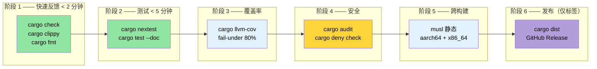

# 整合所有内容 —— 生产 CI/CD 管道 🟡

> **你将学到什么：**
> - 构建多阶段 GitHub Actions CI 工作流（check → test → coverage → security → cross → release）
> - 使用 `rust-cache` 和 `save-if` 调整的缓存策略
> - 在夜间计划上运行 Miri 和消毒器
> - 使用 `Makefile.toml` 和 pre-commit 钩子进行任务自动化
> - 使用 `cargo-dist` 自动发布
>
> **交叉引用：** [构建脚本](ch01-build-scripts-buildrs-in-depth.md) · [跨平台编译](ch02-cross-compilation-one-source-many-target.md) · [基准测试](ch03-benchmarking-measuring-what-matters.md) · [覆盖率](ch04-code-coverage-seeing-what-tests-miss.md) · [Miri/消毒器](ch05-miri-valgrind-and-sanitizers-verifying-u.md) · [依赖](ch06-dependency-management-and-supply-chain-s.md) · [发布配置文件](ch07-release-profiles-and-binary-size.md) · [编译时工具](ch08-compile-time-and-developer-tools.md) · [`no_std`](ch09-no-std-and-feature-verification.md) · [Windows](ch10-windows-and-conditional-compilation.md)

单独的工具很有用。一个在每次推送时自动编排它们的管道具有变革性。本章将第 1-10 章的工具组装成一个内聚的 CI/CD 工作流。

### 完整的 GitHub Actions 工作流

一个工作流文件并行运行所有验证阶段：

```yaml
# .github/workflows/ci.yml
name: CI

on:
  push:
    branches: [main]
  pull_request:
    branches: [main]

env:
  CARGO_TERM_COLOR: always
  CARGO_ENCODED_RUSTFLAGS: "-Dwarnings"  # 将警告视为错误（仅顶级 crate）
  # 注意：与 RUSTFLAGS 不同，CARGO_ENCODED_RUSTFLAGS 不影响构建脚本
  # 或 proc-macros，这避免来自第三方的假阳性警告。
  # 如果你也想对构建脚本强制执行，请使用 RUSTFLAGS="-Dwarnings"。

jobs:
  # ─── 阶段 1：快速反馈 (< 2 分钟) ───
  check:
    name: Check + Clippy + Format
    runs-on: ubuntu-latest
    steps:
      - uses: actions/checkout@v4
      - uses: dtolnay/rust-toolchain@stable
        with:
          components: clippy, rustfmt

      - uses: Swatinem/rust-cache@v2  # 缓存依赖

      - name: Check Cargo.lock
        run: cargo fetch --locked

      - name: Check doc
        run: RUSTDOCFLAGS='-Dwarnings' cargo doc --workspace --all-features --no-deps

      - name: Check 编译
        run: cargo check --workspace --all-targets --all-features

      - name: Clippy lints
        run: cargo clippy --workspace --all-targets --all-features -- -D warnings

      - name: Formatting
        run: cargo fmt --all -- --check

  # ─── 阶段 2：测试 (< 5 分钟) ───
  test:
    name: Test (${{ matrix.os }})
    needs: check
    strategy:
      matrix:
        os: [ubuntu-latest, windows-latest]
    runs-on: ${{ matrix.os }}
    steps:
      - uses: actions/checkout@v4
      - uses: dtolnay/rust-toolchain@stable
      - uses: Swatinem/rust-cache@v2

      - name: 运行测试
        run: cargo test --workspace

      - name: 运行文档测试
        run: cargo test --workspace --doc

  # ─── 阶段 3：跨平台编译 (< 10 分钟) ───
  cross:
    name: Cross (${{ matrix.target }})
    needs: check
    strategy:
      matrix:
        include:
          - target: x86_64-unknown-linux-musl
            os: ubuntu-latest
          - target: aarch64-unknown-linux-gnu
            os: ubuntu-latest
            use_cross: true
    runs-on: ${{ matrix.os }}
    steps:
      - uses: actions/checkout@v4
      - uses: dtolnay/rust-toolchain@stable
        with:
          targets: ${{ matrix.target }}

      - name: 安装 musl-tools
        if: contains(matrix.target, 'musl')
        run: sudo apt-get install -y musl-tools

      - name: 安装 cross
        if: matrix.use_cross
        uses: taiki-e/install-action@cross

      - name: 构建（原生）
        if: "!matrix.use_cross"
        run: cargo build --release --target ${{ matrix.target }}

      - name: 构建（cross）
        if: matrix.use_cross
        run: cross build --release --target ${{ matrix.target }}

      - name: 上传工件
        uses: actions/upload-artifact@v4
        with:
          name: binary-${{ matrix.target }}
          path: target/${{ matrix.target }}/release/diag_tool

  # ─── 阶段 4：覆盖率 (< 10 分钟) ───
  coverage:
    name: 代码覆盖率
    needs: check
    runs-on: ubuntu-latest
    steps:
      - uses: actions/checkout@v4
      - uses: dtolnay/rust-toolchain@stable
        with:
          components: llvm-tools-preview
      - uses: taiki-e/install-action@cargo-llvm-cov

      - name: 生成覆盖率
        run: cargo llvm-cov --workspace --lcov --output-path lcov.info

      - name: 强制执行最低覆盖率
        run: cargo llvm-cov --workspace --fail-under-lines 75

      - name: 上传到 Codecov
        uses: codecov/codecov-action@v4
        with:
          files: lcov.info
          token: ${{ secrets.CODECOV_TOKEN }}

  # ─── 阶段 5：安全验证 (< 15 分钟) ───
  miri:
    name: Miri
    needs: check
    runs-on: ubuntu-latest
    steps:
      - uses: actions/checkout@v4
      - uses: dtolnay/rust-toolchain@nightly
        with:
          components: miri

      - name: 运行 Miri
        run: cargo miri test --workspace
        env:
          MIRIFLAGS: "-Zmiri-backtrace=full"

  # ─── 阶段 6：基准测试（仅 PR，< 10 分钟） ───
  bench:
    name: 基准测试
    if: github.event_name == 'pull_request'
    needs: check
    runs-on: ubuntu-latest
    steps:
      - uses: actions/checkout@v4
      - uses: dtolnay/rust-toolchain@stable

      - name: 运行基准测试
        run: cargo bench -- --output-format bencher | tee bench.txt

      - name: 与基线比较
        uses: benchmark-action/github-action-benchmark@v1
        with:
          tool: 'cargo'
          output-file-path: bench.txt
          github-token: ${{ secrets.GITHUB_TOKEN }}
          alert-threshold: '115%'
          comment-on-alert: true
```

**管道执行流程：**

```text
                    ┌─────────┐
                    │  check  │  ← clippy + fmt + cargo check（2 分钟）
                    └────┬────┘
           ┌─────────┬──┴──┬──────────┬──────────┐
           ▼         ▼     ▼          ▼          ▼
       ┌──────┐  ┌──────┐ ┌────────┐ ┌──────┐ ┌──────┐
       │ test │  │cross │ │coverage│ │ miri │ │bench │
       │ (2×) │  │ (2×) │ │        │ │      │ │(PR)  │
       └──────┘  └──────┘ └────────┘ └──────┘ └──────┘
         3 分钟    8 分钟     8 分钟     12 分钟    5 分钟

总挂钟时间：~14 分钟（check 门后并行）
```

### CI 缓存策略

[`Swatinem/rust-cache@v2`](https://github.com/Swatinem/rust-cache) 是标准 Rust CI 缓存 action。它在运行之间缓存 `~/.cargo` 和 `target/`，但大型工作空间需要调整：

```yaml
# 基础（我们在上面使用的）
- uses: Swatinem/rust-cache@v2

# 为大型工作空间调整：
- uses: Swatinem/rust-cache@v2
  with:
    # 每个任务单独的缓存 —— 防止测试工件污染构建缓存
    prefix-key: "v1-rust"
    key: ${{ matrix.os }}-${{ matrix.target || 'default' }}
    # 仅在 main 分支上保存缓存（PR 读取但不写入）
    save-if: ${{ github.ref == 'refs/heads/main' }}
    # 缓存 Cargo registry + git checkouts + target 目录
    cache-targets: true
    cache-all-crates: true
```

**缓存失效陷阱：**

| 问题 | 修复 |
|---------|-----|
| 缓存无限制增长（>5 GB） | 设置 `prefix-key: "v2-rust"` 强制新鲜缓存 |
| 不同功能污染缓存 | 使用 `key: ${{ hashFiles('**/Cargo.lock') }}` |
| PR 缓存覆盖 main | 设置 `save-if: ${{ github.ref == 'refs/heads/main' }}` |
| 跨平台编译目标膨胀 | 对每个目标三元组使用单独的 `key` |

**任务间共享缓存：**

`check` 任务保存缓存；下游任务（`test`、`cross`、`coverage`）读取它。通过仅在 `main` 上使用 `save-if`，PR 运行获得缓存依赖的好处，而不会写入过时的缓存。

> **对大型工作空间的测量影响**：冷构建 ~4 分钟 → 缓存构建 ~45 秒。仅缓存 action 每个管道运行（跨所有并行任务）就节省约 25 分钟的 CI 时间。

### 使用 cargo-make 的 Makefile.toml

[`cargo-make`](https://sagiegurari.github.io/cargo-make/) 提供可移植的任务运行器，跨平台工作（不像 `make`/`Makefile`）：

```bash
# 安装
cargo install cargo-make
```

```toml
# Makefile.toml —— 在工作空间根目录

[config]
default_to_workspace = false

# ─── 开发者工作流 ───

[tasks.dev]
description = "完整本地验证（与 CI 相同的检查）"
dependencies = ["check", "test", "clippy", "fmt-check"]

[tasks.check]
command = "cargo"
args = ["check", "--workspace", "--all-targets"]

[tasks.test]
command = "cargo"
args = ["test", "--workspace"]

[tasks.clippy]
command = "cargo"
args = ["clippy", "--workspace", "--all-targets", "--", "-D", "warnings"]

[tasks.fmt]
command = "cargo"
args = ["fmt", "--all"]

[tasks.fmt-check]
command = "cargo"
args = ["fmt", "--all", "--", "--check"]

# ─── 覆盖率 ───

[tasks.coverage]
description = "生成 HTML 覆盖率报告"
install_crate = "cargo-llvm-cov"
command = "cargo"
args = ["llvm-cov", "--workspace", "--html", "--open"]

[tasks.coverage-ci]
description = "生成 LCOV 用于 CI 上传"
install_crate = "cargo-llvm-cov"
command = "cargo"
args = ["llvm-cov", "--workspace", "--lcov", "--output-path", "lcov.info"]

# ─── 基准测试 ───

[tasks.bench]
description = "运行所有基准测试"
command = "cargo"
args = ["bench"]

# ─── 跨平台编译 ───

[tasks.build-musl]
description = "构建静态二进制文件（musl）"
command = "cargo"
args = ["build", "--release", "--target", "x86_64-unknown-linux-musl"]

[tasks.build-arm]
description = "为 aarch64 构建（需要 cross）"
command = "cross"
args = ["build", "--release", "--target", "aarch64-unknown-linux-gnu"]

[tasks.build-all]
description = "为所有部署目标构建"
dependencies = ["build-musl", "build-arm"]

# ─── 安全验证 ───

[tasks.miri]
description = "在所有测试上运行 Miri"
toolchain = "nightly"
command = "cargo"
args = ["miri", "test", "--workspace"]

[tasks.audit]
description = "检查已知漏洞"
install_crate = "cargo-audit"
command = "cargo"
args = ["audit"]

# ─── 发布 ───

[tasks.release-dry]
description = "预览 cargo-release 将做什么"
install_crate = "cargo-release"
command = "cargo"
args = ["release", "--workspace", "--dry-run"]
```

**用法：**

```bash
# 等同于 CI 管道，本地
cargo make dev

# 生成并查看覆盖率
cargo make coverage

# 为所有目标构建
cargo make build-all

# 运行安全检查
cargo make miri

# 检查漏洞
cargo make audit
```

### Pre-Commit 钩子：自定义脚本和 `cargo-husky`

在问题到达 CI *之前* 捕获它们。推荐的方法是自定义 git 钩子 —— 它简单、透明且无外部依赖：

```bash
#!/bin/sh
# .githooks/pre-commit

set -e

echo "=== Pre-commit 检查 ==="

# 首先快速检查
echo "→ cargo fmt --check"
cargo fmt --all -- --check

echo "→ cargo check"
cargo check --workspace --all-targets

echo "→ cargo clippy"
cargo clippy --workspace --all-targets -- -D warnings

echo "→ cargo test（仅库，快速）"
cargo test --workspace --lib

echo "=== 所有检查通过 ==="
```

```bash
# 安装钩子
git config core.hooksPath .githooks
chmod +x .githooks/pre-commit
```

**替代方案：`cargo-husky`**（通过构建脚本自动安装钩子）：

> ⚠️ **注意**：`cargo-husky` 自 2022 年以来未更新。它仍然有效但实际已无人维护。考虑对新项目使用上面的自定义钩子方法。

```bash
cargo install cargo-husky
```

```toml
# Cargo.toml —— 添加到根 crate 的 dev-dependencies
[dev-dependencies]
cargo-husky = { version = "1", default-features = false, features = [
    "precommit-hook",
    "run-cargo-check",
    "run-cargo-clippy",
    "run-cargo-fmt",
    "run-cargo-test",
] }
```

### 发布工作流：`cargo-release` 和 `cargo-dist`

**`cargo-release`** —— 自动化版本提升、打标签和发布：

```bash
# 安装
cargo install cargo-release
```

```toml
# release.toml —— 在工作空间根目录
[workspace]
consolidate-commits = true
pre-release-commit-message = "chore: release {{version}}"
tag-message = "v{{version}}"
tag-name = "v{{version}}"

# 不发布内部 crate
[[package]]
name = "core_lib"
release = false

[[package]]
name = "diag_framework"
release = false

# 仅发布主二进制文件
[[package]]
name = "diag_tool"
release = true
```

```bash
# 预览发布
cargo release patch --dry-run

# 执行发布（提升版本、提交、打标签、可选发布）
cargo release patch --execute
# 0.1.0 → 0.1.1

cargo release minor --execute
# 0.1.1 → 0.2.0
```

**`cargo-dist`** —— 为 GitHub Releases 生成可下载的二进制文件：

```bash
# 安装
cargo install cargo-dist

# 初始化（创建 CI 工作流 + 元数据）
cargo dist init

# 预览将构建什么
cargo dist plan

# 生成发布（通常由 CI 在标签推送时完成）
cargo dist build
```

```toml
# `cargo dist init` 添加的 Cargo.toml
[workspace.metadata.dist]
cargo-dist-version = "0.28.0"
ci = "github"
targets = [
    "x86_64-unknown-linux-gnu",
    "x86_64-unknown-linux-musl",
    "aarch64-unknown-linux-gnu",
    "x86_64-pc-windows-msvc",
]
install-path = "CARGO_HOME"
```

这在标签推送时生成一个 GitHub Actions 工作流：
1. 为所有目标平台构建二进制文件
2. 创建带可下载的 `.tar.gz` / `.zip` 归档的 GitHub Release
3. 生成 shell/PowerShell 安装器脚本
4. 发布到 crates.io（如果配置）

### 亲自尝试 —— 顶石练习

此练习将每一章联系在一起。你将为一个全新的 Rust 工作空间构建完整的工程管道：

1. **创建一个新工作空间**，带两个 crate：一个库（`core_lib`）和一个二进制文件（`cli`）。添加一个 `build.rs`，使用 `SOURCE_DATE_EPOCH` 嵌入 git hash 和构建时间戳（第 1 章）。

2. **设置跨平台编译** 用于 `x86_64-unknown-linux-musl` 和 `aarch64-unknown-linux-gnu`。验证两个目标用 `cargo zigbuild` 或 `cross` 构建（第 2 章）。

3. **添加基准测试** 使用 Criterion 或 Divan 为 `core_lib` 中的函数。在本地运行并记录基线（第 3 章）。

4. **测量代码覆盖率** 使用 `cargo llvm-cov`。设置 80% 的最低阈值并验证通过（第 4 章）。

5. **运行 `cargo +nightly careful test`** 和 `cargo miri test`。添加一个测试练习 `unsafe` 代码（如果你有的话）（第 5 章）。

6. **配置 `cargo-deny`** 带 `deny.toml` 禁止 `openssl` 并强制执行 MIT/Apache-2.0 许可（第 6 章）。

7. **优化发布配置文件** 使用 `lto = "thin"`、`strip = true` 和 `codegen-units = 1`。用 `cargo bloat` 测量前后二进制大小（第 7 章）。

8. **添加 `cargo hack --each-feature`** 验证。为可选依赖创建功能标志并确保它单独编译（第 9 章）。

9. **编写 GitHub Actions 工作流**（本章）带所有 6 个阶段。添加带 `save-if` 调整的 `Swatinem/rust-cache@v2`。

**成功标准**：推送到 GitHub → 所有 CI 阶段绿色 → `cargo dist plan` 显示你的发布目标。你现在有一个生产级 Rust 管道。

### CI 管道架构



### 关键要点

- 将 CI 构建为并行阶段：快速检查优先，昂贵任务在门后
- 带 `save-if: ${{ github.ref == 'refs/heads/main' }}` 的 `Swatinem/rust-cache@v2` 防止 PR 缓存抖动
- 在夜间 `schedule:` 触发器上运行 Miri 和更重的消毒器，而非每次推送
- `Makefile.toml`（`cargo make`）将多工具工作流捆绑到单个命令中供本地开发
- `cargo-dist` 自动化跨平台发布构建 —— 停止手动编写平台矩阵 YAML

---
