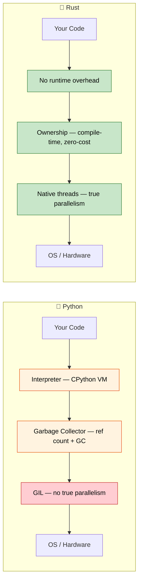

## 演讲者介绍和总体方法

- 演讲者介绍
    - 微软 SCHIE（硅与云硬件基础设施工程）团队首席固件架构师
    - 业界资深专家，专长于安全、系统编程（固件、操作系统、虚拟化）、CPU 和平台架构，以及 C++ 系统
    - 2017 年开始使用 Rust 编程（@AWS EC2），从此深深爱上这门语言
- 本课程尽可能保持互动
    - 假设：你了解 Python 及其生态系统
    - 示例刻意将 Python 概念映射到 Rust 等价物
    - **随时欢迎提出澄清问题**

---

## Python 开发者为什么选择 Rust

> **你将学到什么：** 为什么 Python 开发者正在采用 Rust，真实世界的性能提升（Dropbox、Discord、Pydantic），
> 何时 Rust 是正确的选择 vs 保持使用 Python，以及两种语言之间的核心哲学差异。
>
> **难度：** 🟢 初学者

### 性能：从分钟到毫秒

Python 对于 CPU 密集型工作众所周知地慢。Rust 提供 C 级性能，同时具有高级语言的感觉。

```python
# Python —— 1000 万次调用约 2 秒
import time

def fibonacci(n: int) -> int:
    if n <= 1:
        return n
    a, b = 0, 1
    for _ in range(2, n + 1):
        a, b = b, a + b
    return b

start = time.perf_counter()
results = [fibonacci(n % 30) for n in range(10_000_000)]
elapsed = time.perf_counter() - start
print(f"Elapsed: {elapsed:.2f}s")  # 典型硬件上约 2 秒
```

```rust
// Rust —— 同样的 1000 万次调用约 0.07 秒
use std::time::Instant;

fn fibonacci(n: u64) -> u64 {
    if n <= 1 {
        return n;
    }
    let (mut a, mut b) = (0u64, 1u64);
    for _ in 2..=n {
        let temp = b;
        b = a + b;
        a = temp;
    }
    b
}

fn main() {
    let start = Instant::now();
    let results: Vec<u64> = (0..10_000_000).map(|n| fibonacci(n % 30)).collect();
    println!("Elapsed: {:.2?}", start.elapsed());  // 约 0.07 秒
}
```
> 注意：为了公平的性能对比，应该以 release 模式运行 Rust（`cargo run --release`）。
> **为什么有这种差异？** Python 通过字典查找调度每个 `+` 操作，
> 从堆对象中解包整数，并在每个操作时检查类型。Rust 直接将
> `fibonacci` 编译为少量 x86 `add`/`mov` 指令 —— 与
> C 编译器生成的代码相同。

### 无需垃圾回收器的内存安全

Python 的引用计数 GC 有已知的问题：循环引用、不可预测的 `__del__` 时机，以及内存碎片。Rust 在编译时消除这些问题。

```python
# Python —— 引用计数无法释放的循环引用
class Node:
    def __init__(self, value):
        self.value = value
        self.parent = None
        self.children = []

    def add_child(self, child):
        self.children.append(child)
        child.parent = self  # 循环引用！

# 这两个节点互相引用 —— 引用计数永远不会达到 0
# CPython 的循环检测器*最终*会清理它们，
# 但你无法控制时机，而且它会增加 GC 暂停开销
root = Node("root")
child = Node("child")
root.add_child(child)
```

```rust
// Rust —— 所有权通过设计防止循环引用
struct Node {
    value: String,
    children: Vec<Node>,  // Children are OWNED — no cycles possible
}

impl Node {
    fn new(value: &str) -> Self {
        Node {
            value: value.to_string(),
            children: Vec::new(),
        }
    }

    fn add_child(&mut self, child: Node) {
        self.children.push(child);  // Ownership transfers here
    }
}

fn main() {
    let mut root = Node::new("root");
    let child = Node::new("child");
    root.add_child(child);
    // When root is dropped, all children are dropped too.
    // Deterministic, zero overhead, no GC.
}
```

> **Key insight**: In Rust, the child doesn't hold a reference back to the parent.
> If you truly need cross-references (like a graph), you use explicit mechanisms
> like `Rc<RefCell<T>>` or indices — making the complexity visible and intentional.

***

## Rust 解决的常见 Python 痛点

### 1. 运行时类型错误

最常见的 Python 生产环境 bug：向函数传递错误的类型。
类型提示有帮助，但它们不是强制的。

```python
# Python —— 类型提示是建议，不是规则
def process_user(user_id: int, name: str) -> dict:
    return {"id": user_id, "name": name.upper()}

# 这些在调用处都"能工作" —— 在运行时失败
process_user("not-a-number", 42)        # TypeError: int has no .upper()
process_user(None, "Alice")             # 静默地将 None 存储为 id —— bug 隐藏直到下游代码期望 int

# 即使有 mypy，你仍然可以绕过类型：
data = json.loads('{"id": "oops"}')     # 总是返回 Any
process_user(data["id"], data["name"])  # mypy 无法捕获这个
```

```rust
// Rust —— 编译器在程序运行前捕获所有这些错误
fn process_user(user_id: i64, name: &str) -> User {
    User {
        id: user_id,
        name: name.to_uppercase(),
    }
}

// process_user("not-a-number", 42);     // ❌ 编译错误：expected i64, found &str
// process_user(None, "Alice");           // ❌ 编译错误：expected i64, found Option
// 多余的参数总是编译错误。

// 反序列化 JSON 也是类型安全的：
#[derive(Deserialize)]
struct UserInput {
    id: i64,     // JSON 中必须是数字
    name: String, // JSON 中必须是字符串
}
let input: UserInput = serde_json::from_str(json_str)?; // 如果类型不匹配则返回 Err
process_user(input.id, &input.name); // ✅ 保证正确的类型
```

### 2. None：十亿美元的错误（Python 版）

`None` 可以出现在任何期望值的地方。Python 没有编译时方法来
防止 `AttributeError: 'NoneType' object has no attribute ...`。

```python
# Python —— None 无处不在
def find_user(user_id: int) -> dict | None:
    users = {1: {"name": "Alice"}, 2: {"name": "Bob"}}
    return users.get(user_id)

user = find_user(999)         # 返回 None
print(user["name"])           # 💥 TypeError: 'NoneType' object is not subscriptable

# 即使有 Optional 类型提示，也没有强制检查：
from typing import Optional
def get_name(user_id: int) -> Optional[str]:
    return None

name: Optional[str] = get_name(1)
print(name.upper())          # 💥 AttributeError —— mypy 警告，运行时不在乎
```

```rust
// Rust —— None 不可能出现，除非显式处理
fn find_user(user_id: i64) -> Option<User> {
    let users = HashMap::from([
        (1, User { name: "Alice".into() }),
        (2, User { name: "Bob".into() }),
    ]);
    users.get(&user_id).cloned()
}

let user = find_user(999);  // 返回 Option<User> 的 None 变体
// println!("{}", user.name);  // ❌ 编译错误：Option<User> 没有字段 `name`

// 你*必须*处理 None 情况：
match find_user(999) {
    Some(user) => println!("{}", user.name),
    None => println!("User not found"),
}

// 或使用组合子：
let name = find_user(999)
    .map(|u| u.name)
    .unwrap_or_else(|| "Unknown".to_string());
```

### 3. GIL：Python 的并发天花板

Python 的全局解释器锁意味着线程不能并行运行 Python 代码。
`threading` 仅对 I/O 密集型工作有用；CPU 密集型工作需要 `multiprocessing`
（带有序列化开销）或 C 扩展。

```python
# Python —— 因为 GIL，线程*不能*加速 CPU 工作
import threading
import time

def cpu_work(n):
    total = 0
    for i in range(n):
        total += i * i
    return total

start = time.perf_counter()
threads = [threading.Thread(target=cpu_work, args=(10_000_000,)) for _ in range(4)]
for t in threads:
    t.start()
for t in threads:
    t.join()
elapsed = time.perf_counter() - start
print(f"4 threads: {elapsed:.2f}s")  # 和 1 个线程*差不多*！GIL 阻止了并行性。

# multiprocessing"能工作"，但在进程之间序列化数据：
from multiprocessing import Pool
with Pool(4) as p:
    results = p.map(cpu_work, [10_000_000] * 4)  # 约 4 倍快，但有 pickle 开销
```

```rust
// Rust —— 真正的并行，没有 GIL，没有序列化开销
use std::thread;

fn cpu_work(n: u64) -> u64 {
    (0..n).map(|i| i * i).sum()
}

fn main() {
    let start = std::time::Instant::now();
    let handles: Vec<_> = (0..4)
        .map(|_| thread::spawn(|| cpu_work(10_000_000)))
        .collect();

    let results: Vec<u64> = handles.into_iter()
        .map(|h| h.join().unwrap())
        .collect();

    println!("4 threads: {:.2?}", start.elapsed());  // 比单线程约 4 倍快
}
```

> **使用 Rayon**（Rust 的并行迭代器库），并行性更简单：
> ```rust
> use rayon::prelude::*;
> let results: Vec<u64> = inputs.par_iter().map(|&n| cpu_work(n)).collect();
> ```

### 4. 部署和分发的痛苦

Python 的部署出了名地困难：venv、系统 Python 冲突、
`pip install` 失败、C 扩展 wheel、包含完整 Python 运行时的 Docker 镜像。

```python
# Python 部署清单：
# 1. 哪个 Python 版本？3.9? 3.10? 3.11? 3.12?
# 2. 虚拟环境：venv、conda、poetry、pipenv?
# 3. C 扩展：需要编译器？manylinux wheels?
# 4. 系统依赖：libssl、libffi 等？
# 5. Docker: 完整的 python:3.12 镜像是 1.0 GB
# 6. 启动时间：重度导入的应用需要 200-500ms

# Docker 镜像：约 1 GB
# FROM python:3.12-slim
# COPY requirements.txt .
# RUN pip install -r requirements.txt
# COPY . .
# CMD ["python", "app.py"]
```

```rust
// Rust 部署：单个静态二进制文件，不需要运行时
// cargo build --release → 一个二进制文件，约 5-20 MB
// 复制到任何地方 —— 不需要 Python、不需要 venv、没有依赖

// Docker 镜像：约 5 MB（from scratch 或 distroless）
// FROM scratch
// COPY target/release/my_app /my_app
// CMD ["/my_app"]

// 启动时间：<1ms
// 交叉编译：cargo build --target x86_64-unknown-linux-musl
```

***

## 何时选择 Rust 而非 Python

### 选择 Rust 的情况：
- **性能至关重要**：数据管道、实时处理、计算密集型服务
- **正确性重要**：金融系统、安全关键代码、协议实现
- **部署简单**：单个二进制文件，无运行时依赖
- **低级控制**：硬件交互、操作系统集成、嵌入式系统
- **真正的并发**：CPU 密集型并行，无需 GIL 变通
- **内存效率**：降低内存密集型服务的云成本
- **长时间运行的服务**：可预测的延迟很重要（无 GC 暂停）

### 保留 Python 的情况：
- **快速原型设计**：探索性数据分析、脚本、一次性工具
- **ML/AI 工作流**：PyTorch、TensorFlow、scikit-learn 生态系统
- **胶水代码**：连接 API、数据转换脚本
- **团队专业知识**：当 Rust 学习曲线不合理时
- **上市时间**：当开发速度胜过执行速度时
- **交互式工作**：Jupyter notebooks、REPL 驱动开发
- **脚本**：自动化、系统管理任务、快速实用程序

### 考虑两者（使用 PyO3 的混合方法）：
- **Rust 中的计算密集型代码**：通过 PyO3/maturin 从 Python 调用
- **Python 中的业务逻辑和编排**：熟悉、高效
- **渐进式迁移**：识别热点，用 Rust 扩展替换
- **两全其美**：Python 的生态系统 + Rust 的性能

***

## 现实世界的影响：公司为什么选择 Rust

### Dropbox：存储基础设施
- **之前（Python）**：高 CPU 使用率、同步引擎中的内存开销
- **之后（Rust）**：10 倍性能提升，50% 内存减少
- **结果**：节省数百万基础设施成本

### Discord：语音/视频后端
- **之前（Python → Go）**：GC 暂停导致音频丢失
- **之后（Rust）**：一致的低延迟性能
- **结果**：更好的用户体验，降低服务器成本

### Cloudflare：边缘 Workers
- **为什么选择 Rust**：WebAssembly 编译，边缘可预测的性能
- **结果**：Workers 以微秒级冷启动运行

### Pydantic V2
- **之前**：纯 Python 验证 —— 大负载慢
- **之后**：Rust 核心（通过 PyO3）—— **5-50 倍更快** 验证
- **结果**：相同的 Python API，执行速度显著加快

### 为什么这对 Python 开发者很重要：
1. **互补技能**：Rust 和 Python 解决不同的问题
2. **PyO3 桥梁**：编写可从 Python 调用的 Rust 扩展
3. **性能理解**：了解 Python 为什么慢以及如何修复热点
4. **职业成长**：系统编程专业知识越来越有价值
5. **云成本**：10 倍更快的代码 = 显著降低基础设施支出

***

## 语言哲学对比

### Python 哲学
- **可读性很重要**：简洁的语法，"一种明显的方法来做"
- **包含电池**：广泛的標準庫，快速原型设计
- **鸭子类型**："如果它走起来像鸭子，叫起来像鸭子..."
- **开发者速度**：优化编写速度，而不是执行速度
- **一切都是动态的**：运行时修改类、猴子补丁、元类

### Rust 哲学
- **性能无需牺牲**：零成本抽象，无运行时开销
- **正确性优先**：如果能编译，整类 bug 都是不可能的
- **显式优于隐式**：无隐藏行为，无隐式转换
- **所有权**：资源恰好有一个所有者 —— 内存、文件、套接字
- **无畏并发**：类型系统在编译时防止数据竞争



***

## 快速参考：Rust vs Python

| **概念** | **Python** | **Rust** | **关键差异** |
|-------------|-----------|----------|-------------------|
| 类型系统 | 动态（`鸭子类型`） | 静态（编译时） | 错误在运行前捕获 |
| 内存 | 垃圾回收（引用计数 + 循环 GC） | 所有权系统 | 零成本，确定性清理 |
| None/null | `None` 随处可见 | `Option<T>` | 编译时 None 安全 |
| 错误处理 | `raise`/`try`/`except` | `Result<T, E>` | 显式，无隐藏控制流 |
| 可变性 | 一切可变 | 默认不可变 | 选择加入可变性 |
| 速度 | 解释执行（慢 10-100 倍） | 编译执行（C/C++ 速度） | 数量级更快 |
| 并发 | GIL 限制线程 | 无 GIL，`Send`/`Sync` traits | 默认真正的并行 |
| 依赖 | `pip install` / `poetry add` | `cargo add` | 内置依赖管理 |
| 构建系统 | setuptools/poetry/hatch | Cargo | 单一统一工具 |
| 打包 | `pyproject.toml` | `Cargo.toml` | 类似的声明式配置 |
| REPL | `python` 交互式 | 无 REPL（使用测试/`cargo run`） | 编译优先工作流 |
| 类型提示 | 可选，不强制 | 必需，编译器强制 | 类型不是装饰性的 |

---

## 练习

<details>
<summary><strong>🏋️ 练习：心智模型检查</strong>（点击展开）</summary>

**挑战**：对于每个 Python 片段，预测 Rust 会有什么不同的要求。不要写代码 —— 只需描述约束。

1. `x = [1, 2, 3]; y = x; x.append(4)` —— Rust 中会发生什么？
2. `data = None; print(data.upper())` —— Rust 如何防止这个？
3. `import threading; shared = []; threading.Thread(target=shared.append, args=(1,)).start()` —— Rust 要求什么？

<details>
<summary>🔑 解决方案</summary>

1. **所有权移动**：`let y = x;` 移动 `x` —— `x.push(4)` 是编译错误。你需要 `let y = x.clone();` 或用 `let y = &x;` 借用。
2. **无空值**：`data` 不能是 `None`，除非它是 `Option<String>`。你必须 `match` 或使用 `.unwrap()` / `if let` —— 没有意外的 `NoneType` 错误。
3. **Send + Sync**：编译器要求 `shared` 包装在 `Arc<Mutex<Vec<i32>>>` 中。忘记锁 = 编译错误，而不是竞态条件。

**关键要点**：Rust 将运行时失败转变为编译时错误。你感受到的"摩擦"是编译器在捕获真正的 bug。

</details>
</details>

***


