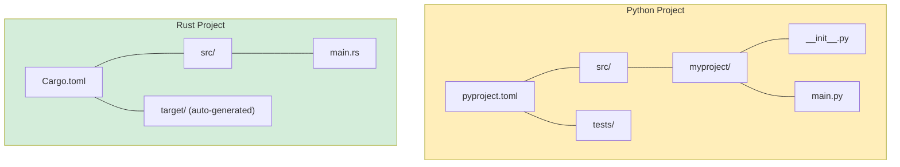

## 安装和设置

> **你将学到什么：** 如何安装 Rust 及其工具链，Cargo 构建系统 vs pip/Poetry，
> IDE 设置，你的第一个 `Hello, world!` 程序，以及映射到 Python 等价物的基本 Rust 关键字。
>
> **难度：** 🟢 初学者

### 安装 Rust
```bash
# 通过 rustup 安装 Rust（Linux/macOS/WSL）
curl --proto '=https' --tlsv1.2 -sSf https://sh.rustup.rs | sh

# 验证安装
rustc --version     # Rust 编译器
cargo --version     # 构建工具 + 包管理器（类似 pip + setuptools 组合）

# 更新 Rust
rustup update
```

### Rust 工具 vs Python 工具

| 用途 | Python | Rust |
|---------|--------|------|
| 语言运行时 | `python`（解释器） | `rustc`（编译器，很少直接调用） |
| 包管理器 | `pip` / `poetry` / `uv` | `cargo`（内置） |
| 项目配置 | `pyproject.toml` | `Cargo.toml` |
| 锁文件 | `poetry.lock` / `requirements.txt` | `Cargo.lock` |
| 虚拟环境 | `venv` / `conda` | 不需要（依赖是每个项目隔离的） |
| 格式化 | `black` / `ruff format` | `rustfmt`（内置：`cargo fmt`） |
| Linter | `ruff` / `flake8` / `pylint` | `clippy`（内置：`cargo clippy`） |
| 类型检查 | `mypy` / `pyright` | 内置于编译器（始终开启） |
| 测试运行器 | `pytest` | `cargo test`（内置） |
| 文档 | `sphinx` / `mkdocs` | `cargo doc`（内置） |
| REPL | `python` / `ipython` | 无（使用 `cargo test` 或 Rust Playground） |

### IDE 设置

**VS Code**（推荐）：
```text
要安装的扩展：
- rust-analyzer        ← 基础：IDE 功能、类型提示、补全
- Even Better TOML     ← Cargo.toml 的语法高亮
- CodeLLDB             ← 调试器支持

# Python 等价物映射：
# rust-analyzer ≈ Pylance（但有 100% 类型覆盖，始终如此）
# cargo clippy  ≈ ruff（但检查正确性，不仅仅是风格）
```

***

## 你的第一个 Rust 程序

### Python Hello World
```python
# hello.py — 直接运行
print("Hello, World!")

# Run:
# python hello.py
```

### Rust Hello World
```rust
// src/main.rs — 必须先编译
fn main() {
    println!("Hello, World!");   // println! 是一个宏（注意 !）
}

// Build and run:
// cargo run
```

### Python 开发者的关键差异

```text
Python:                              Rust:
─────────                            ─────
- 不需要 main()                      - fn main() 是入口点
- 缩进 = 代码块                       - 花括号 {} = 代码块
- print() 是一个函数                 - println!() 是一个宏（! 很重要）
- 无分号                            - 分号结束语句
- 无类型声明                         - 类型推断但始终已知
- 解释执行（直接运行）                - 编译执行（cargo build，然后运行）
- 运行时错误                         - 大多数错误在编译时捕获
```

### 创建你的第一个项目
```bash
# Python                              # Rust
mkdir myproject                        cargo new myproject
cd myproject                           cd myproject
python -m venv .venv                   # 不需要虚拟环境
source .venv/bin/activate              # 不需要激活
# 手动创建文件                        # src/main.rs 已创建

# Python 项目结构：                     Rust 项目结构：
# myproject/                           myproject/
# ├── pyproject.toml                   ├── Cargo.toml        (类似 pyproject.toml)
# ├── src/                             ├── src/
# │   └── myproject/                   │   └── main.rs       (入口点)
# │       ├── __init__.py              └── (不需要 __init__.py)
# │       └── main.py
# └── tests/
#     └── test_main.py
```



> **关键差异**：Rust 项目更简单 —— 没有 `__init__.py`，没有虚拟环境，没有 `setup.py` vs `setup.cfg` vs `pyproject.toml` 混淆。只有 `Cargo.toml` + `src/`。

***

## Cargo vs pip/Poetry

### 项目配置

```toml
# Python — pyproject.toml
[project]
name = "myproject"
version = "0.1.0"
requires-python = ">=3.10"
dependencies = [
    "requests>=2.28",
    "pydantic>=2.0",
]

[project.optional-dependencies]
dev = ["pytest", "ruff", "mypy"]
```

```toml
# Rust — Cargo.toml
[package]
name = "myproject"
version = "0.1.0"
edition = "2021"          # Rust 版本（类似 Python 版本）

[dependencies]
reqwest = "0.12"          # HTTP 客户端（类似 requests）
serde = { version = "1.0", features = ["derive"] }  # 序列化（类似 pydantic）

[dev-dependencies]
# 测试依赖 —— 仅为 `cargo test` 编译
# （不需要单独的测试配置 —— `cargo test` 内置）
```

### 常用 Cargo 命令
```bash
# Python 等价物                       # Rust
pip install requests               cargo add reqwest
pip install -r requirements.txt    cargo build           # 自动安装依赖
pip install -e .                   cargo build            # 始终"可编辑"
python -m pytest                   cargo test
python -m mypy .                   # 内置于编译器 —— 始终运行
ruff check .                       cargo clippy
ruff format .                      cargo fmt
python main.py                     cargo run
python -c "..."                    # 无等价物 —— 使用 cargo run 或测试

# Rust 特有：
cargo new myproject                # 创建新项目
cargo build --release              # 优化构建（比 debug 快 10-100 倍）
cargo doc --open                   # 生成并浏览 API 文档
cargo update                       # 更新依赖（类似 pip install --upgrade）
```

***


## Python 开发者的基本 Rust 关键字

### 变量和可变性关键字

```rust
// let — 声明变量（类似 Python 赋值，但默认不可变）
let name = "Alice";          // Python: name = "Alice"（但可变）
// name = "Bob";             // ❌ 编译错误！默认不可变

// mut — 选择加入可变性
let mut count = 0;           // Python: count = 0（在 Python 中始终可变）
count += 1;                  // ✅ 允许，因为有 `mut`

// const — 编译时常量（类似 Python 的 UPPER_CASE 约定，但强制）
const MAX_SIZE: usize = 1024;   // Python: MAX_SIZE = 1024（仅是约定）

// static — 全局变量（慎用；Python 有模块级全局变量）
static VERSION: &str = "1.0";
```

### 所有权和借用关键字

```rust
// 这些*没有* Python 等价物 —— 它们是 Rust 特有的概念

// & — 借用（只读引用）
fn print_name(name: &str) { }    // Python: def print_name(name: str) —— 但 Python 总是传递引用

// &mut — 可变借用
fn append(list: &mut Vec<i32>) { }  // Python: def append(lst: list) —— 在 Python 中始终可变

// move — 转移所有权（在 Rust 中隐式发生，在 Python 中从不）
let s1 = String::from("hello");
let s2 = s1;    // s1 被*移动*到 s2 —— s1 不再有效
// println!("{}", s1);  // ❌ 编译错误：value moved
```

### 类型定义关键字

```rust
// struct — 类似 Python 的 dataclass 或 NamedTuple
struct Point {               // @dataclass
    x: f64,                  // class Point:
    y: f64,                  //     x: float
}                            //     y: float

// enum — 类似 Python 的 enum 但*强大得多*（携带数据）
enum Shape {                 // 无直接 Python 等价物
    Circle(f64),             // 每个变体可以携带不同的数据
    Rectangle(f64, f64),
}

// impl — 为类型附加方法（类似在类中定义方法）
impl Point {                 // class Point:
    fn distance(&self) -> f64 {  //     def distance(self) -> float:
        (self.x.powi(2) + self.y.powi(2)).sqrt()
    }
}

// trait — 类似 Python 的 ABC 或 Protocol（PEP 544）
trait Drawable {             // class Drawable(Protocol):
    fn draw(&self);          //     def draw(self) -> None: ...
}

// type — 类型别名（类似 Python 的 TypeAlias）
type UserId = i64;           // UserId = int（或 TypeAlias）
```

### 控制流关键字

```rust
// match — 穷尽模式匹配（类似 Python 3.10+ match，但强制）
match value {
    1 => println!("one"),
    2 | 3 => println!("two or three"),
    _ => println!("other"),          // _ = 通配符（类似 Python 的 case _:）
}

// if let — 解构 + 条件（Pythonic: if (m := regex.match(s)):)
if let Some(x) = optional_value {
    println!("{}", x);
}

// loop — 无限循环（类似 while True:）
loop {
    break;  // 必须 break 才能退出
}

// for — 迭代（类似 Python 的 for，但更常需要 .iter()）
for item in collection.iter() {      // for item in collection:
    println!("{}", item);
}

// while let — 带解构的循环
while let Some(item) = stack.pop() {
    process(item);
}
```

### 可见性关键字

```rust
// pub — 公共（Python 没有真正的私有；使用 _ 约定）
pub fn greet() { }           // def greet():  — 在 Python 中一切都是"公共的"

// pub(crate) — 仅在 crate 内可见
pub(crate) fn internal() { } // def _internal():  — 单下划线约定

// （无关键字） — 模块内私有
fn private_helper() { }      // def __private():  — 双下划线名称修饰

// 在 Python 中，"私有"是君子协定。
// 在 Rust 中，私有由编译器强制。
```

---

## 练习

<details>
<summary><strong>🏋️ 练习：第一个 Rust 程序</strong>（点击展开）</summary>

**挑战**：创建一个新的 Rust 项目并编写一个程序：
1. 声明一个变量 `name` 存储你的名字（类型 `&str`）
2. 声明一个可变变量 `count` 从 0 开始
3. 使用 `for` 循环从 1..=5 递增 `count` 并打印 `"Hello, {name}! (count: {count})"`
4. 循环后，使用 `match` 表达式打印 count 是偶数还是奇数

<details>
<summary>🔑 解决方案</summary>

```bash
cargo new hello_rust && cd hello_rust
```

```rust
// src/main.rs
fn main() {
    let name = "Pythonista";
    let mut count = 0u32;

    for _ in 1..=5 {
        count += 1;
        println!("Hello, {name}! (count: {count})");
    }

    let parity = match count % 2 {
        0 => "even",
        _ => "odd",
    };
    println!("Final count {count} is {parity}");
}
```

**关键要点**：
- `let` 默认不可变（你需要 `mut` 来改变 `count`）
- `1..=5` 是闭区间（Python 的 `range(1, 6)`）
- `match` 是返回值的表达式
- 没有 `self`，没有 `if __name__ == "__main__"` —— 只有 `fn main()`

</details>
</details>

***


