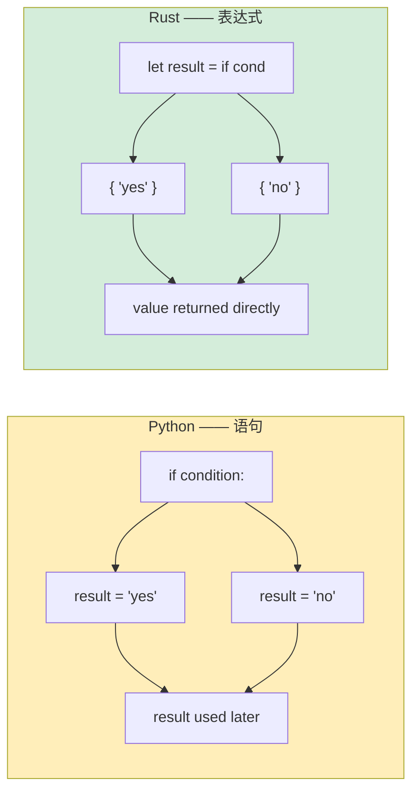

## 条件语句

> **你将学到什么：** `if`/`else` 无括号（但需要花括号），`loop`/`while`/`for` vs Python 的迭代模型，
> 表达式块（一切返回值），以及带有必需返回类型的函数签名。
>
> **难度：** 🟢 初学者

### if/else

```python
# Python
if temperature > 100:
    print("Too hot!")
elif temperature < 0:
    print("Too cold!")
else:
    print("Just right")

# Ternary
status = "hot" if temperature > 100 else "ok"
```

```rust
// Rust —— 需要花括号，无冒号，`else if` 不是 `elif`
if temperature > 100 {
    println!("Too hot!");
} else if temperature < 0 {
    println!("Too cold!");
} else {
    println!("Just right");
}

// if 是*表达式* —— 返回值（类似 Python 的三元，但更强大）
let status = if temperature > 100 { "hot" } else { "ok" };
```

### 关键差异
```rust
// 1. 条件必须是 bool —— 无真值/假值
let x = 42;
// if x { }          // ❌ 错误：expected bool, found integer
if x != 0 { }        // ✅ 需要显式比较

// 在 Python 中，这些都是真值/假值：
// if []:      → False    (空列表)
// if "":      → False    (空字符串)
// if 0:       → False    (零)
// if None:    → False

// 在 Rust 中，*只有* bool 可用于条件：
let items: Vec<i32> = vec![];
// if items { }           // ❌ 错误
if !items.is_empty() { }  // ✅ 显式检查

let name = "";
// if name { }             // ❌ 错误
if !name.is_empty() { }    // ✅ 显式检查
```

***

## 循环和迭代

### for 循环
```python
# Python
for i in range(5):
    print(i)

for item in ["a", "b", "c"]:
    print(item)

for i, item in enumerate(["a", "b", "c"]):
    print(f"{i}: {item}")

for key, value in {"x": 1, "y": 2}.items():
    print(f"{key} = {value}")
```

```rust
// Rust
for i in 0..5 {                           // range(5) → 0..5
    println!("{}", i);
}

for item in ["a", "b", "c"] {             // 直接迭代
    println!("{}", item);
}

for (i, item) in ["a", "b", "c"].iter().enumerate() {  // enumerate()
    println!("{}: {}", i, item);
}

// HashMap 迭代
use std::collections::HashMap;
let map = HashMap::from([("x", 1), ("y", 2)]);
for (key, value) in &map {                // & 借用 map
    println!("{} = {}", key, value);
}
```

### Range 语法
```rust
Python:              Rust:               说明：
range(5)             0..5                半开（不包含结束）
range(1, 10)         1..10               半开
range(1, 11)         1..=10              闭区间（包含结束）
range(0, 10, 2)      (0..10).step_by(2)  步长（是方法，不是语法）
```

### while 循环
```python
# Python
count = 0
while count < 5:
    print(count)
    count += 1

# 无限循环
while True:
    data = get_input()
    if data == "quit":
        break
```

```rust
// Rust
let mut count = 0;
while count < 5 {
    println!("{}", count);
    count += 1;
}

// 无限循环 —— 使用 `loop`，不是 `while true`
loop {
    let data = get_input();
    if data == "quit" {
        break;
    }
}

// loop 可以返回值！（Rust 特有）
let result = loop {
    let input = get_input();
    if let Ok(num) = input.parse::<i32>() {
        break num;  // 带值的 `break` —— 类似循环的 return
    }
    println!("Not a number, try again");
};
```

### 列表推导式 vs 迭代器链
```python
# Python —— 列表推导式
squares = [x ** 2 for x in range(10)]
evens = [x for x in range(20) if x % 2 == 0]
pairs = [(x, y) for x in range(3) for y in range(3)]
```

```rust
// Rust —— 迭代器链（.map、.filter、.collect）
let squares: Vec<i32> = (0..10).map(|x| x * x).collect();
let evens: Vec<i32> = (0..20).filter(|x| x % 2 == 0).collect();
let pairs: Vec<(i32, i32)> = (0..3)
    .flat_map(|x| (0..3).map(move |y| (x, y)))
    .collect();

// 这些是*惰性*的 —— 直到 .collect() 才执行
// Python 推导式是急切的（立即运行）
// Rust 迭代器对于大数据集可能更高效
```

***

## 表达式块

Rust 中一切都是表达式（或可以是）。这与 Python 有很大的转变，在 Python 中 `if`/`for` 是语句。

```python
# Python —— if 是语句（三元除外）
if condition:
    result = "yes"
else:
    result = "no"

# 或三元（限制为单个表达式）：
result = "yes" if condition else "no"
```

```rust
// Rust —— if 是表达式（返回值）
let result = if condition { "yes" } else { "no" };

// 块是表达式 —— 最后一行（无分号）是返回值
let value = {
    let x = 5;
    let y = 10;
    x + y    // 无分号 —— 这是块的值 (15)
};

// match 也是表达式
let description = match temperature {
    t if t > 100 => "boiling",
    t if t > 50 => "hot",
    t if t > 20 => "warm",
    _ => "cold",
};
```

下图说明了 Python 基于语句和 Rust 基于表达式的控制流之间的核心差异：



> **分号规则**：在 Rust 中，块中的最后一个表达式**无分号**是块的返回值。添加分号使其成为语句（返回 `()`）。
> 这让 Python 开发者最初感到困惑 —— 它就像隐式的 `return`。

***

## 函数和类型签名

### Python 函数
```python
# Python —— 类型可选，动态分派
def greet(name: str, greeting: str = "Hello") -> str:
    return f"{greeting}, {name}!"

# 默认参数，*args, **kwargs
def flexible(*args, **kwargs):
    pass

# 一等函数
def apply(f, x):
    return f(x)

result = apply(lambda x: x * 2, 5)  # 10
```

### Rust 函数
```rust
// Rust —— 函数签名上*必需*类型，无默认值
fn greet(name: &str, greeting: &str) -> String {
    format!("{}, {}!", greeting, name)
}

// 无默认参数 —— 使用 builder 模式或 Option
fn greet_with_default(name: &str, greeting: Option<&str>) -> String {
    let greeting = greeting.unwrap_or("Hello");
    format!("{}, {}!", greeting, name)
}

// 无 *args/**kwargs —— 使用切片或结构体
fn sum_all(numbers: &[i32]) -> i32 {
    numbers.iter().sum()
}

// 一等函数和闭包
fn apply(f: fn(i32) -> i32, x: i32) -> i32 {
    f(x)
}

let result = apply(|x| x * 2, 5);  // 10
```

### 返回值
```python
# Python —— return 是显式的，None 是隐式的
def divide(a, b):
    if b == 0:
        return None  # 或抛出异常
    return a / b
```

```rust
// Rust —— 最后一个表达式是返回值（无分号）
fn divide(a: f64, b: f64) -> Option<f64> {
    if b == 0.0 {
        None              // 提前返回（也可以写 `return None;`）
    } else {
        Some(a / b)       // 最后一个表达式 —— 隐式 return
    }
}
```

### 多返回值
```python
# Python —— 返回元组
def min_max(numbers):
    return min(numbers), max(numbers)

lo, hi = min_max([3, 1, 4, 1, 5])
```

```rust
// Rust —— 返回元组（相同概念！）
fn min_max(numbers: &[i32]) -> (i32, i32) {
    let min = *numbers.iter().min().unwrap();
    let max = *numbers.iter().max().unwrap();
    (min, max)
}

let (lo, hi) = min_max(&[3, 1, 4, 1, 5]);
```

### 方法：self vs &self vs &mut self
```rust
// 在 Python 中，`self` 总是可变对象的引用。
// 在 Rust 中，你选择：

impl MyStruct {
    fn new() -> Self { ... }                // 无 self —— "静态方法" / "类方法"
    fn read_only(&self) { ... }             // &self —— 不可变借用（不能修改）
    fn modify(&mut self) { ... }            // &mut self —— 可变借用（可以修改）
    fn consume(self) { ... }                // self —— 获取所有权（对象被移动）
}

// Python 等价物：
// class MyStruct:
//     @classmethod
//     def new(cls): ...                    // 不需要实例
//     def read_only(self): ...             // 在 Python 中这三者相同：
//     def modify(self): ...                // Python self 总是可变
//     def consume(self): ...               // Python 从不"消耗" self
```

---

## 练习

<details>
<summary><strong>🏋️ 练习：使用表达式的 FizzBuzz</strong>（点击展开）</summary>

**挑战**：使用 Rust 基于表达式的 `match` 编写 1..=30 的 FizzBuzz。每个数字应该打印 "Fizz"、"Buzz"、"FizzBuzz" 或数字本身。使用 `match (n % 3, n % 5)` 作为表达式。

<details>
<summary>🔑 解决方案</summary>

```rust
fn main() {
    for n in 1..=30 {
        let result = match (n % 3, n % 5) {
            (0, 0) => String::from("FizzBuzz"),
            (0, _) => String::from("Fizz"),
            (_, 0) => String::from("Buzz"),
            _ => n.to_string(),
        };
        println!("{result}");
    }
}
```

**关键要点**：`match` 是返回值的表达式 —— 不需要 `if/elif/else` 链。`_` 通配符替换 Python 的 `case _:` 默认情况。

</details>
</details>

***

