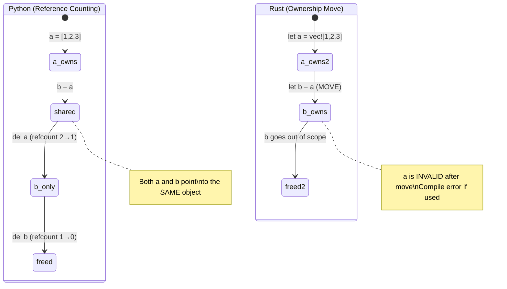
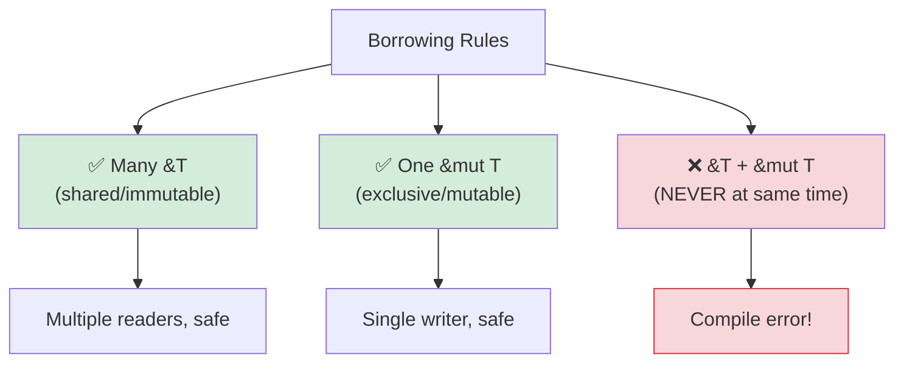

## 理解所有权

> **你将学到什么：** 为什么 Rust 有所有权（无 GC！），移动语义 vs Python 的引用计数，
> 借用（`&` 和 `&mut`），生命周期基础，以及智能指针（`Box`、`Rc`、`Arc`）。
>
> **难度：** 🟡 中级

这是 Python 开发者最难的概念。在 Python 中，你从不想谁"拥有"数据 —— 垃圾回收器处理它。在 Rust 中，每个值恰好有一个所有者，编译器在编译时跟踪这个。

### Python：共享引用无处不在
```python
# Python —— 一切都是引用，gc 清理
a = [1, 2, 3]
b = a              # b 和 a 指向*同一个*列表
b.append(4)
print(a)            # [1, 2, 3, 4] —— 惊讶！a 也变了

# 谁拥有这个列表？a 和 b 都引用它。
# 垃圾回收器在没有引用时释放它。
# 你从不想这个。
```

### Rust：单一所有权
```rust
// Rust —— 每个值恰好有*一个*所有者
let a = vec![1, 2, 3];
let b = a;           # 所有权*移动*从 a 到 b
// println!("{:?}", a); // ❌ 编译错误：value used after move

// a 不再存在。b 是唯一所有者。
println!("{:?}", b); // ✅ [1, 2, 3]

// 当 b 超出作用域，Vec 被释放。确定性。无 GC。
```

### 三个所有权规则
```rust
1. 每个值恰好有*一个*所有者变量。
2. 当所有者超出作用域，值被丢弃（释放）。
3. 所有权可以被转移（移动）但不能复制（除非 Clone）。
```

### 移动语义 —— 最大的 Python 冲击
```python
# Python —— 赋值复制引用，不是数据
def process(data):
    data.append(42)
    # 原始列表被修改！

my_list = [1, 2, 3]
process(my_list)
print(my_list)       # [1, 2, 3, 42] —— 被 process 修改！
```

```rust
// Rust —— 传递给函数*移动*所有权（对于非 Copy 类型）
fn process(mut data: Vec<i32>) -> Vec<i32> {
    data.push(42);
    data  // 必须返回它以归还所有权！
}

let my_vec = vec![1, 2, 3];
let my_vec = process(my_vec);  // 所有权移入并移出
println!("{:?}", my_vec);      // [1, 2, 3, 42]

// 或更好 —— 借用而不是移动：
fn process_borrowed(data: &mut Vec<i32>) {
    data.push(42);
}

let mut my_vec = vec![1, 2, 3];
process_borrowed(&mut my_vec);  // 临时借出它
println!("{:?}", my_vec);       // [1, 2, 3, 42] —— 仍然是我们的
```

### 所有权可视化

```text
Python:                              Rust:

  a ──────┐                           a ──→ [1, 2, 3]
           ├──→ [1, 2, 3]
  b ──────┘                           After: let b = a;

  (a 和 b 共享一个对象)                  a  (无效，已移动)
  (refcount = 2)                      b ──→ [1, 2, 3]
                                      (只有 b 拥有数据)

  del a → refcount = 1                drop(b) → 数据释放
  del b → refcount = 0 → 释放          (确定性，无 GC)
```



***

## Move Semantics vs Reference Counting

### Copy vs Move
```rust
// Simple types (integers, floats, bools, chars) are COPIED, not moved
let x = 42;
let y = x;    // x is COPIED to y (both valid)
println!("{x} {y}");  // ✅ 42 42

// Heap-allocated types (String, Vec, HashMap) are MOVED
let s1 = String::from("hello");
let s2 = s1;  // s1 is MOVED to s2
// println!("{s1}");  // ❌ Error: value used after move

// To explicitly copy heap data, use .clone()
let s1 = String::from("hello");
let s2 = s1.clone();  // Deep copy
println!("{s1} {s2}");  // ✅ hello hello (both valid)
```

### Python Developer's Mental Model
```text
Python:                    Rust:
─────────                  ─────
int, float, bool           Copy types (i32, f64, bool, char)
→ shared refs to immutable  → bitwise copied on assignment
  objects (no real copy)     (always independent values)
                           (Note: Python caches small ints; Rust copies are always predictable)

list, dict, str            Move types (Vec, HashMap, String)
→ shared reference         → ownership transfer (different behavior!)
→ gc cleans up             → owner drops data
→ clone with list(x)       → clone with x.clone()
   or copy.deepcopy(x)
```

### When Python's Sharing Model Causes Bugs

```python
# Python — accidental aliasing
def remove_duplicates(items):
    seen = set()
    result = []
    for item in items:
        if item not in seen:
            seen.add(item)
            result.append(item)
    return result

original = [1, 2, 2, 3, 3, 3]
alias = original          # Alias, NOT a copy
unique = remove_duplicates(alias)
# original is still [1, 2, 2, 3, 3, 3] — but only because we didn't mutate
# If remove_duplicates modified the input, original would be affected too
```

```rust
use std::collections::HashSet;

// Rust — ownership prevents accidental aliasing
fn remove_duplicates(items: &[i32]) -> Vec<i32> {
    let mut seen = HashSet::new();
    items.iter()
        .filter(|&&item| seen.insert(item))
        .copied()
        .collect()
}

let original = vec![1, 2, 2, 3, 3, 3];
let unique = remove_duplicates(&original); // Borrows — can't modify
// original is guaranteed unchanged — compiler prevented mutation via &
```

***

## 借用和生命周期

### 借用 = 借书
```rust
将所有权想象成一本实体书：

Python：每个人都有一本复印件（共享引用 + GC）
Rust：一个人拥有这本书。其他人可以：
         - &book     = 阅读它（不可变借用，允许很多个）
         - &mut book = 在上面写字（可变借用，独占）
         - book      = 把它给别人（移动）
```

### 借用规则



```rust
// 规则 1：你可以有*多个*不可变借用*或*一个可变借用（不能同时）

let mut data = vec![1, 2, 3];

// 多个不可变借用 —— 没问题
let a = &data;
let b = &data;
println!("{:?} {:?}", a, b);  // ✅

// 可变借用 —— 必须是独占的
let c = &mut data;
c.push(4);
// println!("{:?}", a);  // ❌ 错误：当可变借用存在时不能使用不可变借用

// 这在编译时防止数据竞争！
// Python 没有等价物 —— 这就是为什么 Python dict 在迭代时被修改会在运行时崩溃。
```

### 生命周期 —— 简要介绍
```rust
// 生命周期回答："这个引用存活多久？"
// 通常编译器会推断。你很少需要显式编写它们。

// 简单情况 —— 编译器处理：
fn first_word(s: &str) -> &str {
    s.split_whitespace().next().unwrap_or("")
}
// 编译器知道：返回的 &str 和输入的 &str 存活时间一样长

// 当你需要显式生命周期时（罕见）：
fn longest<'a>(a: &'a str, b: &'a str) -> &'a str {
    if a.len() > b.len() { a } else { b }
}
// 'a 表示："返回值和两个输入存活时间一样长"
```

> **对于 Python 开发者**：最初不要担心生命周期。编译器会
> 告诉你何时需要它们，95% 的时间它会自动推断它们。
> 将生命周期注解想象成你给编译器的提示，当它无法自己
> 找出关系时才会用到。

***

## 智能指针

对于单一所有权过于受限的情况，Rust 提供了智能指针。
这些更接近 Python 的所有权模型 —— 但是显式的和可选的。

```rust
// Box<T> —— 堆分配，单一所有者（类似 Python 的正常分配）
let boxed = Box::new(42);  // 堆分配的 i32

// Rc<T> —— 引用计数（类似 Python 的 refcount！）
use std::rc::Rc;
let shared = Rc::new(vec![1, 2, 3]);
let clone1 = Rc::clone(&shared);  // 增加引用计数
let clone2 = Rc::clone(&shared);  // 增加引用计数
// 所有三个指向同一个 Vec。当所有都被丢弃时，Vec 被释放。
// 类似 Python 的引用计数，但 Rc 不处理循环 ——
// 使用 Weak<T> 打破循环（Python 的 GC 自动处理循环）

// Arc<T> —— 原子引用计数（用于多线程代码的 Rc）
use std::sync::Arc;
let thread_safe = Arc::new(vec![1, 2, 3]);
// 当跨线程共享时使用 Arc（Rc 是单线程的）

// RefCell<T> —— 运行时借用检查（类似 Python 的"什么都可以"模型）
use std::cell::RefCell;
let cell = RefCell::new(42);
*cell.borrow_mut() = 99;  // 运行时可变借用（如果双重借用则 panic）
```

### 何时使用哪个

| 智能指针 | Python 类比 | 用例 |
|---------------|----------------|-------|
| `Box<T>` | 正常分配 | 大数据，递归类型，trait 对象 |
| `Rc<T>` | Python 的默认 refcount | 共享所有权，单线程 |
| `Arc<T>` | 线程安全的 refcount | 共享所有权，多线程 |
| `RefCell<T>` | Python 的"就修改它" | 内部可变性（权宜之计） |
| `Rc<RefCell<T>>` | Python 的正常对象模型 | 共享 + 可变（图结构） |

> **关键见解**：`Rc<RefCell<T>>` 给你类似 Python 的语义（共享、可变数据）
> 但你必须显式选择它。Rust 的默认（拥有、移动）更快，避免
> 引用计数的开销。对于带循环的图结构，使用 `Weak<T>`
> 打破引用循环 —— 不像 Python，Rust 的 `Rc` 没有循环回收器。

> 📌 **另见**：[第 13 章 —— 并发](ch13-concurrency.md) 涵盖 `Arc<Mutex<T>>` 用于多线程共享状态。

---

## 练习

<details>
<summary><strong>🏋️ 练习：发现借用检查器错误</strong>（点击展开）</summary>

**挑战**：以下代码有 3 个借用检查器错误。在不使用 `.clone()` 的情况下识别并修复它们：

```rust
fn main() {
    let mut names = vec!["Alice".to_string(), "Bob".to_string()];
    let first = &names[0];
    names.push("Charlie".to_string());
    println!("First: {first}");

    let greeting = make_greeting(names[0]);
    println!("{greeting}");
}

fn make_greeting(name: String) -> String {
    format!("Hello, {name}!")
}
```

<details>
<summary>🔑 解决方案</summary>

```rust
fn main() {
    let mut names = vec!["Alice".to_string(), "Bob".to_string()];
    let first = &names[0];
    println!("First: {first}"); // 借用后使用 BEFORE 修改
    names.push("Charlie".to_string()); // 现在安全 —— 没有存活的不可变借用

    let greeting = make_greeting(&names[0]); // 传递引用，不是所有权
    println!("{greeting}");
}

fn make_greeting(name: &str) -> String { // 接受 &str，不是 String
    format!("Hello, {name}!")
}
```

**修复的错误**：
1. **不可变借用 + 修改**：`first` 借用 `names`，然后 `push` 修改它。修复：在 push 之前使用 `first`。
2. **从 Vec 移动**：`names[0]` 尝试从 Vec 中移动 String（不允许）。修复：使用 `&names[0]` 借用。
3. **函数获取所有权**：`make_greeting(String)` 消耗值。修复：改为接受 `&str`。

</details>
</details>

***


