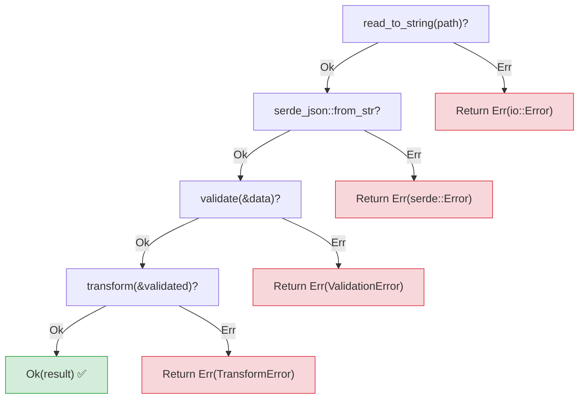
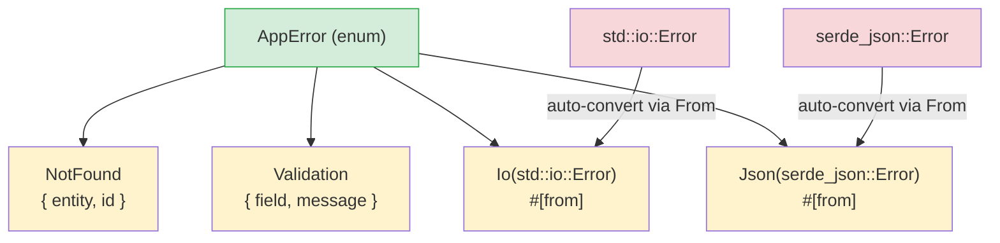

## 异常 vs Result

> **你将学到什么：** `Result<T, E>` vs `try`/`except`，`?` 运算符用于简洁的错误传播，
> 使用 `thiserror` 的自定义错误类型，`anyhow` 用于应用程序，以及为什么显式错误防止隐藏的 bug。
>
> **难度：** 🟡 中级

这是 Python 开发者最大的心智模型变化之一。Python 使用异常进行错误处理 —— 错误可以从任何地方抛出并可以在任何地方捕获（或者根本不捕获）。Rust 使用 `Result<T, E>` —— 错误是必须显式处理的值。

### Python 异常处理
```python
# Python —— 异常可以从任何地方抛出
import json

def load_config(path: str) -> dict:
    try:
        with open(path) as f:
            data = json.load(f)     # 可能抛出 JSONDecodeError
            if "version" not in data:
                raise ValueError("Missing version field")
            return data
    except FileNotFoundError:
        print(f"Config file not found: {path}")
        return {}
    except json.JSONDecodeError as e:
        print(f"Invalid JSON: {e}")
        return {}
    # 这个函数还能抛出什么异常？
    # IOError? PermissionError? UnicodeDecodeError?
    # 你无法从函数签名看出来！
```

### Rust 基于 Result 的错误处理
```rust
// Rust —— 错误是返回值，在函数签名中可见
use std::fs;
use serde_json::Value;

fn load_config(path: &str) -> Result<Value, ConfigError> {
    let contents = fs::read_to_string(path)    // 返回 Result
        .map_err(|e| ConfigError::FileError(e.to_string()))?;

    let data: Value = serde_json::from_str(&contents)  // 返回 Result
        .map_err(|e| ConfigError::ParseError(e.to_string()))?;

    if data.get("version").is_none() {
        return Err(ConfigError::MissingField("version".to_string()));
    }

    Ok(data)
}

#[derive(Debug)]
enum ConfigError {
    FileError(String),
    ParseError(String),
    MissingField(String),
}
```

### 关键差异

```text
Python:                                 Rust:
─────────                               ─────
- 错误是异常（抛出）                    - 错误是值（返回）
- 隐藏的控制流（栈展开）                - 显式控制流（? 运算符）
- 无法从签名知道什么错误                - 必须从返回类型看到错误
- 未捕获的异常在运行时崩溃              - 未处理的 Result 产生编译警告（总是处理它们）
- try/except 是可选的                   - 处理 Result 是必需的
- 宽泛的 except 捕获所有                 - match 臂是穷尽的
```

### Result 的两个变体
```rust
// Result<T, E> 正好有两个变体：
enum Result<T, E> {
    Ok(T),    // 成功 —— 包含值（类似 Python 的返回值）
    Err(E),   // 失败 —— 包含错误（类似 Python 的抛出异常）
}

// 使用 Result：
fn divide(a: f64, b: f64) -> Result<f64, String> {
    if b == 0.0 {
        Err("Division by zero".to_string())  // 类似：raise ValueError("...")
    } else {
        Ok(a / b)                             // 类似：return a / b
    }
}

// 处理 Result —— 类似 try/except 但是显式
match divide(10.0, 0.0) {
    Ok(result) => println!("Result: {result}"),
    Err(msg) => println!("Error: {msg}"),
}
```

***

## ? 运算符

`?` 运算符是 Rust 中相当于让异常向上传播到调用栈的等价物，
但它是可见的和显式的。

### Python —— 隐式传播
```python
# Python —— 异常静默地向上传播到调用栈
def read_username() -> str:
    with open("config.txt") as f:      # FileNotFoundError 传播
        return f.readline().strip()    # IOError 传播

def greet():
    name = read_username()             # 如果这里抛出，greet() 也抛出
    print(f"Hello, {name}!")           # 错误时跳过

# 错误传播是不可见的 —— 你必须阅读实现
# 才能知道什么异常可能逃逸。
```

### Rust —— 使用 ? 显式传播
```rust
// Rust —— ? 传播错误，但在代码和签名中都可见
use std::fs;
use std::io;

fn read_username() -> Result<String, io::Error> {
    let contents = fs::read_to_string("config.txt")?;  // ? = Err 时传播
    Ok(contents.lines().next().unwrap_or("").to_string())
}

fn greet() -> Result<(), io::Error> {
    let name = read_username()?;       // ? = 如果 Err，立即返回 Err
    println!("Hello, {name}!");        // 仅在 Ok 时执行
    Ok(())
}

// ? 说："如果是 Err，立即从*这个*函数返回。"
// 它像 Python 的异常传播，但是：
// 1. 可见（你看到 ?）
// 2. 在返回类型中（Result<..., io::Error>）
// 3. 编译器确保你在某处处理它
```

### 使用 ? 链式调用
```python
# Python —— 多个可能失败的操作
def process_file(path: str) -> dict:
    with open(path) as f:                    # 可能失败
        text = f.read()                       # 可能失败
    data = json.loads(text)                   # 可能失败
    validate(data)                            # 可能失败
    return transform(data)                    # 可能失败
    # 这些都可能抛出 —— 而且异常类型各不相同！
```

```rust
// Rust —— 相同的链，但是显式
fn process_file(path: &str) -> Result<Data, AppError> {
    let text = fs::read_to_string(path)?;     // ? 传播 io::Error
    let data: Value = serde_json::from_str(&text)?;  // ? 传播 serde 错误
    let validated = validate(&data)?;          // ? 传播验证错误
    let result = transform(&validated)?;       // ? 传播转换错误
    Ok(result)
}
// 每个 ? 都是潜在的提前返回 —— 它们都可见！
```



> 每个 `?` 都是一个退出点 —— 不像 Python 的 try/except，你不阅读文档就无法看出哪行可能抛出。
>
> 📌 **另见**：[第 15 章 —— 迁移模式](ch15-migration-patterns.md) 涵盖在实际代码库中将 Python try/except 模式翻译为 Rust。

***

## 使用 thiserror 的自定义错误类型



> `#[from]` 属性自动生成 `impl From<io::Error> for AppError`，因此 `?` 自动将库错误转换为你的应用程序错误。

### Python 自定义异常
```python
# Python —— 自定义异常类
class AppError(Exception):
    pass

class NotFoundError(AppError):
    def __init__(self, entity: str, id: int):
        self.entity = entity
        self.id = id
        super().__init__(f"{entity} with id {id} not found")

class ValidationError(AppError):
    def __init__(self, field: str, message: str):
        self.field = field
        super().__init__(f"Validation error on {field}: {message}")

# 用法：
def find_user(user_id: int) -> dict:
    if user_id not in users:
        raise NotFoundError("User", user_id)
    return users[user_id]
```

### Rust 使用 thiserror 的自定义错误
```rust
// Rust —— 使用 thiserror 的错误枚举（最流行的方法）
// Cargo.toml：thiserror = "2"

use thiserror::Error;

#[derive(Debug, Error)]
enum AppError {
    #[error("{entity} with id {id} not found")]
    NotFound { entity: String, id: i64 },

    #[error("Validation error on {field}: {message}")]
    Validation { field: String, message: String },

    #[error("IO error: {0}")]
    Io(#[from] std::io::Error),        // 从 io::Error 自动转换

    #[error("JSON error: {0}")]
    Json(#[from] serde_json::Error),   // 从 serde 错误自动转换
}

// 用法：
fn find_user(user_id: i64) -> Result<User, AppError> {
    users.get(&user_id)
        .cloned()
        .ok_or(AppError::NotFound {
            entity: "User".to_string(),
            id: user_id,
        })
}

// #[from] 属性意味着 ? 自动将 io::Error 转换为 AppError::Io
fn load_users(path: &str) -> Result<Vec<User>, AppError> {
    let data = fs::read_to_string(path)?;  // io::Error → AppError::Io 自动
    let users: Vec<User> = serde_json::from_str(&data)?;  // → AppError::Json
    Ok(users)
}
```

### 错误处理快速参考

| Python | Rust | 说明 |
|--------|------|------|
| `raise ValueError("msg")` | `return Err(AppError::Validation {...})` | 显式返回 |
| `try: ... except:` | `match result { Ok(v) => ..., Err(e) => ... }` | 穷尽 |
| `except ValueError as e:` | `Err(AppError::Validation { .. }) =>` | 模式匹配 |
| `raise ... from e` | `#[from]` 属性或 `.map_err()` | 错误链 |
| `finally:` | `Drop` trait（自动） | 确定性清理 |
| `with open(...):` | 基于作用域的 drop（自动） | RAII 模式 |
| 异常静默传播 | `?` 可见传播 | 总是在返回类型中 |
| `isinstance(e, ValueError)` | `matches!(e, AppError::Validation {..})` | 类型检查 |

---

## 练习

<details>
<summary><strong>🏋️ 练习：解析配置值</strong>（点击展开）</summary>

**挑战**：编写一个函数 `parse_port(s: &str) -> Result<u16, String>` 要求：
1. 拒绝空字符串，错误为 `"empty input"`
2. 解析字符串为 `u16`，将解析错误映射为 `"invalid number: {original_error}"`
3. 拒绝低于 1024 的端口，错误为 `"port {n} is privileged"`

使用 `""`、`"hello"`、`"80"` 和 `"8080"` 调用它并打印结果。

<details>
<summary>🔑 解决方案</summary>

```rust
fn parse_port(s: &str) -> Result<u16, String> {
    if s.is_empty() {
        return Err("empty input".to_string());
    }
    let port: u16 = s.parse().map_err(|e| format!("invalid number: {e}"))?;
    if port < 1024 {
        return Err(format!("port {port} is privileged"));
    }
    Ok(port)
}

fn main() {
    for input in ["", "hello", "80", "8080"] {
        match parse_port(input) {
            Ok(port) => println!("✅ {input} → {port}"),
            Err(e) => println!("❌ {input:?} → {e}"),
        }
    }
}
```

**关键要点**：`?` 与 `.map_err()` 是 Rust 替换 `try/except ValueError as e: raise ConfigError(...) from e` 的方式。每个错误路径在返回类型中可见。

</details>
</details>
***


