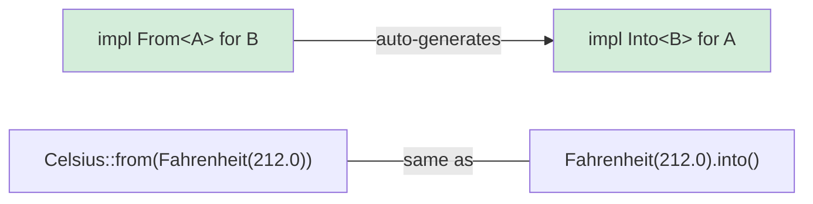

## Rust 中的类型转换

> **你将学到什么：** `From` 和 `Into` traits 用于零成本类型转换，`TryFrom` 用于可能失败的转换，
> `impl From<A> for B` 如何自动生成 `Into`，以及字符串转换模式。
>
> **难度：** 🟡 中级

Python 使用构造函数调用处理类型转换（`int("42")`、`str(42)`、`float("3.14")`）。Rust 使用 `From` 和 `Into` traits 进行类型安全的转换。

### Python 类型转换
```python
# Python —— 使用显式构造函数进行转换
x = int("42")           # str → int（可能抛出 ValueError）
s = str(42)             # int → str
f = float("3.14")       # str → float
lst = list((1, 2, 3))   # tuple → list

# 通过 __init__ 或类方法进行自定义转换
class Celsius:
    def __init__(self, temp: float):
        self.temp = temp

    @classmethod
    def from_fahrenheit(cls, f: float) -> "Celsius":
        return cls((f - 32.0) * 5.0 / 9.0)

c = Celsius.from_fahrenheit(212.0)  # 100.0°C
```

### Rust From/Into
```rust
// Rust —— From trait 定义转换
// 实现 From<T> 会自动给你 Into<U>！

struct Celsius(f64);
struct Fahrenheit(f64);

impl From<Fahrenheit> for Celsius {
    fn from(f: Fahrenheit) -> Self {
        Celsius((f.0 - 32.0) * 5.0 / 9.0)
    }
}

// 现在两种都可行：
let c1 = Celsius::from(Fahrenheit(212.0));    // 显式 From
let c2: Celsius = Fahrenheit(212.0).into();   // Into（自动派生）

// 字符串转换：
let s: String = String::from("hello");         // &str → String
let s: String = "hello".to_string();           // 相同
let s: String = "hello".into();                // 也可行（实现了 From）

let num: i64 = 42i32.into();                   // i32 → i64（无损，所以存在 From）
// let small: i32 = 42i64.into();              // ❌ i64 → i32 可能丢失数据 —— 没有 From

// 对于可能失败的转换，使用 TryFrom：
let n: Result<i32, _> = "42".parse();          // str → i32（可能失败）
let n: i32 = "42".parse().unwrap();            // 如果不是数字则 Panic
let n: i32 = "42".parse()?;                    // 使用 ? 传播错误
```

### From/Into 关系



> **经验法则**：总是实现 `From`，永远不要直接实现 `Into`。实现 `From<A> for B` 会免费给你 `Into<B> for A`。

***

### 何时使用 From/Into

```rust
// 为你的类型实现 From<T> 以实现符合人体工程学的 API 设计：

#[derive(Debug)]
struct UserId(i64);

impl From<i64> for UserId {
    fn from(id: i64) -> Self {
        UserId(id)
    }
}

// 现在函数可以接受任何可转换为 UserId 的东西：
fn find_user(id: impl Into<UserId>) -> Option<String> {
    let user_id = id.into();
    // ... 查找逻辑
    Some(format!("User #{:?}", user_id))
}

find_user(42i64);              // ✅ i64 自动转换为 UserId
find_user(UserId(42));         // ✅ UserId 保持不变
```

***

## TryFrom —— 可能失败的转换

不是所有的转换都能成功。Python 抛出异常；Rust 使用 `TryFrom` 返回 `Result`：

```python
# Python —— 可能失败的转换抛出异常
try:
    port = int("not_a_number")   # ValueError
except ValueError as e:
    print(f"Invalid: {e}")

# 在 __init__ 中自定义验证
class Port:
    def __init__(self, value: int):
        if not (1 <= value <= 65535):
            raise ValueError(f"Invalid port: {value}")
        self.value = value

try:
    p = Port(99999)  # 运行时 ValueError
except ValueError:
    pass
```

```rust
use std::num::ParseIntError;

// 用于内置类型的 TryFrom
let n: Result<i32, ParseIntError> = "42".try_into();   // Ok(42)
let n: Result<i32, ParseIntError> = "bad".try_into();  // Err(...)

// 用于验证的自定义 TryFrom
#[derive(Debug)]
struct Port(u16);

#[derive(Debug)]
enum PortError {
    Zero,
}

impl TryFrom<u16> for Port {
    type Error = PortError;

    fn try_from(value: u16) -> Result<Self, Self::Error> {
        match value {
            0 => Err(PortError::Zero),
            1..=65535 => Ok(Port(value)),
        }
    }
}

impl std::fmt::Display for PortError {
    fn fmt(&self, f: &mut std::fmt::Formatter<'_>) -> std::fmt::Result {
        match self {
            PortError::Zero => write!(f, "port cannot be zero"),
        }
    }
}

// 用法：
let p: Result<Port, _> = 8080u16.try_into();   // Ok(Port(8080))
let p: Result<Port, _> = 0u16.try_into();       // Err(PortError::Zero)
```

> **Python → Rust 心智模型**：`TryFrom` = `__init__` 可以验证并可能失败。但是它不是抛出异常，而是返回 `Result` —— 所以调用者**必须**处理错误情况。

***

## 字符串转换模式

字符串是 Python 开发者最容易混淆的转换来源：

```rust
// String → &str（借用，免费）
let s = String::from("hello");
let r: &str = &s;              // 自动 Deref 强制转换
let r: &str = s.as_str();     // 显式

// &str → String（分配，消耗内存）
let r: &str = "hello";
let s1 = String::from(r);     // From trait
let s2 = r.to_string();       // ToString trait（通过 Display）
let s3: String = r.into();    // Into trait

// Number → String
let s = 42.to_string();       // "42" —— 类似 Python 的 str(42)
let s = format!("{:.2}", 3.14); // "3.14" —— 类似 Python 的 f"{3.14:.2f}"

// String → Number
let n: i32 = "42".parse().unwrap();       // 类似 Python 的 int("42")
let f: f64 = "3.14".parse().unwrap();     // 类似 Python 的 float("3.14")

// 自定义类型 → String（实现 Display）
use std::fmt;

struct Point { x: f64, y: f64 }

impl fmt::Display for Point {
    fn fmt(&self, f: &mut fmt::Formatter<'_>) -> fmt::Result {
        write!(f, "({}, {})", self.x, self.y)
    }
}

let p = Point { x: 1.0, y: 2.0 };
println!("{p}");                // (1, 2) —— 类似 Python 的 __str__
let s = p.to_string();         // 也可行！Display 免费给你 ToString。
```

### 转换快速参考

| Python | Rust | 说明 |
|--------|------|------|
| `str(x)` | `x.to_string()` | 需要 `Display` 实现 |
| `int("42")` | `"42".parse::<i32>()` | 返回 `Result` |
| `float("3.14")` | `"3.14".parse::<f64>()` | 返回 `Result` |
| `list(iter)` | `iter.collect::<Vec<_>>()` | 需要类型注解 |
| `dict(pairs)` | `pairs.collect::<HashMap<_,_>>()` | 需要类型注解 |
| `bool(x)` | 无直接等价物 | 使用显式检查 |
| `MyClass(x)` | `MyClass::from(x)` | 实现 `From<T>` |
| `MyClass(x)`（验证） | `MyClass::try_from(x)?` | 实现 `TryFrom<T>` |

***

## 转换链和错误处理

现实世界的代码经常链式调用多个转换。比较这些方法：

```python
# Python —— 使用 try/except 的转换链
def parse_config(raw: str) -> tuple[str, int]:
    try:
        host, port_str = raw.split(":")
        port = int(port_str)
        if not (1 <= port <= 65535):
            raise ValueError(f"Bad port: {port}")
        return (host, port)
    except (ValueError, AttributeError) as e:
        raise ConfigError(f"Invalid config: {e}") from e
```

```rust
fn parse_config(raw: &str) -> Result<(String, u16), String> {
    let (host, port_str) = raw
        .split_once(':')
        .ok_or_else(|| "missing ':' separator".to_string())?;

    let port: u16 = port_str
        .parse()
        .map_err(|e| format!("invalid port: {e}"))?;

    if port == 0 {
        return Err("port cannot be zero".to_string());
    }

    Ok((host.to_string(), port))
}

fn main() {
    match parse_config("localhost:8080") {
        Ok((host, port)) => println!("Connecting to {host}:{port}"),
        Err(e) => eprintln!("Config error: {e}"),
    }
}
```

> **关键见解**：每个 `?` 都是一个可见的退出点。在 Python 中，`try` 内的任何一行都可能是抛出的那个 —— 在 Rust 中，只有以 `?` 结尾的行可能失败。
>
> 📌 **另见**：[第 9 章 —— 错误处理](ch09-error-handling.md) 深入涵盖 `Result`、`?` 和使用 `thiserror` 的自定义错误类型。

---

## 练习

<details>
<summary><strong>🏋️ 练习：温度转换库</strong>（点击展开）</summary>

**挑战**：构建一个迷你温度转换库：
1. 定义结构体 `Celsius(f64)`、`Fahrenheit(f64)` 和 `Kelvin(f64)`
2. 实现 `From<Celsius> for Fahrenheit` 和 `From<Celsius> for Kelvin`
3. 实现 `TryFrom<f64> for Kelvin` 拒绝低于绝对零度的值（-273.15°C = 0K）
4. 为所有三种类型实现 `Display`（例如 `"100.00°C"`）

<details>
<summary>🔑 解决方案</summary>

```rust
use std::fmt;

struct Celsius(f64);
struct Fahrenheit(f64);
struct Kelvin(f64);

impl From<Celsius> for Fahrenheit {
    fn from(c: Celsius) -> Self {
        Fahrenheit(c.0 * 9.0 / 5.0 + 32.0)
    }
}

impl From<Celsius> for Kelvin {
    fn from(c: Celsius) -> Self {
        Kelvin(c.0 + 273.15)
    }
}

#[derive(Debug)]
struct BelowAbsoluteZero;

impl fmt::Display for BelowAbsoluteZero {
    fn fmt(&self, f: &mut fmt::Formatter<'_>) -> fmt::Result {
        write!(f, "temperature below absolute zero")
    }
}

impl TryFrom<f64> for Kelvin {
    type Error = BelowAbsoluteZero;

    fn try_from(value: f64) -> Result<Self, Self::Error> {
        if value < 0.0 {
            Err(BelowAbsoluteZero)
        } else {
            Ok(Kelvin(value))
        }
    }
}

impl fmt::Display for Celsius    { fn fmt(&self, f: &mut fmt::Formatter<'_>) -> fmt::Result { write!(f, "{:.2}°C", self.0) } }
impl fmt::Display for Fahrenheit { fn fmt(&self, f: &mut fmt::Formatter<'_>) -> fmt::Result { write!(f, "{:.2}°F", self.0) } }
impl fmt::Display for Kelvin     { fn fmt(&self, f: &mut fmt::Formatter<'_>) -> fmt::Result { write!(f, "{:.2}K",  self.0) } }

fn main() {
    let boiling = Celsius(100.0);
    let f: Fahrenheit = Celsius(100.0).into();
    let k: Kelvin = Celsius(100.0).into();
    println!("{boiling} = {f} = {k}");

    match Kelvin::try_from(-10.0) {
        Ok(k) => println!("{k}"),
        Err(e) => println!("Error: {e}"),
    }
}
```

**关键要点**：`From` 处理不可能失败的转换（Celsius→Fahrenheit 总是可行）。`TryFrom` 处理可能失败的转换（负 Kelvin 是不可能的）。Python 在 `__init__` 中混淆两者 —— Rust 在类型系统中使区分显式化。

</details>
</details>
***


