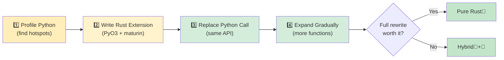

## Rust 中常见的 Python 模式

> **你将学到什么：** 如何翻译 dict→struct、class→struct+impl、列表推导式→迭代器链、
> decorator→trait 以及 context manager→Drop/RAII。 plus 基本 crate 和增量采用策略。
>
> **难度：** 🟡 中级

### 字典 → 结构体
```python
# Python —— 字典作为数据容器（非常常见）
user = {
    "name": "Alice",
    "age": 30,
    "email": "alice@example.com",
    "active": True,
}
print(user["name"])
```

```rust
// Rust —— 带命名字段的结构体
#[derive(Debug, Clone, serde::Serialize, serde::Deserialize)]
struct User {
    name: String,
    age: i32,
    email: String,
    active: bool,
}

let user = User {
    name: "Alice".into(),
    age: 30,
    email: "alice@example.com".into(),
    active: true,
};
println!("{}", user.name);
```

### 上下文管理器 → RAII (Drop)
```python
# Python —— 用于资源清理的上下文管理器
class FileManager:
    def __init__(self, path):
        self.file = open(path, 'w')

    def __enter__(self):
        return self.file

    def __exit__(self, *args):
        self.file.close()

with FileManager("output.txt") as f:
    f.write("hello")
# 退出 `with` 时文件自动关闭
```

```rust
// Rust —— RAII：Drop trait 在值超出作用域时运行
use std::fs::File;
use std::io::Write;

fn write_file() -> std::io::Result<()> {
    let mut file = File::create("output.txt")?;
    file.write_all(b"hello")?;
    Ok(())
    // `file` 超出作用域时文件自动关闭
    // 不需要 `with` —— RAII 处理它！
}
```

### 装饰器 → 高阶函数或宏
```python
# Python —— 用于计时的装饰器
import functools, time

def timed(func):
    @functools.wraps(func)
    def wrapper(*args, **kwargs):
        start = time.perf_counter()
        result = func(*args, **kwargs)
        elapsed = time.perf_counter() - start
        print(f"{func.__name__} took {elapsed:.4f}s")
        return result
    return wrapper

@timed
def slow_function():
    time.sleep(1)
```

```rust
// Rust —— 没有装饰器，使用包装函数或宏
use std::time::Instant;

fn timed<F, R>(name: &str, f: F) -> R
where
    F: FnOnce() -> R,
{
    let start = Instant::now();
    let result = f();
    println!("{} took {:.4?}", name, start.elapsed());
    result
}

// 用法：
let result = timed("slow_function", || {
    std::thread::sleep(std::time::Duration::from_secs(1));
    42
});
```

### 迭代器管道（数据处理）
```python
# Python —— 转换链
import csv
from collections import Counter

def analyze_sales(filename):
    with open(filename) as f:
        reader = csv.DictReader(f)
        sales = [
            row for row in reader
            if float(row["amount"]) > 100
        ]
    by_region = Counter(sale["region"] for sale in sales)
    top_regions = by_region.most_common(5)
    return top_regions
```

```rust
// Rust —— 带强类型的迭代器链
use std::collections::HashMap;

#[derive(Debug, serde::Deserialize)]
struct Sale {
    region: String,
    amount: f64,
}

fn analyze_sales(filename: &str) -> Vec<(String, usize)> {
    let data = std::fs::read_to_string(filename).unwrap();
    let mut reader = csv::Reader::from_reader(data.as_bytes());

    let mut by_region: HashMap<String, usize> = HashMap::new();
    for sale in reader.deserialize::<Sale>().flatten() {
        if sale.amount > 100.0 {
            *by_region.entry(sale.region).or_insert(0) += 1;
        }
    }

    let mut top: Vec<_> = by_region.into_iter().collect();
    top.sort_by(|a, b| b.1.cmp(&a.1));
    top.truncate(5);
    top
}
```

### 全局配置 / 单例
```python
# Python —— 模块级单例（常见模式）
# config.py
import json

class Config:
    _instance = None

    def __new__(cls):
        if cls._instance is None:
            cls._instance = super().__new__(cls)
            with open("config.json") as f:
                cls._instance.data = json.load(f)
        return cls._instance

config = Config()  # 模块级单例
```

```rust
// Rust —— OnceLock 用于延迟静态初始化（Rust 1.70+）
use std::sync::OnceLock;
use serde_json::Value;

static CONFIG: OnceLock<Value> = OnceLock::new();

fn get_config() -> &'static Value {
    CONFIG.get_or_init(|| {
        let data = std::fs::read_to_string("config.json")
            .expect("Failed to read config");
        serde_json::from_str(&data)
            .expect("Failed to parse config")
    })
}

// 在任何地方使用：
let db_host = get_config()["database"]["host"].as_str().unwrap();
```

***

## Python 开发者的基本 Crate

### 数据处理和序列化

| 任务 | Python | Rust Crate | 说明 |
|------|--------|-----------|------|
| JSON | `json` | `serde_json` | 类型安全序列化 |
| CSV | `csv`, `pandas` | `csv` | 流式，低内存 |
| YAML | `pyyaml` | `serde_yaml` | 配置文件 |
| TOML | `tomllib` | `toml` | 配置文件 |
| 数据验证 | `pydantic` | `serde` + 自定义 | 编译时验证 |
| 日期/时间 | `datetime` | `chrono` | 完整的时区支持 |
| 正则 | `re` | `regex` | 非常快 |
| UUID | `uuid` | `uuid` | 相同概念 |

### Web 和网络

| 任务 | Python | Rust Crate | 说明 |
|------|--------|-----------|------|
| HTTP 客户端 | `requests` | `reqwest` | Async-first |
| Web 框架 | `FastAPI`/`Flask` | `axum` / `actix-web` | 非常快 |
| WebSocket | `websockets` | `tokio-tungstenite` | Async |
| gRPC | `grpcio` | `tonic` | 完整支持 |
| 数据库 (SQL) | `sqlalchemy` | `sqlx` / `diesel` | 编译时检查 SQL |
| Redis | `redis-py` | `redis` | Async 支持 |

### CLI 和系统

| 任务 | Python | Rust Crate | 说明 |
|------|--------|-----------|------|
| CLI 参数 | `argparse`/`click` | `clap` | Derive macros |
| 彩色输出 | `colorama` | `colored` | 终端颜色 |
| 进度条 | `tqdm` | `indicatif` | 相同 UX |
| 文件监控 | `watchdog` | `notify` | 跨平台 |
| 日志 | `logging` | `tracing` | 结构化，async-ready |
| 环境变量 | `os.environ` | `std::env` + `dotenvy` | .env 支持 |
| 子进程 | `subprocess` | `std::process::Command` | 内置 |
| 临时文件 | `tempfile` | `tempfile` | 相同名称！

### 测试

| 任务 | Python | Rust Crate | 说明 |
|------|--------|-----------|------|
| 测试框架 | `pytest` | Built-in + `rstest` | `cargo test` |
| Mocking | `unittest.mock` | `mockall` | 基于 Trait |
| 属性测试 | `hypothesis` | `proptest` | 相似 API |
| 快照测试 | `syrupy` | `insta` | 快照批准 |
| 基准测试 | `pytest-benchmark` | `criterion` | 统计学 |
| 代码覆盖率 | `coverage.py` | `cargo-tarpaulin` | LLVM-based |

***

## 增量采用策略



> 📌 **另见**：[第 14 章 — Unsafe Rust 和 FFI](ch14-unsafe-rust-and-ffi.md) 涵盖 PyO3 绑定所需的低级 FFI 细节。

### 步骤 1：识别热点

```python
# 首先 profile 你的 Python 代码
import cProfile
cProfile.run('main()')  # 找到 CPU 密集型函数

# 或者使用 py-spy 进行采样 profiler：
# py-spy top --pid <python-pid>
# py-spy record -o profile.svg -- python main.py
```

### 步骤 2：为热点编写 Rust 扩展

```bash
# 使用 maturin 创建 Rust 扩展
cd my_python_project
maturin init --bindings pyo3

# 用 Rust 编写热点函数（参见上面的 PyO3 部分）
# 构建并安装：
maturin develop --release
```

### 步骤 3：用 Rust 调用替换 Python 调用

```python
# 之前：
result = python_hot_function(data)  # 慢

# 之后：
import my_rust_extension
result = my_rust_extension.hot_function(data)  # 快！

# 相同 API，相同测试，10-100 倍加速
```

### 步骤 4：逐步扩展

```rust
第 1-2 周：用一个 Rust 函数替换一个 CPU 绑定函数
第 3-4 周：替换数据解析/验证层
第 2 个月： 替换核心数据管道
第 3 个月+：如果收益合理，考虑完整的 Rust 重写

关键原则：Python 用于编排，Rust 用于计算。
```

---

## 💼 案例研究：使用 PyO3 加速数据管道

一家 fintech 初创公司有一个 Python 数据管道，处理 2GB 的每日交易 CSV 文件。关键瓶颈是验证 + 转换步骤：

```python
# Python —— 慢的部分（2GB 约 12 分钟）
import csv
from decimal import Decimal
from datetime import datetime

def validate_and_transform(filepath: str) -> list[dict]:
    results = []
    with open(filepath) as f:
        reader = csv.DictReader(f)
        for row in reader:
            # 解析和验证每个字段
            amount = Decimal(row["amount"])
            if amount < 0:
                raise ValueError(f"Negative amount: {amount}")
            date = datetime.strptime(row["date"], "%Y-%m-%d")
            category = categorize(row["merchant"])  # 字符串匹配，约 50 条规则

            results.append({
                "amount_cents": int(amount * 100),
                "date": date.isoformat(),
                "category": category,
                "merchant": row["merchant"].strip().lower(),
            })
    return results
# 15M 行约 12 分钟。尝试过 pandas —— 约 8 分钟但 6GB 内存。
```

**步骤 1**：Profile 并识别热点（CSV 解析 + Decimal 转换 + 字符串匹配 = 95% 的时间）。

**步骤 2**：编写 Rust 扩展：

```rust
// src/lib.rs — PyO3 扩展
use pyo3::prelude::*;
use pyo3::types::PyList;
use std::fs::File;
use std::io::BufReader;

#[derive(Debug)]
struct Transaction {
    amount_cents: i64,
    date: String,
    category: String,
    merchant: String,
}

fn categorize(merchant: &str) -> &'static str {
    // Aho-Corasick 或简单规则 —— 编译一次，飞快
    if merchant.contains("amazon") { "shopping" }
    else if merchant.contains("uber") || merchant.contains("lyft") { "transport" }
    else if merchant.contains("starbucks") { "food" }
    else { "other" }
}

#[pyfunction]
fn process_transactions(path: &str) -> PyResult<Vec<(i64, String, String, String)>> {
    let file = File::open(path).map_err(|e| pyo3::exceptions::PyIOError::new_err(e.to_string()))?;
    let mut reader = csv::Reader::from_reader(BufReader::new(file));

    let mut results = Vec::with_capacity(15_000_000); // 预分配

    for record in reader.records() {
        let record = record.map_err(|e| pyo3::exceptions::PyValueError::new_err(e.to_string()))?;
        let amount_str = &record[0];
        let amount_cents = parse_amount_cents(amount_str)?;  // 自定义解析器（不需要 Decimal）
        let date = &record[1];  // 已经是 ISO 格式，只需验证
        let merchant = record[2].trim().to_lowercase();
        let category = categorize(&merchant).to_string();

        results.push((amount_cents, date.to_string(), category, merchant));
    }
    Ok(results)
}

#[pymodule]
fn fast_pipeline(m: &Bound<'_, PyModule>) -> PyResult<()> {
    m.add_function(wrap_pyfunction!(process_transactions, m)?)?;
    Ok(())
}
```

**步骤 3**：在 Python 中替换一行：

```python
# 之前：
results = validate_and_transform("transactions.csv")  # 12 分钟

# 之后：
import fast_pipeline
results = fast_pipeline.process_transactions("transactions.csv")  # 45 秒

# 相同 Python 编排，相同测试，相同部署
# 只替换了一个函数
```

**结果**：
| 指标 | Python (csv + Decimal) | Rust (PyO3 + csv crate) |
|--------|----------------------|------------------------|
| 时间（2GB / 15M 行） | 12 分钟 | 45 秒 |
| 峰值内存 | 6GB (pandas) / 2GB (csv) | 200MB |
| Python 修改行数 | — | 1 (import + call) |
| 编写的 Rust 代码 | — | 约 60 行 |
| 测试通过 | 47/47 | 47/47 (未变) |

> **关键教训**：你不需要重写整个应用程序。找到占用 95% 时间的 5% 代码，用 PyO3 以 Rust 重写，其他部分保留在 Python 中。团队从"我们需要添加更多服务器"转变为"一台服务器就够了"。

---

## 练习

<details>
<summary><strong>🏋️ 练习：迁移决策矩阵</strong>（点击展开）</summary>

**挑战**：你有一个 Python Web 应用程序，包含这些组件。对于每个组件，决定：**保留在 Python**、**用 Rust 重写**或**PyO3 桥接**。证明每个选择。

1. Flask 路由处理器（请求解析，JSON 响应）
2. 图像缩略图生成（CPU 绑定，每天处理 10k 图像）
3. 数据库 ORM 查询（SQLAlchemy）
4. 用于 2GB 金融文件的 CSV 解析器（每晚运行）
5. 管理仪表板（Jinja2 模板）

<details>
<summary>🔑 解决方案</summary>

| 组件 | 决定 | 理由 |
|---|---|---|
| Flask 路由处理器 | 🐍 保留 Python | I/O 绑定，框架重，Rust 收益低 |
| 图像缩略图生成 | 🦀 PyO3 桥接 | CPU 绑定热点，保留 Python API，Rust 内部 |
| 数据库 ORM 查询 | 🐍 保留 Python | SQLAlchemy 成熟，查询是 I/O 绑定 |
| CSV 解析器（2GB） | 🦀 PyO3 桥接或完整 Rust | CPU + 内存绑定，Rust 的零拷贝解析出色 |
| 管理仪表板 | 🐍 保留 Python | UI/模板代码，无性能问题 |

**关键要点**：迁移甜蜜点是有清晰边界的 CPU 绑定、性能关键代码。不要重写胶水代码或 I/O 绑定处理器 —— 收益不合理。

</details>
</details>

***


