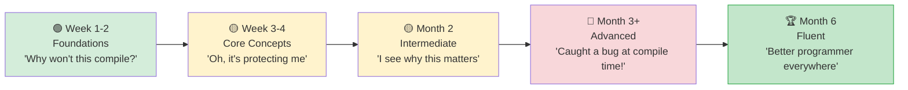

## Python 开发者的地道 Rust

> **你将学到什么：** 要养成的前 10 个习惯，常见陷阱及修复，结构化的 3 个月学习路径，
> 完整的 Python→Rust"罗塞塔石碑"参考表，以及推荐的学习资源。
>
> **难度：** 🟡 中级



### 要养成的前 10 个习惯

1. **在 enum 上使用 `match` 而不是 `if isinstance()`**
   ```python
   # Python                              # Rust
   if isinstance(shape, Circle): ...     match shape { Shape::Circle(r) => ... }
   ```

2. **让编译器指导你** —— 仔细阅读错误消息。Rust 编译器是任何语言中最好的。它告诉你哪里错了以及如何修复。

3. **函数参数中优先使用 `&str` 而不是 `String`** —— 接受最通用的类型。`&str` 适用于 `String` 和字符串字面量。

4. **使用迭代器而不是索引循环** —— 迭代器链比 `for i in 0..vec.len()` 更地道且通常更快。

5. **拥抱 `Option` 和 `Result`** —— 不要对所有东西都用 `.unwrap()`。使用 `?`、`map`、`and_then`、`unwrap_or_else`。

6. **自由地 derive traits** —— `#[derive(Debug, Clone, PartialEq)]` 应该在大多数结构体上。这是免费的，让测试更容易。

7. **严格使用 `cargo clippy`** —— 它捕获数百个风格和正确性问题。把它当作 Rust 的 `ruff`。

8. **不要与借用检查器对抗** —— 如果你在与它对抗，你可能数据结构错了。重构以使所有权清晰。

9. **使用 enum 表示状态机** —— 不要使用字符串标志或布尔值，使用 enum。编译器确保你处理每个状态。

10. **先 Clone，后优化** —— 学习时，自由使用 `.clone()` 避免所有权复杂性。只在性能分析显示需要时才优化。

### Python 开发者的常见错误

| 错误 | 原因 | 修复 |
|---------|-----|-----|
| `.unwrap()` 到处用 | 运行时 panic | 使用 `?` 或 `match` |
| 使用 String 而不是 &str | 不必要的分配 | 参数使用 `&str` |
| `for i in 0..vec.len()` | 不地道 | `for item in &vec` |
| 忽略 clippy 警告 | 错过简单改进 | `cargo clippy` |
| 过多 `.clone()` 调用 | 性能开销 | 重构所有权 |
| 巨大的 main() 函数 | 难以测试 | 提取到 lib.rs |
| 不使用 `#[derive()]` | 重复造轮子 | Derive 常见 traits |
| 错误时 panic | 不可恢复 | 返回 `Result<T, E>` |

***

## 性能对比

### 基准测试：常见操作
```text
操作                   Python 3.12    Rust (release)    加速
─────────────────────  ────────────   ──────────────    ─────────
Fibonacci(40)          ~25s           ~0.3s             ~80x
Sort 10M integers      ~5.2s          ~0.6s             ~9x
JSON parse 100MB       ~8.5s          ~0.4s             ~21x
Regex 1M matches       ~3.1s          ~0.3s             ~10x
HTTP server (req/s)    ~5,000         ~150,000          ~30x
SHA-256 1GB file       ~12s           ~1.2s             ~10x
CSV parse 1M rows      ~4.5s          ~0.2s             ~22x
String concatenation   ~2.1s          ~0.05s            ~42x
```

> **注意**：使用 C 扩展的 Python（NumPy 等）显著缩小了数值工作的差距。这些基准测试比较的是纯 Python vs 纯 Rust。

### 内存使用
```text
Python:                                 Rust:
─────────                               ─────
- 对象头：28 字节/对象                 - 无对象头
- int：28 字节（即使是 0）             - i32：4 字节，i64：8 字节
- str "hello"：54 字节                 - &str "hello"：16 字节（指针 + 长度）
- 1000 个 int 的 list：~36 KB          - Vec<i32>：~4 KB
  (8 KB 指针 + 28 KB int 对象)
- 100 个项目的 dict：~5.5 KB           - 100 个项目的 HashMap：~2.4 KB

典型应用的总内存：
- Python：50-200 MB 基线              - Rust：1-5 MB 基线
```

***

## 常见陷阱和解决方案

### 陷阱 1："借用检查器不让我这样做"
```rust
// 问题：尝试迭代和修改
let mut items = vec![1, 2, 3, 4, 5];
// for item in &items {
//     if *item > 3 { items.push(*item * 2); }  // ❌ 借用时不能可变借用
// }

// 解决方案 1：收集更改，之后应用
let additions: Vec<i32> = items.iter()
    .filter(|&&x| x > 3)
    .map(|&x| x * 2)
    .collect();
items.extend(additions);

// 解决方案 2：使用 retain/extend
items.retain(|&x| x <= 3);
```

### 陷阱 2："太多字符串类型"
```rust
// 不确定时：
// - 函数参数使用 &str
// - 结构体字段和返回值使用 String
// - &str 字面量（"hello"）在任何需要 &str 的地方都有效

fn process(input: &str) -> String {    // 接受 &str，返回 String
    format!("Processed: {}", input)
}
```

### 陷阱 3："我想念 Python 的简单性"
```rust
// Python 一行：
// result = [x**2 for x in data if x > 0]

// Rust 等价物：
let result: Vec<i32> = data.iter()
    .filter(|&&x| x > 0)
    .map(|&x| x * x)
    .collect();

// 它更冗长，但是：
// - 编译时类型安全
// - 快 10-100 倍
// - 不可能有运行时类型错误
// - 显式内存分配（.collect()）
```

### 陷阱 4："我的 REPL 在哪里？"
```rust
// Rust 没有 REPL。相反：
// 1. 使用 `cargo test` 作为你的 REPL —— 写小测试来尝试事情
// 2. 使用 Rust Playground (play.rust-lang.org) 进行快速实验
// 3. 使用 `dbg!()` 宏进行快速调试输出
// 4. 使用 `cargo watch -x test` 在保存时自动运行测试

#[test]
fn playground() {
    // 用它作为你的"REPL" —— 使用 `cargo test playground` 运行
    let result = "hello world"
        .split_whitespace()
        .map(|w| w.to_uppercase())
        .collect::<Vec<_>>();
    dbg!(&result);  // 打印：[src/main.rs:5] &result = ["HELLO", "WORLD"]
}
```

***

## 学习路径和资源

### 第 1-2 周：基础
- [ ] 安装 Rust，设置 VS Code 和 rust-analyzer
- [ ] 完成本指南的第 1-4 章（类型、控制流）
- [ ] 编写 5 个小程序，将 Python 脚本转换为 Rust
- [ ] 熟悉 `cargo build`、`cargo test`、`cargo clippy`

### 第 3-4 周：核心概念
- [ ] 完成第 5-8 章（结构体、enum、所有权、模块）
- [ ] 用 Rust 重写一个 Python 数据处理脚本
- [ ] 练习使用 `Option<T>` 和 `Result<T, E>` 直到自然
- [ ] 仔细阅读编译器错误消息 —— 它们在教你

### 第 2 个月：中级
- [ ] 完成第 9-12 章（错误处理、traits、迭代器）
- [ ] 用 `clap` 和 `serde` 构建一个 CLI 工具
- [ ] 为 Python 项目热点编写 PyO3 扩展
- [ ] 练习迭代器链直到感觉像推导式

### 第 3 个月：高级
- [ ] 完成第 13-16 章（并发、unsafe、测试）
- [ ] 用 `axum` 和 `tokio` 构建一个 Web 服务
- [ ] 为开源 Rust 项目贡献
- [ ] 阅读《Programming Rust》（O'Reilly）以获得更深入的理解

### 推荐资源
- **The Rust Book**: https://doc.rust-lang.org/book/（官方，优秀）
- **Rust by Example**: https://doc.rust-lang.org/rust-by-example/（在实践中学习）
- **Rustlings**: https://github.com/rust-lang/rustlings（练习）
- **Rust Playground**: https://play.rust-lang.org/（在线编译器）
- **This Week in Rust**: https://this-week-in-rust.org/（新闻通讯）
- **PyO3 Guide**: https://pyo3.rs/（Python ↔ Rust 桥接）
- **Comprehensive Rust** (Google): https://google.github.io/comprehensive-rust/

### Python → Rust 罗塞塔石碑

| Python | Rust | 章节 |
|--------|------|------|
| `list` | `Vec<T>` | 5 |
| `dict` | `HashMap<K,V>` | 5 |
| `set` | `HashSet<T>` | 5 |
| `tuple` | `(T1, T2, ...)` | 5 |
| `class` | `struct` + `impl` | 5 |
| `@dataclass` | `#[derive(...)]` | 5, 12a |
| `Enum` | `enum` | 6 |
| `None` | `Option<T>` | 6 |
| `raise`/`try`/`except` | `Result<T,E>` + `?` | 9 |
| `Protocol` (PEP 544) | `trait` | 10 |
| `TypeVar` | Generics `<T>` | 10 |
| `__dunder__` 方法 | Traits (Display, Add 等) | 10 |
| `lambda` | `\|args\| body` | 12 |
| generator `yield` | `impl Iterator` | 12 |
| list comprehension | `.map().filter().collect()` | 12 |
| `@decorator` | 高阶函数或宏 | 12a, 15 |
| `asyncio` | `tokio` | 13 |
| `threading` | `std::thread` | 13 |
| `multiprocessing` | `rayon` | 13 |
| `unittest.mock` | `mockall` | 14a |
| `pytest` | `cargo test` + `rstest` | 14a |
| `pip install` | `cargo add` | 8 |
| `requirements.txt` | `Cargo.lock` | 8 |
| `pyproject.toml` | `Cargo.toml` | 8 |
| `with` (context mgr) | 基于作用域的 `Drop` | 15 |
| `json.dumps/loads` | `serde_json` | 15 |

***

## Python 开发者的最终思考

```rust
你会怀念 Python 的地方：
- REPL 和交互式探索
- 快速原型速度
- 丰富的 ML/AI 生态系统（PyTorch 等）
- "just works"动态类型
- pip install 并立即使用

你从 Rust 中得到的：
- "如果编译通过，就能工作"的信心
- 10-100 倍性能提升
- 不再有运行时类型错误
- 不再有 None/null 崩溃
- 真正的并行（无 GIL！）
- 单一二进制部署
- 可预测的内存使用
- 任何语言中最好的编译器错误消息

旅程：
第 1 周："为什么编译器跟我过不去？"
第 2 周："哦，它实际上在保护我免受 bug 侵害"
第 1 个月："我明白为什么这很重要了"
第 2 个月："我在编译时捕获了一个本会成为生产事故的 bug"
第 3 个月："我不想回到无类型代码了"
第 6 个月："Rust 让我成为了每个语言中更好的程序员"
```

---

## 练习

<details>
<summary><strong>🏋️ 练习：代码审查清单</strong>（点击展开）</summary>

**挑战**：审查这段 Rust 代码（由 Python 开发者编写）并识别 5 个地道的改进：

```rust
fn get_name(names: Vec<String>, index: i32) -> String {
    if index >= 0 && (index as usize) < names.len() {
        return names[index as usize].clone();
    } else {
        return String::from("");
    }
}

fn main() {
    let mut result = String::from("");
    let names = vec!["Alice".to_string(), "Bob".to_string()];
    result = get_name(names.clone(), 0);
    println!("{}", result);
}
```

<details>
<summary>🔑 解决方案</summary>

五个改进：

```rust
// 1. 使用 &[String] 而不是 Vec<String>（不要获取整个 vec 的所有权）
// 2. 使用 usize 作为索引（不是 i32 —— 索引总是非负的）
// 3. 返回 Option<&str> 而不是空字符串（使用类型系统！）
// 4. 使用 .get() 而不是手动边界检查
// 5. 在 main 中不要 clone() —— 传递引用

fn get_name(names: &[String], index: usize) -> Option<&str> {
    names.get(index).map(|s| s.as_str())
}

fn main() {
    let names = vec!["Alice".to_string(), "Bob".to_string()];
    match get_name(&names, 0) {
        Some(name) => println!("{name}"),
        None => println!("Not found"),
    }
}
```

**关键要点**：Python 习惯在 Rust 中的问题：克隆一切（使用借用），使用哨兵值如 `""`（使用 `Option`），在借用足够时获取所有权，以及使用有符号整数作为索引。

</details>
</details>

***

*Python 程序员 Rust 培训指南 完*
