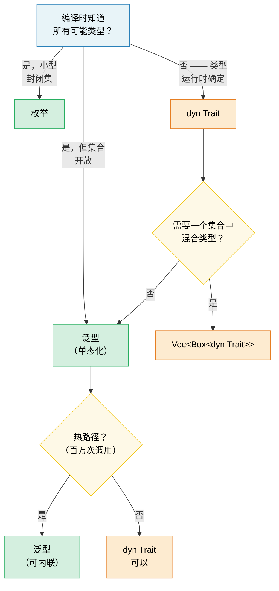

# 1. 泛型 —— 完整视图 🟢

> **你将学到什么：**
> - 单态化如何带来零成本泛型 —— 以及何时导致代码膨胀
> - 决策框架：泛型 vs 枚举 vs trait 对象
> - Const 泛型用于编译时数组大小，`const fn` 用于编译时求值
> - 何时在冷路径上用静态交换动态分发

## 单态化和零成本

Rust 中的泛型是**单态化**的 —— 编译器为每个泛型函数生成一个专门的副本，针对它使用的每个具体类型。这与 Java/C# 中的泛型在运行时被擦除相反。

```rust
fn max_of<T: PartialOrd>(a: T, b: T) -> T {
    if a >= b { a } else { b }
}

fn main() {
    max_of(3_i32, 5_i32);     // 编译器生成 max_of_i32
    max_of(2.0_f64, 7.0_f64); // 编译器生成 max_of_f64
    max_of("a", "z");         // 编译器生成 max_of_str
}
```

**编译器实际生成的内容**（概念上）：

```rust
// 三个独立的函数 —— 没有运行时分发，没有 vtable：
fn max_of_i32(a: i32, b: i32) -> i32 { if a >= b { a } else { b } }
fn max_of_f64(a: f64, b: f64) -> f64 { if a >= b { a } else { b } }
fn max_of_str<'a>(a: &'a str, b: &'a str) -> &'a str { if a >= b { a } else { b } }
```

> **为什么 `max_of_str` 需要 `<'a>` 而 `max_of_i32` 不需要？** `i32` 和 `f64`
> 是 `Copy` 类型 —— 函数返回一个所有权值。但 `&str` 是引用，
> 所以编译器必须知道返回引用的生命周期。`<'a>` 注解
> 表示"返回的 `&str` 至少和两个输入一样长"。

**优势**：零运行时成本 —— 与手写专用代码相同。优化器可以内联、向量化和独立专门化每个副本。

**与 C++ 比较**：Rust 泛型像 C++ 模板一样工作，但有一个关键区别 —— **边界检查发生在定义时，而不是实例化时**。在 C++ 中，模板只有在用特定类型使用时才编译，导致库代码深处出现晦涩的错误消息。在 Rust 中，`T: PartialOrd` 在定义函数时检查，所以错误早被发现且消息清晰。

```rust
// Rust：在定义处错误 —— "T 没有实现 Display"
fn broken<T>(val: T) {
    println!("{val}"); // ❌ 错误：T 没有实现 Display
}

// 修复：添加约束
fn fixed<T: std::fmt::Display>(val: T) {
    println!("{val}"); // ✅
}
```

### 泛型的代价：代码膨胀

单态化有成本 —— 二进制大小。每个独特的实例化重复函数体：

```rust
// 这个无害的函数...
fn serialize<T: serde::Serialize>(value: &T) -> Vec<u8> {
    serde_json::to_vec(value).unwrap()
}

// ...用于 50 个不同类型 → 二进制中 50 个副本。
```

**缓解策略**：

```rust
// 1. 提取非泛型核心（"outline" 模式）
fn serialize<T: serde::Serialize>(value: &T) -> Result<Vec<u8>, serde_json::Error> {
    // 泛型部分：只有序列化调用
    let json_value = serde_json::to_value(value)?;
    // 非泛型部分：提取到单独函数
    serialize_value(json_value)
}

fn serialize_value(value: serde_json::Value) -> Result<Vec<u8>, serde_json::Error> {
    // 这个函数在二进制中只存在一次
    serde_json::to_vec(&value)
}

// 2. 当内联不重要时使用 trait 对象（动态分发）
fn log_item(item: &dyn std::fmt::Display) {
    // 一个副本 —— 使用 vtable 分发
    println!("[LOG] {item}");
}
```

> **经验法则**：对内联重要的热路径使用泛型。
> 对 vtable 调用可忽略不计的冷路径（错误处理、日志、配置）
> 使用 `dyn Trait`。

### 泛型 vs 枚举 vs Trait 对象 —— 决策指南

Rust 中处理"不同类型，相同接口"的三种方式：

| 方法 | 分发 | 已知于 | 可扩展？ | 开销 |
|------|------|--------|---------|------|
| **泛型** (`impl Trait` / `<T: Trait>`) | 静态（单态化） | 编译时 | ✅（开放集） | 零 —— 内联 |
| **枚举** | Match 分支 | 编译时 | ❌（封闭集） | 零 —— 无 vtable |
| **Trait 对象** (`dyn Trait`) | 动态（vtable） | 运行时 | ✅（开放集） | Vtable 指针 + 间接调用 |

```rust
// --- 泛型：开放集，零成本，编译时 ---
fn process<H: Handler>(handler: H, request: Request) -> Response {
    handler.handle(request) // 单态化 —— 每个 H 一个副本
}

// --- 枚举：封闭集，零成本，穷尽匹配 ---
enum Shape {
    Circle(f64),
    Rect(f64, f64),
    Triangle(f64, f64, f64),
}

impl Shape {
    fn area(&self) -> f64 {
        match self {
            Shape::Circle(r) => std::f64::consts::PI * r * r,
            Shape::Rect(w, h) => w * h,
            Shape::Triangle(a, b, c) => {
                let s = (a + b + c) / 2.0;
                (s * (s - a) * (s - b) * (s - c)).sqrt()
            }
        }
    }
}
// 添加新变体强制更新所有 match 分支 —— 编译器
// 强制执行穷尽性。适合"我控制所有变体"。

// --- TRAIT 对象：开放集，运行时成本，可扩展 ---
fn log_all(items: &[Box<dyn std::fmt::Display>]) {
    for item in items {
        println!("{item}"); // vtable 分发
    }
}
```

**决策流程图**：



### Const 泛型

从 Rust 1.51 开始，你可以在*常量值*（而不仅是类型）上参数化类型和函数：

```rust
// 数组包装器，以大小为参数
struct Matrix<const ROWS: usize, const COLS: usize> {
    data: [[f64; COLS]; ROWS],
}

impl<const ROWS: usize, const COLS: usize> Matrix<ROWS, COLS> {
    fn new() -> Self {
        Matrix { data: [[0.0; COLS]; ROWS] }
    }

    fn transpose(&self) -> Matrix<COLS, ROWS> {
        let mut result = Matrix::<COLS, ROWS>::new();
        for r in 0..ROWS {
            for c in 0..COLS {
                result.data[c][r] = self.data[r][c];
            }
        }
        result
    }
}

// 编译器执行维度正确性检查：
fn multiply<const M: usize, const N: usize, const P: usize>(
    a: &Matrix<M, N>,
    b: &Matrix<N, P>, // N 必须匹配！
) -> Matrix<M, P> {
    let mut result = Matrix::<M, P>::new();
    for i in 0..M {
        for j in 0..P {
            for k in 0..N {
                result.data[i][j] += a.data[i][k] * b.data[k][j];
            }
        }
    }
    result
}

// 用法：
let a = Matrix::<2, 3>::new(); // 2×3
let b = Matrix::<3, 4>::new(); // 3×4
let c = multiply(&a, &b);      // 2×4 ✅

// let d = Matrix::<5, 5>::new();
// multiply(&a, &d); // ❌ 编译错误：期望 Matrix<3, _>，得到 Matrix<5, 5>
```

> **C++ 比较**：这类似于 C++ 中的 `template<int N>`，但 Rust
> const 泛型是急切类型检查的，不受 SFINAE 复杂性影响。

### Const 函数 (const fn)

`const fn` 标记一个函数可在编译时求值 —— Rust 的 C++ `constexpr` 等价物。结果可用于 `const` 和 `static` 上下文：

```rust
// 基础 const fn —— 在 const 上下文中编译时求值
const fn celsius_to_fahrenheit(c: f64) -> f64 {
    c * 9.0 / 5.0 + 32.0
}

const BOILING_F: f64 = celsius_to_fahrenheit(100.0); // 编译时计算
const FREEZING_F: f64 = celsius_to_fahrenheit(0.0);  // 32.0

// Const 构造函数 —— 创建 statics 无需 lazy_static!
struct BitMask(u32);

impl BitMask {
    const fn new(bit: u32) -> Self {
        BitMask(1 << bit)
    }

    const fn or(self, other: BitMask) -> Self {
        BitMask(self.0 | other.0)
    }

    const fn contains(&self, bit: u32) -> bool {
        self.0 & (1 << bit) != 0
    }
}

// 静态查找表 —— 无运行时成本，无惰性初始化
const GPIO_INPUT:  BitMask = BitMask::new(0);
const GPIO_OUTPUT: BitMask = BitMask::new(1);
const GPIO_IRQ:    BitMask = BitMask::new(2);
const GPIO_IO:     BitMask = GPIO_INPUT.or(GPIO_OUTPUT);

// 寄存器映射作为 const 数组：
const SENSOR_THRESHOLDS: [u16; 4] = {
    let mut table = [0u16; 4];
    table[0] = 50;   // 警告
    table[1] = 70;   // 高
    table[2] = 85;   // 关键
    table[3] = 100;  // 关闭
    table
};
// 整个表存在于二进制中 —— 无堆，无运行时初始化。
```

**你可以在 `const fn` 中做什么**（从 Rust 1.79+ 起）：
- 算术、位操作、比较
- `if`/`else`、`match`、`loop`、`while`（控制流）
- 创建和修改局部变量（`let mut`）
- 调用其他 `const fn`s
- 引用（`&`、`&mut` —— 在 const 上下文内）
- `panic!()`（如果在编译时触发则成为编译错误）
- 基础浮点算术（`+`、`-`、`*`、`/`；复杂操作如 `sqrt`/`sin` 不符合 const 条件）

**你不能做什么**（还）：
- 堆分配（`Box`、`Vec`、`String`）
- Trait 方法调用（只有固有方法）
- I/O 或副作用

```rust
// const fn 带 panic —— 成为编译时错误：
const fn checked_div(a: u32, b: u32) -> u32 {
    if b == 0 {
        panic!("division by zero"); // 如果 b 在 const 时为 0 则编译错误
    }
    a / b
}

const RESULT: u32 = checked_div(100, 4);  // ✅ 25
// const BAD: u32 = checked_div(100, 0);  // ❌ 编译错误："division by zero"
```

> **C++ 比较**：`const fn` 是 Rust 的 `constexpr`。关键区别：
> Rust 的版本是选择加入的，编译器严格验证只使用
> const 兼容操作。在 C++ 中，`constexpr` 函数可以
> 静默回退到运行时求值 —— 在 Rust 中，`const` 上下文
> *需要*编译时求值，否则是硬错误。

> **实践建议**：尽可能使构造函数和简单工具函数成为 `const fn` —— 它零成本且允许调用者在 const 上下文中使用它们。对于硬件诊断代码，`const fn` 是寄存器定义、位掩码构造和阈值表的理想选择。

> **关键要点 —— 泛型**
> - 单态化带来零成本抽象但可能导致代码膨胀 —— 对冷路径使用 `dyn Trait`
> - Const 泛型（`[T; N]`）用编译时检查的数组大小替代 C++ 模板技巧
> - `const fn` 消除 `lazy_static!` 用于编译时可计算值

> **另见：**[第 2 章 — Traits 深入探讨](ch02-traits-in-depth.md) 了解 trait 约束、关联类型和 trait 对象。[第 4 章 — PhantomData](ch04-phantomdata-types-that-carry-no-data.md) 了解零大小泛型标记。

---

### 练习：带驱逐的泛型缓存 ★★（约 30 分钟）

构建一个泛型 `Cache<K, V>` 结构体，存储键值对，具有可配置的最大容量。满时，最旧的条目被驱逐（FIFO）。要求：

- `fn new(capacity: usize) -> Self`
- `fn insert(&mut self, key: K, value: V)` —— 达到容量时驱逐最旧的
- `fn get(&self, key: &K) -> Option<&V>`
- `fn len(&self) -> usize`
- 约束 `K: Eq + Hash + Clone`

<details>
<summary>🔑 答案</summary>

```rust
use std::collections::{HashMap, VecDeque};
use std::hash::Hash;

struct Cache<K, V> {
    map: HashMap<K, V>,
    order: VecDeque<K>,
    capacity: usize,
}

impl<K: Eq + Hash + Clone, V> Cache<K, V> {
    fn new(capacity: usize) -> Self {
        Cache {
            map: HashMap::with_capacity(capacity),
            order: VecDeque::with_capacity(capacity),
            capacity,
        }
    }

    fn insert(&mut self, key: K, value: V) {
        if self.map.contains_key(&key) {
            self.map.insert(key, value);
            return;
        }
        if self.map.len() >= self.capacity {
            if let Some(oldest) = self.order.pop_front() {
                self.map.remove(&oldest);
            }
        }
        self.order.push_back(key.clone());
        self.map.insert(key, value);
    }

    fn get(&self, key: &K) -> Option<&V> {
        self.map.get(key)
    }

    fn len(&self) -> usize {
        self.map.len()
    }
}

fn main() {
    let mut cache = Cache::new(3);
    cache.insert("a", 1);
    cache.insert("b", 2);
    cache.insert("c", 3);
    assert_eq!(cache.len(), 3);

    cache.insert("d", 4); // 驱逐"a"
    assert_eq!(cache.get(&"a"), None);
    assert_eq!(cache.get(&"d"), Some(&4));
    println!("Cache works! len = {}", cache.len());
}
```

</details>

***
