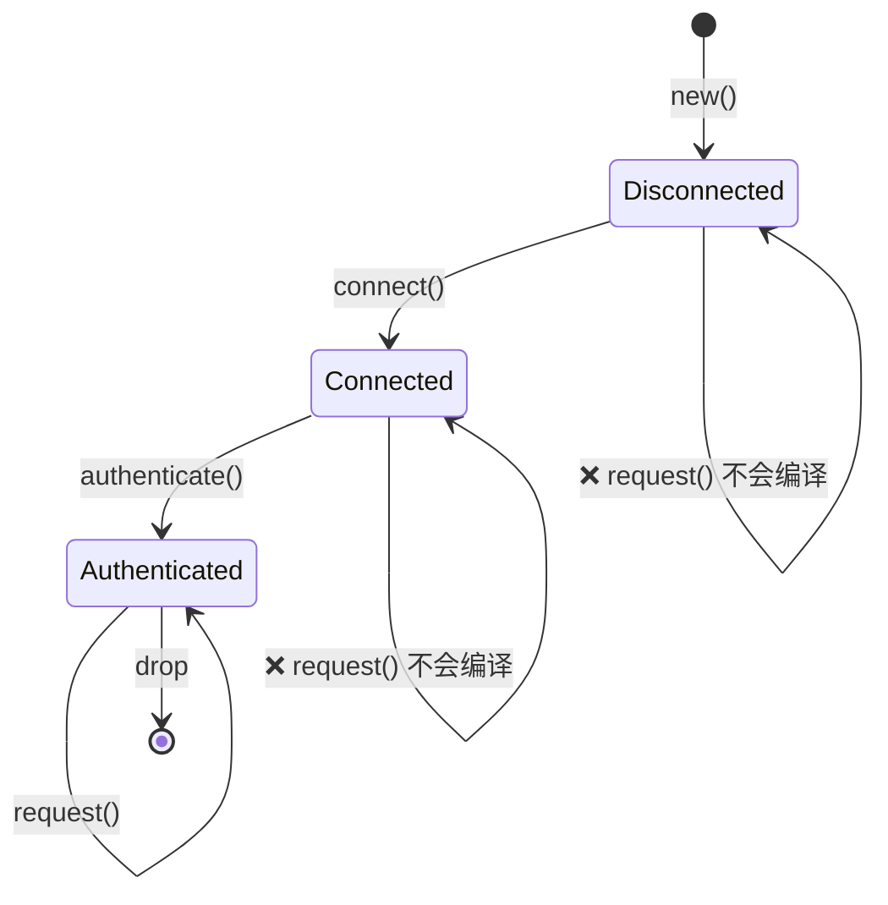
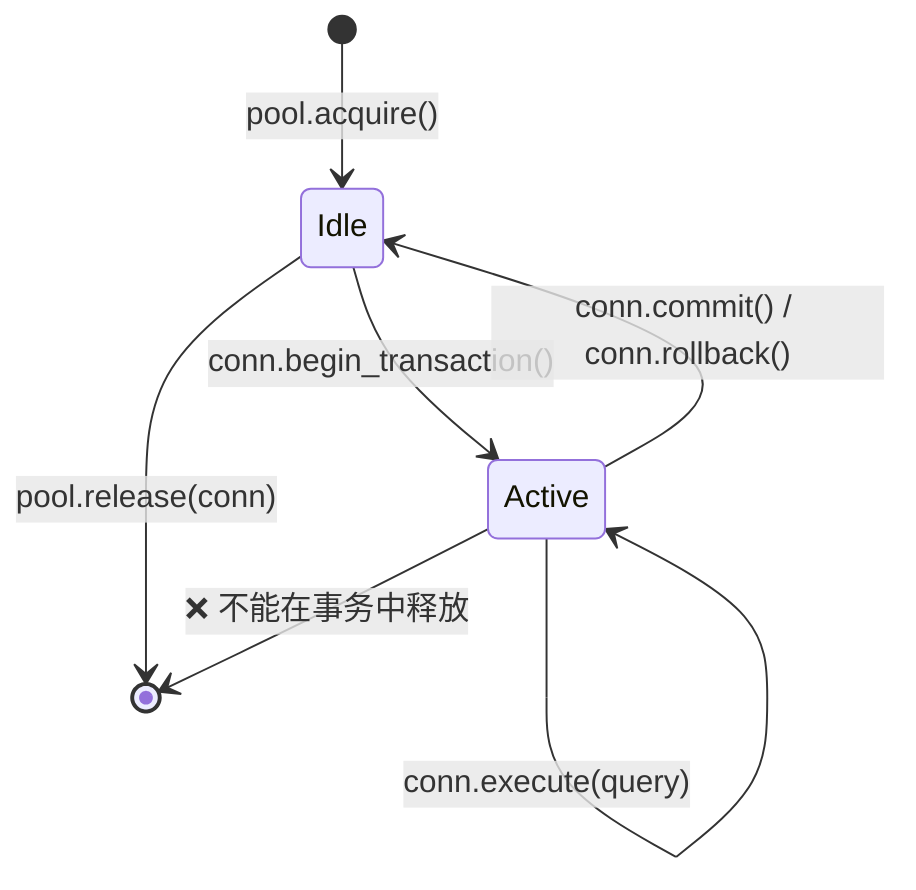
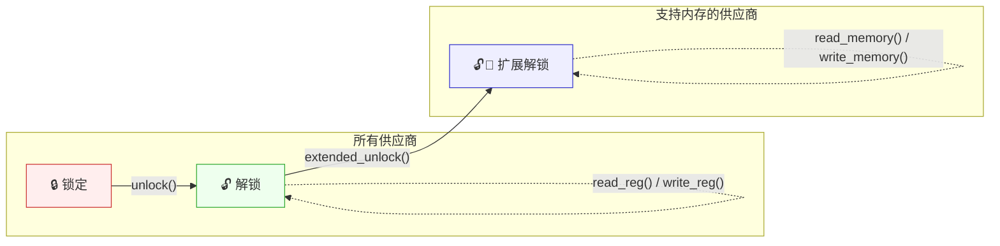
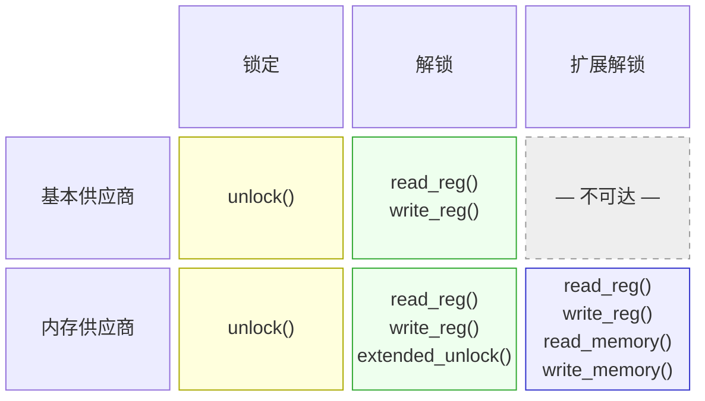

# 3. Newtype 和类型状态模式 🟡

> **你将学到什么：**
> - Newtype 模式用于零成本编译时类型安全
> - 类型状态模式：使非法状态转换不可表示
> - 带类型状态的 builder 模式用于编译时强制构造
> - Config trait 模式用于驯服泛型参数爆炸

## Newtype：零成本类型安全

newtype 模式将现有类型包装在单个字段的元组结构体中，创建一个独特的类型，零运行时开销：

```rust
// 没有 newtype —— 容易搞混：
fn create_user(name: String, email: String, age: u32, employee_id: u32) { }
// create_user(name, email, age, id);  —— 但如果我们交换 age 和 id 呢？
// create_user(name, email, id, age);  —— 编译通过，BUG

// 使用 newtype —— 编译器捕获错误：
struct UserName(String);
struct Email(String);
struct Age(u32);
struct EmployeeId(u32);

fn create_user(name: UserName, email: Email, age: Age, id: EmployeeId) { }
// create_user(name, email, EmployeeId(42), Age(30));
// ❌ 编译错误：期望 Age，得到 EmployeeId
```

### `impl Deref` 用于 Newtypes —— 能力与陷阱

在 newtype 上实现 `Deref` 让它自动转换为内部类型的引用，"免费"获得内部类型的所有方法：

```rust
use std::ops::Deref;

struct Email(String);

impl Email {
    fn new(raw: &str) -> Result<Self, &'static str> {
        if raw.contains('@') {
            Ok(Email(raw.to_string()))
        } else {
            Err("invalid email: missing @")
        }
    }
}

impl Deref for Email {
    type Target = str;
    fn deref(&self) -> &str { &self.0 }
}

// 现在 Email 自动解引用到 &str：
let email = Email::new("user@example.com").unwrap();
println!("Length: {}", email.len()); // 通过 Deref 使用 str::len
```

这很方便 —— 但它实际上**在你的 newtype 抽象边界上打了一个洞**，因为目标类型的*每个*方法都可以在你的包装器上调用。

#### 何时 `Deref` 是合适的

| 场景 | 示例 | 为什么可以 |
|------|------|-----------|
| 智能指针包装器 | `Box<T>`、`Arc<T>`、`MutexGuard<T>` | 包装器的目的完全像 `T` 一样行为 |
| 透明"薄"包装器 | `String` → `str`、`PathBuf` → `Path`、`Vec<T>` → `[T]` | 包装器 IS-A 目标类型的超集 |
| 你的 newtype 真正就是内部类型 | `struct Hostname(String)` 你总是想要完整字符串操作 | 限制 API 不会增加价值 |

#### 何时 `Deref` 是反模式

| 场景 | 问题 |
|------|------|
| **有不变量的领域类型** | `Email` 解引用到 `&str`，所以调用者可以调用 `.split_at()`、`.trim()` 等 —— 都不保持"必须包含 @"不变量。如果有人存储修剪的 `&str` 并重构，不变量丢失。 |
| **你想要受限 API 的类型** | `struct Password(String)` 带 `Deref<Target = str>` 泄漏 `.as_bytes()`、`.chars()`、`Debug` 输出 —— 正是你试图隐藏的。 |
| **假继承** | 使用 `Deref` 让 `ManagerWidget` 自动解引用到 `Widget` 模拟 OOP 继承。这被明确不鼓励 —— 参见 Rust API 指南 (C-DEREF)。 |

> **经验法则**：如果你的 newtype 存在是为了*添加类型安全*或*限制 API*，不要实现 `Deref`。如果它存在是为了*添加能力*同时保持内部类型的完整表面（如智能指针），`Deref` 是正确的选择。

#### `DerefMut` —— 双倍风险

如果你也实现 `DerefMut`，调用者可以直接*可变*内部值，绕过构造函数中的任何验证：

```rust
use std::ops::{Deref, DerefMut};

struct PortNumber(u16);

impl Deref for PortNumber {
    type Target = u16;
    fn deref(&self) -> &u16 { &self.0 }
}

impl DerefMut for PortNumber {
    fn deref_mut(&mut self) -> &mut u16 { &mut self.0 }
}

let mut port = PortNumber(443);
*port = 0; // 绕过任何验证 —— 现在是无效端口
```

仅当内部类型没有要保护的不变量时才实现 `DerefMut`。

#### 优先显式委托

当你只想要内部类型的*一些*方法时，显式委托：

```rust
struct Email(String);

impl Email {
    fn new(raw: &str) -> Result<Self, &'static str> {
        if raw.contains('@') { Ok(Email(raw.to_string())) }
        else { Err("missing @") }
    }

    // 只暴露有意义的：
    pub fn as_str(&self) -> &str { &self.0 }
    pub fn len(&self) -> usize { self.0.len() }
    pub fn domain(&self) -> &str {
        self.0.split('@').nth(1).unwrap_or("")
    }
    // .split_at()、.trim()、.replace() —— 不暴露
}
```

#### Clippy 和生态系统

- **`clippy::wrong_self_convention`** 可以在 `Deref` 转换
  使方法解析意外时触发（例如 `is_empty()` 解析到内部类型的版本
  而不是你打算覆盖的）。
- **Rust API 指南** (C-DEREF) 说明：*"只有智能指针
  应该实现 `Deref`。"* 将此作为强默认；只有在有明确理由时才偏离。
- 如果你需要 trait 兼容性（例如传递 `Email` 给期望 `&str` 的函数），
  考虑实现 `AsRef<str>` 和 `Borrow<str>` 而不是 —— 它们是显式转换，
  无自动转换意外。

#### 决策矩阵

```text
你想要内部类型的所有方法都可调用吗？
  ├─ 是 → 你的类型执行不变量或限制 API 吗？
  │    ├─ 否  → impl Deref ✅  （智能指针/透明包装器）
  │    └─ 是 → 不要 impl Deref ❌（不变量泄漏）
  └─ 否  → 不要 impl Deref ❌  （使用 AsRef / 显式委托）
```

### 类型状态：编译时协议强制

类型状态模式使用类型系统强制操作以正确顺序发生。无效状态变得**不可表示**。



> 每个转换*消费* `self` 并返回一个新类型 —— 编译器强制有效顺序。

```rust
// 问题：一个网络连接必须：
// 1. 创建
// 2. 连接
// 3. 认证
// 4. 然后用于请求
// 在认证前调用 request() 应该是编译错误。

// --- 类型状态标记（零大小类型） ---
struct Disconnected;
struct Connected;
struct Authenticated;

// --- 按状态参数化的连接 ---
struct Connection<State> {
    address: String,
    _state: std::marker::PhantomData<State>,
}

// 只有 Disconnected 连接可以连接：
impl Connection<Disconnected> {
    fn new(address: &str) -> Self {
        Connection {
            address: address.to_string(),
            _state: std::marker::PhantomData,
        }
    }

    fn connect(self) -> Connection<Connected> {
        println!("Connecting to {}...", self.address);
        Connection {
            address: self.address,
            _state: std::marker::PhantomData,
        }
    }
}

// 只有 Connected 连接可以认证：
impl Connection<Connected> {
    fn authenticate(self, _token: &str) -> Connection<Authenticated> {
        println!("Authenticating...");
        Connection {
            address: self.address,
            _state: std::marker::PhantomData,
        }
    }
}

// 只有 Authenticated 连接可以发起请求：
impl Connection<Authenticated> {
    fn request(&self, path: &str) -> String {
        format!("GET {} from {}", path, self.address)
    }
}

fn main() {
    let conn = Connection::new("api.example.com");
    // conn.request("/data"); // ❌ 编译错误：Connection<Disconnected> 上没有方法 `request`

    let conn = conn.connect();
    // conn.request("/data"); // ❌ 编译错误：Connection<Connected> 上没有方法 `request`

    let conn = conn.authenticate("secret-token");
    let response = conn.request("/data"); // ✅ 只在认证后工作
    println!("{response}");
}
```

> **关键见解**：每个状态转换*消费* `self` 并返回一个新类型。
> 转换后不能使用旧状态 —— 编译器强制它。
> 零运行时成本 —— `PhantomData` 是零大小的，状态在编译时擦除。

**与 C++/C# 比较**：在 C++ 或 C# 中，你会用运行时检查强制这个（`if (!authenticated) throw ...`）。Rust 类型状态模式将这些检查移到编译时 —— 无效状态在类型系统中字面上不可表示。

### 带类型状态的 Builder 模式

一个实际应用 —— 一个强制执行必填字段的 builder：

```rust
use std::marker::PhantomData;

// 必填字段的标记类型
struct NeedsName;
struct NeedsPort;
struct Ready;

struct ServerConfig<State> {
    name: Option<String>,
    port: Option<u16>,
    max_connections: usize, // 可选，有默认值
    _state: PhantomData<State>,
}

impl ServerConfig<NeedsName> {
    fn new() -> Self {
        ServerConfig {
            name: None,
            port: None,
            max_connections: 100,
            _state: PhantomData,
        }
    }

    fn name(self, name: &str) -> ServerConfig<NeedsPort> {
        ServerConfig {
            name: Some(name.to_string()),
            port: self.port,
            max_connections: self.max_connections,
            _state: PhantomData,
        }
    }
}

impl ServerConfig<NeedsPort> {
    fn port(self, port: u16) -> ServerConfig<Ready> {
        ServerConfig {
            name: self.name,
            port: Some(port),
            max_connections: self.max_connections,
            _state: PhantomData,
        }
    }
}

impl ServerConfig<Ready> {
    fn max_connections(mut self, n: usize) -> Self {
        self.max_connections = n;
        self
    }

    fn build(self) -> Server {
        Server {
            name: self.name.unwrap(),
            port: self.port.unwrap(),
            max_connections: self.max_connections,
        }
    }
}

struct Server {
    name: String,
    port: u16,
    max_connections: usize,
}

fn main() {
    // 必须提供名称，然后端口，然后可以构建：
    let server = ServerConfig::new()
        .name("my-server")
        .port(8080)
        .max_connections(500)
        .build();

    // ServerConfig::new().port(8080); // ❌ 编译错误：NeedsName 上没有方法 `port`
    // ServerConfig::new().name("x").build(); // ❌ 编译错误：NeedsPort 上没有方法 `build`
}
```

***

## 案例研究：类型安全的连接池

真实世界的系统需要连接池，其中连接通过定义良好的状态移动。这是类型状态模式如何在生产池中强制正确性：



```rust
use std::marker::PhantomData;

// 状态
struct Idle;
struct InTransaction;

struct PooledConnection<State> {
    id: u32,
    _state: PhantomData<State>,
}

struct Pool {
    next_id: u32,
}

impl Pool {
    fn new() -> Self { Pool { next_id: 0 } }

    fn acquire(&mut self) -> PooledConnection<Idle> {
        self.next_id += 1;
        println!("[pool] Acquired connection #{}", self.next_id);
        PooledConnection { id: self.next_id, _state: PhantomData }
    }

    // 只有空闲连接可以释放 —— 防止事务中泄漏
    fn release(&self, conn: PooledConnection<Idle>) {
        println!("[pool] Released connection #{}", conn.id);
    }
}

impl PooledConnection<Idle> {
    fn begin_transaction(self) -> PooledConnection<InTransaction> {
        println!("[conn #{}] BEGIN", self.id);
        PooledConnection { id: self.id, _state: PhantomData }
    }
}

impl PooledConnection<InTransaction> {
    fn execute(&self, query: &str) {
        println!("[conn #{}] EXEC: {}", self.id, query);
    }

    fn commit(self) -> PooledConnection<Idle> {
        println!("[conn #{}] COMMIT", self.id);
        PooledConnection { id: self.id, _state: PhantomData }
    }

    fn rollback(self) -> PooledConnection<Idle> {
        println!("[conn #{}] ROLLBACK", self.id);
        PooledConnection { id: self.id, _state: PhantomData }
    }
}

fn main() {
    let mut pool = Pool::new();

    let conn = pool.acquire();
    let conn = conn.begin_transaction();
    conn.execute("INSERT INTO users VALUES ('Alice')");
    conn.execute("INSERT INTO orders VALUES (1, 42)");
    let conn = conn.commit(); // 回到 Idle
    pool.release(conn);       // ✅ 只在空闲连接上工作

    // pool.release(conn_active); // ❌ 编译错误：不能释放 InTransaction
}
```

**为什么这在生产中重要**：事务中泄漏的连接无限期持有数据库锁。类型状态模式使这不可能 —— 你字面上不能返回连接到池直到事务提交或回滚。

***

## Config Trait 模式 —— 驯服泛型参数爆炸

### 问题

当结构体承担更多责任时，每个由 trait 约束的泛型支持，类型签名变得笨重：

```rust
trait SpiBus   { fn spi_transfer(&self, tx: &[u8], rx: &mut [u8]) -> Result<(), BusError>; }
trait ComPort  { fn com_send(&self, data: &[u8]) -> Result<usize, BusError>; }
trait I3cBus   { fn i3c_read(&self, addr: u8, buf: &mut [u8]) -> Result<(), BusError>; }
trait SmBus    { fn smbus_read_byte(&self, addr: u8, cmd: u8) -> Result<u8, BusError>; }
trait GpioBus  { fn gpio_set(&self, pin: u32, high: bool); }

// ❌ 每个新总线 trait 添加另一个泛型参数
struct DiagController<S: SpiBus, C: ComPort, I: I3cBus, M: SmBus, G: GpioBus> {
    spi: S,
    com: C,
    i3c: I,
    smbus: M,
    gpio: G,
}
// impl 块、函数签名和调用者都重复完整列表。
// 添加第 6 个总线意味着编辑 DiagController<S, C, I, M, G> 的每个提及。
```

这通常被称为**"泛型参数爆炸。"**它在 `impl` 块、函数参数和下游消费者中复合 —— 每个都必须重复完整参数列表。

### 解决方案：Config Trait

将所有关联类型打包到一个 trait 中。结构体然后有**一个**泛型参数，无论它包含多少组件类型：

```rust
#[derive(Debug)]
enum BusError {
    Timeout,
    NakReceived,
    HardwareFault(String),
}

// --- 总线 traits（不变） ---
trait SpiBus {
    fn spi_transfer(&self, tx: &[u8], rx: &mut [u8]) -> Result<(), BusError>;
    fn spi_write(&self, data: &[u8]) -> Result<(), BusError>;
}

trait ComPort {
    fn com_send(&self, data: &[u8]) -> Result<usize, BusError>;
    fn com_recv(&self, buf: &mut [u8], timeout_ms: u32) -> Result<usize, BusError>;
}

trait I3cBus {
    fn i3c_read(&self, addr: u8, buf: &mut [u8]) -> Result<(), BusError>;
    fn i3c_write(&self, addr: u8, data: &[u8]) -> Result<(), BusError>;
}

// --- Config trait：每个组件一个关联类型 ---
trait BoardConfig {
    type Spi: SpiBus;
    type Com: ComPort;
    type I3c: I3cBus;
}

// --- DiagController 恰好有一个泛型参数 ---
struct DiagController<Cfg: BoardConfig> {
    spi: Cfg::Spi,
    com: Cfg::Com,
    i3c: Cfg::I3c,
}
```

`DiagController<Cfg>` 永远不会获得另一个泛型参数。
添加第 4 个总线意味着添加一个关联类型到 `BoardConfig` 和一个字段到 `DiagController` —— 无下游签名更改。

### 实现控制器

```rust
impl<Cfg: BoardConfig> DiagController<Cfg> {
    fn new(spi: Cfg::Spi, com: Cfg::Com, i3c: Cfg::I3c) -> Self {
        DiagController { spi, com, i3c }
    }

    fn read_flash_id(&self) -> Result<u32, BusError> {
        let cmd = [0x9F]; // JEDEC Read ID
        let mut id = [0u8; 4];
        self.spi.spi_transfer(&cmd, &mut id)?;
        Ok(u32::from_be_bytes(id))
    }

    fn send_bmc_command(&self, cmd: &[u8]) -> Result<Vec<u8>, BusError> {
        self.com.com_send(cmd)?;
        let mut resp = vec![0u8; 256];
        let n = self.com.com_recv(&mut resp, 1000)?;
        resp.truncate(n);
        Ok(resp)
    }

    fn read_sensor_temp(&self, sensor_addr: u8) -> Result<i16, BusError> {
        let mut buf = [0u8; 2];
        self.i3c.i3c_read(sensor_addr, &mut buf)?;
        Ok(i16::from_be_bytes(buf))
    }

    fn run_full_diag(&self) -> Result<DiagReport, BusError> {
        let flash_id = self.read_flash_id()?;
        let bmc_resp = self.send_bmc_command(b"VERSION\n")?;
        let cpu_temp = self.read_sensor_temp(0x48)?;
        let gpu_temp = self.read_sensor_temp(0x49)?;

        Ok(DiagReport {
            flash_id,
            bmc_version: String::from_utf8_lossy(&bmc_resp).to_string(),
            cpu_temp_c: cpu_temp,
            gpu_temp_c: gpu_temp,
        })
    }
}

#[derive(Debug)]
struct DiagReport {
    flash_id: u32,
    bmc_version: String,
    cpu_temp_c: i16,
    gpu_temp_c: i16,
}
```

### 生产连接

一个 `impl BoardConfig` 选择具体硬件驱动：

```rust
struct PlatformSpi  { dev: String, speed_hz: u32 }
struct UartCom      { dev: String, baud: u32 }
struct LinuxI3c     { dev: String }

impl SpiBus for PlatformSpi {
    fn spi_transfer(&self, tx: &[u8], rx: &mut [u8]) -> Result<(), BusError> {
        // ioctl(SPI_IOC_MESSAGE) 在生产中
        rx[0..4].copy_from_slice(&[0xEF, 0x40, 0x18, 0x00]);
        Ok(())
    }
    fn spi_write(&self, _data: &[u8]) -> Result<(), BusError> { Ok(()) }
}

impl ComPort for UartCom {
    fn com_send(&self, _data: &[u8]) -> Result<usize, BusError> { Ok(0) }
    fn com_recv(&self, buf: &mut [u8], _timeout: u32) -> Result<usize, BusError> {
        let resp = b"BMC v2.4.1\n";
        buf[..resp.len()].copy_from_slice(resp);
        Ok(resp.len())
    }
}

impl I3cBus for LinuxI3c {
    fn i3c_read(&self, _addr: u8, buf: &mut [u8]) -> Result<(), BusError> {
        buf[0] = 0x00; buf[1] = 0x2D; // 45°C
        Ok(())
    }
    fn i3c_write(&self, _addr: u8, _data: &[u8]) -> Result<(), BusError> { Ok(()) }
}

// ✅ 一个结构体，一个 impl —— 所有具体类型在这里解析
struct ProductionBoard;
impl BoardConfig for ProductionBoard {
    type Spi = PlatformSpi;
    type Com = UartCom;
    type I3c = LinuxI3c;
}

fn main() {
    let ctrl = DiagController::<ProductionBoard>::new(
        PlatformSpi { dev: "/dev/spidev0.0".into(), speed_hz: 10_000_000 },
        UartCom     { dev: "/dev/ttyS0".into(),     baud: 115200 },
        LinuxI3c    { dev: "/dev/i3c-0".into() },
    );
    let report = ctrl.run_full_diag().unwrap();
    println!("{report:#?}");
}
```

### 测试 Mock 连接

通过定义不同的 `BoardConfig` 交换整个硬件层：

```rust
struct MockSpi  { flash_id: [u8; 4] }
struct MockCom  { response: Vec<u8> }
struct MockI3c  { temps: std::collections::HashMap<u8, i16> }

impl SpiBus for MockSpi {
    fn spi_transfer(&self, _tx: &[u8], rx: &mut [u8]) -> Result<(), BusError> {
        rx[..4].copy_from_slice(&self.flash_id);
        Ok(())
    }
    fn spi_write(&self, _data: &[u8]) -> Result<(), BusError> { Ok(()) }
}

impl ComPort for MockCom {
    fn com_send(&self, _data: &[u8]) -> Result<usize, BusError> { Ok(0) }
    fn com_recv(&self, buf: &mut [u8], _timeout: u32) -> Result<usize, BusError> {
        let n = self.response.len().min(buf.len());
        buf[..n].copy_from_slice(&self.response[..n]);
        Ok(n)
    }
}

impl I3cBus for MockI3c {
    fn i3c_read(&self, addr: u8, buf: &mut [u8]) -> Result<(), BusError> {
        let temp = self.temps.get(&addr).copied().unwrap_or(0);
        buf[..2].copy_from_slice(&temp.to_be_bytes());
        Ok(())
    }
    fn i3c_write(&self, _addr: u8, _data: &[u8]) -> Result<(), BusError> { Ok(()) }
}

struct TestBoard;
impl BoardConfig for TestBoard {
    type Spi = MockSpi;
    type Com = MockCom;
    type I3c = MockI3c;
}

#[cfg(test)]
mod tests {
    use super::*;

    fn make_test_controller() -> DiagController<TestBoard> {
        let mut temps = std::collections::HashMap::new();
        temps.insert(0x48, 45i16);
        temps.insert(0x49, 72i16);

        DiagController::<TestBoard>::new(
            MockSpi  { flash_id: [0xEF, 0x40, 0x18, 0x00] },
            MockCom  { response: b"BMC v2.4.1\n".to_vec() },
            MockI3c  { temps },
        )
    }

    #[test]
    fn test_flash_id() {
        let ctrl = make_test_controller();
        assert_eq!(ctrl.read_flash_id().unwrap(), 0xEF401800);
    }

    #[test]
    fn test_sensor_temps() {
        let ctrl = make_test_controller();
        assert_eq!(ctrl.read_sensor_temp(0x48).unwrap(), 45);
        assert_eq!(ctrl.read_sensor_temp(0x49).unwrap(), 72);
    }

    #[test]
    fn test_full_diag() {
        let ctrl = make_test_controller();
        let report = ctrl.run_full_diag().unwrap();
        assert_eq!(report.flash_id, 0xEF401800);
        assert_eq!(report.cpu_temp_c, 45);
        assert_eq!(report.gpu_temp_c, 72);
        assert!(report.bmc_version.contains("2.4.1"));
    }
}
```

### 以后添加新总线

当你需要第 4 个总线时，只有两件事更改 —— `BoardConfig` 和 `DiagController`。
**无下游签名更改**。泛型参数数量保持为一个：

```rust
trait SmBus {
    fn smbus_read_byte(&self, addr: u8, cmd: u8) -> Result<u8, BusError>;
}

// 1. 添加一个关联类型：
trait BoardConfig {
    type Spi: SpiBus;
    type Com: ComPort;
    type I3c: I3cBus;
    type Smb: SmBus;     // ← 新
}

// 2. 添加一个字段：
struct DiagController<Cfg: BoardConfig> {
    spi: Cfg::Spi,
    com: Cfg::Com,
    i3c: Cfg::I3c,
    smb: Cfg::Smb,       // ← 新
}

// 3. 在每个 config impl 中提供具体类型：
impl BoardConfig for ProductionBoard {
    type Spi = PlatformSpi;
    type Com = UartCom;
    type I3c = LinuxI3c;
    type Smb = LinuxSmbus; // ← 新
}
```

### 何时使用此模式

| 情况 | 使用 Config Trait？ | 替代方案 |
|------|:---:|---|
| 结构体上 3+ 个 trait 约束泛型 | ✅ 是 | — |
| 需要交换整个硬件/平台层 | ✅ 是 | — |
| 只有 1-2 个泛型 | ❌ 过度 | 直接泛型 |
| 需要运行时多态 | ❌ | `dyn Trait` 对象 |
| 开放式插件系统 | ❌ | Type-map / `Any` |
| 组件 traits 形成自然组（板、平台） | ✅ 是 | — |

### 关键属性

- **永远一个泛型参数** —— `DiagController<Cfg>` 永远不会获得更多 `<A, B, C, ...>`
- **完全静态分发** —— 无 vtables、无 `dyn`、无堆分配用于 trait 对象
- **干净测试交换** —— 定义 `TestBoard` 带 mock impls，零条件编译
- **编译时安全** —— 忘记关联类型 → 编译错误，不是运行时崩溃
- **实战检验** —— 这是 Substrate/Polkadot 的 frame 系统使用的模式
  通过单个 `Config` trait 管理 20+ 关联类型

> **关键要点 —— Newtype 和类型状态**
> - Newtypes 给予编译时类型安全，零运行时成本
> - 类型状态使非法状态转换成为编译错误，不是运行时 bug
> - Config traits 驯服大型系统中的泛型参数爆炸

> **另见：**[第 4 章 — PhantomData](ch04-phantomdata-types-that-carry-no-data.md) 了解类型状态驱动的零大小标记。[第 2 章 — Traits 深入探讨](ch02-traits-in-depth.md) 了解 config trait 模式中使用的关联类型。

---

## 案例研究：双轴类型状态 —— 供应商 × 协议状态

上面的模式一次处理一个轴：类型状态强制*协议顺序*，
trait 抽象处理*多个供应商*。真实系统通常需要**两者同时**：
一个包装器 `Handle<Vendor, State>` 其中可用方法依赖于*哪个供应商*插入**和***哪个状态*句柄处于。

本节展示**双轴条件 `impl`** 模式 —— 其中 `impl` 块同时门控在供应商 trait 约束和状态标记 trait 上。

### 二维问题

考虑一个调试探头接口（JTAG/SWD）。多个供应商制造探头，每个探头必须解锁后寄存器才可访问。一些供应商额外支持直接内存读取 —— 但仅在*扩展解锁*配置内存访问端口后：



**能力矩阵** —— 哪些方法存在于哪些（供应商、状态）组合 —— 是二维的：



挑战：在**完全编译时**表达这个矩阵，带静态分发，
所以在基本探头上调用 `extended_unlock()` 或在解锁但未扩展句柄上调用 `read_memory()` 是编译错误。

### 解决方案：`Jtag<V, S>` 带标记 Traits

**步骤 1 —— 状态令牌和能力标记：**

```rust,ignore
use std::marker::PhantomData;

// 零大小状态令牌 —— 无运行时成本
struct Locked;
struct Unlocked;
struct ExtendedUnlocked;

// 标记 trait 表达每个状态有哪些能力
trait HasRegAccess {}
impl HasRegAccess for Unlocked {}
impl HasRegAccess for ExtendedUnlocked {}

trait HasMemAccess {}
impl HasMemAccess for ExtendedUnlocked {}
```

> **为什么标记 trait，不只是具体状态？**
> 编写 `impl<V, S: HasRegAccess> Jtag<V, S>` 意味着 `read_reg()` 适用于*任何*有寄存器访问的状态 —— 今天是 `Unlocked` 和 `ExtendedUnlocked`，
> 但如果明天添加 `DebugHalted`，你只添加一行：
> `impl HasRegAccess for DebugHalted {}`。每个寄存器函数自动适用于它 —— 零代码更改。

**步骤 2 —— 供应商 traits（原始操作）：**

```rust,ignore
// 每个供应商探头实现这些
trait JtagVendor {
    fn raw_unlock(&mut self);
    fn raw_read_reg(&self, addr: u32) -> u32;
    fn raw_write_reg(&mut self, addr: u32, val: u32);
}

// 有内存能力的供应商也实现这个 super-trait
trait JtagMemoryVendor: JtagVendor {
    fn raw_extended_unlock(&mut self);
    fn raw_read_memory(&self, addr: u64, buf: &mut [u8]);
    fn raw_write_memory(&mut self, addr: u64, data: &[u8]);
}
```

**步骤 3 —— 带条件 `impl` 块的包装器：**

```rust,ignore
struct Jtag<V, S = Locked> {
    vendor: V,
    _state: PhantomData<S>,
}

// 构造 —— 总是从 Locked 开始
impl<V: JtagVendor> Jtag<V, Locked> {
    fn new(vendor: V) -> Self {
        Jtag { vendor, _state: PhantomData }
    }

    fn unlock(mut self) -> Jtag<V, Unlocked> {
        self.vendor.raw_unlock();
        Jtag { vendor: self.vendor, _state: PhantomData }
    }
}

// 寄存器 I/O —— 任何供应商，任何有 HasRegAccess 的状态
impl<V: JtagVendor, S: HasRegAccess> Jtag<V, S> {
    fn read_reg(&self, addr: u32) -> u32 {
        self.vendor.raw_read_reg(addr)
    }
    fn write_reg(&mut self, addr: u32, val: u32) {
        self.vendor.raw_write_reg(addr, val);
    }
}

// 扩展解锁 —— 只有内存能力供应商，只从 Unlocked
impl<V: JtagMemoryVendor> Jtag<V, Unlocked> {
    fn extended_unlock(mut self) -> Jtag<V, ExtendedUnlocked> {
        self.vendor.raw_extended_unlock();
        Jtag { vendor: self.vendor, _state: PhantomData }
    }
}

// 内存 I/O —— 只有内存能力供应商，只有 ExtendedUnlocked
impl<V: JtagMemoryVendor, S: HasMemAccess> Jtag<V, S> {
    fn read_memory(&self, addr: u64, buf: &mut [u8]) {
        self.vendor.raw_read_memory(addr, buf);
    }
    fn write_memory(&mut self, addr: u64, data: &[u8]) {
        self.vendor.raw_write_memory(addr, data);
    }
}
```

每个 `impl` 块编码能力矩阵的一个单元（或行）。
编译器强制矩阵 —— 无处运行时检查。

### 供应商实现

添加供应商意味着在**一个结构体**上实现原始方法 —— 无每状态结构体重复，无委托样板：

```rust,ignore
// 供应商 A：基本探头 —— 只有寄存器访问
struct BasicProbe { port: u16 }

impl JtagVendor for BasicProbe {
    fn raw_unlock(&mut self)                    { /* TAP reset 序列 */ }
    fn raw_read_reg(&self, addr: u32) -> u32    { /* DR scan */  0 }
    fn raw_write_reg(&mut self, addr: u32, val: u32) { /* DR scan */ }
}
// BasicProbe 没有 impl JtagMemoryVendor。
// extended_unlock() 不会在 Jtag<BasicProbe, _> 上编译。

// 供应商 B：全功能探头 —— 寄存器 + 内存
struct DapProbe { serial: String }

impl JtagVendor for DapProbe {
    fn raw_unlock(&mut self)                    { /* SWD switch, read DPIDR */ }
    fn raw_read_reg(&self, addr: u32) -> u32    { /* AP register read */ 0 }
    fn raw_write_reg(&mut self, addr: u32, val: u32) { /* AP register write */ }
}

impl JtagMemoryVendor for DapProbe {
    fn raw_extended_unlock(&mut self)           { /* select MEM-AP, power up */ }
    fn raw_read_memory(&self, addr: u64, buf: &mut [u8])  { /* MEM-AP read */ }
    fn raw_write_memory(&mut self, addr: u64, data: &[u8]) { /* MEM-AP write */ }
}
```

### 编译器防止什么

| 尝试 | 错误 | 为什么 |
|------|------|--------|
| `Jtag<_, Locked>::read_reg()` | 无方法 `read_reg` | `Locked` 没有 impl `HasRegAccess` |
| `Jtag<BasicProbe, _>::extended_unlock()` | 无方法 `extended_unlock` | `BasicProbe` 没有 impl `JtagMemoryVendor` |
| `Jtag<_, Unlocked>::read_memory()` | 无方法 `read_memory` | `Unlocked` 没有 impl `HasMemAccess` |
| 调用 `unlock()` 两次 | move 后使用值 | `unlock()` 消费 `self` |

所有四个错误在**编译时**捕获。无 panic、无 `Option`、无运行时状态枚举。

### 编写泛型函数

函数只绑定它们关心的轴：

```rust,ignore
/// 适用于任何供应商，任何授予寄存器访问的状态。
fn read_idcode<V: JtagVendor, S: HasRegAccess>(jtag: &Jtag<V, S>) -> u32 {
    jtag.read_reg(0x00)
}

/// 只适用于扩展解锁状态的内存能力供应商。
fn dump_firmware<V: JtagMemoryVendor, S: HasMemAccess>(jtag: &Jtag<V, S>) {
    let mut buf = [0u8; 256];
    jtag.read_memory(0x0800_0000, &mut buf);
}
```

`read_idcode` 不关心你是处于 `Unlocked` 还是 `ExtendedUnlocked` ——
它只需要 `HasRegAccess`。这是标记 trait 超过_markdown 中的硬编码特定状态在签名中_的回报。

### 相同模式，不同领域：存储后端

双轴技术不是硬件特定的。这是相同结构用于存储层，其中一些后端支持事务：

```rust,ignore
// 状态
struct Closed;
struct Open;
struct InTransaction;

trait HasReadWrite {}
impl HasReadWrite for Open {}
impl HasReadWrite for InTransaction {}

// 供应商 traits
trait StorageBackend {
    fn raw_open(&mut self);
    fn raw_read(&self, key: &[u8]) -> Option<Vec<u8>>;
    fn raw_write(&mut self, key: &[u8], value: &[u8]);
}

trait TransactionalBackend: StorageBackend {
    fn raw_begin(&mut self);
    fn raw_commit(&mut self);
    fn raw_rollback(&mut self);
}

// 包装器
struct Store<B, S = Closed> { backend: B, _s: PhantomData<S> }

impl<B: StorageBackend> Store<B, Closed> {
    fn open(mut self) -> Store<B, Open> { self.backend.raw_open(); /* ... */ todo!() }
}
impl<B: StorageBackend, S: HasReadWrite> Store<B, S> {
    fn read(&self, key: &[u8]) -> Option<Vec<u8>>  { self.backend.raw_read(key) }
    fn write(&mut self, key: &[u8], val: &[u8])    { self.backend.raw_write(key, val) }
}
impl<B: TransactionalBackend> Store<B, Open> {
    fn begin(mut self) -> Store<B, InTransaction>   { /* ... */ todo!() }
}
impl<B: TransactionalBackend> Store<B, InTransaction> {
    fn commit(mut self) -> Store<B, Open>           { /* ... */ todo!() }
    fn rollback(mut self) -> Store<B, Open>         { /* ... */ todo!() }
}
```

平面文件后端只实现 `StorageBackend` —— `begin()` 不会编译。数据库后端添加 `TransactionalBackend` —— 完整 `Open → InTransaction → Open` 周期变得可用。

### 何时使用此模式

| 信号 | 为什么双轴适合 |
|------|--------------------|
| 两个独立轴："谁提供它"和"它处于什么状态" | `impl` 块矩阵直接编码两者 |
| 一些供应商严格比其他供应商有更多能力 | Super-trait（`MemoryVendor: Vendor`）+ 条件 `impl` |
| 误用状态或能力是安全/正确性 bug | 编译时预防 > 运行时检查 |
| 你想要静态分发（无 vtables） | `PhantomData` + 泛型 = 零成本 |

| 信号 | 考虑更简单的方案 |
|------|---------------------------|
| 只有一个轴变化（状态或供应商，不是两者） | 单轴类型状态或普通 trait 对象 |
| 三个或更多独立轴 | Config Trait 模式将轴打包到关联类型中 |
| 运行时多态可接受 | `enum` 状态 + `dyn` 分发更简单 |

> **当两个轴变成三个或更多时：**
> 如果你发现自己编写 `Handle<V, S, D, T>` —— 供应商、状态、调试级别、传输 —— 泛型参数列表在告诉你一些事情。
> 考虑将*供应商*轴折叠到关联类型 config trait 中（本章前面的 [Config Trait 模式](#config-trait-pattern--taming-generic-parameter-explosion)），只保留*状态*轴作为泛型参数：`Handle<Cfg, S>`。
> Config trait 捆绑 `type Vendor`、`type Transport` 等。成一个参数，状态轴保留其编译时转换保证。
> 这是自然演进，不是重写 —— 你将供应商相关类型提升到 `Cfg` 中，保持类型状态机制 untouched。

> **关键要点：** 双轴模式是类型状态和 trait 抽象的交集。每个 `impl` 块映射到（供应商 × 状态）矩阵的一个单元。编译器强制整个矩阵 —— 无运行时状态检查、无不可能状态 panic、无成本。

---

### 练习：类型安全状态机 ★★（约 30 分钟）

使用类型状态模式构建交通灯状态机。灯必须按 `Red → Green → Yellow → Red` 转换，其他顺序都不可能。

<details>
<summary>🔑 答案</summary>

```rust
use std::marker::PhantomData;

struct Red;
struct Green;
struct Yellow;

struct TrafficLight<State> {
    _state: PhantomData<State>,
}

impl TrafficLight<Red> {
    fn new() -> Self {
        println!("🔴 Red — STOP");
        TrafficLight { _state: PhantomData }
    }

    fn go(self) -> TrafficLight<Green> {
        println!("🟢 Green — GO");
        TrafficLight { _state: PhantomData }
    }
}

impl TrafficLight<Green> {
    fn caution(self) -> TrafficLight<Yellow> {
        println!("🟡 Yellow — CAUTION");
        TrafficLight { _state: PhantomData }
    }
}

impl TrafficLight<Yellow> {
    fn stop(self) -> TrafficLight<Red> {
        println!("🔴 Red — STOP");
        TrafficLight { _state: PhantomData }
    }
}

fn main() {
    let light = TrafficLight::new(); // Red
    let light = light.go();          // Green
    let light = light.caution();     // Yellow
    let _light = light.stop();       // Red

    // light.caution(); // ❌ 编译错误：Red 上没有方法 `caution`
    // TrafficLight::new().stop(); // ❌ 编译错误：Red 上没有方法 `stop`
}
```

**关键要点**：无效转换是编译错误，不是运行时 panic。

</details>

***
