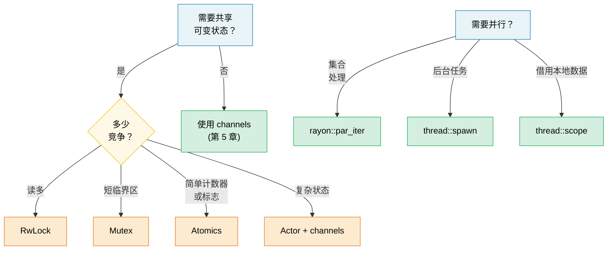

# 6. 并发 vs 并行 vs 线程 🟡

> **你将学到什么：**
> - 并发和并行之间的精确区别
> - OS 线程、scoped 线程和 rayon 用于数据并行
> - 共享状态原语：Arc、Mutex、RwLock、Atomics、Condvar
> - 带 OnceLock/LazyLock 的惰性初始化和无锁模式

## 术语：并发 ≠ 并行

这些术语经常混淆。这是精确区别：

| | 并发 | 并行 |
|---|------|------|
| **定义** | 管理多个可以进展的任务 | 同时执行多个任务 |
| **硬件要求** | 一个核心足够 | 需要多个核心 |
| **类比** | 一个厨师，多道菜（在它们之间切换） | 多个厨师，每个做一道菜 |
| **Rust 工具** | `async/await`、channels、`select!` | `rayon`、`thread::spawn`、`par_iter()` |

```text
并发（单核心）：              并行（多核心）：
                                      
Task A: ██░░██░░██            Task A: ██████████
Task B: ░░██░░██░░            Task B: ██████████
─────────────────→ 时间         ─────────────────→ 时间
（在一个核心上交错）            （在两个核心上同时）
```

### std::thread —— OS 线程

Rust 线程 1:1 映射到 OS 线程。每个获得自己的栈（通常 2-8 MB）：

```rust
use std::thread;
use std::time::Duration;

fn main() {
    // 生成一个线程 —— 接受闭包
    let handle = thread::spawn(|| {
        for i in 0..5 {
            println!("spawned thread: {i}");
            thread::sleep(Duration::from_millis(100));
        }
        42 // 返回值
    });

    // 同时在主线程上工作
    for i in 0..3 {
        println!("main thread: {i}");
        thread::sleep(Duration::from_millis(150));
    }

    // 等待线程完成并获取其返回值
    let result = handle.join().unwrap(); // 如果线程 panic 则 unwrap panic
    println!("Thread returned: {result}");
}
```

**Thread::spawn 类型要求**：

```rust
// 闭包必须是：
// 1. Send —— 可以转移到另一个线程
// 2. 'static —— 不能从调用作用域借用
// 3. FnOnce —— 获取捕获变量的所有权

let data = vec![1, 2, 3];

// ❌ 借用 data —— 不是 'static
// thread::spawn(|| println!("{data:?}"));

// ✅ 将所有权移入线程
thread::spawn(move || println!("{data:?}"));
// data 在这里不再可访问
```

### Scoped 线程 (std::thread::scope)

从 Rust 1.63 开始，scoped 线程解决 `'static` 要求 —— 线程可以从父作用域借用：

```rust
use std::thread;

fn main() {
    let mut data = vec![1, 2, 3, 4, 5];

    thread::scope(|s| {
        // 线程 1：借用共享引用
        s.spawn(|| {
            let sum: i32 = data.iter().sum();
            println!("Sum: {sum}");
        });

        // 线程 2：也借用共享引用（多个读取者 OK）
        s.spawn(|| {
            let max = data.iter().max().unwrap();
            println!("Max: {max}");
        });

        // ❌ 不能在共享借用存在时可变借用：
        // s.spawn(|| data.push(6));
    });
    // 所有 scoped 线程在这里 join —— 保证在作用域返回前完成

    // 现在可以安全可变 —— 所有线程已完成
    data.push(6);
    println!("Updated: {data:?}");
}
```

> **这很重要**：在 scoped 线程之前，你必须 `Arc::clone()` 一切
> 来与线程共享。现在你可以直接借用，编译器证明
> 所有线程在数据超出作用域前完成。

### rayon —— 数据并行

`rayon` 提供并行迭代器，自动在线程池间分发工作：

```rust,ignore
// Cargo.toml: rayon = "1"
use rayon::prelude::*;

fn main() {
    let data: Vec<u64> = (0..1_000_000).collect();

    // 顺序：
    let sum_seq: u64 = data.iter().map(|x| x * x).sum();

    // 并行 —— 只改变 `.iter()` 为 `.par_iter()`：
    let sum_par: u64 = data.par_iter().map(|x| x * x).sum();

    assert_eq!(sum_seq, sum_par);

    // 并行排序：
    let mut numbers = vec![5, 2, 8, 1, 9, 3];
    numbers.par_sort();

    // 并行处理带 map/filter/collect：
    let results: Vec<_> = data
        .par_iter()
        .filter(|&&x| x % 2 == 0)
        .map(|&x| expensive_computation(x))
        .collect();
}

fn expensive_computation(x: u64) -> u64 {
    // 模拟 CPU 重型工作
    (0..1000).fold(x, |acc, _| acc.wrapping_mul(7).wrapping_add(13))
}
```

**何时使用 rayon vs 线程**：

| 使用 | 何时 |
|------|------|
| `rayon::par_iter()` | 并行处理集合（map、filter、reduce） |
| `thread::spawn` | 长时间运行的后台任务、I/O 工作者 |
| `thread::scope` | 借用本地数据的短命并行任务 |
| `async` + `tokio` | I/O 绑定并发（网络、文件 I/O） |

### 共享状态：Arc、Mutex、RwLock、Atomics

当线程需要共享可变状态时，Rust 提供安全抽象：

> **注意**：`.lock()`、`.read()` 和 `.write()` 上的 `.unwrap()` 用于简洁
> 在这些示例中。这些调用仅当另一个线程在持有锁时 panic（"中毒"）才失败。生产代码应该决定是从中毒锁恢复还是传播错误。

```rust
use std::sync::{Arc, Mutex, RwLock};
use std::sync::atomic::{AtomicU64, Ordering};
use std::thread;

// --- Arc<Mutex<T>>：共享 + 独占访问 ---
fn mutex_example() {
    let counter = Arc::new(Mutex::new(0u64));
    let mut handles = vec![];

    for _ in 0..10 {
        let counter = Arc::clone(&counter);
        handles.push(thread::spawn(move || {
            for _ in 0..1000 {
                let mut guard = counter.lock().unwrap();
                *guard += 1;
            } // Guard 被 drop → 锁释放
        }));
    }

    for h in handles { h.join().unwrap(); }
    println!("Counter: {}", counter.lock().unwrap()); // 10000
}

// --- Arc<RwLock<T>>：多个读取者 OR 一个写入者 ---
fn rwlock_example() {
    let config = Arc::new(RwLock::new(String::from("initial")));

    // 许多读取者 —— 不互相阻塞
    let readers: Vec<_> = (0..5).map(|id| {
        let config = Arc::clone(&config);
        thread::spawn(move || {
            let guard = config.read().unwrap();
            println!("Reader {id}: {guard}");
        })
    }).collect();

    // 写入者 —— 阻塞并等待所有读取者完成
    {
        let mut guard = config.write().unwrap();
        *guard = "updated".to_string();
    }

    for r in readers { r.join().unwrap(); }
}

// --- Atomics：简单值的无锁 ---
fn atomic_example() {
    let counter = Arc::new(AtomicU64::new(0));
    let mut handles = vec![];

    for _ in 0..10 {
        let counter = Arc::clone(&counter);
        handles.push(thread::spawn(move || {
            for _ in 0..1000 {
                counter.fetch_add(1, Ordering::Relaxed);
                // 无锁、无 mutex —— 硬件原子指令
            }
        }));
    }

    for h in handles { h.join().unwrap(); }
    println!("Atomic counter: {}", counter.load(Ordering::Relaxed)); // 10000
}
```

### 快速比较

| 原语 | 使用场景 | 成本 | 竞争 |
|------|----------|------|------|
| `Mutex<T>` | 短临界区 | 锁 + 解锁 | 线程排队等待 |
| `RwLock<T>` | 读多写少 | 读写锁 | 读取者并发，写入者独占 |
| `AtomicU64` 等 | 计数器、标志 | 硬件 CAS | 无锁 —— 无等待 |
| Channels | 消息传递 | 队列操作 | 生产者/消费者解耦 |

### 条件变量 (`Condvar`)

`Condvar` 让线程**等待**直到另一个线程信号某个条件为真，无需忙循环。它总是与 `Mutex` 配对：

```rust
use std::sync::{Arc, Mutex, Condvar};
use std::thread;

let pair = Arc::new((Mutex::new(false), Condvar::new()));
let pair2 = Arc::clone(&pair);

// 生成线程：等待直到 ready == true
let handle = thread::spawn(move || {
    let (lock, cvar) = &*pair2;
    let mut ready = lock.lock().unwrap();
    while !*ready {
        ready = cvar.wait(ready).unwrap(); // 原子解锁 + 睡眠
    }
    println!("Worker: condition met, proceeding");
});

// 主线程：设置 ready = true，然后信号
{
    let (lock, cvar) = &*pair;
    let mut ready = lock.lock().unwrap();
    *ready = true;
    cvar.notify_one(); // 唤醒一个等待线程（用 notify_all 唤醒多个）
}
handle.join().unwrap();
```

> **模式**：`wait()` 返回后总是在 `while` 循环中重新检查条件
> —— 虚假唤醒被 OS 允许。

### 惰性初始化：OnceLock 和 LazyLock

在 Rust 1.80 之前，初始化需要运行时计算的 global static（例如解析配置、编译正则）需要 `lazy_static!` 宏或 `once_cell` crate。标准库现在提供两种类型原生覆盖这些使用场景：

```rust
use std::sync::{OnceLock, LazyLock};
use std::collections::HashMap;

// OnceLock —— 通过 `get_or_init` 在首次使用时初始化。
// 适用于初始化值依赖于运行时参数时。
static CONFIG: OnceLock<HashMap<String, String>> = OnceLock::new();

fn get_config() -> &'static HashMap<String, String> {
    CONFIG.get_or_init(|| {
        // 昂贵：读取和解析配置文件 —— 恰好发生一次。
        let mut m = HashMap::new();
        m.insert("log_level".into(), "info".into());
        m
    })
}

// LazyLock —— 在首次访问时初始化，闭包在定义处提供。
// 等价于 lazy_static! 但无宏。
static REGEX: LazyLock<regex::Regex> = LazyLock::new(|| {
    regex::Regex::new(r"^[a-zA-Z0-9_]+$").unwrap()
});

fn is_valid_identifier(s: &str) -> bool {
    REGEX.is_match(s) // 第一次调用编译正则；后续调用重用。
}
```

| 类型 | 稳定化 | 初始化时机 | 何时使用 |
|------|--------|------------|----------|
| `OnceLock<T>` | Rust 1.70 | 调用处（`get_or_init`） | 初始化依赖于运行时参数 |
| `LazyLock<T>` | Rust 1.80 | 定义处（闭包） | 初始化是自包含的 |
| `lazy_static!` | — | 定义处（宏） | 1.80 前代码库（迁移离开） |
| `const fn` + `static` | 总是 | 编译时 | 值可在编译时计算 |

> **迁移提示**：替换 `lazy_static! { static ref X: T = expr; }` 为
> `static X: LazyLock<T> = LazyLock::new(|| expr);` —— 相同语义、无宏、
> 无外部依赖。

### 无锁模式

对于高性能代码，完全避免锁：

```rust
use std::sync::atomic::{AtomicBool, AtomicUsize, Ordering};
use std::sync::Arc;

// 模式 1：自旋锁（教育用 —— 优先 std::sync::Mutex）
// ⚠️ 警告：这只是教学示例。真实自旋锁需要：
//   - RAII guard（所以持有期间 panic 不会无限死锁）
//   - 公平性保证（这在竞争下饥饿）
//   - 退避策略（指数退避、向 OS 让出）
// 在生产中使用 std::sync::Mutex 或 parking_lot::Mutex。
struct SpinLock {
    locked: AtomicBool,
}

impl SpinLock {
    fn new() -> Self { SpinLock { locked: AtomicBool::new(false) } }

    fn lock(&self) {
        while self.locked
            .compare_exchange_weak(false, true, Ordering::Acquire, Ordering::Relaxed)
            .is_err()
        {
            std::hint::spin_loop(); // CPU 提示：我们在自旋
        }
    }

    fn unlock(&self) {
        self.locked.store(false, Ordering::Release);
    }
}

// 模式 2：无锁 SPSC（单生产者、单消费者）
// 在生产中使用 crossbeam::queue::ArrayQueue 或类似
// 只为自己学习。

// 模式 3：用于无等待读取的序列计数器
// ⚠️ 最适合单个机器字类型（u64、f64）；更宽的 T 可能在读取时撕裂。
struct SeqLock<T: Copy> {
    seq: AtomicUsize,
    data: std::cell::UnsafeCell<T>,
}

unsafe impl<T: Copy + Send> Sync for SeqLock<T> {}

impl<T: Copy> SeqLock<T> {
    fn new(val: T) -> Self {
        SeqLock {
            seq: AtomicUsize::new(0),
            data: std::cell::UnsafeCell::new(val),
        }
    }

    fn read(&self) -> T {
        loop {
            let s1 = self.seq.load(Ordering::Acquire);
            if s1 & 1 != 0 { continue; } // 写入者进行中，重试

            // 安全：我们使用 ptr::read_volatile 防止编译器
            // 重新排序或缓存读取。SeqLock 协议（在读取后检查
            // s1 == s2）确保如果有写入者活跃我们重试。
            // 这镜像 C SeqLock 模式，其中数据读取必须使用
            // volatile/relaxed 语义以避免并发下撕裂。
            let value = unsafe { core::ptr::read_volatile(self.data.get() as *const T) };

            // Acquire 屏障：确保上面的数据读取是有序的，在
            // 我们重新检查序列计数器之前。
            std::sync::atomic::fence(Ordering::Acquire);
            let s2 = self.seq.load(Ordering::Relaxed);

            if s1 == s2 { return value; } // 没有写入者介入
            // 否则重试
        }
    }

    /// # 安全契约
    /// 只允许一个线程同时调用 `write()`。如果需要多个写入者，
    /// 在外部 `Mutex` 中包装 `write()` 调用。
    fn write(&self, val: T) {
        // 增加到奇数（信号写入进行中）。
        // AcqRel：Acquire 端防止后续数据写入
        // 在这个增加之前被重新排序（读取者必须在观察到部分写入前看到奇数）。
        // Release 端对单个写入者技术上不必要但无害且一致。
        self.seq.fetch_add(1, Ordering::AcqRel);
        // 安全：由调用者保持的单写入者不变量（见上面文档）。
        // UnsafeCell 允许内部可变；seq 计数器保护读取者。
        unsafe { *self.data.get() = val; }
        // 增加到偶数（信号写入完成）。
        // Release：确保数据写入在读取者看到偶数 seq 前可见。
        self.seq.fetch_add(1, Ordering::Release);
    }
}
```

> **⚠️ Rust 内存模型注意事项**：`write()` 中通过 `UnsafeCell` 的非原子写入与
> `read()` 中非原子 `ptr::read_volatile` 并发在 Rust 抽象机下技术上是数据竞争 —— 即使
> SeqLock 协议确保读取者总是在陈旧数据上重试。这镜像 C 内核 SeqLock 模式，
> 并且在所有现代硬件上对适合单个机器字的类型 `T`（例如 `u64`）在实践中是可靠的。
> 对于更宽的类型，考虑对数据字段使用 `AtomicU64` 或在 `Mutex` 中包装访问。
> 参见 [Rust 不安全代码指南](https://rust-lang.github.io/unsafe-code-guidelines/)
> 了解 `UnsafeCell` 并发的演进故事。

> **实践建议**：无锁代码很难正确。使用 `Mutex` 或
> `RwLock` 除非性能分析显示锁竞争是你的瓶颈。当你
> 确实需要无锁时，使用成熟的 crates（`crossbeam`、`arc-swap`、`dashmap`）
> 而不是自己实现。

> **关键要点 —— 并发**
> - Scoped 线程（`thread::scope`）让你借用栈数据，无需 `Arc`
> - `rayon::par_iter()` 用一个方法调用并行化迭代器
> - 使用 `OnceLock`/`LazyLock` 代替 `lazy_static!`；在达到原子之前使用 `Mutex`
> - 无锁代码很难 —— 优先成熟的 crates 而不是手工实现

> **另见：**[第 5 章 —— Channels](ch05-channels-and-message-passing.md) 了解消息传递并发。[第 9 章 —— 智能指针](ch09-smart-pointers-and-interior-mutability.md) 了解 Arc/Rc 详情。



---

### 练习：带 Scoped 线程的并行 Map ★★（约 25 分钟）

编写一个函数 `parallel_map<T, R>(data: &[T], f: fn(&T) -> R, num_threads: usize) -> Vec<R>`，将 `data` 分割成 `num_threads` 块并在 scoped 线程中处理每个块。不要使用 `rayon` —— 使用 `std::thread::scope`。

<details>
<summary>🔑 答案</summary>

```rust
fn parallel_map<T: Sync, R: Send>(data: &[T], f: fn(&T) -> R, num_threads: usize) -> Vec<R> {
    let chunk_size = (data.len() + num_threads - 1) / num_threads;
    let mut results = Vec::with_capacity(data.len());

    std::thread::scope(|s| {
        let mut handles = Vec::new();
        for chunk in data.chunks(chunk_size) {
            handles.push(s.spawn(move || {
                chunk.iter().map(f).collect::<Vec<_>>()
            }));
        }
        for h in handles {
            results.extend(h.join().unwrap());
        }
    });

    results
}

fn main() {
    let data: Vec<u64> = (1..=20).collect();
    let squares = parallel_map(&data, |x| x * x, 4);
    assert_eq!(squares, (1..=20).map(|x: u64| x * x).collect::<Vec<_>>());
    println!("Parallel squares: {squares:?}");
}
```

</details>

***
