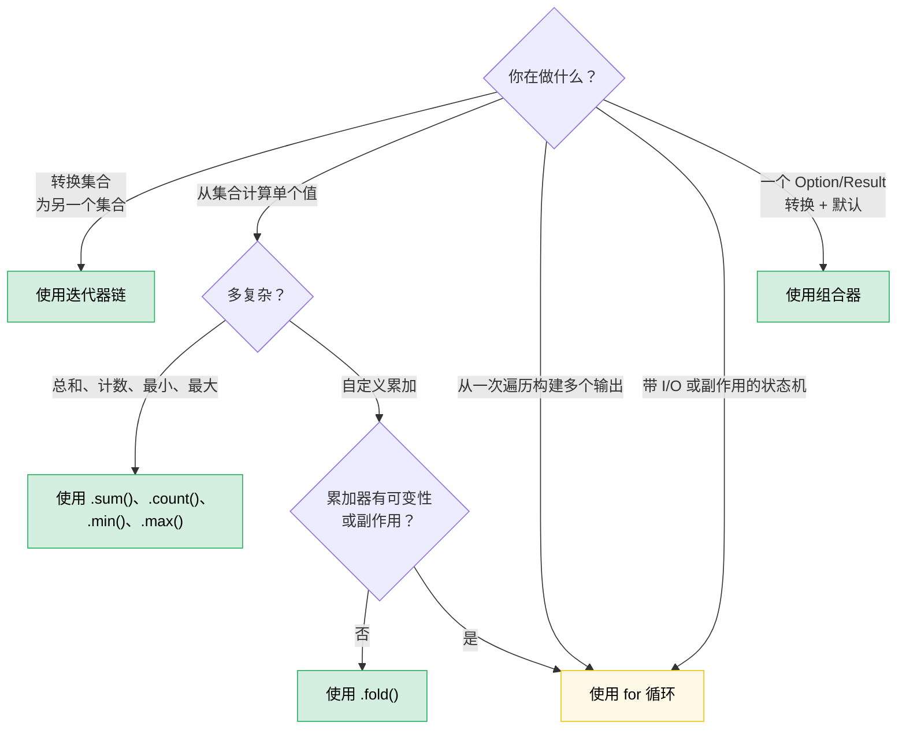

# 8. 函数式 vs 命令式：优雅何时胜出（何时不会）🟡

> **难度：** 🟡 中级 | **时间：** 2–3 小时 | **先决条件：** [第 7 章 — 闭包](ch07-closures-and-higher-order-functions.md)

Rust 赋予你函数式和命令式风格之间真正的平等。不像 Haskell（强制函数式）或 C（默认命令式），Rust 让你选择 —— 正确的选择取决于你要表达什么。本章培养正确判断的能力。

**核心原则：** 当你*通过管道转换数据*时函数式风格大放异彩。当你*管理带副作用的状态转换*时命令式风格大放异彩。大多数真实代码两者兼有，技巧在于知道边界落在哪里。

---

## 8.1 你不知道你想要的组合器

许多 Rust 开发者这样写：

```rust
let value = if let Some(x) = maybe_config() {
    x
} else {
    default_config()
};
process(value);
```

而他们本可以这样写：

```rust
process(maybe_config().unwrap_or_else(default_config));
```

或这个常见模式：

```rust
let display_name = if let Some(name) = user.nickname() {
    name.to_uppercase()
} else {
    "ANONYMOUS".to_string()
};
```

也就是：

```rust
let display_name = user.nickname()
    .map(|n| n.to_uppercase())
    .unwrap_or_else(|| "ANONYMOUS".to_string());
```

函数式版本不只是更短 —— 它告诉你*什么*正在发生（转换，然后默认），而不必追踪控制流。`if let` 版本让你阅读分支来找出两条路径最终到达同一地方。

### Option 组合器家族

这里是心智模型：`Option<T>` 是一个有一个元素或空的集合。`Option` 上的每个组合器都有集合操作的类比。

| 你写... | 而不是... | 它传达什么 |
|---|---|---|
| `opt.unwrap_or(default)` | `if let Some(x) = opt { x } else { default }` | "使用这个值或回退" |
| `opt.unwrap_or_else(\|\| expensive())` | `if let Some(x) = opt { x } else { expensive() }` | 相同，但默认是惰性的 |
| `opt.map(f)` | `match opt { Some(x) => Some(f(x)), None => None }` | "转换内部，传播缺失" |
| `opt.and_then(f)` | `match opt { Some(x) => f(x), None => None }` | "链接可能失败的操作" (flatmap) |
| `opt.filter(\|x\| pred(x))` | `match opt { Some(x) if pred(&x) => Some(x), _ => None }` | "仅当通过时保留" |
| `opt.zip(other)` | `if let (Some(a), Some(b)) = (opt, other) { Some((a,b)) } else { None }` | "两者或都不" |
| `opt.or(fallback)` | `if opt.is_some() { opt } else { fallback }` | "第一个可用的" |
| `opt.or_else(\|\| try_another())` | `if opt.is_some() { opt } else { try_another() }` | "按顺序尝试备选" |
| `opt.map_or(default, f)` | `if let Some(x) = opt { f(x) } else { default }` | "转换或默认" —— 一行式 |
| `opt.map_or_else(default_fn, f)` | `if let Some(x) = opt { f(x) } else { default_fn() }` | 相同，两边都是闭包 |
| `opt?` | `match opt { Some(x) => x, None => return None }` | "向上传播缺失" |

### Result 组合器家族

相同模式适用于 `Result<T, E>`：

| 你写... | 而不是... | 它传达什么 |
|---|---|---|
| `res.map(f)` | `match res { Ok(x) => Ok(f(x)), Err(e) => Err(e) }` | 转换成功路径 |
| `res.map_err(f)` | `match res { Ok(x) => Ok(x), Err(e) => Err(f(e)) }` | 转换错误 |
| `res.and_then(f)` | `match res { Ok(x) => f(x), Err(e) => Err(e) }` | 链接可能失败的操作 |
| `res.unwrap_or_else(\|e\| default(e))` | `match res { Ok(x) => x, Err(e) => default(e) }` | 从错误恢复 |
| `res.ok()` | `match res { Ok(x) => Some(x), Err(_) => None }` | "我不关心错误" |
| `res?` | `match res { Ok(x) => x, Err(e) => return Err(e.into()) }` | 向上传播错误 |

### 何时 `if let` 更好

组合器在以下情况失败：

- **你需要在 `Some` 分支中使用多条语句。** 有 5 行代码的 map 闭包比有 5 行代码的 `if let` 更糟。
- **控制流是重点。** `if let Some(connection) = pool.try_get() { /* 使用它 */ } else { /* 记录、重试、告警 */ }` —— 两个分支是真正不同的代码路径，不是转换或默认。
- **副作用主导。** 如果两个分支都做 I/O 且带有不同的错误处理，组合器版本模糊了重要的差异。

**经验法则：** 如果 `else` 分支产生与 `Some` 分支*相同的类型*且主体是短表达式，使用组合器。如果分支做根本上不同的事情，使用 `if let` 或 `match`。

---

## 8.2 Bool 组合器：`.then()` 和 `.then_some()`

另一个比应该更常见的模式：

```rust
let label = if is_admin {
    Some("ADMIN")
} else {
    None
};
```

Rust 1.62+ 给你：

```rust
let label = is_admin.then_some("ADMIN");
```

或用计算的值：

```rust
let permissions = is_admin.then(|| compute_admin_permissions());
```

这在链中特别强大：

```rust
// 命令式
let mut tags = Vec::new();
if user.is_admin { tags.push("admin"); }
if user.is_verified { tags.push("verified"); }
if user.score > 100 { tags.push("power-user"); }

// 函数式
let tags: Vec<&str> = [
    user.is_admin.then_some("admin"),
    user.is_verified.then_some("verified"),
    (user.score > 100).then_some("power-user"),
]
.into_iter()
.flatten()
.collect();
```

函数式版本让模式明确："从条件元素构建列表。"命令式版本让你阅读每个 `if` 来确认它们都做相同的事情（push 一个标签）。

---

## 8.3 迭代器链 vs 循环：决策框架

第 7 章展示了机制。本节培养判断力。

### 迭代器何时胜出

**数据管道** —— 通过一系列步骤转换集合：

```rust
// 命令式：8 行，2 个可变变量
let mut results = Vec::new();
for item in inventory {
    if item.category == Category::Server {
        if let Some(temp) = item.last_temperature() {
            if temp > 80.0 {
                results.push((item.id, temp));
            }
        }
    }
}

// 函数式：6 行，0 个可变变量，一个管道
let results: Vec<_> = inventory.iter()
    .filter(|item| item.category == Category::Server)
    .filter_map(|item| item.last_temperature().map(|t| (item.id, t)))
    .filter(|(_, temp)| *temp > 80.0)
    .collect();
```

函数式版本胜出因为：
- 每个过滤器独立可读
- 无 `mut` —— 数据单向流动
- 你可以添加/移除/重新排序管道阶段而不重构
- LLVM 内联迭代器适配器为与循环相同的机器码

**聚合** —— 从集合计算单个值：

```rust
// 命令式
let mut total_power = 0.0;
let mut count = 0;
for server in fleet {
    total_power += server.power_draw();
    count += 1;
}
let avg = total_power / count as f64;

// 函数式
let (total_power, count) = fleet.iter()
    .map(|s| s.power_draw())
    .fold((0.0, 0usize), |(sum, n), p| (sum + p, n + 1));
let avg = total_power / count as f64;
```

或甚至更简单如果你只需要总和：

```rust
let total: f64 = fleet.iter().map(|s| s.power_draw()).sum();
```

### 循环何时胜出

**带复杂状态的提前退出：**

```rust
// 这清晰且直接
let mut best_candidate = None;
for server in fleet {
    let score = evaluate(server);
    if score > threshold {
        if server.is_available() {
            best_candidate = Some(server);
            break; // 找到了 —— 立即停止
        }
    }
}

// 函数式版本很别扭
let best_candidate = fleet.iter()
    .filter(|s| evaluate(s) > threshold)
    .find(|s| s.is_available());
```

等等 —— 那个函数式版本实际上相当干净。让我们尝试一个它真正失败的情况：

**同时构建多个输出：**

```rust
// 命令式：清晰，每个分支做不同的事情
let mut warnings = Vec::new();
let mut errors = Vec::new();
let mut stats = Stats::default();

for event in log_stream {
    match event.severity {
        Severity::Warn => {
            warnings.push(event.clone());
            stats.warn_count += 1;
        }
        Severity::Error => {
            errors.push(event.clone());
            stats.error_count += 1;
            if event.is_critical() {
                alert_oncall(&event);
            }
        }
        _ => stats.other_count += 1,
    }
}

// 函数式版本：强制、 awkward，没人想读这个
let (warnings, errors, stats) = log_stream.iter().fold(
    (Vec::new(), Vec::new(), Stats::default()),
    |(mut w, mut e, mut s), event| {
        match event.severity {
            Severity::Warn => { w.push(event.clone()); s.warn_count += 1; }
            Severity::Error => {
                e.push(event.clone()); s.error_count += 1;
                if event.is_critical() { alert_oncall(event); }
            }
            _ => s.other_count += 1,
        }
        (w, e, s)
    },
);
```

fold 版本*更长*、*更难读*，而且仍有可变性（`mut` 解构的累加器）。循环胜出因为：
- 多个输出同时构建
- 副作用（告警）混合在逻辑中
- 分支主体是语句，不是表达式

**带 I/O 的状态机：**

```rust
// 读取标记的解析器 —— 循环就是算法
let mut state = ParseState::Start;
loop {
    let token = lexer.next_token()?;
    state = match state {
        ParseState::Start => match token {
            Token::Keyword(k) => ParseState::GotKeyword(k),
            Token::Eof => break,
            _ => return Err(ParseError::UnexpectedToken(token)),
        },
        ParseState::GotKeyword(k) => match token {
            Token::Ident(name) => ParseState::GotName(k, name),
            _ => return Err(ParseError::ExpectedIdentifier),
        },
        // ...更多状态
    };
}
```

没有函数式等价物更干净。带 `match state` 的循环是状态机的自然表达。

### 决策流程图



### 旁白：作用域可变性 —— 内部命令式，外部函数式

Rust 块是表达式。这让你将可变性限制在构造阶段并不可变地绑定结果：

```rust
use rand::random;

let samples = {
    let mut buf = Vec::with_capacity(10);
    while buf.len() < 10 {
        let reading: f64 = random();
        buf.push(reading);
        if random::<u8>() % 3 == 0 { break; } // 随机提前停止
    }
    buf
};
// samples 是不可变的 —— 包含 1 到 10 个元素
```

内部 `buf` 仅在块内可变。一旦块产生，外部绑定 `samples` 是不可变的，编译器会拒绝任何后续 `samples.push(...)`。

**为什么不是迭代器链？** 你可能尝试：

```rust
let samples: Vec<f64> = std::iter::from_fn(|| Some(random()))
    .take(10)
    .take_while(|_| random::<u8>() % 3 != 0)
    .collect();
```

但 `take_while` *排除* 失败谓词的元素，产生 0 到 9 个元素而不是命令式版本提供的保证至少一个。你可以用 `scan` 或 `chain` 解决它，但命令式版本更清晰。

**作用域可变性真正胜出的场景：**

| 场景 | 为什么迭代器挣扎 |
|---|---|
| **排序后冻结** (`sort_unstable()` + `dedup()`) | 两者都返回 `()` —— 无链式输出（如果可用 itertools 提供 `.sorted().dedup()`） |
| **有状态终止**（停止于与数据无关的条件） | `take_while` 丢弃边界元素 |
| **多步骤结构体填充**（从不同来源逐字段） | 无自然单管道 |

**诚实校准：** 对于大多数集合构建任务，迭代器链或 [itertools](https://docs.rs/itertools) 是首选。当构造逻辑有分支、提前退出、或不映射到单个管道的原地可变性时使用作用域可变性。这个模式的真正价值是教导*可变作用域可以比变量生命周期更小* —— 一个 Rust 基础，让来自 C++、C# 和 Python 的开发者惊讶。

---

## 8.4 `?` 运算符：函数式遇见命令式

`?` 运算符是 Rust 对两种风格最优雅的合成。它本质上是 `.and_then()` 结合提前返回：

```rust
// 这个 and_then 链...
fn load_config() -> Result<Config, Error> {
    read_file("config.toml")
        .and_then(|contents| parse_toml(&contents))
        .and_then(|table| validate_config(table))
        .and_then(|valid| Config::from_validated(valid))
}

// ...等价于这个
fn load_config() -> Result<Config, Error> {
    let contents = read_file("config.toml")?;
    let table = parse_toml(&contents)?;
    let valid = validate_config(table)?;
    Config::from_validated(valid)
}
```

两者在精神上都是函数式的（它们自动传播错误），但 `?` 版本给你命名的中间变量，这在以下情况很重要：

- 你需要在后面再次使用 `contents`
- 你想每步添加 `.context("while parsing config")?`
- 你想调试并检查中间值

**反模式：** 当 `?` 可用时长 `.and_then()` 链。如果链中每个闭包都是 `|x| next_step(x)`，你重新发明了 `?` 而没有可读性。

**何时 `.and_then()` 比 `?` 更好：**

```rust
// 在 Option 内部转换，无提前返回
let port: Option<u16> = config.get("port")
    .and_then(|v| v.parse::<u16>().ok())
    .filter(|&p| p > 0 && p < 65535);
```

你不能在这里使用 `?` 因为没有封闭函数可从中返回 —— 你正在构建 `Option`，不是传播它。

---

## 8.5 集合构建：`collect()` vs Push 循环

`collect()` 比大多数开发者意识到的更强大：

### 收集到 Result

```rust
// 命令式：解析列表，在第一个错误失败
let mut numbers = Vec::new();
for s in input_strings {
    let n: i64 = s.parse().map_err(|_| Error::BadInput(s.clone()))?;
    numbers.push(n);
}

// 函数式：收集到 Result<Vec<_>, _>
let numbers: Vec<i64> = input_strings.iter()
    .map(|s| s.parse::<i64>().map_err(|_| Error::BadInput(s.clone())))
    .collect::<Result<_, _>>()?;
```

`collect::<Result<Vec<_>, _>>()` 技巧有效因为 `Result` 实现 `FromIterator`。它在第一个 `Err` 短路，就像带 `?` 的循环。

### 收集到 HashMap

```rust
// 命令式
let mut index = HashMap::new();
for server in fleet {
    index.insert(server.id.clone(), server);
}

// 函数式
let index: HashMap<_, _> = fleet.into_iter()
    .map(|s| (s.id.clone(), s))
    .collect();
```

### 收集到 String

```rust
// 命令式
let mut csv = String::new();
for (i, field) in fields.iter().enumerate() {
    if i > 0 { csv.push(','); }
    csv.push_str(field);
}

// 函数式
let csv = fields.join(",");

// 或用于更复杂格式化：
let csv: String = fields.iter()
    .map(|f| format!("\"{f}\""))
    .collect::<Vec<_>>()
    .join(",");
```

### 循环版本何时胜出

`collect()` 分配新集合。如果你*原地修改*，循环更清晰且更高效：

```rust
// 原地更新 —— 没有更好的函数式等价物
for server in &mut fleet {
    if server.needs_refresh() {
        server.refresh_telemetry()?;
    }
}
```

函数式版本需要 `.iter_mut().for_each(|s| { ... })`，这只是带额外语法的循环。

---

## 8.6 模式匹配作为函数分发

Rust 的 `match` 是大多数开发者命令式使用的函数式结构。这是函数式视角：

### Match 作为查找表

```rust
// 命令式思维："检查每个情况"
fn status_message(code: StatusCode) -> &'static str {
    if code == StatusCode::OK { "Success" }
    else if code == StatusCode::NOT_FOUND { "Not found" }
    else if code == StatusCode::INTERNAL { "Server error" }
    else { "Unknown" }
}

// 函数式思维："从定义域映射到值域"
fn status_message(code: StatusCode) -> &'static str {
    match code {
        StatusCode::OK => "Success",
        StatusCode::NOT_FOUND => "Not found",
        StatusCode::INTERNAL => "Server error",
        _ => "Unknown",
    }
}
```

`match` 版本不只是风格 —— 编译器验证穷尽性。添加新变体，每个不处理它的 `match` 变成编译错误。`if/else` 链静默落入默认。

### Match + 解构作为管道

```rust
// 解析命令 —— 每个臂提取并转换
fn execute(cmd: Command) -> Result<Response, Error> {
    match cmd {
        Command::Get { key } => db.get(&key).map(Response::Value),
        Command::Set { key, value } => db.set(key, value).map(|_| Response::Ok),
        Command::Delete { key } => db.delete(&key).map(|_| Response::Ok),
        Command::Batch(cmds) => cmds.into_iter()
            .map(execute)
            .collect::<Result<Vec<_>, _>>()
            .map(Response::Batch),
    }
}
```

每个臂是返回相同类型的表达式。这是作为函数分发的模式匹配 —— `match` 臂本质上是按枚举变体索引的函数表。

---

## 8.7 在自定义类型上链式方法

函数式风格扩展到标准库类型之外。Builder 模式和流式 API 是伪装的函数式编程：

```rust
// 这是对你自己类型的组合器链
let query = QueryBuilder::new("servers")
    .filter("status", Eq, "active")
    .filter("rack", In, &["A1", "A2", "B1"])
    .order_by("temperature", Desc)
    .limit(50)
    .build();
```

**关键洞察：** 如果你的类型有接受 `self` 并返回 `Self`（或转换的类型）的方法，你构建了组合器。相同的函数式/命令式判断适用：

```rust
// 好：可链式因为每步是简单转换
let config = Config::default()
    .with_timeout(Duration::from_secs(30))
    .with_retries(3)
    .with_tls(true);

// 坏：可链式但链做太多不相关的事情
let result = processor
    .load_data(path)?       // I/O
    .validate()             // 纯
    .transform(rule_set)    // 纯
    .save_to_disk(output)?  // I/O
    .notify_downstream()?;  // 副作用

// 更好：将纯管道与 I/O 书端分离
let data = load_data(path)?;
let processed = data.validate().transform(rule_set);
save_to_disk(output, &processed)?;
notify_downstream()?;
```

当链混合纯转换与 I/O 时失败。读者无法分辨哪些调用可能失败、哪些有副作用、以及实际数据转换发生在哪里。

---

## 8.8 性能：它们相同

一个常见误解："函数式风格更慢因为所有闭包和分配。"

在 Rust 中，**迭代器链编译为与手写循环相同的机器码。** LLVM 内联闭包调用，消除迭代器适配器结构体，通常产生相同的汇编。这称为*零成本抽象*，它不是愿望 —— 它是经过测量的。

```rust
// 这些在 release 构建中产生相同的汇编：

// 函数式
let sum: i64 = (0..1000).filter(|n| n % 2 == 0).map(|n| n * n).sum();

// 命令式
let mut sum: i64 = 0;
for n in 0..1000 {
    if n % 2 == 0 {
        sum += n * n;
    }
}
```

**唯一例外：** `.collect()` 分配。如果你用中间集合链式 `.map().collect().iter().map().collect()`，你正在支付循环版本避免的分配成本。修复：通过直接链式适配器消除中间 collect，或者如果你需要中间集合用于其他原因则使用循环。

---

## 8.9 品味测试：转换目录

这里是有"我写了 6 行但有一个一行式"的最常见模式的参考表：

| 命令式模式 | 函数式等价物 | 何时偏好函数式 |
|---|---|---|
| `if let Some(x) = opt { f(x) } else { default }` | `opt.map_or(default, f)` | 两边都是短表达式 |
| `if let Some(x) = opt { Some(g(x)) } else { None }` | `opt.map(g)` | 总是 —— 这就是 `map` 用途 |
| `if condition { Some(x) } else { None }` | `condition.then_some(x)` | 总是 |
| `if condition { Some(compute()) } else { None }` | `condition.then(compute)` | 总是 |
| `match opt { Some(x) if pred(x) => Some(x), _ => None }` | `opt.filter(pred)` | 总是 |
| `for x in iter { if pred(x) { result.push(f(x)); } }` | `iter.filter(pred).map(f).collect()` | 当管道在一屏内可读时 |
| `if a.is_some() && b.is_some() { Some((a?, b?)) }` | `a.zip(b)` | 总是 —— `.zip()` 正是这个 |
| `match (a, b) { (Some(x), Some(y)) => x + y, _ => 0 }` | `a.zip(b).map(\|(x,y)\| x + y).unwrap_or(0)` | 判断调用 —— 取决于复杂度 |
| `iter.map(f).collect::<Vec<_>>()[0]` | `iter.map(f).next().unwrap()` | 不要为一个元素分配 Vec |
| `let mut v = vec; v.sort(); v` | `{ let mut v = vec; v.sort(); v }` | Rust 标准库无 `.sorted()`（使用 itertools） |

---

## 8.10 反模式

### 过度函数式化：没人能读的 5 层深链

```rust
// 这不优雅。这是谜题。
let result = data.iter()
    .filter_map(|x| x.metadata.as_ref())
    .flat_map(|m| m.tags.iter())
    .filter(|t| t.starts_with("env:"))
    .map(|t| t.strip_prefix("env:").unwrap())
    .filter(|env| allowed_envs.contains(env))
    .map(|env| env.to_uppercase())
    .collect::<HashSet<_>>()
    .into_iter()
    .sorted()
    .collect::<Vec<_>>();
```

当链超过 ~4 个适配器时，用命名的中间变量拆分它或提取辅助函数：

```rust
let env_tags = data.iter()
    .filter_map(|x| x.metadata.as_ref())
    .flat_map(|m| m.tags.iter());

let allowed: Vec<_> = env_tags
    .filter_map(|t| t.strip_prefix("env:"))
    .filter(|env| allowed_envs.contains(env))
    .map(|env| env.to_uppercase())
    .sorted()
    .collect();
```

### 函数式化不足：Rust 有词汇的 C 风格循环

```rust
// 这只是 .any()
let mut found = false;
for item in &list {
    if item.is_expired() {
        found = true;
        break;
    }
}

// 改为写这个
let found = list.iter().any(|item| item.is_expired());
```

```rust
// 这只是 .find()
let mut target = None;
for server in &fleet {
    if server.id == target_id {
        target = Some(server);
        break;
    }
}

// 改为写这个
let target = fleet.iter().find(|s| s.id == target_id);
```

```rust
// 这只是 .all()
let mut all_healthy = true;
for server in &fleet {
    if !server.is_healthy() {
        all_healthy = false;
        break;
    }
}

// 改为写这个
let all_healthy = fleet.iter().all(|s| s.is_healthy());
```

标准库有这些是有原因的。学习词汇，模式变得明显。

---

## 关键要点

> - **Option 和 Result 是单元素集合。** 它们的组合器（`.map()`、`.and_then()`、`.unwrap_or_else()`、`.filter()`、`.zip()`）替换大多数 `if let` / `match` 样板代码。
> - **使用 `bool::then_some()`** —— 它在所有情况下替换 `if cond { Some(x) } else { None }`。
> - **迭代器链胜在数据管道** —— filter/map/collect 无可变状态。它们编译为与循环相同的机器码。
> - **循环胜在多输出状态机** —— 当你构建多个集合、在分支中做 I/O、或管理状态转换时。
> - **`?` 运算符是两者最好的** —— 函数式错误传播，命令式可读性。
> - **在 ~4 个适配器处拆分链** —— 使用命名的中间变量提高可读性。过度函数式化与函数式化不足一样糟糕。
> - **学习标准库词汇** —— `.any()`、`.all()`、`.find()`、`.position()`、`.sum()`、`.min_by_key()` —— 每个都用一个揭示意图的调用替换多行循环。

> **另见：**[第 7 章](ch07-closures-and-higher-order-functions.md) 了解闭包机制和 `Fn` trait 层次结构。[第 10 章](ch10-error-handling-patterns.md) 了解错误组合器模式。[第 15 章](ch15-crate-architecture-and-api-design.md) 了解流式 API 设计。

---

### 练习：从命令式重构为函数式 ★★（约 30 分钟）

将以下函数从命令式重构为函数式风格。然后识别函数式版本*更糟* 的一个地方并解释原因。

```rust
fn summarize_fleet(fleet: &[Server]) -> FleetSummary {
    let mut healthy = Vec::new();
    let mut degraded = Vec::new();
    let mut failed = Vec::new();
    let mut total_power = 0.0;
    let mut max_temp = f64::NEG_INFINITY;

    for server in fleet {
        match server.health_status() {
            Health::Healthy => healthy.push(server.id.clone()),
            Health::Degraded(reason) => degraded.push((server.id.clone(), reason)),
            Health::Failed(err) => failed.push((server.id.clone(), err)),
        }
        total_power += server.power_draw();
        if server.max_temperature() > max_temp {
            max_temp = server.max_temperature();
        }
    }

    FleetSummary {
        healthy,
        degraded,
        failed,
        avg_power: total_power / fleet.len() as f64,
        max_temp,
    }
}
```

<details>
<summary>🔑 答案</summary>

`total_power` 和 `max_temp` 是干净的函数式重写：

```rust
fn summarize_fleet(fleet: &[Server]) -> FleetSummary {
    let avg_power: f64 = fleet.iter().map(|s| s.power_draw()).sum::<f64>()
        / fleet.len() as f64;

    let max_temp = fleet.iter()
        .map(|s| s.max_temperature())
        .fold(f64::NEG_INFINITY, f64::max);

    // 但三路分区作为循环更好。
    // 函数式版本需要三个单独的遍历
    // 或带元组内三个可变累加器的别扭 .fold()。
    let mut healthy = Vec::new();
    let mut degraded = Vec::new();
    let mut failed = Vec::new();

    for server in fleet {
        match server.health_status() {
            Health::Healthy => healthy.push(server.id.clone()),
            Health::Degraded(reason) => degraded.push((server.id.clone(), reason)),
            Health::Failed(err) => failed.push((server.id.clone(), err)),
        }
    }

    FleetSummary { healthy, degraded, failed, avg_power, max_temp }
}
```

**为什么循环对三路分区更好：** 函数式版本需要三个 `.filter().collect()` 遍历（3x 迭代），或带元组内三个 `mut Vec` 累加器的 `.fold()` —— 这只是用更糟语法重写的循环。命令式单遍循环更清晰、更高效、且更容易扩展。

</details>

***
