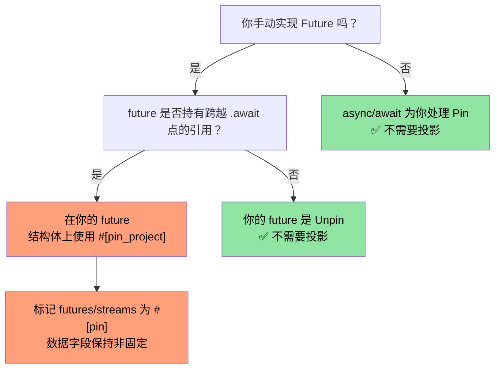
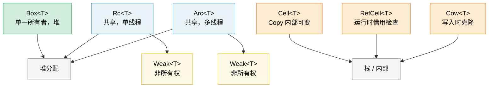

# 9. 智能指针和内部可变性 🟡

> **你将学到什么：**
> - Box、Rc、Arc 用于堆分配和共享所有权
> - Weak 引用用于打破 Rc/Arc 引用循环
> - Cell、RefCell 和 Cow 用于内部可变性模式
> - Pin 用于自引用类型和 ManuallyDrop 用于生命周期控制

## Box、Rc、Arc —— 堆分配和共享

```rust
// --- Box<T>: 单一所有者，堆分配 ---
// 使用场景：递归类型、大值、trait 对象
let boxed: Box<i32> = Box::new(42);
println!("{}", *boxed); // Deref 为 i32

// 递归类型需要 Box（否则无限大小）：
enum List<T> {
    Cons(T, Box<List<T>>),
    Nil,
}

// Trait 对象（动态分发）：
let writer: Box<dyn std::io::Write> = Box::new(std::io::stdout());

// --- Rc<T>: 多所有者，单线程 ---
// 使用场景：一个线程内的共享所有权（无 Send/Sync）
use std::rc::Rc;

let a = Rc::new(vec![1, 2, 3]);
let b = Rc::clone(&a); // 增加引用计数（不是深克隆）
let c = Rc::clone(&a);
println!("Ref count: {}", Rc::strong_count(&a)); // 3

// 三个都指向同一个 Vec。当最后一个 Rc 被 drop 时，
// Vec 被释放。

// --- Arc<T>: 多所有者，线程安全 ---
// 使用场景：跨线程共享所有权
use std::sync::Arc;

let shared = Arc::new(String::from("shared data"));
let handles: Vec<_> = (0..5).map(|_| {
    let shared = Arc::clone(&shared);
    std::thread::spawn(move || println!("{shared}"))
}).collect();
for h in handles { h.join().unwrap(); }
```

### Weak 引用 —— 打破引用循环

`Rc` 和 `Arc` 使用引用计数，无法释放循环（A → B → A）。
`Weak<T>` 是非所有权句柄，**不**增加强引用计数：

```rust
use std::rc::{Rc, Weak};
use std::cell::RefCell;

struct Node {
    value: i32,
    parent: RefCell<Weak<Node>>,   // 不让父节点保持存活
    children: RefCell<Vec<Rc<Node>>>,
}

let parent = Rc::new(Node {
    value: 0, parent: RefCell::new(Weak::new()), children: RefCell::new(vec![]),
});
let child = Rc::new(Node {
    value: 1, parent: RefCell::new(Rc::downgrade(&parent)), children: RefCell::new(vec![]),
});
parent.children.borrow_mut().push(Rc::clone(&child));

// 从子节点访问父节点 —— 返回 Option<Rc<Node>>：
if let Some(p) = child.parent.borrow().upgrade() {
    println!("Child's parent value: {}", p.value); // 0
}
// 当 `parent` 被 drop 时，强引用计数 → 0，内存被释放。
// `child.parent.upgrade()` 会返回 `None`。
```

**经验法则**：对所有权边使用 `Rc`/`Arc`，对后向引用和缓存使用 `Weak`。对于线程安全代码，使用 `Arc<T>` 与 `sync::Weak<T>`。

### Cell 和 RefCell —— 内部可变性

有时你需要通过共享（`&`）引用可变数据。Rust 提供*内部可变性*，带运行时借用检查：

```rust
use std::cell::{Cell, RefCell};

// --- Cell<T>: 基于 Copy 的内部可变性 ---
// 仅用于 Copy 类型（或你交换进/出的类型）
struct Counter {
    count: Cell<u32>,
}

impl Counter {
    fn new() -> Self { Counter { count: Cell::new(0) } }

    fn increment(&self) { // &self，不是 &mut self！
        self.count.set(self.count.get() + 1);
    }

    fn value(&self) -> u32 { self.count.get() }
}

// --- RefCell<T>: 运行时借用检查 ---
// 如果你在运行时违反借用规则则 panic
struct Cache {
    data: RefCell<Vec<String>>,
}

impl Cache {
    fn new() -> Self { Cache { data: RefCell::new(Vec::new()) } }

    fn add(&self, item: String) { // &self —— 从外部看是不可变的
        self.data.borrow_mut().push(item); // 运行时检查的 &mut
    }

    fn get_all(&self) -> Vec<String> {
        self.data.borrow().clone() // 运行时检查的 &
    }

    fn bad_example(&self) {
        let _guard1 = self.data.borrow();
        // let _guard2 = self.data.borrow_mut();
        // ❌ 运行时 PANIC —— 当 & 存在时不能有 &mut
    }
}
```

> **Cell vs RefCell**：`Cell` 从不会 panic（它复制/交换值）但仅适用于 `Copy` 类型或通过 `swap()`/`replace()`。`RefCell` 适用于任何类型但在双重可变借用时 panic。两者都不是 `Sync` —— 对于多线程使用，见 `Mutex`/`RwLock`。

### Cow —— 写入时克隆

`Cow`（Clone on Write）持有借用或所有的值。它仅在需要可变时克隆：

```rust
use std::borrow::Cow;

// 避免在不需要修改时分配：
fn normalize(input: &str) -> Cow<'_, str> {
    if input.contains('\t') {
        // 仅当需要替换制表符时分配
        Cow::Owned(input.replace('\t', "    "))
    } else {
        // 无分配 —— 只返回引用
        Cow::Borrowed(input)
    }
}

fn main() {
    let clean = "no tabs here";
    let dirty = "tabs\there";

    let r1 = normalize(clean); // Cow::Borrowed —— 零分配
    let r2 = normalize(dirty); // Cow::Owned —— 分配新 String

    println!("{r1}");
    println!("{r2}");
}

// 也对可能所有权的函数参数有用：
fn process(data: Cow<'_, [u8]>) {
    // 可以读取数据而不复制
    println!("Length: {}", data.len());
    // 如果需要可变，Cow 自动克隆：
    let mut owned = data.into_owned(); // 仅当 Borrowed 时克隆
    owned.push(0xFF);
}
```

#### `Cow<'_, [u8]>` 用于二进制数据

`Cow` 对字节导向的 API 特别有用，其中数据可能需要也可能不需要转换（插入校验和、填充、转义）。这避免在常见的快速路径上分配 `Vec<u8>`：

```rust
use std::borrow::Cow;

/// 将帧填充到最小长度，当无需填充时借用。
fn pad_frame(frame: &[u8], min_len: usize) -> Cow<'_, [u8]> {
    if frame.len() >= min_len {
        Cow::Borrowed(frame)  // 已经足够长 —— 零分配
    } else {
        let mut padded = frame.to_vec();
        padded.resize(min_len, 0x00);
        Cow::Owned(padded)    // 仅当需要填充时分配
    }
}

let short = pad_frame(&[0xDE, 0xAD], 8);    // Owned —— 填充到 8 字节
let long  = pad_frame(&[0; 64], 8);          // Borrowed —— 已经 >= 8
```

> **提示**：将 `Cow<[u8]>` 与 `bytes::Bytes`（第 10 章）结合使用，当你需要共享可能已转换缓冲区的引用计数时。

### 何时使用哪个指针

| 指针 | 所有者数量 | 线程安全 | 可变性 | 使用场景 |
|---------|:-----------:|:-----------:|:----------:|----------|
| `Box<T>` | 1 | ✅（如果 T: Send） | 通过 `&mut` | 堆分配、trait 对象、递归类型 |
| `Rc<T>` | N | ❌ | 无（用 Cell/RefCell 包装） | 共享所有权、单线程、图/树 |
| `Arc<T>` | N | ✅ | 无（用 Mutex/RwLock 包装） | 跨线程共享所有权 |
| `Cell<T>` | — | ❌ | `.get()` / `.set()` | Copy 类型的内部可变性 |
| `RefCell<T>` | — | ❌ | `.borrow()` / `.borrow_mut()` | 任何类型的内部可变性，单线程 |
| `Cow<'_, T>` | 0 或 1 | ✅（如果 T: Send） | 写入时克隆 | 当数据经常不变时避免分配 |

### Pin 和自引用类型

`Pin<P>` 防止值在内存中移动。这对**自引用类型** —— 包含指向自己数据的指针的结构体 —— 以及 `Future` 至关重要，后者可能在 `.await` 点之间持有引用。

```rust
use std::pin::Pin;
use std::marker::PhantomPinned;

// 自引用结构体（简化）：
struct SelfRef {
    data: String,
    ptr: *const String, // 指向下面的 `data`
    _pin: PhantomPinned, // 选择退出 Unpin —— 不能移动
}

impl SelfRef {
    fn new(s: &str) -> Pin<Box<Self>> {
        let val = SelfRef {
            data: s.to_string(),
            ptr: std::ptr::null(),
            _pin: PhantomPinned,
        };
        let mut boxed = Box::pin(val);

        // 安全：设置指针后我们不移动数据
        let self_ptr: *const String = &boxed.data;
        unsafe {
            let mut_ref = Pin::as_mut(&mut boxed);
            Pin::get_unchecked_mut(mut_ref).ptr = self_ptr;
        }
        boxed
    }

    fn data(&self) -> &str {
        &self.data
    }

    fn ptr_data(&self) -> &str {
        // 安全：ptr 设置为指向 pin 时的 self.data
        unsafe { &*self.ptr }
    }
}

fn main() {
    let pinned = SelfRef::new("hello");
    assert_eq!(pinned.data(), pinned.ptr_data()); // 都是 "hello"
    // std::mem::swap 会使 ptr 失效 —— 但 Pin 防止它
}
```

**关键概念**：

| 概念 | 含义 |
|---------|--------|
| `Unpin`（自动 trait） | "移动这个类型是安全的。"大多数类型默认是 `Unpin`。 |
| `!Unpin` / `PhantomPinned` | "我有内部指针 —— 不要移动我。" |
| `Pin<&mut T>` | 保证 `T` 不会移动的可变引用 |
| `Pin<Box<T>>` | 所有的、堆上固定的值 |

**为什么这对 async 重要**：每个 `async fn` 展开为可能在 `.await` 点之间持有引用的 `Future` —— 使其自引用。async 运行时使用 `Pin<&mut Future>` 保证 future 在被 poll 后不会移动。

```rust
// 当你写：
async fn fetch(url: &str) -> String {
    let response = http_get(url).await; // 引用跨越 await 持有
    response.text().await
}

// 编译器生成一个 !Unpin 的状态机结构体，
// 运行时在调用 Future::poll() 之前固定它。
```

> **何时关心 Pin**：(1) 手动实现 `Future`，(2) 编写 async 运行时或组合器，(3) 任何带自引用指针的结构体。对于普通应用代码，`async/await` 透明地处理固定。见配套的 *Async Rust Training* 了解更多覆盖。
>
> **替代 crate**：对于无需手动 `Pin` 的自引用结构体，考虑 [`ouroboros`](https://crates.io/crates/ouroboros) 或 [`self_cell`](https://crates.io/crates/self_cell) —— 它们生成带正确固定和 drop 语义的安全包装器。

### Pin 投影 —— 结构固定

当你有 `Pin<&mut MyStruct>`，你经常需要访问单个字段。**Pin 投影** 是从 `Pin<&mut Struct>` 安全地到 `Pin<&mut Field>`（对于固定字段）或 `&mut Field`（对于非固定字段）的模式。

#### 问题：固定类型上的字段访问

```rust
use std::pin::Pin;
use std::marker::PhantomPinned;

struct MyFuture {
    data: String,              // 普通字段 —— 安全移动
    state: InternalState,      // 自引用 —— 必须保持固定
    _pin: PhantomPinned,
}

enum InternalState {
    Waiting { ptr: *const String }, // 指向 `data` —— 自引用
    Done,
}

// 给定 `Pin<&mut MyFuture>`，你如何访问 `data` 和 `state`？
// 你不能直接做 `pinned.data` —— 编译器不会让你
// 不经 unsafe 获取固定值的字段 &mut。
```

#### 手动 Pin 投影（unsafe）

```rust
impl MyFuture {
    // 投影到 `data` —— 这个字段在结构上非固定（移动安全）
    fn data(self: Pin<&mut Self>) -> &mut String {
        // 安全：`data` 不是结构上固定的。仅移动 `data`
        // 不移动整个结构体，所以 Pin 的保证保持不变。
        unsafe { &mut self.get_unchecked_mut().data }
    }

    // 投影到 `state` —— 这个字段是结构上固定的
    fn state(self: Pin<&mut Self>) -> Pin<&mut InternalState> {
        // 安全：`state` 是结构上固定的 —— 我们通过返回 Pin<&mut InternalState> 维护固定不变量。
        unsafe { Pin::new_unchecked(&mut self.get_unchecked_mut().state) }
    }
}
```

**结构固定规则** —— 字段是"结构上固定的"如果：
1. 仅移动/交换该字段可能使自引用失效
2. 结构体的 `Drop` impl 不能移动该字段
3. 结构体必须是 `!Unpin`（由 `PhantomPinned` 或 `!Unpin` 字段强制执行）

#### `pin-project` —— 安全 Pin 投影（零 Unsafe）

`pin-project` crate 在编译时生成可证明正确的投影，消除手动 `unsafe` 的需要：

```rust
use pin_project::pin_project;
use std::pin::Pin;
use std::future::Future;
use std::task::{Context, Poll};

#[pin_project]                   // <-- 生成投影方法
struct TimedFuture<F: Future> {
    #[pin]                       // <-- 结构上固定（它是 Future）
    inner: F,
    started_at: std::time::Instant, // 非固定 —— 普通数据
}

impl<F: Future> Future for TimedFuture<F> {
    type Output = (F::Output, std::time::Duration);

    fn poll(self: Pin<&mut Self>, cx: &mut Context<'_>) -> Poll<Self::Output> {
        let this = self.project();  // 安全！由 pin_project 生成
        //   this.inner   : Pin<&mut F>              —— 固定字段
        //   this.started_at : &mut std::time::Instant —— 非固定字段

        match this.inner.poll(cx) {
            Poll::Ready(output) => {
                let elapsed = this.started_at.elapsed();
                Poll::Ready((output, elapsed))
            }
            Poll::Pending => Poll::Pending,
        }
    }
}
```

#### `pin-project` vs 手动投影

| 方面 | 手动 (`unsafe`) | `pin-project` |
|--------|-------------------|---------------|
| 安全性 | 你证明不变量 | 编译器验证 |
| 样板代码 | 低（但易错） | 零 —— derive 宏 |
| `Drop` 交互 | 不能移动固定字段 | 强制执行：`#[pinned_drop]` |
| 编译时成本 | 无 | 过程宏展开 |
| 使用场景 | 原语、`no_std` | 应用 / 库代码 |

#### `#[pinned_drop]` —— 固定类型的 Drop

当类型有 `#[pin]` 字段，`pin-project` 要求 `#[pinned_drop]` 而不是常规 `Drop` impl，以防止意外移动固定字段：

```rust
use pin_project::{pin_project, pinned_drop};
use std::pin::Pin;

#[pin_project(PinnedDrop)]
struct Connection<F> {
    #[pin]
    future: F,
    buffer: Vec<u8>,  // 非固定 —— 可以在 drop 中移动
}

#[pinned_drop]
impl<F> PinnedDrop for Connection<F> {
    fn drop(self: Pin<&mut Self>) {
        let this = self.project();
        // `this.future` 是 Pin<&mut F> —— 不能移动，只能原地 drop
        // `this.buffer` 是 &mut Vec<u8> —— 可以排空、清空等
        this.buffer.clear();
        println!("Connection dropped, buffer cleared");
    }
}
```

#### Pin 投影何时在实践中重要

> **注意**：下图使用 Mermaid 语法。它在 GitHub 和支持 Mermaid 的工具（带 `mermaid` 插件的 mdBook、带 Mermaid 扩展的 VS Code）中渲染。在纯 Markdown 查看器中，你会看到原始源代码。



> **经验法则**：如果你包装另一个 `Future` 或 `Stream`，使用 `pin-project`。如果你用 `async/await` 编写应用代码，你从不需要直接使用 pin 投影。见配套的 *Async Rust Training* 了解使用 pin 投影的 async 组合器模式。

### Drop 顺序和 ManuallyDrop

Rust 的 drop 顺序是确定性的，但有值得知道的规则：

#### Drop 顺序规则

```rust
struct Label(&'static str);

impl Drop for Label {
    fn drop(&mut self) { println!("Dropping {}", self.0); }
}

fn main() {
    let a = Label("first");   // 第一个声明
    let b = Label("second");  // 第二个声明
    let c = Label("third");   // 第三个声明
}
// 输出：
//   Dropping third    ← 局部变量按 REVERSE 声明顺序 drop
//   Dropping second
//   Dropping first
```

**三条规则**：

| 什么 | Drop 顺序 | 理由 |
|------|-----------|----------|
| **局部变量** | 反向声明顺序 | 后面的变量可能引用前面的 |
| **结构体字段** | 声明顺序（从上到下） | 匹配构造顺序（自 Rust 1.0 稳定，由 [RFC 1857](https://rust-lang.github.io/rfcs/1857-stabilize-drop-order.html) 保证） |
| **元组元素** | 声明顺序（从左到右） | `(a, b, c)` → drop `a`，然后 `b`，然后 `c` |

```rust
struct Server {
    listener: Label,  // 第 1 个 drop
    handler: Label,   // 第 2 个 drop
    logger: Label,    // 第 3 个 drop
}
// 字段从上到下 drop（声明顺序）。
// 当字段相互引用或持有资源时这很重要。
```

> **实际影响**：如果你的结构体有 `JoinHandle` 和 `Sender`，字段顺序决定哪个先 drop。如果线程从 channel 读取，先 drop `Sender`（关闭 channel）以便线程退出，然后 join handle。在结构体中将 `Sender` 放在 `JoinHandle` 上面。

#### `ManuallyDrop<T>` —— 抑制自动 Drop

`ManuallyDrop<T>` 包装一个值并防止其析构函数自动运行。你负责 drop 它（或故意泄漏它）：

```rust
use std::mem::ManuallyDrop;

// 使用场景 1：防止 unsafe 代码中的双重释放
struct TwoPhaseBuffer {
    // 我们需要自己 drop Vec 来控制时机
    data: ManuallyDrop<Vec<u8>>,
    committed: bool,
}

impl TwoPhaseBuffer {
    fn new(capacity: usize) -> Self {
        TwoPhaseBuffer {
            data: ManuallyDrop::new(Vec::with_capacity(capacity)),
            committed: false,
        }
    }

    fn write(&mut self, bytes: &[u8]) {
        self.data.extend_from_slice(bytes);
    }

    fn commit(&mut self) {
        self.committed = true;
        println!("Committed {} bytes", self.data.len());
    }
}

impl Drop for TwoPhaseBuffer {
    fn drop(&mut self) {
        if !self.committed {
            println!("Rolling back — dropping uncommitted data");
        }
        // 安全：data 在这里总是有效的；我们只 drop 它一次。
        unsafe { ManuallyDrop::drop(&mut self.data); }
    }
}
```

```rust
// 使用场景 2：故意泄漏（例如，全局单例）
fn leaked_string() -> &'static str {
    // Box::leak() 是创建 &'static 引用的地道方式：
    let s = String::from("lives forever");
    Box::leak(s.into_boxed_str())
    // ⚠️ 这是受控内存泄漏。String 的堆分配
    // 从不会被释放。仅用于长生命周期单例。
}

// ManuallyDrop 替代（需要 unsafe）：
// ⚠️ 优先使用上面的 Box::leak() —— 这里仅用于说明
// ManuallyDrop 语义（抑制 Drop 而堆数据存活）。
fn leaked_string_manual() -> &'static str {
    use std::mem::ManuallyDrop;
    let md = ManuallyDrop::new(String::from("lives forever"));
    // 安全：ManuallyDrop 防止释放；堆数据永久存活，
    // 所以 'static 引用是有效的。
    unsafe { &*(md.as_str() as *const str) }
}
```

```rust
// 使用场景 3：Union 字段（一次只有一个变体有效）
use std::mem::ManuallyDrop;

union IntOrString {
    i: u64,
    s: ManuallyDrop<String>,
    // String 有 Drop impl，所以它 MUST 包装在 ManuallyDrop 中
    // 在 union 内部 —— 编译器不知道哪个字段是活跃的。
}

// 无自动 Drop —— 构造 IntOrString 的代码也必须
// 处理清理。如果 String 变体是活跃的，调用：
//   unsafe { ManuallyDrop::drop(&mut value.s); }
// 无 Drop impl，union 只是被泄漏（无 UB，只是泄漏）。
```

**ManuallyDrop vs `mem::forget`**：

| | `ManuallyDrop<T>` | `mem::forget(value)` |
|---|---|---|
| 何时 | 在构造时包装 | 稍后消费 |
| 访问内部 | `&*md` / `&mut *md` | 值消失了 |
| 稍后 Drop | `ManuallyDrop::drop(&mut md)` | 不可能 |
| 使用场景 | 细粒度生命周期控制 | 一次性泄漏 |

> **规则**：在不安全的抽象中使用 `ManuallyDrop`，当你需要控制析构函数*确切*何时运行时。在安全的应用代码中，你几乎从不需要它 —— Rust 的自动 drop 顺序正确处理事情。

> **关键要点 —— 智能指针**
> - `Box` 用于堆上的单一所有权；`Rc`/`Arc` 用于共享所有权（单/多线程）
> - `Cell`/`RefCell` 提供内部可变性；`RefCell` 在运行时违规时 panic
> - `Cow` 在常见路径上避免分配；`Pin` 防止自引用类型移动
> - Drop 顺序：字段按声明顺序 drop（RFC 1857）；局部变量按反向声明顺序 drop

> **另见：**[第 6 章 —— 并发](ch06-concurrency-vs-parallelism-vs-threads.md) 了解 Arc + Mutex 模式。[第 4 章 —— PhantomData](ch04-phantomdata-types-that-carry-no-data.md) 了解与智能指针一起使用的 PhantomData。



---

### 练习：引用计数图 ★★（约 30 分钟）

使用 `Rc<RefCell<Node>>` 构建一个有向图，其中每个节点有一个名称和子节点列表。使用 `Weak` 创建一个循环（A → B → C → A）来打破后向边。用 `Rc::strong_count` 验证无内存泄漏。

<details>
<summary>🔑 答案</summary>

```rust
use std::cell::RefCell;
use std::rc::{Rc, Weak};

struct Node {
    name: String,
    children: Vec<Rc<RefCell<Node>>>,
    back_ref: Option<Weak<RefCell<Node>>>,
}

impl Node {
    fn new(name: &str) -> Rc<RefCell<Self>> {
        Rc::new(RefCell::new(Node {
            name: name.to_string(),
            children: Vec::new(),
            back_ref: None,
        }))
    }
}

impl Drop for Node {
    fn drop(&mut self) {
        println!("Dropping {}", self.name);
    }
}

fn main() {
    let a = Node::new("A");
    let b = Node::new("B");
    let c = Node::new("C");

    // A → B → C，C 通过 Weak 后向引用 A
    a.borrow_mut().children.push(Rc::clone(&b));
    b.borrow_mut().children.push(Rc::clone(&c));
    c.borrow_mut().back_ref = Some(Rc::downgrade(&a)); // Weak 引用！

    println!("A strong count: {}", Rc::strong_count(&a)); // 1（只有 `a` 绑定）
    println!("B strong count: {}", Rc::strong_count(&b)); // 2（b + A 的子节点）
    println!("C strong count: {}", Rc::strong_count(&c)); // 2（c + B 的子节点）

    // 升级 weak 引用证明它有效：
    let c_ref = c.borrow();
    if let Some(back) = &c_ref.back_ref {
        if let Some(a_ref) = back.upgrade() {
            println!("C points back to: {}", a_ref.borrow().name);
        }
    }
    // 当 a、b、c 超出作用域时，所有节点 drop（无循环泄漏！）
}
```

</details>

***
