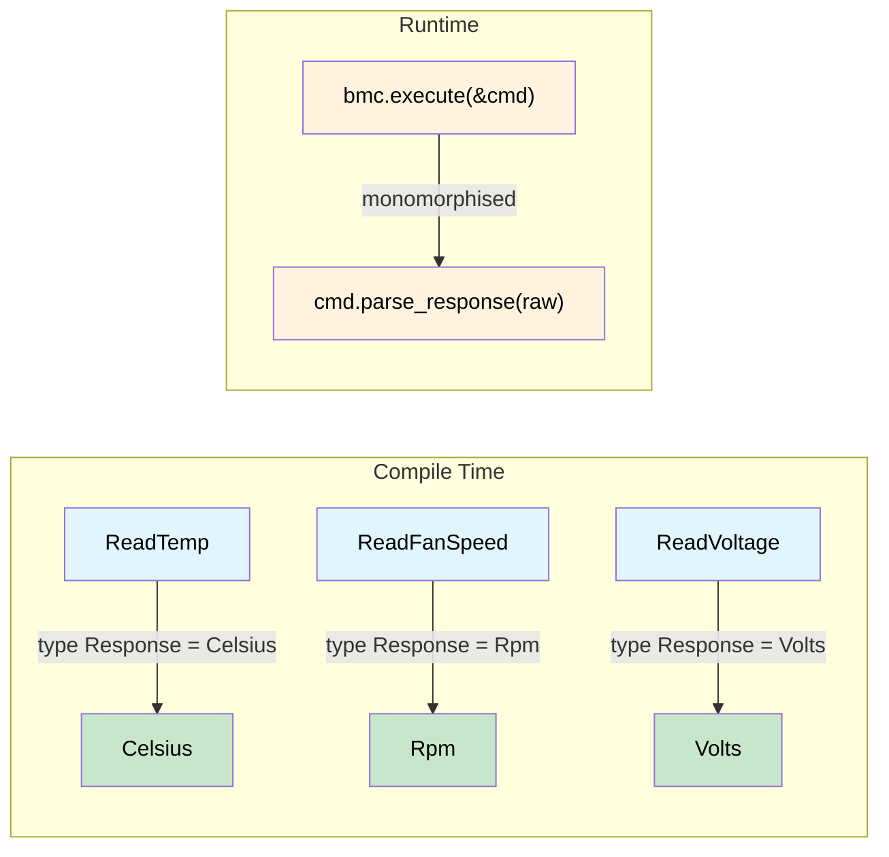

# 类型化命令接口 —— 请求决定响应 🟡

> **你将学到什么：** 命令 trait 上的关联类型如何在请求和响应之间创建编译时绑定，消除 IPMI、Redfish 和 NVMe 协议中的不匹配解析、单位混淆和静默类型强制。
>
> **交叉引用**：[第 1 章](ch01-the-philosophy-why-types-beat-tests.md)（理念）、[第 6 章](ch06-dimensional-analysis-making-the-compiler.md)（量纲类型）、[第 7 章](ch07-validated-boundaries-parse-dont-validate.md)（验证边界）、[第 10 章](ch10-putting-it-all-together-a-complete-diagn.md)（集成）

## 无类型沼泽

大多数硬件管理栈 —— IPMI、Redfish、NVMe Admin、PLDM —— 最初都是 `raw bytes in → raw bytes out`。这创建了一类测试只能部分发现的 bug：

```rust,ignore
use std::io;

struct BmcRaw { /* ipmitool handle */ }

impl BmcRaw {
    fn raw_command(&self, net_fn: u8, cmd: u8, data: &[u8]) -> io::Result<Vec<u8>> {
        // ... shells out to ipmitool ...
        Ok(vec![0x00, 0x19, 0x00]) // stub
    }
}

fn diagnose_thermal(bmc: &BmcRaw) -> io::Result<()> {
    let raw = bmc.raw_command(0x04, 0x2D, &[0x20])?;
    let cpu_temp = raw[0] as f64;        // 🤞 字节 0 是读数吗？

    let raw = bmc.raw_command(0x04, 0x2D, &[0x30])?;
    let fan_rpm = raw[0] as u32;         // 🐛 风扇速度是 2 字节 LE

    let raw = bmc.raw_command(0x04, 0x2D, &[0x40])?;
    let voltage = raw[0] as f64;         // 🐛 需要除以 1000

    if cpu_temp > fan_rpm as f64 {       // 🐛 比较°C 和 RPM
        println!("uh oh");
    }

    log_temp(voltage);                   // 🐛 传递伏特作为温度
    Ok(())
}

fn log_temp(t: f64) { println!("Temp: {t}°C"); }
```

| # | Bug | 发现时间 |
|---|-----|----------|
| 1 | 风扇 RPM 解析为 1 字节而不是 2 | 生产环境，凌晨 3 点 |
| 2 | 电压未缩放 | 每个 PSU 标记为过压 |
| 3 | 比较°C 和 RPM | 可能永远不会 |
| 4 | 伏特传递给温度记录器 | 6 个月后，读取历史数据时 |

**根本原因：** 一切都是 `Vec<u8>` → `f64` → 祈祷。

## 类型化命令模式

### 步骤 1 —— 领域新类型

```rust,ignore
#[derive(Debug, Clone, Copy, PartialEq, PartialOrd)]
pub struct Celsius(pub f64);

#[derive(Debug, Clone, Copy, PartialEq, PartialOrd)]
pub struct Rpm(pub u32);  // u32：原始 IPMI 传感器值（整数 RPM）

#[derive(Debug, Clone, Copy, PartialEq, PartialOrd)]
pub struct Volts(pub f64);

#[derive(Debug, Clone, Copy, PartialEq, PartialOrd)]
pub struct Watts(pub f64);
```

> **关于 `Rpm(u32)` vs `Rpm(f64)` 的说明：** 本章中内部类型是 `u32`，因为 IPMI 传感器读数是整数值。在第 6 章（量纲分析）中，`Rpm` 使用 `f64` 支持算术运算（平均、缩放）。两者都有效 —— 无论内部类型如何，新类型都能防止跨单位混淆。

### 步骤 2 —— 命令 trait（类型索引分发）

关联类型 `Response` 是关键 —— 它将每个命令结构绑定到其返回类型。每个实现结构将 `Response` 固定到特定的领域类型，因此 `execute()` 总是返回完全正确的类型：

```rust,ignore
pub trait IpmiCmd {
    /// "类型索引" —— 决定 execute() 返回什么。
    type Response;

    fn net_fn(&self) -> u8;
    fn cmd_byte(&self) -> u8;
    fn payload(&self) -> Vec<u8>;

    /// 解析封装在这里 —— 每个命令知道自己的字节布局。
    fn parse_response(&self, raw: &[u8]) -> io::Result<Self::Response>;
}
```

### 步骤 3 —— 每个命令一个结构

```rust,ignore
pub struct ReadTemp { pub sensor_id: u8 }
impl IpmiCmd for ReadTemp {
    type Response = Celsius;
    fn net_fn(&self) -> u8 { 0x04 }
    fn cmd_byte(&self) -> u8 { 0x2D }
    fn payload(&self) -> Vec<u8> { vec![self.sensor_id] }
    fn parse_response(&self, raw: &[u8]) -> io::Result<Celsius> {
        if raw.is_empty() {
            return Err(io::Error::new(io::ErrorKind::InvalidData, "empty response"));
        }
        // 注意：第 1 章的无类型示例使用 `raw[0] as i8 as f64`（有符号）
        // 因为该函数演示没有 SDR 元数据的通用解析。这里我们使用无符号（`as f64`），
        // 因为 IPMI 规范 §35.5 中的 SDR 线性化公式将无符号原始读数转换为校准值。
        // 在生产环境中，应用完整的 SDR 公式：result = (M × raw + B) × 10^(R_exp)。
        Ok(Celsius(raw[0] as f64))  // 无符号原始字节，根据 SDR 公式转换
    }
}

pub struct ReadFanSpeed { pub fan_id: u8 }
impl IpmiCmd for ReadFanSpeed {
    type Response = Rpm;
    fn net_fn(&self) -> u8 { 0x04 }
    fn cmd_byte(&self) -> u8 { 0x2D }
    fn payload(&self) -> Vec<u8> { vec![self.fan_id] }
    fn parse_response(&self, raw: &[u8]) -> io::Result<Rpm> {
        if raw.len() < 2 {
            return Err(io::Error::new(io::ErrorKind::InvalidData,
                format!("fan speed needs 2 bytes, got {}", raw.len())));
        }
        Ok(Rpm(u16::from_le_bytes([raw[0], raw[1]]) as u32))
    }
}

pub struct ReadVoltage { pub rail: u8 }
impl IpmiCmd for ReadVoltage {
    type Response = Volts;
    fn net_fn(&self) -> u8 { 0x04 }
    fn cmd_byte(&self) -> u8 { 0x2D }
    fn payload(&self) -> Vec<u8> { vec![self.rail] }
    fn parse_response(&self, raw: &[u8]) -> io::Result<Volts> {
        if raw.len() < 2 {
            return Err(io::Error::new(io::ErrorKind::InvalidData,
                format!("voltage needs 2 bytes, got {}", raw.len())));
        }
        Ok(Volts(u16::from_le_bytes([raw[0], raw[1]]) as f64 / 1000.0))
    }
}
```

### 步骤 4 —— 执行器（零 `dyn`，单体化）

```rust,ignore
pub struct BmcConnection { pub timeout_secs: u32 }

impl BmcConnection {
    pub fn execute<C: IpmiCmd>(&self, cmd: &C) -> io::Result<C::Response> {
        let raw = self.raw_send(cmd.net_fn(), cmd.cmd_byte(), &cmd.payload())?;
        cmd.parse_response(&raw)
    }

    fn raw_send(&self, _nf: u8, _cmd: u8, _data: &[u8]) -> io::Result<Vec<u8>> {
        Ok(vec![0x19, 0x00]) // stub
    }
}
```

### 步骤 5 —— 所有四个 bug 变成编译错误

```rust,ignore
fn diagnose_thermal_typed(bmc: &BmcConnection) -> io::Result<()> {
    let cpu_temp: Celsius = bmc.execute(&ReadTemp { sensor_id: 0x20 })?;
    let fan_rpm:  Rpm     = bmc.execute(&ReadFanSpeed { fan_id: 0x30 })?;
    let voltage:  Volts   = bmc.execute(&ReadVoltage { rail: 0x40 })?;

    // Bug #1 —— 不可能：解析逻辑在 ReadFanSpeed::parse_response 中
    // Bug #2 —— 不可能：单位缩放在 ReadVoltage::parse_response 中

    // Bug #3 —— 编译错误：
    // if cpu_temp > fan_rpm { }
    //    ^^^^^^^^   ^^^^^^^ Celsius vs Rpm → "mismatched types" ❌

    // Bug #4 —— 编译错误：
    // log_temperature(voltage);
    //                 ^^^^^^^ Volts, expected Celsius ❌

    if cpu_temp > Celsius(85.0) { println!("CPU overheating: {:?}", cpu_temp); }
    if fan_rpm < Rpm(4000)      { println!("Fan too slow: {:?}", fan_rpm); }

    Ok(())
}

fn log_temperature(t: Celsius) { println!("Temp: {:?}", t); }
fn log_voltage(v: Volts)       { println!("Voltage: {:?}", v); }
```

## IPMI：无法混淆的传感器读取

添加新传感器就是一个结构体 + 一个实现 —— 无需分散的解析：

```rust,ignore
pub struct ReadPowerDraw { pub domain: u8 }
impl IpmiCmd for ReadPowerDraw {
    type Response = Watts;
    fn net_fn(&self) -> u8 { 0x04 }
    fn cmd_byte(&self) -> u8 { 0x2D }
    fn payload(&self) -> Vec<u8> { vec![self.domain] }
    fn parse_response(&self, raw: &[u8]) -> io::Result<Watts> {
        if raw.len() < 2 {
            return Err(io::Error::new(io::ErrorKind::InvalidData,
                format!("power draw needs 2 bytes, got {}", raw.len())));
        }
        Ok(Watts(u16::from_le_bytes([raw[0], raw[1]]) as f64))
    }
}

// 每个使用 bmc.execute(&ReadPowerDraw { domain: 0 }) 的调用者
// 自动获得 Watts 返回 —— 无需其他地方的解析代码
```

### 隔离测试每个命令

```rust,ignore
#[cfg(test)]
mod tests {
    use super::*;

    struct StubBmc {
        responses: std::collections::HashMap<u8, Vec<u8>>,
    }

    impl StubBmc {
        fn execute<C: IpmiCmd>(&self, cmd: &C) -> io::Result<C::Response> {
            let key = cmd.payload()[0];
            let raw = self.responses.get(&key)
                .ok_or_else(|| io::Error::new(io::ErrorKind::NotFound, "no stub"))?;
            cmd.parse_response(raw)
        }
    }

    #[test]
    fn read_temp_parses_raw_byte() {
        let bmc = StubBmc {
            responses: [(0x20, vec![0x19])].into(), // 25 十进制 = 0x19
        };
        let temp = bmc.execute(&ReadTemp { sensor_id: 0x20 }).unwrap();
        assert_eq!(temp, Celsius(25.0));
    }

    #[test]
    fn read_fan_parses_two_byte_le() {
        let bmc = StubBmc {
            responses: [(0x30, vec![0x00, 0x19])].into(), // 0x1900 = 6400
        };
        let rpm = bmc.execute(&ReadFanSpeed { fan_id: 0x30 }).unwrap();
        assert_eq!(rpm, Rpm(6400));
    }

    #[test]
    fn read_voltage_scales_millivolts() {
        let bmc = StubBmc {
            responses: [(0x40, vec![0xE8, 0x2E])].into(), // 0x2EE8 = 12008 mV
        };
        let v = bmc.execute(&ReadVoltage { rail: 0x40 }).unwrap();
        assert!((v.0 - 12.008).abs() < 0.001);
    }
}
```

## Redfish：模式类型的 REST 端点

Redfish 甚至更合适 —— 每个端点返回 DMTF 定义的 JSON 模式：

```rust,ignore
use serde::Deserialize;

#[derive(Debug, Deserialize)]
pub struct ThermalResponse {
    #[serde(rename = "Temperatures")]
    pub temperatures: Vec<RedfishTemp>,
    #[serde(rename = "Fans")]
    pub fans: Vec<RedfishFan>,
}

#[derive(Debug, Deserialize)]
pub struct RedfishTemp {
    #[serde(rename = "Name")]
    pub name: String,
    #[serde(rename = "ReadingCelsius")]
    pub reading: f64,
    #[serde(rename = "UpperThresholdCritical")]
    pub critical_hi: Option<f64>,
    #[serde(rename = "Status")]
    pub status: RedfishHealth,
}

#[derive(Debug, Deserialize)]
pub struct RedfishFan {
    #[serde(rename = "Name")]
    pub name: String,
    #[serde(rename = "Reading")]
    pub rpm: u32,
    #[serde(rename = "Status")]
    pub status: RedfishHealth,
}

#[derive(Debug, Deserialize)]
pub struct PowerResponse {
    #[serde(rename = "Voltages")]
    pub voltages: Vec<RedfishVoltage>,
    #[serde(rename = "PowerSupplies")]
    pub psus: Vec<RedfishPsu>,
}

#[derive(Debug, Deserialize)]
pub struct RedfishVoltage {
    #[serde(rename = "Name")]
    pub name: String,
    #[serde(rename = "ReadingVolts")]
    pub reading: f64,
    #[serde(rename = "Status")]
    pub status: RedfishHealth,
}

#[derive(Debug, Deserialize)]
pub struct RedfishPsu {
    #[serde(rename = "Name")]
    pub name: String,
    #[serde(rename = "PowerOutputWatts")]
    pub output_watts: Option<f64>,
    #[serde(rename = "Status")]
    pub status: RedfishHealth,
}

#[derive(Debug, Deserialize)]
pub struct ProcessorResponse {
    #[serde(rename = "Model")]
    pub model: String,
    #[serde(rename = "TotalCores")]
    pub cores: u32,
    #[serde(rename = "Status")]
    pub status: RedfishHealth,
}

#[derive(Debug, Deserialize)]
pub struct RedfishHealth {
    #[serde(rename = "State")]
    pub state: String,
    #[serde(rename = "Health")]
    pub health: Option<String>,
}

/// 类型化 Redfish 端点 —— 每个都知道其响应类型。
pub trait RedfishEndpoint {
    type Response: serde::de::DeserializeOwned;
    fn method(&self) -> &'static str;
    fn path(&self) -> String;
}

pub struct GetThermal { pub chassis_id: String }
impl RedfishEndpoint for GetThermal {
    type Response = ThermalResponse;
    fn method(&self) -> &'static str { "GET" }
    fn path(&self) -> String {
        format!("/redfish/v1/Chassis/{}/Thermal", self.chassis_id)
    }
}

pub struct GetPower { pub chassis_id: String }
impl RedfishEndpoint for GetPower {
    type Response = PowerResponse;
    fn method(&self) -> &'static str { "GET" }
    fn path(&self) -> String {
        format!("/redfish/v1/Chassis/{}/Power", self.chassis_id)
    }
}

pub struct GetProcessor { pub system_id: String, pub proc_id: String }
impl RedfishEndpoint for GetProcessor {
    type Response = ProcessorResponse;
    fn method(&self) -> &'static str { "GET" }
    fn path(&self) -> String {
        format!("/redfish/v1/Systems/{}/Processors/{}", self.system_id, self.proc_id)
    }
}

pub struct RedfishClient {
    pub base_url: String,
    pub auth_token: String,
}

impl RedfishClient {
    pub fn execute<E: RedfishEndpoint>(&self, endpoint: &E) -> io::Result<E::Response> {
        let url = format!("{}{}", self.base_url, endpoint.path());
        let json_bytes = self.http_request(endpoint.method(), &url)?;
        serde_json::from_slice(&json_bytes)
            .map_err(|e| io::Error::new(io::ErrorKind::InvalidData, e))
    }

    fn http_request(&self, _method: &str, _url: &str) -> io::Result<Vec<u8>> {
        Ok(vec![]) // stub — real impl uses reqwest/hyper
    }
}

// 用法 —— 完全类型化，自文档化
fn redfish_pre_flight(client: &RedfishClient) -> io::Result<()> {
    let thermal: ThermalResponse = client.execute(&GetThermal {
        chassis_id: "1".into(),
    })?;
    let power: PowerResponse = client.execute(&GetPower {
        chassis_id: "1".into(),
    })?;

    // ❌ 编译错误 —— 不能将 PowerResponse 传递给温度检查：
    // check_thermals(&power); → "expected ThermalResponse, found PowerResponse"

    for temp in &thermal.temperatures {
        if let Some(crit) = temp.critical_hi {
            if temp.reading > crit {
                println!("CRITICAL: {} at {}°C (threshold: {}°C)",
                    temp.name, temp.reading, crit);
            }
        }
    }
    Ok(())
}
```

## NVMe Admin: Identify Doesn't Return Log Pages

NVMe admin commands follow the same shape. The controller distinguishes command
opcodes, but in C the caller must know which struct to overlay on the 4 KB
completion buffer. The typed-command pattern makes this impossible to get wrong:

```rust,ignore
use std::io;

/// The NVMe Admin command trait — same shape as IpmiCmd.
pub trait NvmeAdminCmd {
    type Response;
    fn opcode(&self) -> u8;
    fn parse_completion(&self, data: &[u8]) -> io::Result<Self::Response>;
}

// ── Identify (opcode 0x06) ──

#[derive(Debug, Clone)]
pub struct IdentifyResponse {
    pub model_number: String,   // bytes 24–63
    pub serial_number: String,  // bytes 4–23
    pub firmware_rev: String,   // bytes 64–71
    pub total_capacity_gb: u64,
}

pub struct Identify {
    pub nsid: u32, // 0 = controller, >0 = namespace
}

impl NvmeAdminCmd for Identify {
    type Response = IdentifyResponse;
    fn opcode(&self) -> u8 { 0x06 }
    fn parse_completion(&self, data: &[u8]) -> io::Result<IdentifyResponse> {
        if data.len() < 4096 {
            return Err(io::Error::new(io::ErrorKind::InvalidData, "short identify"));
        }
        Ok(IdentifyResponse {
            serial_number: String::from_utf8_lossy(&data[4..24]).trim().to_string(),
            model_number: String::from_utf8_lossy(&data[24..64]).trim().to_string(),
            firmware_rev: String::from_utf8_lossy(&data[64..72]).trim().to_string(),
            total_capacity_gb: u64::from_le_bytes(
                data[280..288].try_into().unwrap()
            ) / (1024 * 1024 * 1024),
        })
    }
}

// ── Get Log Page (opcode 0x02) ──

#[derive(Debug, Clone)]
pub struct SmartLog {
    pub critical_warning: u8,
    pub temperature_kelvin: u16,
    pub available_spare_pct: u8,
    pub data_units_read: u128,
}

pub struct GetLogPage {
    pub log_id: u8, // 0x02 = SMART/Health
}

impl NvmeAdminCmd for GetLogPage {
    type Response = SmartLog;
    fn opcode(&self) -> u8 { 0x02 }
    fn parse_completion(&self, data: &[u8]) -> io::Result<SmartLog> {
        if data.len() < 512 {
            return Err(io::Error::new(io::ErrorKind::InvalidData, "short log page"));
        }
        Ok(SmartLog {
            critical_warning: data[0],
            temperature_kelvin: u16::from_le_bytes([data[1], data[2]]),
            available_spare_pct: data[3],
            data_units_read: u128::from_le_bytes(data[32..48].try_into().unwrap()),
        })
    }
}

// ── Executor ──

pub struct NvmeController { /* fd, BAR, etc. */ }

impl NvmeController {
    pub fn admin_cmd<C: NvmeAdminCmd>(&self, cmd: &C) -> io::Result<C::Response> {
        let raw = self.submit_and_wait(cmd.opcode())?;
        cmd.parse_completion(&raw)
    }

    fn submit_and_wait(&self, _opcode: u8) -> io::Result<Vec<u8>> {
        Ok(vec![0u8; 4096]) // stub — real impl issues doorbell + waits for CQ entry
    }
}

// ── Usage ──

fn nvme_health_check(ctrl: &NvmeController) -> io::Result<()> {
    let id: IdentifyResponse = ctrl.admin_cmd(&Identify { nsid: 0 })?;
    let smart: SmartLog = ctrl.admin_cmd(&GetLogPage { log_id: 0x02 })?;

    // ❌ Compile error — Identify returns IdentifyResponse, not SmartLog:
    // let smart: SmartLog = ctrl.admin_cmd(&Identify { nsid: 0 })?;

    println!("{} (FW {}): {}°C, {}% spare",
        id.model_number, id.firmware_rev,
        smart.temperature_kelvin.saturating_sub(273),
        smart.available_spare_pct);

    Ok(())
}
```

The three-protocol progression now follows a **graduated arc** (the same technique
ch07 uses for validated boundaries):

| Beat | Protocol | Complexity | What it adds |
|:----:|----------|-----------|--------------|
| 1 | IPMI | Simple: sensor ID → reading | Core pattern: `trait + associated type` |
| 2 | Redfish | REST: endpoint → typed JSON | Serde integration, schema-typed responses |
| 3 | NVMe | Binary: opcode → 4 KB struct overlay | Raw buffer parsing, multi-struct completion data |

## Extension: Macro DSL for Command Scripts

```rust,ignore
/// Execute a series of typed IPMI commands, returning a tuple of results.
macro_rules! diag_script {
    ($bmc:expr; $($cmd:expr),+ $(,)?) => {{
        ( $( $bmc.execute(&$cmd)?, )+ )
    }};
}

fn full_pre_flight(bmc: &BmcConnection) -> io::Result<()> {
    let (temp, rpm, volts) = diag_script!(bmc;
        ReadTemp     { sensor_id: 0x20 },
        ReadFanSpeed { fan_id:    0x30 },
        ReadVoltage  { rail:      0x40 },
    );
    // Type: (Celsius, Rpm, Volts) — fully inferred, swap = compile error
    assert!(temp  < Celsius(95.0), "CPU too hot");
    assert!(rpm   > Rpm(3000),     "Fan too slow");
    assert!(volts > Volts(11.4),   "12V rail sagging");
    Ok(())
}
```

## Extension: Enum Dispatch for Dynamic Scripts

When commands come from JSON config at runtime:

```rust,ignore
pub enum AnyReading {
    Temp(Celsius),
    Rpm(Rpm),
    Volt(Volts),
    Watt(Watts),
}

pub enum AnyCmd {
    Temp(ReadTemp),
    Fan(ReadFanSpeed),
    Voltage(ReadVoltage),
    Power(ReadPowerDraw),
}

impl AnyCmd {
    pub fn execute(&self, bmc: &BmcConnection) -> io::Result<AnyReading> {
        match self {
            AnyCmd::Temp(c)    => Ok(AnyReading::Temp(bmc.execute(c)?)),
            AnyCmd::Fan(c)     => Ok(AnyReading::Rpm(bmc.execute(c)?)),
            AnyCmd::Voltage(c) => Ok(AnyReading::Volt(bmc.execute(c)?)),
            AnyCmd::Power(c)   => Ok(AnyReading::Watt(bmc.execute(c)?)),
        }
    }
}

fn run_dynamic_script(bmc: &BmcConnection, script: &[AnyCmd]) -> io::Result<Vec<AnyReading>> {
    script.iter().map(|cmd| cmd.execute(bmc)).collect()
}
```

## The Pattern Family

This pattern applies to **every** hardware management protocol:

| Protocol | Request Type | Response Type |
|----------|-------------|---------------|
| IPMI Sensor Reading | `ReadTemp` | `Celsius` |
| Redfish REST | `GetThermal` | `ThermalResponse` |
| NVMe Admin | `Identify` | `IdentifyResponse` |
| PLDM | `GetFwParams` | `FwParamsResponse` |
| MCTP | `GetEid` | `EidResponse` |
| PCIe Config Space | `ReadCapability` | `CapabilityHeader` |
| SMBIOS/DMI | `ReadType17` | `MemoryDeviceInfo` |

The request type **determines** the response type — the compiler enforces it everywhere.

## Typed Command Flow



## Exercise: PLDM Typed Commands

Design a `PldmCmd` trait (same shape as `IpmiCmd`) for two PLDM commands:
- `GetFwParams` → `FwParamsResponse { active_version: String, pending_version: Option<String> }`
- `QueryDeviceIds` → `DeviceIdResponse { descriptors: Vec<Descriptor> }`

Requirements: static dispatch, `parse_response` returns `io::Result<Self::Response>`.

<details>
<summary>Solution</summary>

```rust,ignore
use std::io;

pub trait PldmCmd {
    type Response;
    fn pldm_type(&self) -> u8;
    fn command_code(&self) -> u8;
    fn parse_response(&self, raw: &[u8]) -> io::Result<Self::Response>;
}

#[derive(Debug, Clone)]
pub struct FwParamsResponse {
    pub active_version: String,
    pub pending_version: Option<String>,
}

pub struct GetFwParams;
impl PldmCmd for GetFwParams {
    type Response = FwParamsResponse;
    fn pldm_type(&self) -> u8 { 0x05 } // Firmware Update
    fn command_code(&self) -> u8 { 0x02 }
    fn parse_response(&self, raw: &[u8]) -> io::Result<FwParamsResponse> {
        // Simplified — real impl decodes PLDM FW Update spec fields
        if raw.len() < 4 {
            return Err(io::Error::new(io::ErrorKind::InvalidData, "too short"));
        }
        Ok(FwParamsResponse {
            active_version: String::from_utf8_lossy(&raw[..4]).to_string(),
            pending_version: None,
        })
    }
}

#[derive(Debug, Clone)]
pub struct Descriptor { pub descriptor_type: u16, pub data: Vec<u8> }

#[derive(Debug, Clone)]
pub struct DeviceIdResponse { pub descriptors: Vec<Descriptor> }

pub struct QueryDeviceIds;
impl PldmCmd for QueryDeviceIds {
    type Response = DeviceIdResponse;
    fn pldm_type(&self) -> u8 { 0x05 }
    fn command_code(&self) -> u8 { 0x04 }
    fn parse_response(&self, raw: &[u8]) -> io::Result<DeviceIdResponse> {
        Ok(DeviceIdResponse { descriptors: vec![] }) // stub
    }
}
```

</details>

## Key Takeaways

1. **Associated type = compile-time contract** — `type Response` on the command trait locks each request to exactly one response type.
2. **Parsing is encapsulated** — byte-layout knowledge lives in `parse_response`, not scattered across callers.
3. **Zero-cost dispatch** — generic `execute<C: IpmiCmd>` monomorphises to direct calls with no vtable.
4. **One pattern, many protocols** — IPMI, Redfish, NVMe, PLDM, MCTP all fit the same `trait Cmd { type Response; }` shape.
5. **Enum dispatch bridges static and dynamic** — wrap typed commands in an enum for runtime-driven scripts without losing type safety inside each arm.
6. **Graduated complexity strengthens intuition** — IPMI (sensor ID → reading), Redfish (endpoint → JSON schema), and NVMe (opcode → 4 KB struct overlay) all use the same trait shape, but each beat adds a layer of parsing complexity.

---

