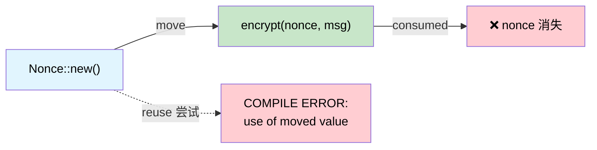

# 一次性类型 —— 通过所有权实现密码学保证 🟡

> **你将学到什么：** Rust 的移动语义如何作为线性类型系统，在编译时使 nonce 重用、双重密钥协商和意外的熔丝重新编程变得不可能。
>
> **交叉引用**：[第 1 章](ch01-the-philosophy-why-types-beat-tests.md)（理念）、[第 4 章](ch04-capability-tokens-zero-cost-proof-of-aut.md)（能力令牌）、[第 5 章](ch05-protocol-state-machines-type-state-for-r.md)（type-state）、[第 14 章](ch14-testing-type-level-guarantees.md)（测试 compile-fail）

## Nonce 重用灾难

在认证加密（AES-GCM、ChaCha20-Poly1305）中，对同一个 key 重用 nonce 是**灾难性的** —— 它会泄露两个明文的 XOR，甚至认证密钥本身。这不是理论上的担忧：

- **2016**：TLS 中 AES-GCM 的 Forbidden Attack —— nonce 重用允许明文恢复
- **2020**：多个 IoT 固件更新系统因 RNG 不佳而重用 nonce

在 C/C++ 中，nonce 只是 `uint8_t[12]`。没有什么能阻止你使用它两次。

```c
// C —— 没有什么能阻止 nonce 重用
uint8_t nonce[12];
generate_nonce(nonce);
encrypt(key, nonce, msg1, out1);   // ✅ 第一次使用
encrypt(key, nonce, msg2, out2);   // 🐛 灾难性的：相同的 nonce
```

## 移动语义作为线性类型

Rust 的所有权系统实际上是**线性类型系统** —— 一个值只能使用一次（移动），除非它实现了 `Copy`。`ring` crate 利用了这一点：

```rust,ignore
// ring::aead::Nonce 是：
// - 不是 Clone
// - 不是 Copy
// - 使用时按值消耗
pub struct Nonce(/* private */);

impl Nonce {
    pub fn try_assume_unique_for_key(value: &[u8]) -> Result<Self, Unspecified> {
        // ...
    }
    // 没有 Clone，没有 Copy —— 只能使用一次
}
```

当你将 `Nonce` 传递给 `seal_in_place()` 时，**它被移动了**：

```rust,ignore
// 伪代码，镜像 ring 的 API 形式
fn seal_in_place(
    key: &SealingKey,
    nonce: Nonce,       // ← 被移动，不是借用
    data: &mut Vec<u8>,
) -> Result<(), Error> {
    // ... 原地加密数据 ...
    // nonce 被消耗 —— 不能再使用
    Ok(())
}
```

尝试重用它：

```rust,ignore
fn bad_encrypt(key: &SealingKey, data1: &mut Vec<u8>, data2: &mut Vec<u8>) {
    // .unwrap() 是安全的 —— 12 字节数组总是有效的 nonce
    let nonce = Nonce::try_assume_unique_for_key(&[0u8; 12]).unwrap();
    seal_in_place(key, nonce, data1).unwrap();  // ✅ nonce 在这里被移动
    // seal_in_place(key, nonce, data2).unwrap();
    //                    ^^^^^^ 错误：使用已移动的值 ❌
}
```

编译器**证明**每个 nonce 正好使用一次。不需要测试。

## 案例研究：ring 的 Nonce

`ring` crate 更进一步使用 `NonceSequence` —— 一个**生成** nonce 的 trait，也是不可克隆的：

```rust,ignore
/// 唯一 nonce 序列。
/// 不是 Clone —— 一旦绑定到 key，就不能复制。
pub trait NonceSequence {
    fn advance(&mut self) -> Result<Nonce, Unspecified>;
}

/// SealingKey 封装了 NonceSequence —— 每次 seal() 自动推进。
pub struct SealingKey<N: NonceSequence> {
    key: UnboundKey,   // 在构造期间被消耗
    nonce_seq: N,
}

impl<N: NonceSequence> SealingKey<N> {
    pub fn new(key: UnboundKey, nonce_seq: N) -> Self {
        // UnboundKey 被移动 —— 不能同时用于密封和解封
        SealingKey { key, nonce_seq }
    }

    pub fn seal_in_place_append_tag(
        &mut self,       // &mut —— 独占访问
        aad: Aad<&[u8]>,
        in_out: &mut Vec<u8>,
    ) -> Result<(), Unspecified> {
        let nonce = self.nonce_seq.advance()?; // 自动生成唯一 nonce
        // ... 用 nonce 加密 ...
        Ok(())
    }
}
# pub struct UnboundKey;
# pub struct Aad<T>(T);
# pub struct Unspecified;
```

所有权链防止：
1. **Nonce 重用** —— `Nonce` 不是 `Clone`，每次调用时被消耗
2. **Key 复制** —— `UnboundKey` 被移动到 `SealingKey`，不能同时创建 `OpeningKey`
3. **序列复制** —— `NonceSequence` 不是 `Clone`，所以没有两个 key 共享计数器

**这些都不需要运行时检查。** 编译器强制执行所有三个。

## 案例研究：临时密钥协商

临时 Diffie-Hellman 密钥必须**正好使用一次**（这就是"临时"的含义）。`ring` 强制执行这一点：

```rust,ignore
/// 临时私钥。不是 Clone，不是 Copy。
/// 被 agree_ephemeral() 消耗。
pub struct EphemeralPrivateKey { /* ... */ }

/// 计算共享密钥 —— 消耗私钥。
pub fn agree_ephemeral(
    my_private_key: EphemeralPrivateKey,  // ← 被移动
    peer_public_key: &UnparsedPublicKey,
    error_value: Unspecified,
    kdf: impl FnOnce(&[u8]) -> Result<SharedSecret, Unspecified>,
) -> Result<SharedSecret, Unspecified> {
    // ... DH 计算 ...
    // my_private_key 被消耗 —— 永远不能重用
    # kdf(&[])
}
# pub struct UnparsedPublicKey;
# pub struct SharedSecret;
# pub struct Unspecified;
```

调用 `agree_ephemeral()` 后，私钥**在内存中不再存在**（它已被丢弃）。C++ 开发者需要记住 `memset(key, 0, len)` 并希望编译器不优化掉它。在 Rust 中，密钥 simplemente 消失了。

## 硬件应用：一次性熔丝编程

服务器平台有**OTP（一次性可编程）熔丝**用于安全密钥、板序列号和特性位。写入熔丝是不可逆的 —— 用不同数据写入两次会使板子变砖。这是移动语义的完美应用场景：

```rust,ignore
use std::io;

/// 熔丝写入负载。不是 Clone，不是 Copy。
/// 在编程时消耗。
pub struct FusePayload {
    address: u32,
    data: Vec<u8>,
    // 私有构造器 —— 只能通过验证的 builder 创建
}

/// 熔丝编程器处于正确状态的证明。
pub struct FuseController {
    /* 硬件句柄 */
}

impl FuseController {
    /// 编程熔丝 —— 消耗负载，防止双重写入。
    pub fn program(
        &mut self,
        payload: FusePayload,  // ← 被移动 —— 不能使用两次
    ) -> io::Result<()> {
        // ... 写入 OTP 硬件 ...
        // payload 被消耗 —— 尝试用相同的 payload 再次编程
        // 是编译错误
        Ok(())
    }
}

/// 带验证的 Builder —— 创建 FusePayload 的唯一方式。
pub struct FusePayloadBuilder {
    address: Option<u32>,
    data: Option<Vec<u8>>,
}

impl FusePayloadBuilder {
    pub fn new() -> Self {
        FusePayloadBuilder { address: None, data: None }
    }

    pub fn address(mut self, addr: u32) -> Self {
        self.address = Some(addr);
        self
    }

    pub fn data(mut self, data: Vec<u8>) -> Self {
        self.data = Some(data);
        self
    }

    pub fn build(self) -> Result<FusePayload, &'static str> {
        let address = self.address.ok_or("address required")?;
        let data = self.data.ok_or("data required")?;
        if data.len() > 32 { return Err("fuse data too long"); }
        Ok(FusePayload { address, data })
    }
}

// 用法：
fn program_board_serial(ctrl: &mut FuseController) -> io::Result<()> {
    let payload = FusePayloadBuilder::new()
        .address(0x100)
        .data(b"SN12345678".to_vec())
        .build()
        .map_err(|e| io::Error::new(io::ErrorKind::InvalidInput, e))?;

    ctrl.program(payload)?;      // ✅ payload 被消耗

    // ctrl.program(payload);    // ❌ 错误：使用已移动的值
    //              ^^^^^^^ value used after move

    Ok(())
}
```

## 硬件应用：一次性校准令牌

某些传感器需要校准步骤，并且每个电源周期**必须正好发生一次**。校准令牌强制执行这一点：

```rust,ignore
/// 在开机时发放一次。不是 Clone，不是 Copy。
pub struct CalibrationToken {
    _private: (),
}

pub struct SensorController {
    calibrated: bool,
}

impl SensorController {
    /// 在开机时调用一次 —— 返回校准令牌。
    pub fn power_on() -> (Self, CalibrationToken) {
        (
            SensorController { calibrated: false },
            CalibrationToken { _private: () },
        )
    }

    /// 校准传感器 —— 消耗令牌。
    pub fn calibrate(&mut self, _token: CalibrationToken) -> io::Result<()> {
        // ... 运行校准序列 ...
        self.calibrated = true;
        Ok(())
    }

    /// 读取传感器 —— 只有在校准后才有意义。
    ///
    /// **局限性：** 移动语义保证是*部分*的。调用者可以
    /// `drop(cal_token)` 而不调用 `calibrate()` —— 令牌会被销毁
    /// 但校准不会运行。`#[must_use]` 注解（见下文）会生成警告，
    /// 但不是硬错误。
    ///
    /// 这里运行时 `self.calibrated` 检查是这种情况的**安全网**。
    /// 对于完全的编译时解决方案，参见第 5 章的 type-state 模式，
    /// 其中 `send_command()` 只存在于 `IpmiSession<Active>` 上。
    pub fn read(&self) -> io::Result<f64> {
        if !self.calibrated {
            return Err(io::Error::new(io::ErrorKind::Other, "not calibrated"));
        }
        Ok(25.0) // stub
    }
}

fn sensor_workflow() -> io::Result<()> {
    let (mut ctrl, cal_token) = SensorController::power_on();

    // cal_token 必须在某处使用 —— 它不是 Copy，所以丢弃它
    // 而不消耗它会生成警告（或使用 #[must_use] 时为错误）
    ctrl.calibrate(cal_token)?;

    // 现在读取有效：
    let temp = ctrl.read()?;
    println!("Temperature: {temp}°C");

    // 不能再校准 —— 令牌被消耗：
    // ctrl.calibrate(cal_token);  // ❌ 使用已移动的值

    Ok(())
}
```

### 何时使用一次性类型

| 场景 | 使用一次性（移动）语义？ |
|----------|:------:|
| 密码学 nonces | ✅ 总是 —— nonce 重用是灾难性的 |
| 临时密钥（DH、ECDH） | ✅ 总是 —— 重用削弱前向保密性 |
| OTP 熔丝写入 | ✅ 总是 —— 双重写入使硬件变砖 |
| 许可证激活码 | ✅ 通常 —— 防止双重激活 |
| 校准令牌 | ✅ 通常 —— 强制执行每会话一次 |
| 文件写句柄 | ⚠️ 有时 —— 取决于协议 |
| 数据库事务句柄 | ⚠️ 有时 —— commit/rollback 是一次性的 |
| 通用数据缓冲区 | ❌ 这些需要重用 —— 使用 `&mut [u8]` |

## 一次性所有权流



## 练习：一次性固件签名令牌

设计一个 `SigningToken`，只能使用一次来签名固件镜像：
- `SigningToken::issue(key_id: &str) -> SigningToken`（不是 Clone，不是 Copy）
- `sign(token: SigningToken, image: &[u8]) -> SignedImage`（消耗令牌）
- 尝试签名两次应该是编译错误。

<details>
<summary>解决方案</summary>

```rust,ignore
pub struct SigningToken {
    key_id: String,
    // 不是 Clone，不是 Copy
}

pub struct SignedImage {
    pub signature: Vec<u8>,
    pub key_id: String,
}

impl SigningToken {
    pub fn issue(key_id: &str) -> Self {
        SigningToken { key_id: key_id.to_string() }
    }
}

pub fn sign(token: SigningToken, _image: &[u8]) -> SignedImage {
    // 令牌通过移动被消耗 —— 不能重用
    SignedImage {
        signature: vec![0xDE, 0xAD],  // stub
        key_id: token.key_id,
    }
}

// ✅ 编译通过：
// let tok = SigningToken::issue("release-key");
// let signed = sign(tok, &firmware_bytes);
//
// ❌ 编译错误：
// let signed2 = sign(tok, &other_bytes);  // ERROR: use of moved value
```

</details>

## 关键要点

1. **移动 = 线性使用** —— 非 Clone、非 Copy 的类型只能被消耗一次；编译器强制执行这一点。
2. **Nonce 重用是灾难性的** —— Rust 的所有权系统在结构上防止它，而不是靠纪律。
3. **模式适用于密码学之外** —— OTP 熔丝、校准令牌、审计条目 —— 任何最多发生一次的事情。
4. **临时密钥免费获得前向保密性** —— 密钥协商值被移动到派生的秘密中并消失。
5. **如有疑问，移除 `Clone`** —— 你总是可以稍后添加它；从已发布的 API 中移除它是破坏性变更。

---

