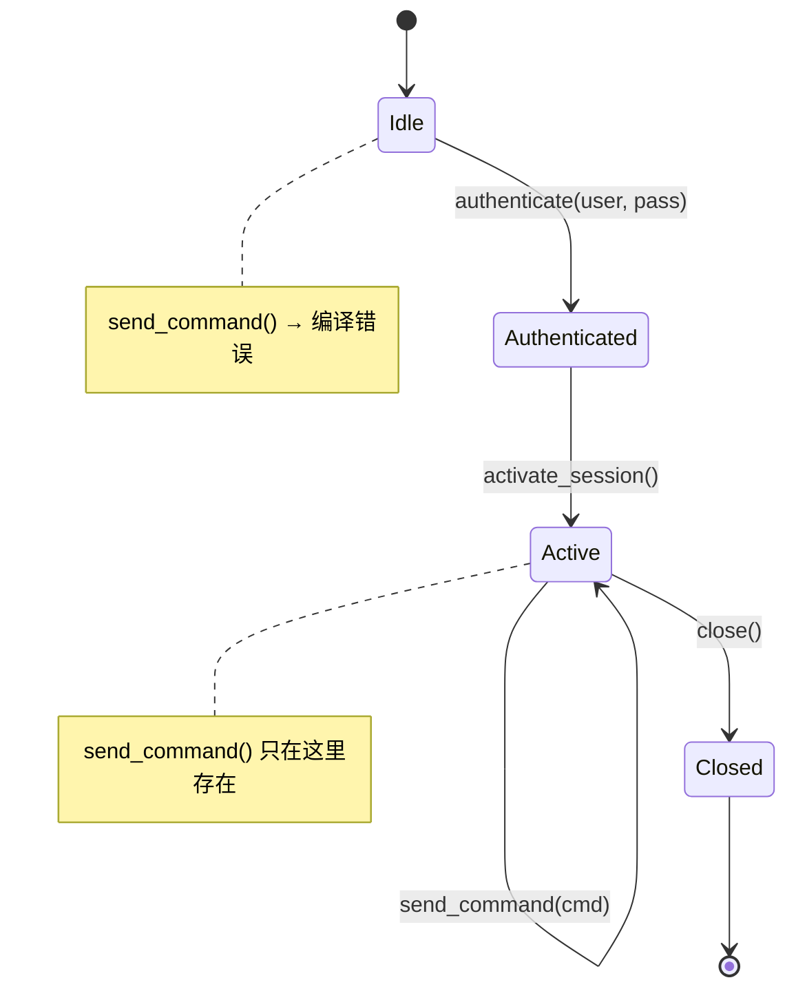
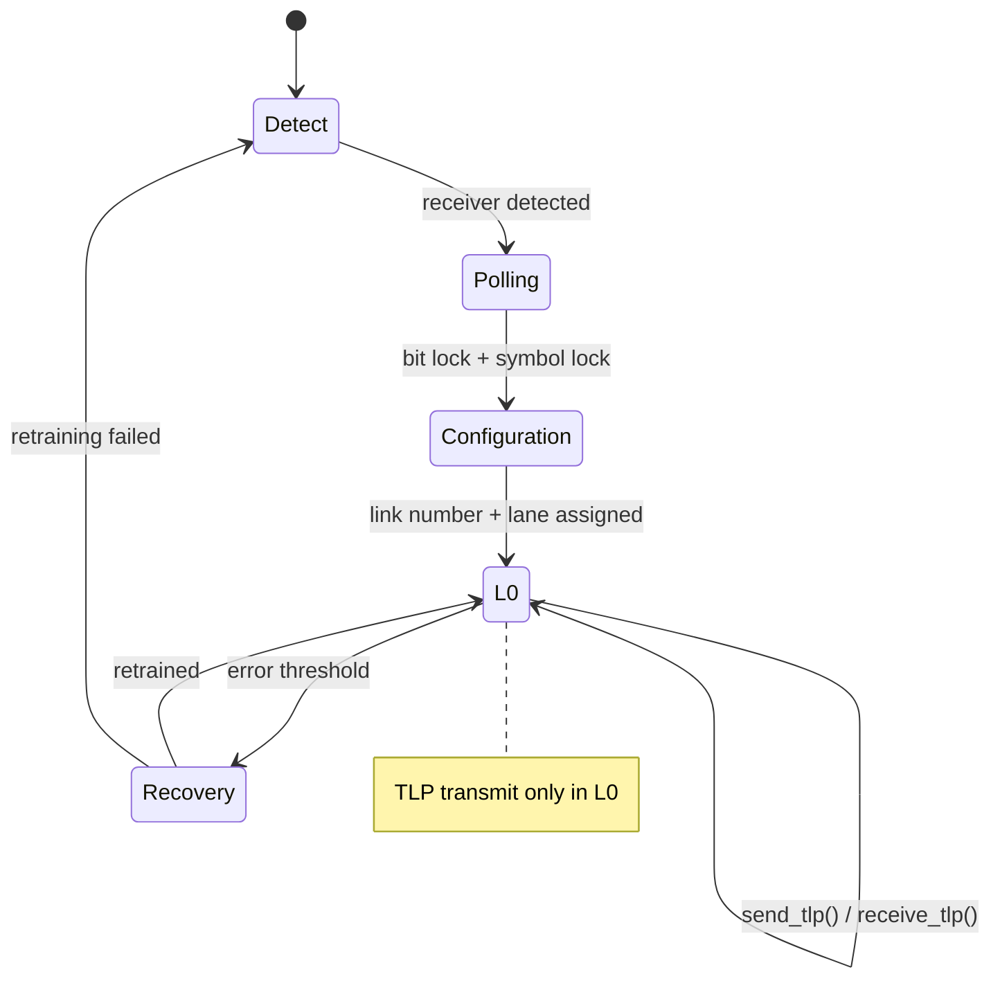
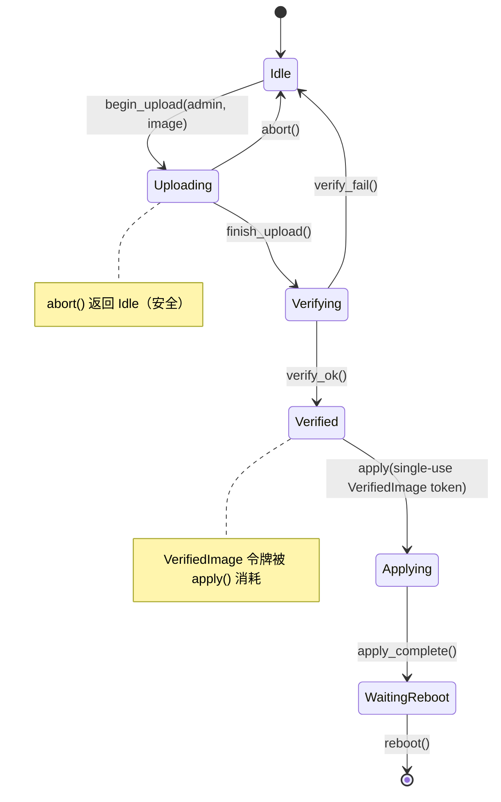

# 协议状态机 —— 真实硬件的 Type-State 🔴

> **你将学到什么：** type-state 编码如何将协议违规（错误顺序的命令、close 后使用）变成编译错误，应用于 IPMI 会话生命周期和 PCIe 链路训练。
>
> **交叉引用**：[第 1 章](ch01-the-philosophy-why-types-beat-tests.md)（级别 2 —— 状态正确性）、[第 4 章](ch04-capability-tokens-zero-cost-proof-of-aut.md)（令牌）、[第 9 章](ch09-phantom-types-for-resource-tracking.md)（phantom 类型）、[第 11 章](ch11-fourteen-tricks-from-the-trenches.md)（技巧 4 —— typestate builder，技巧 8 —— async type-state）

## 问题：协议违规

硬件协议有**严格的状态机**。IPMI 会话有以下状态：
Unauthenticated → Authenticated → Active → Closed。PCIe 链路训练经历
Detect → Polling → Configuration → L0。在错误的状态下发送命令
会破坏会话或挂起总线。

**IPMI 会话状态机：**



**PCIe 链路训练状态机（LTSSM）：**



在 C/C++ 中，状态用 enum 和运行时检查跟踪：

```c
typedef enum { IDLE, AUTHENTICATED, ACTIVE, CLOSED } session_state_t;

typedef struct {
    session_state_t state;
    uint32_t session_id;
    // ...
} ipmi_session_t;

int ipmi_send_command(ipmi_session_t *s, uint8_t cmd, uint8_t *data, int len) {
    if (s->state != ACTIVE) {        // 运行时检查 —— 容易忘记
        return -EINVAL;
    }
    // ... 发送命令 ...
    return 0;
}
```

## Type-State 模式

使用 type-state，每个协议状态是一个**不同的类型**。转换是消耗一个状态并返回另一个的方法。编译器阻止在错误状态下调用方法，因为**那些方法在该类型上不存在**。

```rust,ignore
use std::marker::PhantomData;

// 状态 —— 零大小标记类型
pub struct Idle;
## 案例研究：IPMI 会话生命周期

pub struct Authenticated;
pub struct Active;
pub struct Closed;

/// IPMI 会话参数化其当前状态。
/// 状态只存在于类型系统中（PhantomData 是零大小的）。
pub struct IpmiSession<State> {
    transport: String,     // 例如 "192.168.1.100"
    session_id: Option<u32>,
    _state: PhantomData<State>,
}

// 转换：Idle → Authenticated
impl IpmiSession<Idle> {
    pub fn new(host: &str) -> Self {
        IpmiSession {
            transport: host.to_string(),
            session_id: None,
            _state: PhantomData,
        }
    }

    pub fn authenticate(
        self,              // ← 消耗 Idle 会话
        user: &str,
        pass: &str,
    ) -> Result<IpmiSession<Authenticated>, String> {
        println!("Authenticating {user} on {}", self.transport);
        Ok(IpmiSession {
            transport: self.transport,
            session_id: Some(42),
            _state: PhantomData,
        })
    }
}

// 转换：Authenticated → Active
impl IpmiSession<Authenticated> {
    pub fn activate(self) -> Result<IpmiSession<Active>, String> {
        // session_id 通过 type-state 转换路径保证为 Some
        println!("Activating session {}", self.session_id.unwrap());
        Ok(IpmiSession {
            transport: self.transport,
            session_id: self.session_id,
            _state: PhantomData,
        })
    }
}

// 仅在 Active 状态下可用的操作
impl IpmiSession<Active> {
    pub fn send_command(&mut self, netfn: u8, cmd: u8, data: &[u8]) -> Vec<u8> {
        // session_id 在 Active 状态下保证为 Some
        println!("Sending cmd 0x{cmd:02X} on session {}", self.session_id.unwrap());
        vec![0x00] // stub: completion code OK
    }

    pub fn close(self) -> IpmiSession<Closed> {
        // session_id 在 Active 状态下保证为 Some
        println!("Closing session {}", self.session_id.unwrap());
        IpmiSession {
            transport: self.transport,
            session_id: None,
            _state: PhantomData,
        }
    }
}

fn ipmi_workflow() -> Result<(), String> {
    let session = IpmiSession::new("192.168.1.100");

    // session.send_command(0x04, 0x2D, &[]);
    //  ^^^^^^ 错误：IpmiSession<Idle> 上没有方法 `send_command` ❌

    let session = session.authenticate("admin", "password")?;

    // session.send_command(0x04, 0x2D, &[]);
    //  ^^^^^^ 错误：IpmiSession<Authenticated> 上没有方法 `send_command` ❌

    let mut session = session.activate()?;

    // ✅ 现在 send_command 存在：
    let response = session.send_command(0x04, 0x2D, &[1]);

    let _closed = session.close();

    // _closed.send_command(0x04, 0x2D, &[]);
    //  ^^^^^^ 错误：IpmiSession<Closed> 上没有方法 `send_command` ❌

    Ok(())
}
```

**任何地方都没有运行时状态检查。** 编译器强制执行：
- 激活前认证
- 发送命令前激活
- close 后不能发送命令

## PCIe 链路训练状态机

PCIe 链路训练是 PCIe 规范中定义的多阶段协议。
Type-state 防止在链路就绪前发送数据：

```rust,ignore
use std::marker::PhantomData;

// PCIe LTSSM 状态（简化）
pub struct Detect;
pub struct Polling;
pub struct Configuration;
pub struct L0;         // 完全操作状态
pub struct Recovery;

pub struct PcieLink<State> {
    slot: u32,
    width: u8,          // 协商的宽度（x1, x4, x8, x16）
    speed: u8,          // Gen1=1, Gen2=2, Gen3=3, Gen4=4, Gen5=5
    _state: PhantomData<State>,
}

impl PcieLink<Detect> {
    pub fn new(slot: u32) -> Self {
        PcieLink {
            slot, width: 0, speed: 0,
            _state: PhantomData,
        }
    }

    pub fn detect_receiver(self) -> Result<PcieLink<Polling>, String> {
        println!("Slot {}: receiver detected", self.slot);
        Ok(PcieLink {
            slot: self.slot, width: 0, speed: 0,
            _state: PhantomData,
        })
    }
}

impl PcieLink<Polling> {
    pub fn poll_compliance(self) -> Result<PcieLink<Configuration>, String> {
        println!("Slot {}: polling complete, entering configuration", self.slot);
        Ok(PcieLink {
            slot: self.slot, width: 0, speed: 0,
            _state: PhantomData,
        })
    }
}

impl PcieLink<Configuration> {
    pub fn negotiate(self, width: u8, speed: u8) -> Result<PcieLink<L0>, String> {
        println!("Slot {}: negotiated x{width} Gen{speed}", self.slot);
        Ok(PcieLink {
            slot: self.slot, width, speed,
            _state: PhantomData,
        })
    }
}

impl PcieLink<L0> {
    /// 发送 TLP —— 只有在链路完全训练（L0）时才可能。
    pub fn send_tlp(&mut self, tlp: &[u8]) -> Vec<u8> {
        println!("Slot {}: sending {} byte TLP", self.slot, tlp.len());
        vec![0x00] // stub
    }

    /// 进入 recovery —— 返回到 Recovery 状态。
    pub fn enter_recovery(self) -> PcieLink<Recovery> {
        PcieLink {
            slot: self.slot, width: self.width, speed: self.speed,
            _state: PhantomData,
        }
    }

    pub fn link_info(&self) -> String {
        format!("x{} Gen{}", self.width, self.speed)
    }
}

impl PcieLink<Recovery> {
    pub fn retrain(self, speed: u8) -> Result<PcieLink<L0>, String> {
        println!("Slot {}: retrained at Gen{speed}", self.slot);
        Ok(PcieLink {
            slot: self.slot, width: self.width, speed,
            _state: PhantomData,
        })
    }
}

fn pcie_workflow() -> Result<(), String> {
    let link = PcieLink::new(0);

    // link.send_tlp(&[0x01]);  // ❌ PcieLink<Detect> 上没有方法 `send_tlp`

    let link = link.detect_receiver()?;
    let link = link.poll_compliance()?;
    let mut link = link.negotiate(16, 5)?; // x16 Gen5

    // ✅ 现在我们可以发送 TLP：
    let _resp = link.send_tlp(&[0x00, 0x01, 0x02]);
    println!("Link: {}", link.link_info());

    // Recovery 和 retrain：
    let recovery = link.enter_recovery();
    let mut link = recovery.retrain(4)?;  // 降级到 Gen4
    let _resp = link.send_tlp(&[0x03]);

    Ok(())
}
```

## 组合 Type-State 和能力令牌

Type-state 和能力令牌自然地组合。需要活跃 IPMI 会话和管理员权限的诊断：

```rust,ignore
# use std::marker::PhantomData;
# pub struct Active;
# pub struct AdminToken { _p: () }
# pub struct IpmiSession<S> { _s: PhantomData<S> }
# impl IpmiSession<Active> {
#     pub fn send_command(&mut self, _nf: u8, _cmd: u8, _d: &[u8]) -> Vec<u8> { vec![] }
# }

/// 运行固件更新 —— 需要：
/// 1. 活跃的 IPMI 会话（type-state）
/// 2. 管理员权限（能力令牌）
pub fn firmware_update(
    session: &mut IpmiSession<Active>,   // 证明会话活跃
    _admin: &AdminToken,                 // 证明调用者是管理员
    image: &[u8],
) -> Result<(), String> {
    // 不需要运行时检查 —— 签名就是检查
    session.send_command(0x2C, 0x01, image);
    Ok(())
}
```

调用者必须：
1. 创建会话（`Idle`）
2. 认证（`Authenticated`）
3. 激活（`Active`）
4. 获取 `AdminToken`
5. 然后才能调用 `firmware_update()`

全部在编译时强制执行，零运行时成本。

## Beat 3：固件更新 —— 多阶段 FSM 与组合

固件更新生命周期比会话有更多的状态，并与能力令牌和一次性类型（第 3 章）组合。这是本书最复杂的 type-state 示例 —— 如果你对它感到舒适，你已经掌握了这个模式。



```rust,ignore
use std::marker::PhantomData;

// ── 状态 ──
pub struct Idle;
pub struct Uploading;
pub struct Verifying;
pub struct Verified;
pub struct Applying;
pub struct WaitingReboot;

// ── 一次性证明镜像通过验证（第 3 章）──
pub struct VerifiedImage {
    _private: (),
    pub digest: [u8; 32],
}

// ── 能力令牌：只有管理员可以发起（第 4 章）──
pub struct FirmwareAdminToken { _private: () }

pub struct FwUpdate<S> {
    version: String,
    _state: PhantomData<S>,
}

impl FwUpdate<Idle> {
    pub fn new() -> Self {
        FwUpdate { version: String::new(), _state: PhantomData }
    }

    /// 开始上传 —— 需要管理员权限。
    pub fn begin_upload(
        self,
        _admin: &FirmwareAdminToken,
        version: &str,
    ) -> FwUpdate<Uploading> {
        println!("Uploading firmware v{version}...");
        FwUpdate { version: version.to_string(), _state: PhantomData }
    }
}

impl FwUpdate<Uploading> {
    pub fn finish_upload(self) -> FwUpdate<Verifying> {
        println!("Upload complete, verifying v{}...", self.version);
        FwUpdate { version: self.version, _state: PhantomData }
    }

    /// Abort 返回 Idle —— 在上传过程中的任何时候都是安全的。
    pub fn abort(self) -> FwUpdate<Idle> {
        println!("Upload aborted.");
        FwUpdate { version: String::new(), _state: PhantomData }
    }
}

impl FwUpdate<Verifying> {
    /// 成功后，生成一次性 VerifiedImage 令牌。
    pub fn verify_ok(self, digest: [u8; 32]) -> (FwUpdate<Verified>, VerifiedImage) {
        println!("Verification passed for v{}", self.version);
        (
            FwUpdate { version: self.version, _state: PhantomData },
            VerifiedImage { _private: (), digest },
        )
    }

    pub fn verify_fail(self) -> FwUpdate<Idle> {
        println!("Verification failed — returning to idle.");
        FwUpdate { version: String::new(), _state: PhantomData }
    }
}

impl FwUpdate<Verified> {
    /// Apply 消耗 VerifiedImage 令牌 —— 不能应用两次。
    pub fn apply(self, proof: VerifiedImage) -> FwUpdate<Applying> {
        println!("Applying v{} (digest: {:02x?})", self.version, &proof.digest[..4]);
        // proof 被移动 —— 不能重用
        FwUpdate { version: self.version, _state: PhantomData }
    }
}

impl FwUpdate<Applying> {
    pub fn apply_complete(self) -> FwUpdate<WaitingReboot> {
        println!("Apply complete — waiting for reboot.");
        FwUpdate { version: self.version, _state: PhantomData }
    }
}

impl FwUpdate<WaitingReboot> {
    pub fn reboot(self) {
        println!("Rebooting into v{}...", self.version);
    }
}

// ── 用法 ──

fn firmware_workflow() {
    let fw = FwUpdate::new();

    // fw.finish_upload();  // ❌ FwUpdate<Idle> 上没有方法 `finish_upload`

    let admin = FirmwareAdminToken { _private: () }; // 来自认证系统
    let fw = fw.begin_upload(&admin, "2.10.1");
    let fw = fw.finish_upload();

    let digest = [0xAB; 32]; // 验证期间计算
    let (fw, token) = fw.verify_ok(digest);

    let fw = fw.apply(token);
    // fw.apply(token);  // ❌ 使用已移动的值：`token`

    let fw = fw.apply_complete();
    fw.reboot();
}
```

**三个 beats 一起说明的内容：**

| Beat | 协议 | 状态数 | 组合 |
|:----:|----------|:------:|-------------|
| 1 | IPMI 会话 | 4 | 纯 type-state |
| 2 | PCIe LTSSM | 5 | Type-state + recovery 分支 |
| 3 | 固件更新 | 6 | Type-state + 能力令牌（第 4 章）+ 一次性证明（第 3 章） |

每个 beat 增加一层复杂性。到 beat 3 时，编译器强制执行状态顺序、管理员权限和一次性应用 —— 单个 FSM 中消除三个 bug 类别。

### 何时使用 Type-State

| 协议 | Type-State 值得吗？ |
|----------|:------:|
| IPMI 会话生命周期 | ✅ 是 —— authenticate → activate → command → close |
| PCIe 链路训练 | ✅ 是 —— detect → poll → configure → L0 |
| TLS 握手 | ✅ 是 —— ClientHello → ServerHello → Finished |
| USB 枚举 | ✅ 是 —— Attached → Powered → Default → Addressed → Configured |
| 简单的请求/响应 | ⚠️ 可能不 —— 只有 2 个状态 |
| Fire-and-forget 消息 | ❌ 不 —— 没有状态需要跟踪 |

## 练习：USB 设备枚举 Type-State

建模一个 USB 设备必须经历：`Attached` → `Powered` → `Default` → `Addressed` → `Configured`。每个转换应该消耗前一个状态并生成下一个状态。`send_data()` 应该只在 `Configured` 中可用。

<details>
<summary>解决方案</summary>

```rust,ignore
use std::marker::PhantomData;

pub struct Attached;
pub struct Powered;
pub struct Default;
pub struct Addressed;
pub struct Configured;

pub struct UsbDevice<State> {
    address: u8,
    _state: PhantomData<State>,
}

impl UsbDevice<Attached> {
    pub fn new() -> Self {
        UsbDevice { address: 0, _state: PhantomData }
    }
    pub fn power_on(self) -> UsbDevice<Powered> {
        UsbDevice { address: self.address, _state: PhantomData }
    }
}

impl UsbDevice<Powered> {
    pub fn reset(self) -> UsbDevice<Default> {
        UsbDevice { address: self.address, _state: PhantomData }
    }
}

impl UsbDevice<Default> {
    pub fn set_address(self, addr: u8) -> UsbDevice<Addressed> {
        UsbDevice { address: addr, _state: PhantomData }
    }
}

impl UsbDevice<Addressed> {
    pub fn configure(self) -> UsbDevice<Configured> {
        UsbDevice { address: self.address, _state: PhantomData }
    }
}

impl UsbDevice<Configured> {
    pub fn send_data(&self, _data: &[u8]) {
        // 仅在 Configured 状态下可用
    }
}
```

</details>

## 关键要点

1. **Type-state 使错误顺序的调用不可能** —— 方法只存在于它们有效的状态上。
2. **每个转换消耗 `self`** —— 转换后不能保留旧状态。
3. **与能力令牌组合** —— `firmware_update()` 需要*两者* `Session<Active>` 和 `AdminToken`。
4. **三个 beats，增加的复杂性** —— IPMI（纯 FSM）、PCIe LTSSM（recovery 分支）和固件更新（FSM + 令牌 + 一次性证明）展示模式从简单扩展到丰富组合。
5. **不要过度应用** —— 两状态请求/响应协议不用 type-state 更简单。
6. **模式扩展到完整的 Redfish 工作流** —— 第 17 章将 type-state 应用于 Redfish 会话生命周期，第 18 章将 builder type-state 用于响应构造。

---

