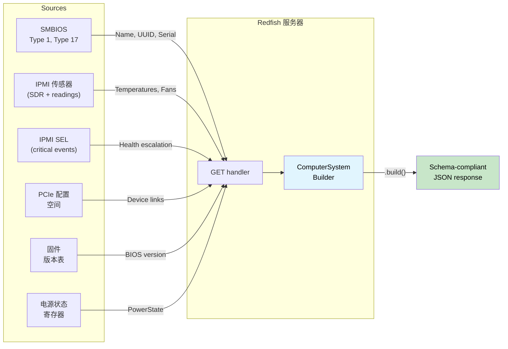

# 应用演练 —— 类型安全 Redfish 服务器 🟡

> **你将学到什么：** 如何将响应 builder type-state、源可用性令牌、量纲序列化、健康汇总、模式版本化和类型化动作分派组合成一个 Redfish 服务器，**无法产生模式非合规响应** —— [ch17](ch17-redfish-applied-walkthrough.md) 客户端演练的镜像。
>
> **交叉引用**：[ch02](ch02-typed-command-interfaces-request-determi.md)（类型化命令 —— 反转为动作分派）、[ch04](ch04-capability-tokens-zero-cost-proof-of-aut.md)（能力令牌 —— 源可用性）、[ch06](ch06-dimensional-analysis-making-the-compiler.md)（量纲类型 —— 序列化端）、[ch07](ch07-validated-boundaries-parse-dont-validate.md)（验证边界 —— 反转："构造，不要序列化"）、[ch09](ch09-phantom-types-for-resource-tracking.md)（phantom 类型 —— 模式版本化）、[ch11](ch11-fourteen-tricks-from-the-trenches.md)（技巧 3 —— `#[non_exhaustive]`，技巧 4 —— builder type-state）、[ch17](ch17-redfish-applied-walkthrough.md)（客户端对应物）

## 镜像问题

第 17 章问：*"我如何正确消费 Redfish？"* 本章问镜像问题：*"我如何正确产生 Redfish？"*

在客户端，危险是**信任**坏数据。在服务器端，危险是**发出**坏数据 —— 舰队中的每个客户端都相信你发送的内容。

单个 `GET /redfish/v1/Systems/1` 响应必须融合来自多个源的数据：



在 C 中，这是一个 500 行的 handler，调用六个子系统，手动用 `json_object_set()` 构建 JSON 树，希望每个必需字段都被填充。忘记一个？响应违反 Redfish 模式。搞错单位？每个客户端看到损坏的遥测。

```c
// C —— 汇编问题
json_t *get_computer_system(const char *id) {
    json_t *obj = json_object();
    json_object_set_new(obj, "@odata.type",
        json_string("#ComputerSystem.v1_13_0.ComputerSystem"));

    // 🐛 忘了设置 "Name" —— 模式需要它
    // 🐛 忘了设置 "UUID" —— 模式需要它

    smbios_type1_t *t1 = smbios_get_type1();
    if (t1) {
        json_object_set_new(obj, "Manufacturer",
            json_string(t1->manufacturer));
    }

    json_object_set_new(obj, "PowerState",
        json_string(get_power_state()));  // 至少这个总是可用的

    // 🐛 Reading 是原始 ADC 计数，不是 Celsius —— 没有类型捕获它
    double cpu_temp = read_sensor(SENSOR_CPU_TEMP);
    // 这个数字在某个地方的 Thermal 响应中使用...
    // 但没有在类型级别将它与 "Celsius" 绑定

    // 🐛 Health 是手动计算的 —— 忘了包含 PSU 状态
    json_object_set_new(obj, "Status",
        build_status("Enabled", "OK")); // 应该是 "Critical" —— PSU 在失败

    return obj; // 缺少 2 个必需字段，错误的健康，原始单位
}
```

一个 handler 中四个 bug。在客户端，每个 bug 影响**一个**客户端。在服务器端，每个 bug 影响**每个**查询此 BMC 的客户端。

---

## 第 1 节 —— 响应 Builder Type-state："构造，不要序列化"（ch07 反转）

第 7 章教导"解析，不要验证" —— 验证入站数据一次，在类型中携带证明。服务器端镜像是**"构造，不要序列化"** —— 通过 builder 构建出站响应，在所有必需字段存在之前门控 `.build()`。

```rust,ignore
use std::marker::PhantomData;

// ──── 类型级字段跟踪 ────

pub struct HasField;
pub struct MissingField;

// ──── 响应 Builder ────

/// ComputerSystem Redfish 资源的 Builder。
/// 类型参数跟踪哪些 REQUIRED 字段已提供。
/// 可选字段不需要类型级跟踪。
pub struct ComputerSystemBuilder<Name, Uuid, PowerState, Status> {
    // 必需字段 —— 在类型级跟踪
    name: Option<String>,
    uuid: Option<String>,
    power_state: Option<PowerStateValue>,
    status: Option<ResourceStatus>,
    // 可选字段 —— 不跟踪（总是可设置）
    manufacturer: Option<String>,
    model: Option<String>,
    serial_number: Option<String>,
    bios_version: Option<String>,
    processor_summary: Option<ProcessorSummary>,
    memory_summary: Option<MemorySummary>,
    _markers: PhantomData<(Name, Uuid, PowerState, Status)>,
}

#[derive(Debug, Clone, serde::Serialize)]
pub enum PowerStateValue { On, Off, PoweringOn, PoweringOff }

#[derive(Debug, Clone, serde::Serialize)]
pub struct ResourceStatus {
    #[serde(rename = "State")]
    pub state: StatusState,
    #[serde(rename = "Health")]
    pub health: HealthValue,
    #[serde(rename = "HealthRollup", skip_serializing_if = "Option::is_none")]
    pub health_rollup: Option<HealthValue>,
}

#[derive(Debug, Clone, Copy, serde::Serialize)]
pub enum StatusState { Enabled, Disabled, Absent, StandbyOffline, Starting }

#[derive(Debug, Clone, Copy, PartialEq, Eq, PartialOrd, Ord, serde::Serialize)]
pub enum HealthValue { OK, Warning, Critical }

#[derive(Debug, Clone, serde::Serialize)]
pub struct ProcessorSummary {
    #[serde(rename = "Count")]
    pub count: u32,
    #[serde(rename = "Status")]
    pub status: ResourceStatus,
}

#[derive(Debug, Clone, serde::Serialize)]
pub struct MemorySummary {
    #[serde(rename = "TotalSystemMemoryGiB")]
    pub total_gib: f64,
    #[serde(rename = "Status")]
    pub status: ResourceStatus,
}

// ──── 构造函数：所有字段从 MissingField 开始 ────

impl ComputerSystemBuilder<MissingField, MissingField, MissingField, MissingField> {
    pub fn new() -> Self {
        ComputerSystemBuilder {
            name: None, uuid: None, power_state: None, status: None,
            manufacturer: None, model: None, serial_number: None,
            bios_version: None, processor_summary: None, memory_summary: None,
            _markers: PhantomData,
        }
    }
}

// ──── 必需字段设置器 —— 每个转换一个类型参数 ────

impl<U, P, S> ComputerSystemBuilder<MissingField, U, P, S> {
    pub fn name(self, name: String) -> ComputerSystemBuilder<HasField, U, P, S> {
        ComputerSystemBuilder {
            name: Some(name), uuid: self.uuid,
            power_state: self.power_state, status: self.status,
            manufacturer: self.manufacturer, model: self.model,
            serial_number: self.serial_number, bios_version: self.bios_version,
            processor_summary: self.processor_summary,
            memory_summary: self.memory_summary, _markers: PhantomData,
        }
    }
}

impl<N, P, S> ComputerSystemBuilder<N, MissingField, P, S> {
    pub fn uuid(self, uuid: String) -> ComputerSystemBuilder<N, HasField, P, S> {
        ComputerSystemBuilder {
            name: self.name, uuid: Some(uuid),
            power_state: self.power_state, status: self.status,
            manufacturer: self.manufacturer, model: self.model,
            serial_number: self.serial_number, bios_version: self.bios_version,
            processor_summary: self.processor_summary,
            memory_summary: self.memory_summary, _markers: PhantomData,
        }
    }
}

impl<N, U, S> ComputerSystemBuilder<N, U, MissingField, S> {
    pub fn power_state(self, ps: PowerStateValue)
        -> ComputerSystemBuilder<N, U, HasField, S>
    {
        ComputerSystemBuilder {
            name: self.name, uuid: self.uuid,
            power_state: Some(ps), status: self.status,
            manufacturer: self.manufacturer, model: self.model,
            serial_number: self.serial_number, bios_version: self.bios_version,
            processor_summary: self.processor_summary,
            memory_summary: self.memory_summary, _markers: PhantomData,
        }
    }
}

impl<N, U, P> ComputerSystemBuilder<N, U, P, MissingField> {
    pub fn status(self, status: ResourceStatus)
        -> ComputerSystemBuilder<N, U, P, HasField>
    {
        ComputerSystemBuilder {
            name: self.name, uuid: self.uuid,
            power_state: self.power_state, status: Some(status),
            manufacturer: self.manufacturer, model: self.model,
            serial_number: self.serial_number, bios_version: self.bios_version,
            processor_summary: self.processor_summary,
            memory_summary: self.memory_summary, _markers: PhantomData,
        }
    }
}

// ──── 可选字段设置器 —— 在任何状态下可用 ────

impl<N, U, P, S> ComputerSystemBuilder<N, U, P, S> {
    pub fn manufacturer(mut self, m: String) -> Self {
        self.manufacturer = Some(m); self
    }
    pub fn model(mut self, m: String) -> Self {
        self.model = Some(m); self
    }
    pub fn serial_number(mut self, s: String) -> Self {
        self.serial_number = Some(s); self
    }
    pub fn bios_version(mut self, v: String) -> Self {
        self.bios_version = Some(v); self
    }
    pub fn processor_summary(mut self, ps: ProcessorSummary) -> Self {
        self.processor_summary = Some(ps); self
    }
    pub fn memory_summary(mut self, ms: MemorySummary) -> Self {
        self.memory_summary = Some(ms); self
    }
}

// ──── .build() 仅在所有必需字段是 HasField 时存在 ────

impl ComputerSystemBuilder<HasField, HasField, HasField, HasField> {
    pub fn build(self, id: &str) -> serde_json::Value {
        let mut obj = serde_json::json!({
            "@odata.id": format!("/redfish/v1/Systems/{id}"),
            "@odata.type": "#ComputerSystem.v1_13_0.ComputerSystem",
            "Id": id,
            // Type-state 保证这些是 Some —— .unwrap() 在这里安全。
            // 在生产中，优先使用 .expect("guaranteed by type state")。
            "Name": self.name.unwrap(),
            "UUID": self.uuid.unwrap(),
            "PowerState": self.power_state.unwrap(),
            "Status": self.status.unwrap(),
        });

        // 可选字段 —— 仅在存在时包含
        if let Some(m) = self.manufacturer {
            obj["Manufacturer"] = serde_json::json!(m);
        }
        if let Some(m) = self.model {
            obj["Model"] = serde_json::json!(m);
        }
        if let Some(s) = self.serial_number {
            obj["SerialNumber"] = serde_json::json!(s);
        }
        if let Some(v) = self.bios_version {
            obj["BiosVersion"] = serde_json::json!(v);
        }
        // 注意：.unwrap() 用于 to_value() 是为了简洁。
        // 生产代码应该用 `?` 传播序列化错误。
        if let Some(ps) = self.processor_summary {
            obj["ProcessorSummary"] = serde_json::to_value(ps).unwrap();
        }
        if let Some(ms) = self.memory_summary {
            obj["MemorySummary"] = serde_json::to_value(ms).unwrap();
        }

        obj
    }
}

//
// ── 编译器强制执行完整性 ──
//
// ✅ 所有必需字段设置 —— .build() 可用：
// ComputerSystemBuilder::new()
//     .name("PowerEdge R750".into())
//     .uuid("4c4c4544-...".into())
//     .power_state(PowerStateValue::On)
//     .status(ResourceStatus { ... })
//     .manufacturer("Dell".into())        // 可选 —— 可以包含
//     .build("1")
//
// ❌ 缺少 "Name" —— 编译错误：
// ComputerSystemBuilder::new()
//     .uuid("4c4c4544-...".into())
//     .power_state(PowerStateValue::On)
//     .status(ResourceStatus { ... })
//     .build("1")
//   ERROR: method `build` not found for
//   `ComputerSystemBuilder<MissingField, HasField, HasField, HasField>`
```

**消除的 bug 类别：** 模式非合规响应。handler 物理上无法在不提供每个必需字段的情况下序列化 `ComputerSystem`。编译器错误消息甚至告诉你*哪个*字段缺失 —— 它就在类型参数中：`Name` 位置中的 `MissingField`。

---

## 第 2 节 —— 源可用性令牌（能力令牌，ch04 —— 新变体）

在 ch04 和 ch17 中，能力令牌证明**授权** —— "调用者允许这样做。" 在服务器端，相同模式证明**可用性** —— "此数据源成功初始化。"

BMC 查询的每个子系统可以独立失败。SMBIOS 表可能损坏。传感器子系统可能仍在初始化。PCIe 总线扫描可能超时。将每个编码为证明令牌：

```rust,ignore
/// 证明 SMBIOS 表成功解析。
/// 仅由 SMBIOS init 函数产生。
pub struct SmbiosReady {
    _private: (),
}

/// 证明 IPMI 传感器子系统响应。
pub struct SensorsReady {
    _private: (),
}

/// 证明 PCIe 总线扫描完成。
pub struct PcieReady {
    _private: (),
}

/// 证明 SEL 成功读取。
pub struct SelReady {
    _private: (),
}

// ──── 数据源初始化 ────

pub struct SmbiosTables {
    pub product_name: String,
    pub manufacturer: String,
    pub serial_number: String,
    pub uuid: String,
}

pub struct SensorCache {
    pub cpu_temp: Celsius,
    pub inlet_temp: Celsius,
    pub fan_readings: Vec<(String, Rpm)>,
    pub psu_power: Vec<(String, Watts)>,
}

/// 丰富的 SEL 摘要 —— 来自类型化事件的每子系统健康派生。
/// 由 ch07 SEL 节中的消费者流水线构建。
/// 替换有损的 `has_critical_events: bool` 与类型化粒度。
pub struct TypedSelSummary {
    pub total_entries: u32,
    pub processor_health: HealthValue,
    pub memory_health: HealthValue,
    pub power_health: HealthValue,
    pub thermal_health: HealthValue,
    pub fan_health: HealthValue,
    pub storage_health: HealthValue,
    pub security_health: HealthValue,
}

pub fn init_smbios() -> Option<(SmbiosReady, SmbiosTables)> {
    // 读取 SMBIOS 入口点，解析表...
    // 如果表不存在或损坏则返回 None
    Some((
        SmbiosReady { _private: () },
        SmbiosTables {
            product_name: "PowerEdge R750".into(),
            manufacturer: "Dell Inc.".into(),
            serial_number: "SVC1234567".into(),
            uuid: "4c4c4544-004d-5610-804c-b2c04f435031".into(),
        },
    ))
}

pub fn init_sensors() -> Option<(SensorsReady, SensorCache)> {
    // 初始化 SDR 存储库，读取所有传感器...
    // 如果 IPMI 子系统不响应则返回 None
    Some((
        SensorsReady { _private: () },
        SensorCache {
            cpu_temp: Celsius(68.0),
            inlet_temp: Celsius(24.0),
            fan_readings: vec![
                ("Fan1".into(), Rpm(8400)),
                ("Fan2".into(), Rpm(8200)),
            ],
            psu_power: vec![
                ("PSU1".into(), Watts(285.0)),
                ("PSU2".into(), Watts(290.0)),
            ],
        },
    ))
}

pub fn init_sel() -> Option<(SelReady, TypedSelSummary)> {
    // 在生产中：读取 SEL 条目，通过 ch07 的 TryFrom 解析，
    // 通过 classify_event_health() 分类，通过 summarize_sel() 聚合。
    Some((
        SelReady { _private: () },
        TypedSelSummary {
            total_entries: 42,
            processor_health: HealthValue::OK,
            memory_health: HealthValue::OK,
            power_health: HealthValue::OK,
            thermal_health: HealthValue::OK,
            fan_health: HealthValue::OK,
            storage_health: HealthValue::OK,
            security_health: HealthValue::OK,
        },
    ))
}
```

现在，从数据源填充 builder 字段的函数**需要相应的证明令牌**：

```rust,ignore
/// 从 SMBIOS 派生的字段填充。需要证明 SMBIOS 可用。
fn populate_from_smbios<P, S>(
    builder: ComputerSystemBuilder<MissingField, MissingField, P, S>,
    _proof: &SmbiosReady,
    tables: &SmbiosTables,
) -> ComputerSystemBuilder<HasField, HasField, P, S> {
    builder
        .name(tables.product_name.clone())
        .uuid(tables.uuid.clone())
        .manufacturer(tables.manufacturer.clone())
        .serial_number(tables.serial_number.clone())
}

/// 当 SMBIOS 不可用时的回退 —— 用安全默认值提供必需字段。
fn populate_smbios_fallback<P, S>(
    builder: ComputerSystemBuilder<MissingField, MissingField, P, S>,
) -> ComputerSystemBuilder<HasField, HasField, P, S> {
    builder
        .name("Unknown System".into())
        .uuid("00000000-0000-0000-0000-000000000000".into())
}
```

handler 基于哪些令牌可用来选择路径：

```rust,ignore
fn build_computer_system(
    smbios: &Option<(SmbiosReady, SmbiosTables)>,
    power_state: PowerStateValue,
    health: ResourceStatus,
) -> serde_json::Value {
    let builder = ComputerSystemBuilder::new()
        .power_state(power_state)
        .status(health);

    let builder = match smbios {
        Some((proof, tables)) => populate_from_smbios(builder, proof, tables),
        None => populate_smbios_fallback(builder),
    };

    // 两条路径都为 Name 和 UUID 产生 HasField。
    // .build() 任一方式都可用。
    builder.build("1")
}
```

**消除的 bug 类别：** 调用初始化失败的子系统。如果 SMBIOS 没有解析，你没有 `SmbiosReady` 令牌 —— 编译器强制你通过回退路径。没有运行时 `if (smbios != NULL)` 可忘记。

### 将源令牌与能力 Mixins 结合（ch08）

有多个 Redfish 资源类型要服务（ComputerSystem、Chassis、Manager、Thermal、Power），源填充逻辑在 handlers 间重复。来自 ch08 的**mixin**模式消除这种重复。声明 handler 有什么源，blanket impl 自动提供填充方法：

```rust,ignore
/// ── 成分 Trait（ch08）用于数据源 ──

pub trait HasSmbios {
    fn smbios(&self) -> &(SmbiosReady, SmbiosTables);
}

pub trait HasSensors {
    fn sensors(&self) -> &(SensorsReady, SensorCache);
}

pub trait HasSel {
    fn sel(&self) -> &(SelReady, TypedSelSummary);
}

/// ── Mixin：任何有 SMBIOS + Sensors 的 handler 获得身份填充 ──

pub trait IdentityMixin: HasSmbios {
    fn populate_identity<P, S>(
        &self,
        builder: ComputerSystemBuilder<MissingField, MissingField, P, S>,
    ) -> ComputerSystemBuilder<HasField, HasField, P, S> {
        let (_, tables) = self.smbios();
        builder
            .name(tables.product_name.clone())
            .uuid(tables.uuid.clone())
            .manufacturer(tables.manufacturer.clone())
            .serial_number(tables.serial_number.clone())
    }
}

/// 为任何有 SMBIOS 能力的类型自动实现。
impl<T: HasSmbios> IdentityMixin for T {}

/// ── Mixin：任何有 Sensors + SEL 的 handler 获得健康汇总 ──

pub trait HealthMixin: HasSensors + HasSel {
    fn compute_health(&self) -> ResourceStatus {
        let (_, cache) = self.sensors();
        let (_, sel_summary) = self.sel();
        compute_system_health(
            Some(&(SensorsReady { _private: () }, cache.clone())).as_ref(),
            Some(&(SelReady { _private: () }, sel_summary.clone())).as_ref(),
        )
    }
}

impl<T: HasSensors + HasSel> HealthMixin for T {}

/// ── 具体 handler 拥有可用的源 ──

struct FullPlatformHandler {
    smbios: (SmbiosReady, SmbiosTables),
    sensors: (SensorsReady, SensorCache),
    sel: (SelReady, TypedSelSummary),
}

impl HasSmbios  for FullPlatformHandler {
    fn smbios(&self) -> &(SmbiosReady, SmbiosTables) { &self.smbios }
}
impl HasSensors for FullPlatformHandler {
    fn sensors(&self) -> &(SensorsReady, SensorCache) { &self.sensors }
}
impl HasSel     for FullPlatformHandler {
    fn sel(&self) -> &(SelReady, TypedSelSummary) { &self.sel }
}

// FullPlatformHandler 自动获得：
//   IdentityMixin::populate_identity()   （通过 HasSmbios）
//   HealthMixin::compute_health()        （通过 HasSensors + HasSel）
//
// 实现 HasSensors 但不是 HasSel 的 SensorsOnlyHandler
// 会获得 IdentityMixin（如果它有 SMBIOS）但不是 HealthMixin。
// 在它上面调用 .compute_health() → 编译错误。
```

这直接镜像 ch08 的 `BaseBoardController` 模式：成分 trait 声明你有什么，mixin trait 通过 blanket impl 提供行为，编译器门控每个 mixin 的先决条件。添加新数据源（例如，`HasNvme`）加上 mixin（例如，`StorageMixin: HasNvme + HasSel`）为每个有两个的 handler 自动提供存储健康汇总。

---

## 第 3 节 —— 序列化边界的量纲类型（ch06）

在客户端（ch17 §4），量纲类型防止**读取** °C 作为 RPM。在服务器端，它们防止**写入** RPM 到 Celsius JSON 字段。这可能更危险 —— 服务器上的错误值传播到每个客户端。

```rust,ignore
use serde::Serialize;

// ──── 来自 ch06 的量纲类型，带 Serialize ────

#[derive(Debug, Clone, Copy, PartialEq, PartialOrd, Serialize)]
pub struct Celsius(pub f64);

#[derive(Debug, Clone, Copy, PartialEq, PartialOrd, Serialize)]
pub struct Rpm(pub u32);

#[derive(Debug, Clone, Copy, PartialEq, PartialOrd, Serialize)]
pub struct Watts(pub f64);

// ──── Redfish Thermal 响应成员 ────
// 字段类型强制执行哪个单位属于哪个 JSON 属性。

#[derive(Serialize)]
#[serde(rename_all = "PascalCase")]
pub struct TemperatureMember {
    pub member_id: String,
    pub name: String,
    pub reading_celsius: Celsius,           // ← 必须是 Celsius
    #[serde(skip_serializing_if = "Option::is_none")]
    pub upper_threshold_critical: Option<Celsius>,
    #[serde(skip_serializing_if = "Option::is_none")]
    pub upper_threshold_fatal: Option<Celsius>,
    pub status: ResourceStatus,
}

#[derive(Serialize)]
#[serde(rename_all = "PascalCase")]
pub struct FanMember {
    pub member_id: String,
    pub name: String,
    pub reading: Rpm,                       // ← 必须是 Rpm
    pub reading_units: &'static str,        // 总是 "RPM"
    pub status: ResourceStatus,
}

#[derive(Serialize)]
#[serde(rename_all = "PascalCase")]
pub struct PowerControlMember {
    pub member_id: String,
    pub name: String,
    pub power_consumed_watts: Watts,        // ← 必须是 Watts
    #[serde(skip_serializing_if = "Option::is_none")]
    pub power_capacity_watts: Option<Watts>,
    pub status: ResourceStatus,
}

// ──── 从传感器缓存构建 Thermal 响应 ────

fn build_thermal_response(
    _proof: &SensorsReady,
    cache: &SensorCache,
) -> serde_json::Value {
    let temps = vec![
        TemperatureMember {
            member_id: "0".into(),
            name: "CPU Temp".into(),
            reading_celsius: cache.cpu_temp,     // Celsius → Celsius ✅
            upper_threshold_critical: Some(Celsius(95.0)),
            upper_threshold_fatal: Some(Celsius(105.0)),
            status: ResourceStatus {
                state: StatusState::Enabled,
                health: if cache.cpu_temp < Celsius(95.0) {
                    HealthValue::OK
                } else {
                    HealthValue::Critical
                },
                health_rollup: None,
            },
        },
        TemperatureMember {
            member_id: "1".into(),
            name: "Inlet Temp".into(),
            reading_celsius: cache.inlet_temp,   // Celsius → Celsius ✅
            upper_threshold_critical: Some(Celsius(42.0)),
            upper_threshold_fatal: None,
            status: ResourceStatus {
                state: StatusState::Enabled,
                health: HealthValue::OK,
                health_rollup: None,
            },
        },

        // ❌ 编译错误 —— 不能把 Rpm 放在 Celsius 字段中：
        // TemperatureMember {
        //     reading_celsius: cache.fan_readings[0].1,  // Rpm ≠ Celsius
        //     ...
        // }
    ];

    let fans: Vec<FanMember> = cache.fan_readings.iter().enumerate().map(|(i, (name, rpm))| {
        FanMember {
            member_id: i.to_string(),
            name: name.clone(),
            reading: *rpm,                       // Rpm → Rpm ✅
            reading_units: "RPM",
            status: ResourceStatus {
                state: StatusState::Enabled,
                health: if *rpm > Rpm(1000) { HealthValue::OK } else { HealthValue::Critical },
                health_rollup: None,
            },
        }
    }).collect();

    serde_json::json!({
        "@odata.type": "#Thermal.v1_7_0.Thermal",
        "Temperatures": temps,
        "Fans": fans,
    })
}
```

**消除的 bug 类别：** 序列化时的单位混淆。Redfish 模式说 `ReadingCelsius` 是 °C。Rust 类型系统说 `reading_celsius` 必须是 `Celsius`。如果开发者意外传递 `Rpm(8400)` 或 `Watts(285.0)`，编译器在值到达 JSON 之前捕获它。

---

## 第 4 节 —— 健康汇总作为类型化 Fold

Redfish `Status.Health` 是*汇总* —— 所有子组件的最差健康。在 C 中，这通常是一系列 `if` 检查，不可避免地遗漏源。使用类型化 enum 和 `Ord`，汇总是单行 fold —— 编译器确保每个源贡献：

```rust,ignore
/// 从多个源汇总健康。
/// Ord on HealthValue: OK < Warning < Critical。
/// 返回最差（max）值。
fn rollup(sources: &[HealthValue]) -> HealthValue {
    sources.iter().copied().max().unwrap_or(HealthValue::OK)
}

/// 从所有子组件计算系统级健康。
/// 显式接受每个源的引用 —— 调用者必须提供*所有*它们。
fn compute_system_health(
    sensors: Option<&(SensorsReady, SensorCache)>,
    sel: Option<&(SelReady, TypedSelSummary)>,
) -> ResourceStatus {
    let mut inputs = Vec::new();

    // ── 实时传感器读数 ──
    if let Some((_proof, cache)) = sensors {
        // 温度健康（量纲：Celsius 比较）
        if cache.cpu_temp > Celsius(95.0) {
            inputs.push(HealthValue::Critical);
        } else if cache.cpu_temp > Celsius(85.0) {
            inputs.push(HealthValue::Warning);
        } else {
            inputs.push(HealthValue::OK);
        }

        // 风扇健康（量纲：Rpm 比较）
        for (_name, rpm) in &cache.fan_readings {
            if *rpm < Rpm(500) {
                inputs.push(HealthValue::Critical);
            } else if *rpm < Rpm(1000) {
                inputs.push(HealthValue::Warning);
            } else {
                inputs.push(HealthValue::OK);
            }
        }

        // PSU 健康（量纲：Watts 比较）
        for (_name, watts) in &cache.psu_power {
            if *watts > Watts(800.0) {
                inputs.push(HealthValue::Critical);
            } else {
                inputs.push(HealthValue::OK);
            }
        }
    }

    // ── 每子系统 SEL 健康（来自 ch07 的 TypedSelSummary）──
    // 每个子系统的健康通过穷尽匹配每个传感器类型和事件变体派生。
    // 没有信息丢失。
    if let Some((_proof, sel_summary)) = sel {
        inputs.push(sel_summary.processor_health);
        inputs.push(sel_summary.memory_health);
        inputs.push(sel_summary.power_health);
        inputs.push(sel_summary.thermal_health);
        inputs.push(sel_summary.fan_health);
        inputs.push(sel_summary.storage_health);
        inputs.push(sel_summary.security_health);
    }

    let health = rollup(&inputs);

    ResourceStatus {
        state: StatusState::Enabled,
        health,
        health_rollup: Some(health),
    }
}
```

**消除的 bug 类别：** 不完整健康汇总。在 C 中，忘记在健康计算中包含 PSU 状态是静默 bug —— 系统报告"OK"而 PSU 在失败。这里，`compute_system_health` 显式接受每个数据源的引用。SEL 贡献不再是损耗的 `bool` —— 它是七个每子系统 `HealthValue` 字段，通过 ch07 消费者流水线中的穷尽匹配派生。添加新 SEL 传感器类型强制分类器处理它；添加新子系统字段强制汇总包含它。

---

## 第 5 节 —— 带 Phantom 类型的模式版本化（ch09）

如果 BMC 通告 `ComputerSystem.v1_13_0`，响应**必须**包含在该模式版本中引入的属性（`LastResetTime`、`BootProgress`）。通告 v1.13 而没有这些字段是 Redfish 互操作性验证器失败。Phantom 版本标记使这成为编译时契约：

```rust,ignore
use std::marker::PhantomData;

// ──── 模式版本标记 ────

pub struct V1_5;
pub struct V1_13;

// ──── 版本感知响应 ────

pub struct ComputerSystemResponse<V> {
    pub base: ComputerSystemBase,
    _version: PhantomData<V>,
}

pub struct ComputerSystemBase {
    pub id: String,
    pub name: String,
    pub uuid: String,
    pub power_state: PowerStateValue,
    pub status: ResourceStatus,
    pub manufacturer: Option<String>,
    pub serial_number: Option<String>,
    pub bios_version: Option<String>,
}

// 在所有版本上可用的方法：
impl<V> ComputerSystemResponse<V> {
    pub fn base_json(&self) -> serde_json::Value {
        serde_json::json!({
            "Id": self.base.id,
            "Name": self.base.name,
            "UUID": self.base.uuid,
            "PowerState": self.base.power_state,
            "Status": self.base.status,
        })
    }
}

// ──── v1.13 特定字段 ────

/// 最后一次系统重置的日期和时间。
pub struct LastResetTime(pub String);

/// 启动进度信息。
pub struct BootProgress {
    pub last_state: String,
    pub last_state_time: String,
}

impl ComputerSystemResponse<V1_13> {
    /// LastResetTime —— 在 v1.13+ 中必需。
    /// 此方法仅存在于 V1_13。如果 BMC 通告 v1.13
    /// 且 handler 不调用这个，字段缺失。
    pub fn last_reset_time(&self) -> LastResetTime {
        // 从 RTC 或启动时间戳寄存器读取
        LastResetTime("2026-03-16T08:30:00Z".to_string())
    }

    /// BootProgress —— 在 v1.13+ 中必需。
    pub fn boot_progress(&self) -> BootProgress {
        BootProgress {
            last_state: "OSRunning".to_string(),
            last_state_time: "2026-03-16T08:32:00Z".to_string(),
        }
    }

    /// 构建完整的 v1.13 JSON 响应，包括版本特定字段。
    pub fn to_json(&self) -> serde_json::Value {
        let mut obj = self.base_json();
        obj["@odata.type"] =
            serde_json::json!("#ComputerSystem.v1_13_0.ComputerSystem");

        let reset_time = self.last_reset_time();
        obj["LastResetTime"] = serde_json::json!(reset_time.0);

        let boot = self.boot_progress();
        obj["BootProgress"] = serde_json::json!({
            "LastState": boot.last_state,
            "LastStateTime": boot.last_state_time,
        });

        obj
    }
}

impl ComputerSystemResponse<V1_5> {
    /// v1.5 JSON —— 无 LastResetTime，无 BootProgress。
    pub fn to_json(&self) -> serde_json::Value {
        let mut obj = self.base_json();
        obj["@odata.type"] =
            serde_json::json!("#ComputerSystem.v1_5_0.ComputerSystem");
        obj
    }

    // last_reset_time() 在这里不存在。
    // 调用它 → 编译错误：
    //   let resp: ComputerSystemResponse<V1_5> = ...;
    //   resp.last_reset_time();
    //   ❌ ERROR: method `last_reset_time` not found for
    //            `ComputerSystemResponse<V1_5>`
}
```

**消除的 bug 类别：** 模式版本不匹配。如果 BMC 配置为通告 v1.13，使用 `ComputerSystemResponse<V1_13>` 且编译器确保产生每个 v1.13 必需字段。降级到 v1.5？更改类型参数 —— v1.13 方法消失，没有死字段泄漏到响应中。

---

## 第 6 节 —— 类型化动作分派（ch02 反转）

在 ch02 中，类型化命令模式在**客户端**绑定 `Request → Response`。在**服务器**端，相同模式验证入站 action payload 并类型安全地分派它们 —— 相反方向。

```rust,ignore
use serde::Deserialize;

// ──── Action Trait（ch02 的 IpmiCmd  trait 镜像）────

/// Redfish action：框架从 POST body 反序列化 Params，
/// 然后调用 execute()。如果 JSON 不匹配 Params，反序列化
/// 失败 —— execute() 永远不会用坏输入调用。
pub trait RedfishAction {
    /// 预期的 JSON body 结构。
    type Params: serde::de::DeserializeOwned;
    /// 执行动作的结果。
    type Result: serde::Serialize;

    fn execute(&self, params: Self::Params) -> Result<Self::Result, RedfishError>;
}

#[derive(Debug)]
pub enum RedfishError {
    InvalidPayload(String),
    ActionFailed(String),
}

// ──── ComputerSystem.Reset ────

pub struct ComputerSystemReset;

#[derive(Debug, Deserialize)]
pub enum ResetType {
    On,
    ForceOff,
    GracefulShutdown,
    GracefulRestart,
    ForceRestart,
    ForceOn,
    PushPowerButton,
}

#[derive(Debug, Deserialize)]
#[serde(rename_all = "PascalCase")]
pub struct ResetParams {
    pub reset_type: ResetType,
}

impl RedfishAction for ComputerSystemReset {
    type Params = ResetParams;
    type Result = ();

    fn execute(&self, params: ResetParams) -> Result<(), RedfishError> {
        match params.reset_type {
            ResetType::GracefulShutdown => {
                // 发送 ACPI shutdown 到主机
                println!("Initiating ACPI shutdown");
                Ok(())
            }
            ResetType::ForceOff => {
                // 断言主机关机
                println!("Forcing power off");
                Ok(())
            }
            ResetType::On | ResetType::ForceOn => {
                println!("Powering on");
                Ok(())
            }
            ResetType::GracefulRestart => {
                println!("ACPI restart");
                Ok(())
            }
            ResetType::ForceRestart => {
                println!("Forced restart");
                Ok(())
            }
            ResetType::PushPowerButton => {
                println!("Simulating power button press");
                Ok(())
            }
            // 穷尽 —— 编译器捕获缺失的变体
        }
    }
}

// ──── Manager.ResetToDefaults ────

pub struct ManagerResetToDefaults;

#[derive(Debug, Deserialize)]
pub enum ResetToDefaultsType {
    ResetAll,
    PreserveNetworkAndUsers,
    PreserveNetwork,
}

#[derive(Debug, Deserialize)]
#[serde(rename_all = "PascalCase")]
pub struct ResetToDefaultsParams {
    pub reset_to_defaults_type: ResetToDefaultsType,
}

impl RedfishAction for ManagerResetToDefaults {
    type Params = ResetToDefaultsParams;
    type Result = ();

    fn execute(&self, params: ResetToDefaultsParams) -> Result<(), RedfishError> {
        match params.reset_to_defaults_type {
            ResetToDefaultsType::ResetAll => {
                println!("Full factory reset");
                Ok(())
            }
            ResetToDefaultsType::PreserveNetworkAndUsers => {
                println!("Reset preserving network + users");
                Ok(())
            }
            ResetToDefaultsType::PreserveNetwork => {
                println!("Reset preserving network config");
                Ok(())
            }
        }
    }
}

// ──── 通用 Action 分派器 ────

fn dispatch_action<A: RedfishAction>(
    action: &A,
    raw_body: &str,
) -> Result<A::Result, RedfishError> {
    // 反序列化验证 payload 结构。
    // 如果 JSON 不匹配 A::Params，这失败
    // 且 execute() 永远不会调用。
    let params: A::Params = serde_json::from_str(raw_body)
        .map_err(|e| RedfishError::InvalidPayload(e.to_string()))?;

    action.execute(params)
}

// ── 用法 ──

fn handle_reset_action(body: &str) -> Result<(), RedfishError> {
    // 类型安全：ResetParams 由 serde 在 execute() 之前验证
    dispatch_action(&ComputerSystemReset, body)?;
    Ok(())

    // 无效 JSON: {"ResetType": "Explode"}
    // → serde 错误："unknown variant `Explode`"
    // → execute() 永远不会调用

    // 缺失字段：{}
    // → serde 错误："missing field `ResetType`"
    // → execute() 永远不会调用
}
```

**消除的 bug 类别：**
- **无效 action payload：** serde 拒绝未知 enum 变体和缺失字段在 `execute()` 调用之前。无手动 `if (body["ResetType"] == ...)` 链。
- **缺失变体处理：** `match params.reset_type` 是穷尽的 —— 添加新 `ResetType` 变体强制每个 action handler 更新。
- **类型混淆：** `ComputerSystemReset` 期望 `ResetParams`；`ManagerResetToDefaults` 期望 `ResetToDefaultsParams`。trait 系统防止将一个 action 的 params 传递给另一个 action 的 handler。

---

## 第 7 节 —— 整合在一起：GET Handler

这是将所有六节组合成单个模式合规响应的完整 handler：

```rust,ignore
/// 完整 GET /redfish/v1/Systems/1 handler。
///
/// 每个必需字段由 builder type-state 强制执行。
/// 每个数据源由可用性令牌门控。
/// 每个单位锁定到它的量纲类型。
/// 每个健康输入馈送类型化汇总。
fn handle_get_computer_system(
    smbios: &Option<(SmbiosReady, SmbiosTables)>,
    sensors: &Option<(SensorsReady, SensorCache)>,
    sel: &Option<(SelReady, TypedSelSummary)>,
    power_state: PowerStateValue,
    bios_version: Option<String>,
) -> serde_json::Value {
    // ── 1. 健康汇总（第 4 节）────
    // 从传感器 + SEL 折叠健康到单个类型化状态
    let health = compute_system_health(
        sensors.as_ref(),
        sel.as_ref(),
    );

    // ── 2. Builder type-state（第 1 节）────
    let builder = ComputerSystemBuilder::new()
        .power_state(power_state)
        .status(health);

    // ── 3. 源可用性令牌（第 2 节）────
    let builder = match smbios {
        Some((proof, tables)) => {
            // SMBIOS 可用 —— 从硬件填充
            populate_from_smbios(builder, proof, tables)
        }
        None => {
            // SMBIOS 不可用 —— 安全默认值
            populate_smbios_fallback(builder)
        }
    };

    // ── 4. 来自传感器的可选丰富（第 3 节）────
    let builder = if let Some((_proof, cache)) = sensors {
        builder
            .processor_summary(ProcessorSummary {
                count: 2,
                status: ResourceStatus {
                    state: StatusState::Enabled,
                    health: if cache.cpu_temp < Celsius(95.0) {
                        HealthValue::OK
                    } else {
                        HealthValue::Critical
                    },
                    health_rollup: None,
                },
            })
    } else {
        builder
    };

    let builder = match bios_version {
        Some(v) => builder.bios_version(v),
        None => builder,
    };

    // ── 5. 构建（第 1 节）────
    // .build() 可用因为两条路径（SMBIOS 存在 / 不存在）
    // 为 Name 和 UUID 产生 HasField。编译器验证了这个。
    builder.build("1")
}

// ──── 服务器启动 ────

fn main() {
    // 初始化所有数据源 —— 每个返回可用性令牌
    let smbios = init_smbios();
    let sensors = init_sensors();
    let sel = init_sel();

    // 模拟 handler 调用
    let response = handle_get_computer_system(
        &smbios,
        &sensors,
        &sel,
        PowerStateValue::On,
        Some("2.10.1".into()),
    );

    // 注意：.unwrap() 用于简洁 —— 在生产中处理错误。
    println!("{}", serde_json::to_string_pretty(&response).unwrap());
}
```

**预期输出：**

```json
{
  "@odata.id": "/redfish/v1/Systems/1",
  "@odata.type": "#ComputerSystem.v1_13_0.ComputerSystem",
  "Id": "1",
  "Name": "PowerEdge R750",
  "UUID": "4c4c4544-004d-5610-804c-b2c04f435031",
  "PowerState": "On",
  "Status": {
    "State": "Enabled",
    "Health": "OK",
    "HealthRollup": "OK"
  },
  "Manufacturer": "Dell Inc.",
  "SerialNumber": "SVC1234567",
  "BiosVersion": "2.10.1",
  "ProcessorSummary": {
    "Count": 2,
    "Status": {
      "State": "Enabled",
      "Health": "OK"
    }
  }
}
```

### 编译器证明的内容（服务器端）

| # | Bug 类别 | 如何防止 | 模式（章节） |
|---|-----------|-------------------|-------------------|
| 1 | 响应中缺失必需字段 | `.build()` 要求所有 type-state 标记是 `HasField` | Builder type-state（§1） |
| 2 | 调用失败的子系统 | 源可用性令牌门控数据访问 | 能力令牌（§2） |
| 3 | 无不可用源的回退 | 两个 `match` 臂（存在/不存在）必须产生 `HasField` | Type-state + 穷尽 match（§2） |
| 4 | JSON 字段中错误单位 | `reading_celsius: Celsius` ≠ `Rpm` ≠ `Watts` | 量纲类型（§3） |
| 5 | 不完整健康汇总 | `compute_system_health` 显式接受源引用；SEL 通过 ch07 的 `TypedSelSummary` 提供每子系统 `HealthValue` | 类型化函数签名 + 穷尽匹配（§4） |
| 6 | 模式版本不匹配 | `ComputerSystemResponse<V1_13>` 有 `last_reset_time()`；`V1_5` 没有 | Phantom 类型（§5） |
| 7 | 无效 action payload 被接受 | serde 在 `execute()` 之前拒绝未知/缺失字段 | 类型化动作分派（§6） |
| 8 | 缺失 action 变体处理 | `match params.reset_type` 是穷尽的 | Enum 穷尽性（§6） |
| 9 | 错误 action params 到错误 handler | `RedfishAction::Params` 是关联类型 | 类型化命令反转（§6） |

**总运行时开销：零。** builder 标记、可用性令牌、phantom 版本类型和量纲 newtype 都编译消失。产生的 JSON 与手写 C 版本相同 —— 减去九类 bug。

---

## 镜像：客户端 vs. 服务器模式映射

| 关注点 | 客户端（ch17） | 服务器（本章） |
|---------|---------------|----------------------|
| **边界方向** | 入站：JSON → 类型化值 | 出站：类型化值 → JSON |
| **核心原则** | "解析，不要验证" | "构造，不要序列化" |
| **字段完整性** | `TryFrom` 验证必需字段存在 | Builder type-state 门控 `.build()` 在必需字段上 |
| **单位安全** | 读取时 `Celsius` ≠ `Rpm` | 写入时 `Celsius` ≠ `Rpm` |
| **特权 / 可用性** | 能力令牌门控请求 | 可用性令牌门控数据源访问 |
| **数据源** | 单个源（BMC） | 多个源（SMBIOS、传感器、SEL、PCIe、...） |
| **模式版本** | Phantom 类型防止访问不支持的字段 | Phantom 类型强制执行提供版本必需字段 |
| **动作** | 客户端发送类型化 action POST | 服务器通过 `RedfishAction` trait 验证 + 分派 |
| **健康** | 读取并信任 `Status.Health` | 通过类型化汇总计算 `Status.Health` |
| **失败传播** | 一个坏解析 → 一个客户端错误 | 一个坏序列化 → 每个客户端看到错误数据 |

两章形成完整的故事。第 17 章：*"我消费的每个响应都是类型检查的。"* 本章：*"我产生的每个响应都是类型检查的。"* 相同模式在两个方向流动 —— 类型系统不知道或不在乎你在哪一端。

## 关键要点

1. **"构造，不要序列化"** 是服务器端镜像的"解析，不要验证" —— 使用 builder type-state 所以 `.build()` 仅在所有必需字段存在时存在。
2. **源可用性令牌证明初始化** —— 来自 ch04 的相同能力令牌模式，重新用于证明数据源就绪。
3. **量纲类型保护生产者和消费者** —— 将 `Rpm` 放在 `ReadingCelsius` 字段中是编译错误，不是客户报告的 bug。
4. **健康汇总是类型化 fold** —— `Ord` on `HealthValue` 加上显式源引用意味着编译器捕获"忘了包含 PSU 状态"。
5. **类型级的模式版本化** —— phantom 类型参数使版本特定字段在编译时出现和消失。
6. **动作分派反转 ch02** —— `serde` 反序列化 payload 到类型化 `Params` 结构，enum 变体的穷尽匹配意味着添加新 `ResetType` 强制每个 handler 更新。
7. **服务器端 bug 传播到每个客户端** —— 这就是为什么在生产者端的编译时正确性甚至比消费者端更关键。

---
